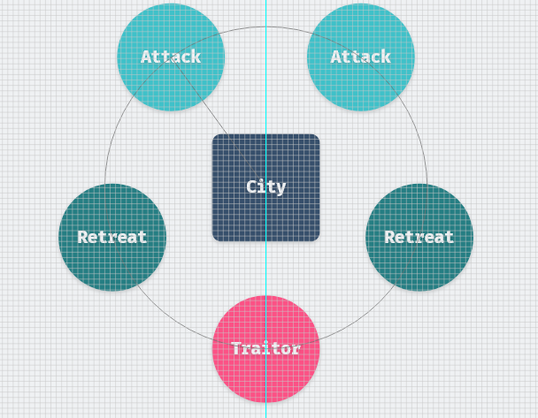

## Blog

这里是 beihai 的技术博客，记录着我学习与思考的内容，本网站使用 *[hugo_extended_version](https://gohugo.io/)* 构建，并通过 *[travis](https://travis-ci.com/)* 进行集成部署。

这篇 README 描述了一些文字格式和风格规范，博客中 2020 年 3 月之后的所有文章都遵守这些排版规范。

## 排版规范

#### 空格

1. 中英文与数字之间的空格规范

   - 中英文之间需要增加空格
   - 中文与数字之间需要增加空格
   - 数字与单位之间无需增加空格
   - 全角标点与其他字符之间不加空格

   > 示例：本篇文章写于 2020 年 7 月 24 日，耗时 40mins。

2. 一段文字中有超链接的部分，在超链接的前后使用空格

   > 示例：可以 [点击这里](https://wingsxdu.com/index.xml) 通过 RSS 订阅我的博客，而不是[点击这里](https://wingsxdu.com/index.xml)。

3. 英文前后接全角标点符号或者表示单位的角标符号时，不需要加空格

   > 示例：整体性能提升了 20%，核心温度降低了 5°C。

4. 引用的内容前后不用加空格

   > 示例：每一台服务器被称为一个`Node`。

#### 标点

1. 全文使用全角中文标点，遇到完整的英文整句、特殊名词，其內容使用半角标点。

   > 示例：乔布斯那句话是怎么说的？『Stay hungry, stay foolish.』

2. 行文使用直角引号『』，而不是弯引号 “”

   > 示例：诚如鲁迅所说『人类的悲欢并不相通』，世间的感同身受太过珍贵。

3. 使用逗号数字表示法

   > 示例：一个包含 1,000 个节点的服务器集群为该地区的 100,000 名用户提供服务。

4. 使用标准的省略号`……`，而不是`。。。`或`...`

5. 需要着重显示的部分使用「**加粗**」，不要使用「*斜体*」，更不要使用「***加粗 + 斜体***」的组合

#### 链接引用

1. 行文中出现的论文、重要文献等链接，加粗显示

   > 示例：eBay 架构师在 ACM 上发表了 **[Base: An Acid Alternative](https://queue.acm.org/detail.cfm?id=1394128)** 一文

2. 行文中推荐的第三方链接，使用斜体显示

   > 示例：观看视频 *[Proof-of-Stake (vs proof-of-work)](https://youtu.be/M3EFi_POhps)* 更详细地了解相关内容

3. 引用的大段文字使用引用符号并加斜体

   > 示例：
   >
   > *一组拜占庭将军分别各率领一支军队共同围困一座城市，各支军队的行动策略限定为**进攻**或**撤退**两种。因为部分军队进攻部分军队撤退可能会造成灾难性后果，因此各位将军必须通过投票来达成一致策略，即所有军队一起进攻或所有军队一起撤退……*

#### 专有名词

1. 正确地拼写专有名词的大小写，依据官方写法而定

   > 示例：MySQL 是正确的拼写，而不是 mysql、Mysql、MySql。

2. 使用 『中文全称（英文全称，英文缩写）』格式解释英文专有名词的缩写

   > 示例：两阶段提交（Two Phase Commit, 2PC）是一种在多节点之间实现事务原子提交的共识算法。

#### 列表

若文中出现大量的相关文献链接引用，需要按照出现的顺序进行标号，并在文章结尾统一给出链接（斜体表示）

> 示例：
>
> FLP 的论文 **[[1\] Impossibility of Distributed Consensus with One Faulty Process](https://groups.csail.mit.edu/tds/papers/Lynch/jacm85.pdf)** 证明了一个结论……
>
> CAP 定理由 Eric Brewer 在 1998 年首次提出，并于 2002 年在论文 **[[2\] Brewer’s Conjecture and the Feasibility of Consistent, Available, Partition-Tolerant Web Services](https://citeseerx.ist.psu.edu/viewdoc/download?doi=10.1.1.67.6951&rep=rep1&type=pdf)** 中得到论证……
>
> ## 引用文献
>
> - *[[1\] Impossibility of Distributed Consensus with One Faulty Process](https://groups.csail.mit.edu/tds/papers/Lynch/jacm85.pdf)*
> - *[[2\] Brewer’s Conjecture and the Feasibility of Consistent, Available, Partition-Tolerant Web Services](https://citeseerx.ist.psu.edu/viewdoc/download?doi=10.1.1.67.6951&rep=rep1&type=pdf)*
> - *[[3\] Base: An Acid Alternative](https://queue.acm.org/detail.cfm?id=1394128)*
> - *[[4\] The Part-Time Parliament](https://lamport.azurewebsites.net/pubs/lamport-paxos.pdf)*
> - *……*

## 文章配图

文章配图使用 Adobe XD 制作了自己的素材库，风格上参考了 *[技术文章配图指南](https://draveness.me/sketch-and-sketch/)* ，主要配色来源于 *[Color Hunt](https://colorhunt.co/)*。

其实这个软件提供的功能并不丰富，有时需要一些奇技淫巧，比如这张图我是这样画的：

总之，对配图统一规范再辅以亮丽的颜色，时间充裕可以添加一些新奇的元素，这就让文章读起来那不么枯燥。

## Reference

- [少数派写作排版指南](https://sspai.com/post/37815)
- [中文文案排版指北](https://github.com/mzlogin/chinese-copywriting-guidelines)
- [技术文章配图指南](https://draveness.me/sketch-and-sketch/)