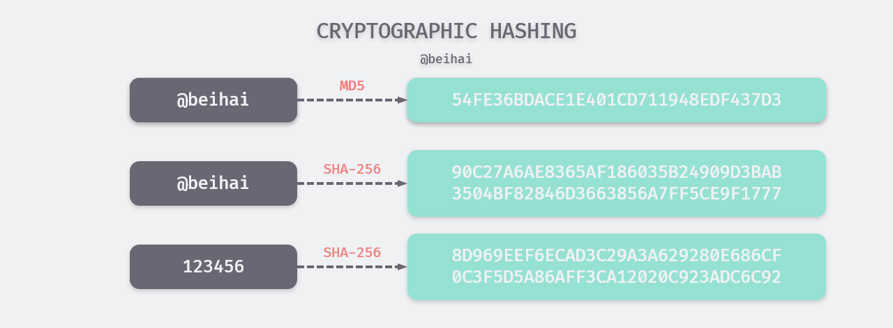

哈希算法（Hash function）又称散列算法，是一种从任何数据（文件、字符等）中创建小的数字“指纹”的方法。哈希算法只需满足把一个散列对象映射到另一个区间的需求，因此根据使用场景的不同，可将哈希算法分为加密哈希与非加密哈希。



## 概述

加密哈希被认为是单向函数，也就是说极难由散列函数输出的结果，回推输入的数据是什么。加密哈希函数的输入数据，通常被称为消息（message），而它的输出结果通常被称为摘要（digest）。一个理想的密码散列函数通常具有以下三个特性：

- 单向性：极难由一个已知的散列数值，推算出原始的消息；
- 唯一性：在不改动散列数值的前提下，修改消息内容是不可行的；
- 抗碰撞性：对于两个不同的消息，它不能给与相同的散列数值。

> 其中不可碰撞性是指以当前的算法与算力水平，哈希碰撞的开销超出人类可以接受的水平。以 SHA-256 为例，其哈希数值可能性约有 10<sup>77</sup> 种，而目前人类估计的宇宙原子总数约 10<sup>80</sup>。 虽然有[生日攻击](https://juejin.im/post/5ce6b828f265da1bba58dd9e#heading-1)等密码学攻击手段存在，散列碰撞的概率会大幅提升，但仍然是一个巨大的数字。

常见的加密哈希函数有 MD5、SHA-1、SHA-2（包含 SHA-224、SHA-256、SHA-512 等），虽然种类繁多，但除了生成摘要的长度 、循环体内容等有一些差异外，算法的基本结构是一致的。下面以 SHA-256 为例，详细介绍加密哈希算法的执行步骤。

## SHA-256 实现原理

#### 常量初始化

SHA-256 算法中用到了 8 个哈希初值以及 64 个哈希常量，其中，8 个哈希初值是对自然数前 8 个质数（2,3,5,7,11,13,17,19）的平方根的小数部分取前 32 bit：

```
h0 = 6a09e667    h1 = bb67ae85    h2 = 3c6ef372    h3 = a54ff53a
h4 = 510e527f    h5 = 9b05688c    h6 = 1f83d9ab    h7 = 5be0cd19
```

64个哈希常量是对自然数中前 64 个质数的立方根的小数部分取前 32 bit，标记为 k[t]：

```
428a2f98 71374491 b5c0fbcf e9b5dba5 3956c25b 59f111f1 923f82a4 ab1c5ed5
d807aa98 12835b01 243185be 550c7dc3 72be5d74 80deb1fe 9bdc06a7 c19bf174
e49b69c1 efbe4786 0fc19dc6 240ca1cc 2de92c6f 4a7484aa 5cb0a9dc 76f988da
983e5152 a831c66d b00327c8 bf597fc7 c6e00bf3 d5a79147 06ca6351 14292967
27b70a85 2e1b2138 4d2c6dfc 53380d13 650a7354 766a0abb 81c2c92e 92722c85
a2bfe8a1 a81a664b c24b8b70 c76c51a3 d192e819 d6990624 f40e3585 106aa070
19a4c116 1e376c08 2748774c 34b0bcb5 391c0cb3 4ed8aa4a 5b9cca4f 682e6ff3
748f82ee 78a5636f 84c87814 8cc70208 90befffa a4506ceb bef9a3f7 c67178f2
```

这些常量将会在算法循环体中用到。

#### 附加长度值

 SHA-256 用一个 64 位的数据来表示原始消息的长度，而在信息处理的过程中给需要将消息分解成 512bit 大小的块，因此补位后的消息长度应该是 512 的整数倍。附加长度值分为两个步骤：

1. 第一个 bit 位补 1，然后都补 0，直到长度满足对 512 取模后余数是 448，如果长度已经满足对 512 取模后余数是 448，需要填充 512 个bit；
2. 附加长度为 64bit 的长度值。

以 ASCII 编码的字符串“abc”为例，其十六进制表示为`0x616263`，补位后的数据如下：

```
61626380 00000000 00000000 00000000 00000000 00000000 00000000 00000000
00000000 00000000 00000000 00000000 00000000 00000000 00000000 00000018
```

#### 主循环

在进行消息摘要计算之前，需要将消息分解成 512bit 大小的块，分成块的数量也是算法需要循环的次数。每个块又将分解为 16 个 32bit 大端存储的字，记为w[0], …, w[15]。在计算过程中需要 64 个“字”，前 16 个字直接由消息的第 i 个块分解得到，其余的 48 个字由下面迭代公式得到：

```
W[t] = Q1(W[t-2]) + W[t-7] + Q0(W[t-15]) + W[t-16]
```

在计算过程中用到了六个运算函数：

```
Ch(x,y,z) = ((x & y) ^ ((~x) & z))
Maj(x,y,z) = ((x & y) ^ (x & z) ^ (y & z))
E0(x) = (x >> 2 | x << 30) ^ (x >> 13 | x << 19) ^ (x >> 22 | x << 10);
E1(x) = (x >> 6 | x << 26) ^ (x >> 11 | x << 21) ^ (x >> 25 | x << 7)
Q0(x) = (x >> 7 | x << 25) ^ (x >> 18 | x << 14) ^ (x >> 3)
Q1(x) = (x >> 17 | x << 15) ^ (x >> 19 | x << 13) ^ (x >> 10)
```

计算过程如下：

```
a~h = h0~h7
For t = 0 to 63
    T1 = h + E1(e) + Ch(e,f,g) + K[t] + W[t]
    T2 = E0(a) + Maj(a,b,c)
    h = g
    g = f
    f = e
    e = d + T1
    d = c
    c = b
    b = a
    a = T1 + T2
    
h0~h7 = a~h + h0~h7
```

每个区块运算的结果为最终的 a~h 值加上 h0~h7，并作为下一个区块的初值，如果是最后一个区块将作为散列数值输出。

以上文的字符串“abc”为例，算法流程如下：

```
          a        b        c        d 	      e        f        g        h
init: 6a09e667 bb67ae85 3c6ef372 a54ff53a 510e527f 9b05688c 1f83d9ab 5be0cd19
t = 0 5d6aebcd 6a09e667 bb67ae85 3c6ef372 fa2a4622 510e527f 9b05688c 1f83d9ab
t = 1 5a6ad9ad 5d6aebcd 6a09e667 bb67ae85 78ce7989 fa2a4622 510e527f 9b05688c
t = 2 c8c347a7 5a6ad9ad 5d6aebcd 6a09e667 f92939eb 78ce7989 fa2a4622 510e527f
...
t = 63 506e3058 d39a2165 04d24d6c b85e2ce9 5ef50f24 fb121210 948d25b6 961f4894

H1 = 6a09e667 + 506e3058 = ba7816bf
H2 = bb67ae85 + d39a2165 = 8f01cfea
H3 = 3c6ef372 + 04d24d6c = 414140de
H4 = a54ff53a + b85e2ce9 = 5dae2223
H5 = 510e527f + 5ef50f24 = b00361a3
H6 = 9b05688c + fb121210 = 96177a9c
H7 = 1f83d9ab + 948d25b6 = b410ff61
H8 = 5be0cd19 + 961f4894 = f20015ad
```

## 总结

随着时间的推移，加密哈希算法逐渐被攻破，已经不具有不可碰撞性，即`MD5(m1) == MD5(m2)`：

1. 2004 年，王小云教授证明 MD5 可以产生碰撞：[Collisions for Hash Functions](https://eprint.iacr.org/2004/199.pdf)；
2. 2005 年，王小云教授改进算法在 2<sup>63</sup> 时间复杂度内找到 SHA-1 碰撞：[New Cryptanalytic Results Against SHA-1](http://www.schneier.com/blog/archives/2005/08/new_cryptanalyt.html)；
3. 2017 年，Google 公司创建了两个有着相同的 SHA-1 值但内容不同的 PDF 文件，代表 SHA-1 算法已被正式攻破：[Google: Announcing the first SHA1 collision](https://security.googleblog.com/2017/02/announcing-first-sha1-collision.html) 。

为什么不可碰撞性对加密哈希算法如此重要？从 SHA-256 算法的实现步骤可以看出，加密哈希的逆向计算几乎是不可能的，暴力破解法的成本也太高，因此对加密哈希算法所谓的“攻击”实际是利用哈希碰撞为突破口进行数据伪造。以常见的保存用户密码为例，如果是明文存储，一旦发生数据泄露，那么所有的账户都会被盗用，因此常用下面一些方法进行 Hash 加密：

- Hash 加密：单纯对密码进行 Hash 加密无法保证密码的安全性，因为用户密码通常是短字符，无论采用哪种加密算法，都可以利用暴力破解或彩虹表攻击破解；
- Hash 加盐：在原消息上添加随机盐再进行哈希加密，并将盐与密码保存起来，以便下次登陆验证，添加随机盐增加了彩虹表破解的难度，促使攻击者放弃破解。但是如果对密码进行不安全的散列函数（MD5）计算，数据库泄露后，攻击者可以根据散列值找出碰撞的消息，不管这个消息是否与密码相同，都可以通过验证。
- 专用哈希函数加密：使用`bcrypt`等专门用来密码加密的哈希函数进行加密，这类函数通常运算时间较长，大大增加了攻击成本。

密码加密不单单是一个技术问题，对于攻击者来说，如果破解成本大于收益成本，即使攻破了加密的密码也是无意义的。而那些被证明可以产生散列碰撞的 Hash 函数，攻击它们的成本较低，随着算法的改进与硬件水平的提升，破解的成本也不断降低。从安全的角度考虑，应该及时更换不安全的哈希算法。

加密哈希的应用比较广泛，笔者详细地学习哈希算法的实现原理，也是为了更好地理解它们使用与被攻击的方式，而不仅仅是在编程中调一个函数库。在这之前以为密码学的知识比较晦涩难懂，实际上抛开中间的数学运算，整体的逻辑十分清晰，基本结构很容易理解。

## Reference

- [散列函数](https://zh.wikipedia.org/wiki/%E6%95%A3%E5%88%97%E5%87%BD%E6%95%B8)
- [密码散列函数](https://zh.wikipedia.org/wiki/%E5%AF%86%E7%A2%BC%E9%9B%9C%E6%B9%8A%E5%87%BD%E6%95%B8)
- [Birthday attack](https://en.wikipedia.org/wiki/Birthday_attack)
- [Descriptions of SHA-256, SHA-384, and SHA-512](http://www.iwar.org.uk/comsec/resources/cipher/sha256-384-512.pdf)
- [加密算法原理分析(MD5、SHA-256)](https://juejin.im/post/5ce6b828f265da1bba58dd9e#heading-1)
- [彩虹表（rainbow table）](https://www.jianshu.com/p/732d9d960411)
- [Bcrypt](https://en.wikipedia.org/wiki/Bcrypt)