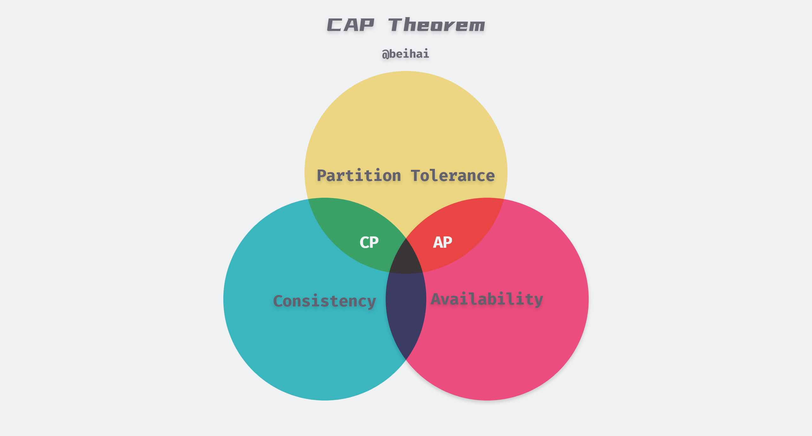
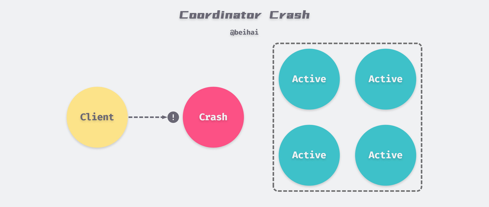
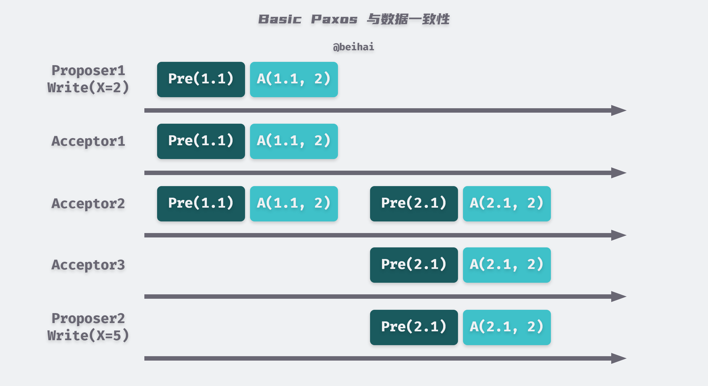
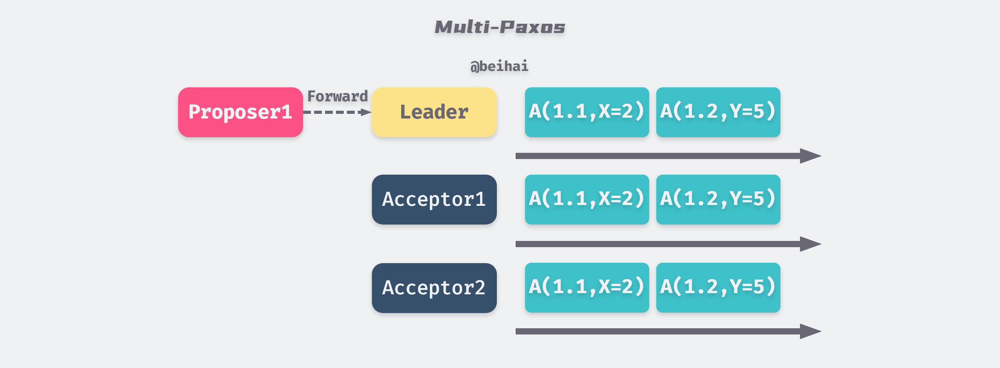
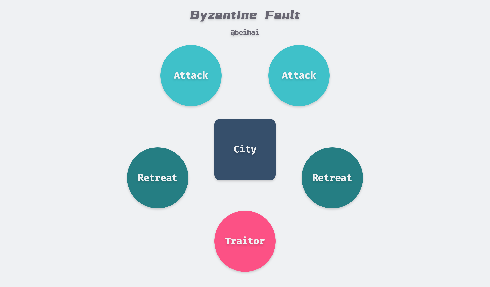
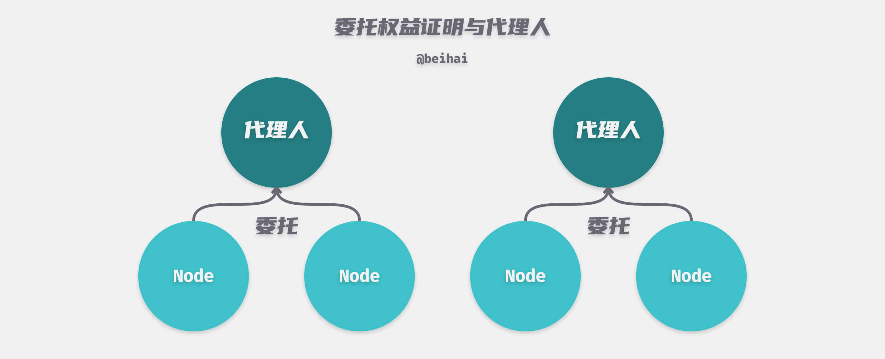

> 分布式系统中最重要的抽象之一就是共识：所有的节点就某一项提议达成一致。分布式系统中的一个或多个节点可以提议某些值，由共识算法来决定最终值，而共识的核心思想在于，决定一致的结果，并且一旦决定，就不能发生改变。本篇文章总结了常见的共识算法与分布式领域的一些理论，希望能获得较为全面的认知。

## 共识与一致性

#### 不可靠的网络与时钟

互联网以及大多数数据中心的内部网络都是异步网络，在这种网络中，一个节点可以发送数据包到另一个节点，但是网络并不保证它什么时候到达，甚至它是否能够到达。发送消息之后等待响应的过程中，可能出现很多错误情况：

- 请求可能在某个消息队列中或发生网络分区，无法立即传达至远程接收节点；
- 远程接收节点可能已经崩溃失效或暂时无法响应（例如运行长时间的垃圾回收）；
- 远程接收节点可能正确处理了请求，但是回复消息在网络中丢失。

当通过网络发送数据包时，数据包可能会丢失或延迟，同样，回复消息也会发生这类情况。这些问题在异步网络中无法明确区分，发送者唯一能确定的是，尚未收到响应消息，但无法判断具体原因，通常情况下，消息发送者会不断重复发送消息以期待响应。

在分布式系统中一种常见的错误情况是：由于跨节点通信不可能立即完成，消息经由网络从一台机器到另一台机器总是需要花费时间，但是由于网络的不确定延迟，我们无法提供按照消息发送的顺序进行接收的保证，**即后发送的消息可能优先到达处理，或者消息被重复处理**，这就违反了一致性要求。


所以分布式系统的异步网络是不可靠的，它无法保证消息的顺序。解决上述数据冲突问题的一个策略是**最后写入获胜（Last Write Wins，LWW）**：当写入被复制到其它节点时，会根据源写入节点的墙上时钟来标记事件排序，并采纳时间最新的写入数据。

> 现代计算机内部至少有两种不同的时钟，墙上时钟返回的是自 1970 年 1 月 1 日以来的秒数或毫秒数，即 UNIX 时间戳；单调时钟是一个单调自增的时间计数器，常用于测量持续的时间间隔。

每一台计算机都拥有自己的石英时钟设备，也就是说每台机器都维护了自己本地的时间版本。但是这些石英钟设备并非绝对准确，可能存在时钟漂移现象（运行速度加快或减慢），一个节点上的时间可能与另一个节点上的时间完全不同。例如谷歌假设其服务器的时钟偏移为 200ppm（百万分之一），相当于如果每 30 秒与 NTP 服务器重新同步一次，则可能出现的最大偏差为 6ms，如果每天同步一次，则最大偏差为 17s。

由于最后写入的消息是由一个节点上的时钟来决定的，这就避免不了一个事实：**这个时钟可能是错误的**。所以通过时间戳来进行跨节点的事件排序依然无法解决下面这几类问题：

- 后续发生的写操作可能无法覆盖较早版本的值，原因是后者节点的时钟太快了，导致一些数据被偷偷地丢弃；
- 由于时钟精度的限制，两个节点可能产生了完全相同的时间戳；
- 闰秒会产生一分钟为 59 秒或 61 秒的调整，这可能会使系统出现混乱。

虽然墙上时钟可以与 NTP（Network Time Protocol）服务器、GPS 或数据中心内部设立的原子钟等更加精确的时钟同步，纠正自己的时间，但如果两者的时钟差距很大，在时间重置后应用程序可能会看到时间突然倒退或向前跳跃现象，这会引发新的时钟问题：NTP 同步可能会产生时钟回拨，使得后写入的数据拥有较旧=早的时间戳，导致该写入被抛弃。


因此节点的时钟可能与其它节点存在明显的不同步，尽管可以设置 NTP 服务器进行纠正，但是依靠时钟进行**事件排序**仍然存在一定的风险，所以基于递增计数器的逻辑时钟或全局时钟是比物理时钟更可靠的方式。逻辑时钟依据事件的相对前后关系为其分配唯一 ID，并按照 ID 大小判断消息的新旧，这就避免了时间排序潜在的冲突。

#### FLP 不可能定理

FLP 不可能定理是分布式系统历史中最重要的定理之一，FLP 的论文 **[ [1] Impossibility of Distributed Consensus with One Faulty Process](https://groups.csail.mit.edu/tds/papers/Lynch/jacm85.pdf)** 证明了一个结论：**在异步系统模型中，如果节点存在崩溃失效的风险，则不存在一个总是能够在有限时间内达成共识的确定性	算法**。不可能定理是基于异步系统模型而做的证明，这是一个非常受限的模型，它假定共识算法不能使用任何时钟或超时机制来检测崩溃节点，并且消息仅会被传送一次。

但在实际中，每一个节点都拥有自己的墙上时钟和单调时钟，虽然它们可能有着完全不同的时间，但是**时间的更新频率是完全相同的**，所以我们仍然可以通过时钟计算接收消息的间隔时间，在这种前提下，就可以使用超时等方法来判断节点是否存活，从而绕过 FLP 定理实现稳定的共识方案。

综上来说，FLP 定理其实是告诉我们不要浪费时间试图去为纯粹的异步分布式系统设计面向任意场景的共识算法，异步系统没有办法保证能在有限时间内达成一致。

#### CAP 定理

CAP 定理由 Eric Brewer 在 1998 年首次提出，并于 2002 年在论文 **[[2] Brewer’s Conjecture and the Feasibility of Consistent, Available, Partition-Tolerant Web Services](https://citeseerx.ist.psu.edu/viewdoc/download?doi=10.1.1.67.6951&rep=rep1&type=pdf)** 中得到论证。它提出在异步的网络模型中分布式系统的三个指标：一致性（Consistency）、可用性（Availability）和分区容错性（Partition Tolerance），当发生故障时，最多只能同时满足这三项中的两项。



- **一致性**：CAP 理论中一致性强调的是线性一致（强一致性），即客户端将值写入服务器并获得响应后，它期望能够从任何一个服务器读取到该值或更新的值，或者返回一个错误。
- **可用性**：系统中非故障节点对收到的每个请求都必须产生响应，不允许服务器忽略客户端的请求。但是可用性不保证读取到最新的写入值。
- **分区容错性**：尽管集群节点之间的网络丢失或延迟了任意数量的消息，但系统仍可以继续运行。当发生网络分区时，从一个分区的某个节点发送到另一分区节点的所有消息都将丢失。

> 大多数分布式系统都分布在多个子网络中，每个子网络就叫做一个区`partition`，每个分区拥有自己的通信网络并且相互之间进行数据同步。网络分区指的是，两个区之间可能无法通信，但节点仍处于活跃状态。

由于网络分区是一种故障，无论你是否喜欢，它都可能发生，所以无法逃避分区问题。当网络正常时，系统可以同时满足一致性和可用性，当出现网络分区故障时，那就需要做出取舍，是拒绝客户端请求减少可用性来保证数据一致性，还是继续提供服务但可能会有数据不一致的风险。所以对 CAP 定理更准确地描述是『在网络分区情况下，选择一致还是可用』。

关于 CAP 定理存在许多争议，其对可用性的定义与通常意义上的理解有些差别，并且只考虑了一种一致性模型（线性一致）和一种故障（网络分区），而没有考虑网络延迟、节点崩溃或其它需要处理的情况。所以在这之后又提出了 BASE 理论。

#### BASE 理论

BASE 理论是 eBay 架构师对大规模互联网分布式系统实践的总结，并在 ACM 上发表了 **[ [3] Base: An Acid Alternative](https://queue.acm.org/detail.cfm?id=1394128)** 一文，其核心思想是**即使无法做到强一致性，但每个应用都可以根据自身业务特点，采用适当的方式来使系统达到最终一致性**。

BASE 是对 CAP 中一致性和可用性权衡的结果，对分布式系统提出了三个概念：

- 基本可用（Basically Available）
- 软（弱）状态（Soft State）
- 最终一致性（Eventually Consistent）

BASE 理论表明要实现系统的横向扩展，就要对业务进行功能分区，将数据的不同功能组迁移到相互独立的数据库服务器上。由于降低了事务的耦合度，就不能单纯依赖数据库的约束来保证功能组之间的一致性，BASE 提出使用消息队列来异步执行解耦后的命令。


在上图中，买家购买了一定数量的商品，订单信息记录实时在交易表中，并将后续需要执行的操作发送到消息队列中。同时，一个独立的消息处理组件，不断从队列中取出消息，更新用户表中某个商家的销量信息。在这个简单的交易系统中，买家只要等待订单信息的写入结束就算完成交易，商品销量更新的延迟对买家是没有影响的。

BASE 理论强调的最终一致性允许系统中的数据存在中间状态，并认为该状态不影响系统的整体可用性，即**允许多个节点的数据副本存在数据延时**。但是在一定的期限内，应当保证所有副本数据一致，达到数据的最终一致。

总体来说 BASE 理论面向的是大型高并发、可扩展的分布式系统。BASE 提出通过牺牲强一致性来获得可用性，并允许数据短时间内的不一致。在实际场景中，不同业务对数据的一致性要求也不一样，因此衍生出因果一致性、单调读一致性等一致性模型，最终选择要根据使用场景决定。

#### 小节

本节介绍了分布式系统面临的问题和相关的定理，这些内容告诉我们，当我们设计与选择分布式系统时，需要针对具体的需求制定不同的解决方案，一个面向每秒钟请求三次 1GB 数据的系统和一个每秒钟请求 1,000 次 4KB 的系统可能是完全不同的。 所以针对不同使用场景提出了各种共识算法，下面将一一介绍。

## 原子提交与 2PC

单节点的事务具有原子性，当一个包含多笔写操作的事务在执行过程中出现意外，原子性可以为上层应用提供非常简单的语义：事务的结果要么是所有写入被成功提交，要么是中止操作将以写入的内容都回滚。原子性可以防止失败的事务污染数据库，避免形成部分成功夹杂着部分失败。

在单个数据库节点上执行的事务，其原子性通常由存储引擎来负责，依赖于数据持久化写入磁盘的顺序关系，即先写入数据，再提交记录。但是在分布式系统中，向所有节点简单地发送一个写请求，然后各个节点独立执行事务提交是远远不够的，这样做很容易发生部分节点提交成功，而其它一些节点发生失败：

- 某些请求可能在网络中丢失，最终因超时而丢弃；
- 某些节点检测到数据冲突或违反约束，因而决定中止操作；
- 某些节点可能在提交记录前崩溃，然后在恢复时回滚，最终记录被丢弃。

如果一部分节点提交了事务，而其它节点放弃了事务，这就违反了数据一致性保证。而且事务还具有隔离性与持久性，彼此之间的事务提交不可见，也不能撤销。所以这就要求如果有部分节点提交了事务，则所有节点也必须跟着提交事务。

#### 2PC

两阶段提交（Two Phase Commit, 2PC）是一种在多节点之间实现事务原子提交的共识算法，用来保证所有节点要么全部提交，要么全部中止。2PC 引入了协调者（Coordinator）这一全新的节点身份，而其它节点被称为参与者（Participant），客户端的所有请求都需要经由协调者来处理。

2PC 将事务的提交过程分成了准备和提交两个阶段进行处理，在准备阶段：

1. 协调者向所有参与者发送事务内容，并询问是否可以执行事务提交；
2. 参与者节点执行事务操作，然后将 Redo 和 Undo 信息记入日志中；
3. 参与者向协调者反馈响应。

如果参与者成功执行了事务操作，那么会向协调者反馈 Yes 响应，反之反馈 No 响应。如果协调者从所有参与者获得的反馈都是 Yes 响应，那么协调者会向所有参与者节点发出提交请求，完成事务的写入。

但是如果有任何一个参与者反馈了 No 响应，或者协调者等待超时无法接收所有节点的反馈响应，协调者就会中断事务，向所有节点发送回滚请求。参与者会利用一阶段的 Undo 日志回滚事务。


2PC 使用分布式事务 ID 来标记请求，这就保证了事务间不会发生冲突。并且只要协调者做出了提交或放弃的决定，这个决定就必须执行下去，如果某个节点发生崩溃，协调者将无限重试，直到所有节点都达成一致，才能继续处理后面的请求。2PC 的同步阻塞问题极大限制了系统整体的性能，执行写请求所耗费的时间由集群中最『慢』的节点决定。 

2PC 协议的另一大缺陷在于所有的请求必须由协调者处理，参与者必须等待协调者的下一步决定。如果协调者崩溃或发生网络故障，参与者只能无奈等待，这可能导致长时间的服务不可用状态。



#### 3PC

三阶段提交对两阶段提交进行了一定的改进，将准备过程一分为二，形成了 CanCommit、PreCommit、DoCommit 三个阶段：

1. 协调者向参与者发送包含事务内容的 CanCommit 消息，如果参与者认为自身可以顺利执行事务，会回复 Yes 响应；
2. 协调者向参与者发送 PreCommit 消息，执行事务操作，并记录 Redo 和 Undo 信息；
3. 协调者发送 DoCommit 消息，进行事务提交。

3PC 假定一个**有界的网络延迟并且节点能够在规定时间内响应**，所以 3PC 通过连接是否超时来判断节点是否故障：如果参与者等待第二阶段指令超时，则自动 abort 抛弃事务，若等待第三阶段指令超时，则自动 commit 提交事务。相较于两阶段提交，三阶段提交协议最大的优点是降低了参与者的阻塞范围，并且能够在出现单点故障后继续保持一致。


3PC 在解决单点阻塞的同时也引入了新的问题，由于网络延迟的不确定性，可能会造成节点的假死误报，例如如果协调者在第三阶段发出了 abort 消息，但是有些参与者没有及时收到，那么就会自动提交事务，造成数据不一致。在无限延迟的网络环境中，超时机制并不是可靠的故障检测器，即使节点正常，请求也可能由于网络问题而最终超时。因此尽管人们已经意识到协调者存在着一些问题，但还在普遍使用 2PC。

#### 小节

通常情况下，集群中的主节点是非常稳定的，2PC 协议可以很好地完成分布式事务的原子提交，但它没有关心容错问题，它强行指定某个节点为『独裁者』，由它做出所有的决定。这意味着该节点一旦崩溃失效，系统就无法继续做出任何决定。由单点崩溃引起的服务不可用问题，在某些场景下是无法接受的，所以需要一种支持容错的解决方案。

## 支持容错的共识

在计算机系统所在的物理世界中，组件经常发生故障，例如，有研究表明硬盘的平均无故障时间约为 10~50 年，因此，在一个包含 10,000 块硬盘的存储集群中，我们应该预期每天有一块磁盘发生故障。既然硬件问题无法避免，我们就需要针对故障进行处理，其中最著名的支持容错的共识算法包括 Paxos、Raft、Zab 等，本节会对这些算法逐一介绍。

#### Paxos

Paxos 是 Leslie Lamport 于 1990 年在论文 **[ [4] The Part-Time Parliament](https://lamport.azurewebsites.net/pubs/lamport-paxos.pdf)** 中提出的一个理论上的一致性解决方案，这篇论文中虚构了一个名叫 Paxos 的小岛，来描述共识算法解决数据一致性问题的过程：

> *在古希腊有一个叫做 Paxos 的小岛，岛上采用兼职议会的形式来通过法令，但是 Paxos 的议员并不愿意把他全部的时间投入到议会事务中。议会中的议员通过信使进行消息的传递，但是，议员和信使随时有可能会离开议事大厅，并且信使可能会重复地传送消息，也可能一去不复返（但是不会篡改消息）。因此，议会协议要保证在每个议员都可能随时缺席的情况下也能继续产生法令，并且不会出现冲突。*

兼职议会所面对的问题对应于今天的容错式分布式系统所面对的问题：议员对应于分布式系统中的处理进程，而议员的缺席对应于处理进程的宕机或网络故障。但是在这篇论文中，Lamport 采用了故事叙事的方式，使得很多工程人员难以正确理解算法的概念。于是在 2001 年，Lamport 做出妥协，发表了 **[ [5] Paxos Made Simple](https://lamport.azurewebsites.net/pubs/paxos-simple.pdf)** 一文，用通俗易懂的语言重新讲述了 Paxos。

Paxos 的论文中，讨论了 Basic Paxos 和 Multi-Paxos 这两种具体的共识算法，下面就对此展开介绍。

##### Basic Paxos

在 Paxos 算法中，集群有三种参与角色，分别是 **Proposer、Acceptor** 和 **Learner**，每个角色由多个进程组成，同一时刻一个进程只能担任一种角色，但是进程可以进行身份转换。其中 Learner 只是一个数据副本，不参与共识过程。

Paxos 的每一个法令提案都有自己的唯一编号，不同的 Proposer 会从不相交的编号集合中选择自己的编号，这样任何两个 Proposer 就不会产生相同编号的提案。Paxos 中只要半数以上节点写入提案就算通过，这就避免了集群中较慢的节点阻塞响应。并且 Paxos 确保只能有一个提案被选定，同时，如果某个提案被选定了，那么这个提案也无法被修改。

Paxos 的运行过程分为两个阶段，分别是准备阶段（Prepare）和接受阶段（Accept），当 Proposer 接收到来自客户端的请求时，就会进入如下流程：

1. **Prepare:**
   1. Proposer 选择一个提案编号 N，然后向 Acceptor 广播编号为 N 的 Prepare 请求；
   2. 如果 Acceptor 收到一个编号为 N 的 Prepare 请求，且 N 大于它已经响应的所有 Prepare 请求的编号，那么它就会保证不再响应任何编号小于 N 的提案，同时将它已经通过的最大编号的提案（如果存在的话）回复给 Proposer。
2. **Accept:**
   1. 如果 Proposer 收到来自半数以上 Acceptor 的响应，那么它就会发送包含 (N, value)  的 Accept 请求，这里的 value 是收到的响应中编号最大的提案值，如果所有的响应都不包含提案，那么它是客户端发送的值；
   2. 如果 Acceptor 收到一个针对编号 N 的提案的 Accept 请求，只要它还未对编号大于 N 的 Prepare 请求作出响应，它就可以通过这个提案。

我们举一个简单的例子介绍 Paxos 是如何在多个提案下保证一致性的，下面图片中 Proposer1 和 Proposer2 分别收到了客户端的写请求 (X=2) 和 (X=5)，P1 首先发出 Prepare 和 Accept 请求， A1 和 A2 服务器都接受了 P1 的提案 (X=2)，由于该提案满足半数写入要求，所以该提案被集群通过。在这之后，P2 发出 `Prepare(2.1)`的请求，A2 由于已经接受了 (X=2)，所以它会返回接受的提案编号和值 `(2.1, 2)`，P2 使用接收到的提案代替自己的提案，向其他服务器发送 `Accept(2.1, 2)` 请求，最终所有的服务器会达成一致并选择相同的值。



需要注意的是，Basic Paxos 只能为一个值形成共识，一旦提案被确定，之后值永远不会变，也就是说整个 Paxos 集群只会接受一个提案。

Basic Paxos 也存在一个极端的情况，试想如果 P1 提出编号为 N1 的提案，并顺利完成了准备阶段，此时 P2 紧接着提出一个编号为 N2 的提案，同样也完成了准备阶段，那么 Acceptor 会忽略 P1 的 Accept 请求。于是 P1 再次进入准备阶段并提出编号为 N3 的提案，以此类推，这就造成了这两个提案都无法被选定。

尽管由于网络延迟或节点故障，最终还是会有一个 Proposer 胜出，但是提案『死锁』期间耗费了很多时间与网络资源，在 Multi-Paxos 中解决了这个问题。

##### Multi-Paxos

Multi-Paxos 是对 Basic Paxos 的改良，为避免提案陷入上述提到的死循环，Multi-Paxos 会选举出一个主 Proposer (被称为 Leader)，由它来提出所有提案，其它的 Proposer 会将客户端请求转发给主 Proposer。只要 Leader 能与过半的 Acceptor 通信，那么它就可以不断推进提案编号，并且这些提案最终都会被批准。



Multi-Paxos 对选举过程并没有什么限制，任何节点都可以被选举成为 Leader，所以新的 Leader 选出来后，它需要先与其它的 Acceptor 同步。如果新的主节点数据比较落后，需要花费较长的时间进行数据同步。

> 实际上 Lamport 的论文并没有介绍 Leader 究竟应该如何选举，也没有详细描述如何处理一些边界条件，这使得每一个 Paxos 算法实现都有着或多或少的差异。

#### Raft 与 Zab

Raft 与 Zab 都借鉴了 Multi-Paxos，在原有的基础上简化了算法模型，更利于人们理解。Zab 是特别为 ZooKeeper 设计的支持崩溃恢复的原子广播协议，而 Raft 是一种通用的分布式共识算法，这两种算法的核心思路基本一致，因此我们主要以 Raft 为例介绍。

一个 Raft 集群包含若干个服务器节点，每一个节点都有一个唯一标识 ID，并且在任何时刻，每一个服务器节点都处于 **Leader**、**Follower**、**Candidate** 这三个状态之一。在通常情况下，系统中只有一个 Leader 并且其他节点都是 Follower，如果 Follower 在一定的时间内接收不到来自 Leader 的消息，那么它就会变成 Candidate 并发起一次选举，获得集群中大多数选票（超过 n/2+1）的候选人将成为新的 Leader。


从上面的图片中可以清楚地看出选举的流程，并且 Raft 对选举过程进行了一些限制。首先，候选人在发起一次选举之前，需要尝试连接集群中的其他节点，并询问它们是否愿意参与选举，如果集群中的其它节点能够正常收到 Leader 的心跳消息，那么会拒绝参与选举。其次，只有拥有最新、最全日志的节点才能够当选 Leader。

> 预投票机制可以阻止离群节点频繁地刷新任期值，防止该节点重新加入集群时以更大的任期值废黜 Leader。

Raft 使用全局时钟保证所有的写操作是线性的，集群中任意一个数据副本都按照客户端的请求执行了相同顺序的命令，即在给定请求序列的情况下，即使副本以不同的顺序接收，数据副本始终进行相同的内部状态转换并产生相同的答复。

Raft 被产业界广泛使用，像 etcd、TiDB 就是根据 Raft 构建的分布式数据库，Redis6 也添加了 Raft 模块来保证数据一致性，所以在工程中优先考虑 Raft 会是一个比较稳妥的决定。若想更详细地了解 Raft 实现细节，可以阅读论文 **[ [6] In Search of an Understandable Consensus Algorithm (Extended Version)](https://raft.github.io/raft.pdf)** 。

#### 小节

本节的所有算法都可以归纳为类 Paxos 算法， 并且他们的共识过程与两阶段提交非常类似。最大的区别在于，2PC 的主节点是由外部指定的，而类 Paxos 算法可以在主节点崩溃失效后重新选举出新的主节点并进入一致状态。除此之外，容错共识算法只要收到多数节点的投票结果即可通过决议，而 2PC 则要每个参与者都必须做出 Yes 响应才能通过。这些差异是确保共识算法的正确性和容错性的关键。

最后要强调一点，类 Paxos 算法支持容错的前提是，发生崩溃或不可用的节点数量必须小于半数节点，这样才能保证至少有一个存活的节点拥有最新、最全的数据，不会发生数据丢失现象。

## 拜占庭容错

到目前为止，本文所有的内容假定节点**虽然不可靠但一定是诚实的**，节点不会恶意发送不正确的消息，消息在发送途中也不会被篡改。前几年比较热门的区块链技术就是以防篡改作为主要卖点之一，将分布式系统容错的范围进一步扩大，并把相关的理论知识带入大众视野。这一类算法统称为拜占庭容错算法。

#### 拜占庭将军问题

1982 年，Lamport 与 Robert Shostak、Marshall Pease 发表了论文 **[ [7] The Byzantine Generals Problem ](https://lamport.azurewebsites.net/pubs/byz.pdf)**，提出了拜占庭将军问题来描述分布式系统中的消息不可靠现象。这篇论文依然是以故事叙事的方式叙述的：

> *一组拜占庭将军分别各率领一支军队共同围困一座城市，各支军队的行动策略限定为**进攻**或**撤退**两种。因为部分军队进攻部分军队撤退可能会造成灾难性后果，因此各位将军必须通过投票来达成一致策略，即所有军队一起进攻或所有军队一起撤退。各位将军分处城市不同方向，他们只能通过信使互相联系。在投票过程中每位将军都将自己投票给进攻或是撤退的信息通过信使通知其他所有将军，这样一来每位将军根据自己的投票和其他所有将军送来的信息就可以知道共同的投票结果而决定行动策略。*
>
> *这个系统的问题在于，将军和信使中可能出现叛徒，他们不仅可能向较为糟糕的策略投票，还可能选择性地发送投票信息。*



例如在上面的图片中，我们假设有 5 位将军投票，其中有 1 名叛徒。4 名忠诚的将军中出现了 2 人投进攻，2 人投撤离的情况。这时候叛徒可能故意给 2 名投进攻的将领送信投票进攻，而给 2 名投撤离的将领送信表示撤离。这就导致在 2 名投进攻的将领看来，投票结果是 3 人投进攻，从而发起进攻；而在 2 名投撤离的将军看来则是 3 人投撤离。这样各支军队的一致协同就遭到了破坏。

拜占庭容错就是要确保诚实的将军们在受到叛徒干扰的情况下，遵循少数服从多数的原则，确保诚实节点也能达成共识。Lamport 在其论文中证明，如果恶意节点数为 m ，只要总节点数能够达到 3m+1，就能确保共识的达成。换句话说，要想顺利达成共识，必须保证系统内至少 2/3 的节点是诚实的。

#### POW 与 POS

工作量证明（Proof-of-Work，POW）的概念于 1993 年被 Cynthia Dwork 和 Moni Naor 提出，起初用于阻止 DDOS 攻击和垃圾邮件等一些服务滥用问题。时至今日这种算法也被赋予新的意义，即以『挖矿』形式作为比特币的核心，帮助集群选举一位领导者来决定下一个区块的内容。

POW 在执行请求前需要每个节点进行一些适当耗时的问题解谜，**这个问题很难找到解决方法，但是很容易验证答案的正确性**，最先计算出结果的节点会获得记账权（数据写入权）并将数据广播给其它节点进行验证。在比特币网络中，问题解谜的难度会不断增加，确保大约 10 分钟切换一次主节点，预防当前节点的『叛变』行为。


问题解谜最常用的计算方式是 Hash，例如给定一个字符序列，要求为字符序列添加一个随机数，使其经过 SHA-256 哈希函数计算结果的前四位均为 0。节点通过穷举猜测的方式来计算符合要求的数值，而验证时只需要进行一次 Hash 运算。

```
SHA256(Hello World107105) == 0000bfe6af4232f78b0c8eba37a6ba6c17b9b8671473b0b82305880be077edd9
```

因为问题解谜是一个纯粹的概率性事件，尝试的次数越多得到答案的概率越大，所以 POW 算法倾向于计算能力更强、网络环境更好的节点当选主节点。这就导致了在比特币网络中，为了获得记账奖励而创建大规模的矿池，浪费了很多算力与电力。

2011 年，一名用户在比特币论坛发表帖子 **[ [8] Proof of stake instead of proof of work](https://bitcointalk.org/index.php?topic=27787.0)**，提出了股权证明（Proof-of-Stake，POS）的概念。股权证明去掉了工作量证明对能源和计算能力的要求，而是用股权取而代之。每一个节点使用自己持有的数字货币作为『股权』抵押，下一个记账权的持有者是根据不同节点的股份和时间进行随机选择的。

由于节点被选举的概率与抵押的股权占比呈正相关，这就使得富有的节点有更多的机会得到记账权，对于小股东来说，千分之几甚至万分之几的股份很难有什么作为。改进后的委托权益证明（Delegated Proof-of-Stake，DPOS）能够让节点将自己的股权委托给一个代理人，代表自己参与到记账权的争夺中，这样小股东也可以从中获取收益。



在委托权益证明中，每一个参与者都能够选举任意数量的节点去争夺记账权，得票最多的前 N 个节点会成为候选人，下一个记账权的持有者就是从这样一组候选人中随机选取。除此之外，N 的数量也是由整个网络投票决定的，可以尽可能地保证选举的随机性。

作为区块链领域最重要的两类共识算法，POW 与 POS 都引入了经济学的概念，只要让攻击的成本远远高于收益并且十分高昂，就可以消除攻击者的动机，保证多数人的利益。对于区块链共识感兴趣的同学，可以观看视频 *[Proof-of-Stake (vs proof-of-work)](https://youtu.be/M3EFi_POhps)* 更详细地介绍了 POW 与 POS 的区别和优缺点。

#### 小节

拜占庭容错是分布式系统中最严格的共识，除了大家熟知的区块链，一些对安全性要求很高的的即时系统如波音的飞行控制系统、[SpaceX](https://lwn.net/Articles/540368/) 也都采用了拜占庭容错的共识算法。但是对于多数系统来说，它们都部署在一个局域网环境中，消息被篡改的情况的非常罕见；另一方面，由于网络原因造成的消息不完整问题可以使用校验算法避免，所以如果环境是可信的，大部分情况下是不用考虑拜占庭故障的。

目前拜占庭容错的应用场景还不是很多，笔者在整理这篇文章时也考虑过是否应该添加这方面的内容。从总体来看，拜占庭容错是目前最高级别的容错，甚至可以解决分布式环境中计算机运行时出现的电路错误（没办法单纯的用密码学与数字签名来避免），了解这些知识或许可以带来不一样的解决问题思路。

## 总结

本篇文章先介绍了一些重要的理论，其中 FLP 不可能定理指出不要为异步分布式系统设计出一个通用的共识算法，『银弹』是不存在的，CAP 和 BASE 理论则针对一些特定的应用场景进行了讨论。文章共总结了三类共识算法：实现了原子提交的 2PC 及其变种 3PC、支持容错的类 Paxos 和解决拜占庭将军问题的 POW、POS。从这里不难看出，可扩展性并不是使用分布式系统的唯一原因，支持容错与低延迟也是同样重要的目标，如何选择更符合自己需求的共识算法是一件影响深远的决策问题。

除此之外，上述共识算法都有一个共同的特点：使用主从复制来提高系统的扩展性，所以如何选主与如何数据同步是它们解决问题时的共同思路，或许在工程中将目光集中到维护『主从复制』这个点上会有不一样的收获 。

分布式领域仍然有许多问题待需解决，处理这些问题不仅是一个持续活跃的研究领域，也是构建实用的分布式系统时的主要关注点，放慢脚步，多积累一些知识，终究不是一件坏事。

随着这篇广泛而不全面的总结文章，笔者一阶段的学习计划算是结束了，未来一周会对前面的文章重新整理，复盘学习过程并进行调整。临近大四，希望自己能够放平心态，平衡好学习规划与学校安排。

## 引用文献

- *[ [1] Impossibility of Distributed Consensus with One Faulty Process](https://groups.csail.mit.edu/tds/papers/Lynch/jacm85.pdf)*
- *[ [2] Brewer’s Conjecture and the Feasibility of Consistent, Available, Partition-Tolerant Web Services](https://citeseerx.ist.psu.edu/viewdoc/download?doi=10.1.1.67.6951&rep=rep1&type=pdf)*
- *[ [3] Base: An Acid Alternative](https://queue.acm.org/detail.cfm?id=1394128)*
- *[ [4] The Part-Time Parliament](https://lamport.azurewebsites.net/pubs/lamport-paxos.pdf)*
- *[ [5] Paxos Made Simple](https://lamport.azurewebsites.net/pubs/paxos-simple.pdf)*
- *[ [6] In Search of an Understandable Consensus Algorithm (Extended Version)](https://raft.github.io/raft.pdf)*
- *[ [7] The Byzantine Generals Problem ](https://lamport.azurewebsites.net/pubs/byz.pdf)*
- *[ [8] Proof of stake instead of proof of work](https://bitcointalk.org/index.php?topic=27787.0)*

##  Reference

- [There is No Now: Problems with simultaneity in distributed systems](https://queue.acm.org/detail.cfm?id=2745385)
- [CAP Theorem](https://medium.com/system-design-blog/cap-theorem-1455ce5fc0a0)
- [分布式理论(二) - BASE理论](https://juejin.im/post/5b2663fcf265da59a401e6f8)
- [Three-phase commit protocol](https://en.wikipedia.org/wiki/Three-phase_commit_protocol)
- [分布式一致性协议 Raft 原理](https://wingsxdu.com/post/algorithms/raft/)
- [Zab vs. Paxos](https://cwiki.apache.org/confluence/display/ZOOKEEPER/Zab+vs.+Paxos)
- [Byzantine fault](https://en.wikipedia.org/wiki/Byzantine_fault)
- [L6: Byzantine Fault Tolerance](https://www.youtube.com/watch?v=_e4wNoTV3Gw)
- [Understanding Blockchain Fundamentals](https://medium.com/loom-network/understanding-blockchain-fundamentals-part-2-proof-of-work-proof-of-stake-b6ae907c7edb)
- [Designing Data-Intensive Applications](https://book.douban.com/subject/30329536//)