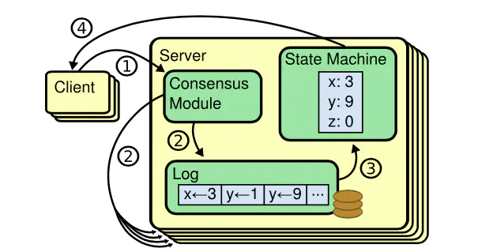
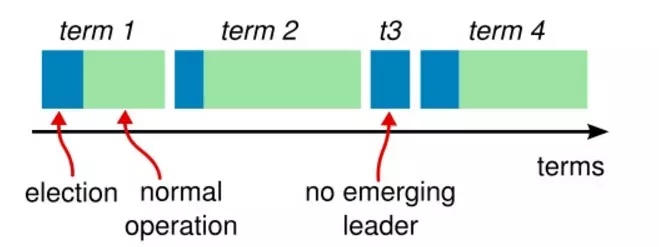

> Raft 是一种基于消息传递通信模型、用来管理日志复制的一致性协议，它允许一组机器像一个整体一样工作，即使其中的一些机器出现错误也能正常提供服务。在 Raft 被提出来之前，Paxos 协议是第一个被证明的一致性算法，但是 Paxos 的原理理解与工程实现都很困难。Raft 是Paxos 的一种实现方式，目标是提供更好理解的算法，并被证明可以提供与 Paxos相同的容错性以及性能。
>

## 概述

Raft 算法是可以用来替代 Paxos 算法的分布式共识算法，而且 raft 算法比 Paxos 算法更易懂且更容易实现。为了达到易于理解的目标，Raft 利用问题分解方法，将"复制集中节点一致性"这一复杂问题划分为四个可以被独立解释并处理的子问题：**领导选举（Leader Election）**，**日志复制（Log Replication）**，**安全性（Safety）**，**成员变更（Membership Changes）**。下文会从这四方面介绍 Raft 算法的机制。

#### 数据一致性

分布式系统中的节点通信存在两种模型：共享内存（Shared memory）和消息传递（Messages passing）。基于消息传递通信模型的分布式系统，不可避免的会发生以下错误：进程运行缓慢慢、被杀死或者重启，消息可能会因此延迟、丢失、重复。Paxos 算法解决的是在不考虑[拜占庭将军问题](https://zh.wikipedia.org/wiki/%E6%8B%9C%E5%8D%A0%E5%BA%AD%E5%B0%86%E5%86%9B%E9%97%AE%E9%A2%98)的条件下，在一个可能发生上述异常情况的分布式系统中如何就某个值达成一致，保证不论发生以上任何异常，都不会破坏共识，即确保数据的一致性。

分布式系统中常见的三种一致性模型：

- 强一致性：当更新操作在某个副本上执行成功后，之后所有的读操作都要能够获得最新的数据；
- 弱一致性：当更新某数据时，用户读到最新的数据需要一段时间的延迟；
- 最终一致性：它是一种特殊的弱一致性，当某个数据Ｘ更新后，在经过一个时间片段，所有后续对Ｘ的操作能够获得新数据，在这个时间片段内，数据可能是不一致的。

Raft 是分布式领域中的一种强一致性算法，当其中某个节点收到客户端的一组指令时，它必须与其它节点沟通，以保证所有的节点以相同的顺序收到相同的指令，最终所有的节点会产生一致的结果，就像是一台机器一样。

#### 状态机复制

在分布式环境中，如果我们要让一个服务具有容错能力，最常用的方法就是让一个服务的多个副本同时运行在不同的节点上。为了保证多个副本在运行时的状态都是同步的，即客户端无论将请求发送到哪一个节点中，最后都能得到相同的结果，因此采用状态机复制（State Machine Replication）方法。

状态机复制通常使用日志复制（log replication）实现，每个服务器存储一个包含一系列命令的日志，其状态机按顺序执行日志中的命令，每个日志中的命令都相同并且顺序也一致，因此每个状态机处理相同的命令序列，这样就能得到相同的状态和输出序列。

Raft 的工作就是保证复制日志的一致性，服务器上的`Consensus`模块接收来自客户端的命令，并将它们添加到日志中。随后该服务器与其他服务器上的`Consensus`模块通信，以确保每个服务器上具有相同的日志序列，即使有小部分的服务器通信失败。 每个服务器上的状态机按顺序执行命令，并将输出返回给客户端，这样就形成了高可用的复制状态机。

Raft 算法和 Paxos 算法一样，也具有以下分布式共识算法的特性：

- 确保在所有非拜占庭条件下（包括网络延迟、分区和数据包丢失，重复、乱序）的安全性（不会返回不正确的结果）；
- 只要超过一半（n/2+1）服务器都可以运行，并且可以相互通信和与客户通信，一致性算法就可用。 因此，五台服务器的典型集群可以容忍任何两台服务器的故障。 如果服务器突然宕机，它们可以稍后恢复转台并重新加入群集；
- 它们不依赖于时序来确保日志的一致性：错误的时钟和极端消息延迟可能在最坏的情况下导致可用性问题；
- 在通常情况下，只要集群的大部分（过半服务器）已经响应了单轮远程过程调用，命令就可以完成;，少数的慢服务器不需要影响整个系统性能。

## Leader Election

Raft 是一种用来管理上述日志复制过程的算法，Raft 通过领导选举机制选举出一个 Leader，由它全权负责管理日志复制来实现一致性。一个 Raft 集群包含若干个服务器节点，在任何时刻，每一个服务器节点都处于这三个状态之一：

- **Leader**（领导人）：Leader 处理所有的客户端请求，在通常情况下，系统中只有一个 Leader 并且其他节点都是 Follower；
- **Follower**（根随者）：Follower 不会发送任何请求，只是简单地响应来自 Leader 或 Candidate 的请求，如果一个客户端与 Follower 联系，那么 Follower 会把请求重定向至 Leader；
- **Candidate**（候选人）：如果 Follower 接收不到来自 Leader 的消息，那么它就会变成 Candidate 并发起一次选举，获得集群中大多数选票（超过 n/2+1）的候选人将成为新的 Leader。

Raft 把时间分割成任意长度的**任期**（Term），任期用连续的整数标记。每一段任期从一次选举开始，如果一个 Candidate  赢得选举，那么它在这个任期内充当领导人的职责。在某些情况下，一次选举可能会发生选票瓜分的情况，，每个 Candidate 的选票数都不足`n/2+1`，这时这个任期会以没有 Leader 结束，一个新的任期和一次新的选举会重新开始。Raft 保证了在一个给定的任期内，最多只有一个 Leader。

#### 节点通信

集群中的节点使用远程过程调用（RPC）进行通信，Raft 中一共有三种类型的 RPC：**AppendEntries  RPC** 由 Leader 发起，用于日志复制和提供心跳机制；**RequestVote RPC** 由 Candidate 在选举期间发起；**InstallSnapshot  RPC** 由 Leader 发起，将快照分块发送给日志落后的 Follower。在本小节中会先介绍前两种 RPC。

其中 AppendEntries  RPC 的主要包含的字段如下：

| 参数         | 含义                                                         |
| ------------ | ------------------------------------------------------------ |
| term         | Leader 的任期号                                              |
| leaderId     | Leader Id，以便于跟随者重定向请求                            |
| prevLogIndex | 上一个日志条目的索引值                                       |
| prevLogTerm  | 上一个日志条目的任期号                                       |
| entries[]    | 准备存储的日志条目（表示心跳时为空；为提高通信效率一次可以发送多个） |
| leaderCommit | Leader 已经提交的日志的索引值                                |

RequestVote RPC 的主要内容：

| 参数         | 含义                           |
| ------------ | ------------------------------ |
| term         | Candidate 的任期号             |
| candidateId  | 请求选票的 Candidate Id        |
| lastLogIndex | Candidate 最后日志条目的索引值 |
| lastLogTerm  | Candidate 最后日志条目的任期号 |

各字段的详细意义会在后面介绍。

#### 选举流程

当一个 Raft 集群启动时，所有节点都是 Follower 身份。一个节点从领导人或者候选者处接收到有效的 RPC 时会继续保持着跟随者状态。Leader 会周期性的地所有跟随者发送心跳消息（即不包含日志项内容的 AppendEntries  RPC）来维持自己的权威。如果一个 Follower 在一段时间里没有接收到任何消息，那么他就会认为系统中没有可用的领导者，因此发起选举以选出新的领导者。

要开始一次选举过程，Follower 先将自己当前的任期号加 1 并转换到 Candidate。然后他会并行的向集群中的其他节点发送 RequestVote RPC 来给自己投票。Candidate 会保持当前状态直到以下三件事情之一发生：

1. 第一种情况是它自己赢得了本次的选举：当一个 Candidate 从集群的多数服节点中获得了针对同一个任期号的选票，那么它就赢得了这次选举并成为领导人。每一个节点按照先到先得的原则，最多会对一个任期号投出一张选票，一旦 Candidate 赢得选举，它就立即成为 Leader，然后它会向其它的节点发送心跳消息来建立自己的权威并阻止新 Leader 的产生；
2. 第二种情况是其它节点成为 Leader：在等待投票期间，Candidate 可能会收到其它服务器节点声明它是领导人的 AppendEntries  RPC。如果这个领导人的任期号（包含在此次 RPC 中）不小于 Candidate 当前的任期号，那么 Candidate 会承认 Leader 的合法性并回到 Follower 状态。 如果此次 RPC 中的任期号比自己小，那么 Candidate  会拒绝这次的 RPC 并且继续保持 Candidate 状态。
3. 第三种情况是如果有多个 Follower 同时成为 Candidate  ，那么选票可能会被瓜分以至于没有 Candidate  可以赢得大多数节点的支持。当这种情况发生时，每一个 Candidate  都会超时，然后通过增加当前任期号来开始一轮新的选举。然而，没有其他机制的话，选票可能会被无限的重复瓜分。

#### 随机选举超时时间

Raft 算法使用随机选举超时时间的方法来确保很少会发生选票瓜分的情况，就算发生也能很快的解决。为了阻止选票起初就被瓜分，选举超时时间是从一个固定的区间（例如 150-300 毫秒）随机选择。这样可以把服务器都分散开以至于在大多数情况下只有一个服务器会选举超时；然后他赢得选举并在其他服务器超时之前发送心跳包。同样的机制被用在选票瓜分的情况下。每一个候选人在开始一次选举的时候会重置一个随机的选举超时时间，然后在超时时间内等待投票的结果；这样减少了在新的选举中另外的选票瓜分的可能性。

## 总结

## Reference

- [CAP theorem](https://zh.wikipedia.org/wiki/CAP%E5%AE%9A%E7%90%86)
- [Paxos](https://zh.wikipedia.org/zh-cn/Paxos%E7%AE%97%E6%B3%95)
- [Raft](https://zh.wikipedia.org/wiki/Raft)
- [拜占庭将军问题](https://zh.wikipedia.org/wiki/%E6%8B%9C%E5%8D%A0%E5%BA%AD%E5%B0%86%E5%86%9B%E9%97%AE%E9%A2%98)
- [State machine replication]([https://zh.wikipedia.org/wiki/%E7%8A%B6%E6%80%81%E6%9C%BA%E5%A4%8D%E5%88%B6](https://zh.wikipedia.org/wiki/状态机复制))
- [In Search of an Understandable Consensus Algorithm](https://web.stanford.edu/~ouster/cgi-bin/papers/raft-atc14)
- [寻找一种易于理解的一致性算法（扩展版）](https://github.com/maemual/raft-zh_cn/blob/master/raft-zh_cn.md)
- [The Raft Consensus Algorithm](https://raft.github.io/)
- [分布式一致性算法：Raft 算法](https://www.jianshu.com/p/2a2ba021f721)
- [CAP 理论十二年回顾："规则"变了](https://www.infoq.cn/article/cap-twelve-years-later-how-the-rules-have-changed/)

