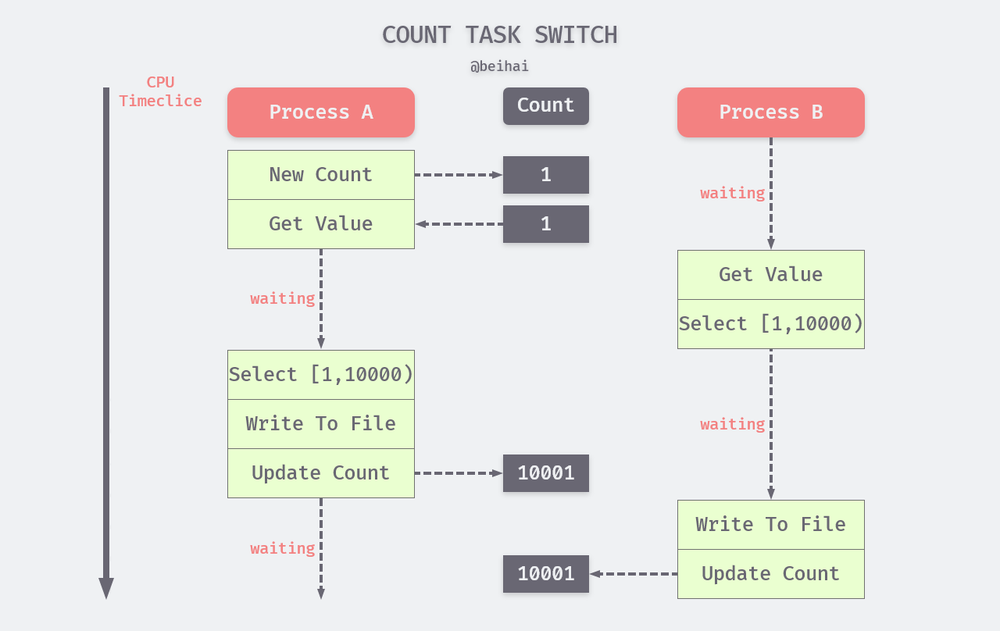
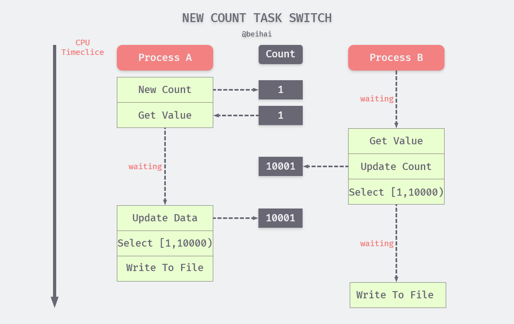

> *原理分析（Analyze The Principles）是一系列对计算机科学领域中的程序设计进行分析，每一篇文章都会着重于某一个实际问题。如果你有想了解的问题、错误指正，可以在文章下面留言。* 

并发这个概念由来已久，其主要思想是使多个任务可以在同一个时间段内下执行以便更快地得到结果。最早支持并发编程的语言是汇编语言，不过那时并没有任何的理论基础来支持这种编程方式，一个细微的编程错误就可能使程序变得非常不稳定，而且对程序的测试也几乎是不可能的。随着计算机软硬件技术的发展，如今并发程序的编写早已没有以前那么复杂。在今天可以毫不夸张地说，如果我们想真正理解一门编程语言以及领悟怎样才能编好程序，学习并发编程这一步必不可少。

## 概述

并发编程的思想来自于多任务操作系统，在早期的单用户操作系统中，任务是一个接一个运行的，各个任务的执行完全是串行的，只有在一个任务运行完成后，另一个任务才会被读取。而多任务操作系统则允许终端用户同时运行多个程序。当一个程序暂时不需要使用 CPU 的时候，比如等待一个网络连接，系统内核会把该程序挂起或中断，使得其他程序可以使用 CPU。

#### 并发程序内部的交互

并发程序内部会被划分为多个部分（或代码段），每个部分可以看作一个串行程序。在这些串行程序之间，可能会存在交互需求。比如，多个串行程序可能都要对一个共享资源进行访问，或者相互传递一些数据。这种情况下，我们需要协调程序的执行，即**同步**（Synchronous）。同步的作用是避免在并发访问共享资源时可能发生的冲突，以及确保有条不紊地传递数据。

根据同步的原则，程序如果想要使用一个共享资源，就必须先请求该资源并获取它的访问权。当程序不再需要某个资源的时候，该程序需放弃对资源的访问权（释放资源）。在同一时刻，某个资源应该只被一个程序占用，一个程序对资源的请求不应该导致其他正在访问该资源的程序中断，而应该等到占用程序释放资源后再请求。

数据传递也称为并发程序内部的通信，除同步外，我们也可以利用**异步**的方式对通信进行管理，这种方式使得数据可以不加延迟地发送给数据接收方。如果数据接收方还没有为接收数据做好准备，也不会造成数据接收方的等待，数据会被临时存储在通信缓存中。通信缓存是一种特殊的共享资源，可以同时被多个程序使用，数据接收方可以在准备就绪后按照先进先出进行接收。

## 同步问题

在很多时候，我们需要多个进程或线程之间相互配合完成一个任务。上文提到过，进程的用户空间是互相独立的，一般而言是不能互相访问的，唯一的例外是共享内存区。但在共享数据的过程中，可能会产生一些“干扰”。

> 不论是多 CPU、多进程还是多线程，只要它们之间存在数据共享，就一定会牵扯同步问题。

#### 计数器

**同步**是一个具有普遍意义的问题，为了更好地切入同步问题，我们举一个计数器例子进行说明。假设进程 A 创建一个计数器 Count，初值为 1，Count 与进程 B 共享，进程 A 与 B 并发执行相同的任务： 从数据库中查询符合条件的数据，并写入 ./temp 文件中。任务流程大致如下：

1. 从计数器中读取值；
2. 每次从数据库中查询一万条数据，若用 a 代表计数器值，那么查询范围为：[a, a+10000)；
3. 遍历查询数据，将符合条件的数据组成新的数据集合
4. 将数据集合写入 ./temp 文件；
5. 计数器的值加 10000，即 c = c+10000；
6. 检查数据是否全部读完，若是则程序退出，否则重复上述步骤；

**注：假设上面的例子运行在单个逻辑处理器上，多核处理器的进程调度可能略有不同。**

进程 A 和 B每次对指定数据集合迁移时，都要完成上面的六个步骤，但由于内核会对进程进行切换与调度，我们无法确保进程在一次循环查询过程不会被打断。在实际运行过程中，进程 A 与 B 可能会穿插在一起执行（基本上一定是穿插执行），而且上下文切换的粒度会比上面的描述步骤小很多。但为了清晰起见，我们可以假设一种可能的进程调度过程。

1. 内核使 CPU 运行进程 A，初始化计数器；
2. 进程 A 读取计数器初值 1；
3. CPU 被进程 B 抢占，读取计数器初值 1，并依此查询筛选数据，得到一个新的数据集合，此时内核认为进程 B 已经运行足够长的时间，将 A 换上 CPU；
4. 进程 A 开始查询并筛选数据，得到一个数据集合，这个数据集合与进程 B 完全一致；
5. 进程 A 将数据集合写入 ./temp 文件；
6. 进程 A 将计数器的值更新为 10001；
7. 内核把进程 A 换下，让 CPU 运行 B；
8. 进程 B 数据集合写入 ./temp 文件；
9. 进程 B 将计数器的值更新为 10001；

该进程调度过程如下图所示：

通过示例图我们看出一个很明显的问题，进程 A 与 B 在做重复的事情，造成了双倍的资源消耗，却得到了一样的结果。这是由于同一个进程对计数器值的存取时间跨度太大了，计数器只达成了记录任务进度的目的，却没有对多进程进行任务协调，导致进程的执行过程完全是随机的。

如果我们对计数器进行改进，将流程中的第五步移动到第一步之后，即在获取计数器值之后立即更新计数器。这样做确实起到了很大效果，大大减少了“事倍功半”问题出现的概率，但仍然不能彻底解决问题。仍然存在计数器值更新之前 CPU 就将进程切换的可能性。

#### 原子操作与临界区

在并发编程中，多个进程对同一个资源进行访问可能会互相干扰，这种情况被称为竞争条件（race condition）。造成竞争条件的根本原因在于进程在进行某些操作的过程中被中断，虽然进程再次运行时其状态会恢复如初，但是外界环境可能在此时间段内已经发生了改变。在上面改进版的计数器例子中，虽然已经尽可能避免，但由于进程调度的不可控性使得竞态条件仍然可能发生。为了解决这个问题，我们引入**原子操作**与**临界区**这两个概念。

原子操作意为“**执行过程中不可被中断的一个或一系列操作**”，也不允许在执行结束之前被任何任务或者事件终止，要么全部执行，要么就不执行。原子操作必须由一个单一的汇编指令表示，并且需要得到芯片级的支持，因此原子操作线程间交互数据最细粒度的同步操作，它可以保证线程间读写某个数值的原子性，绝对的并发安全。

相比于原子操作，让串行化执行的若干代码形成临界区的做法更加通用。临界区在任意时刻只允许一个线程对共享资源进行访问，从而实现互斥（mutex）。互斥遵循排他原则，如果有多个线程试图同时访问临界区，那么在有一个线程进入后，其他所有试图访问此临界区的线程将被挂起，并一直持续到进入临界区的线程离开。原子操作和临界区看起来类似，但是原子操作不能被中断，临界区对是否能被中断没有强制规定，只要保证一个访问者在临界区中时其他访问者不允许进入。

如果我们把获取更新计数器值的过程形成临界区，进程在执行此操作的过程中不会被打断，其他进程只能在更新值之后再取值，就可以避免竞争条件的发生。

## 总结

## Reference

- 