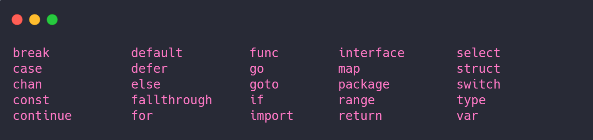
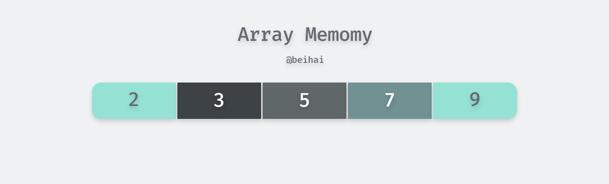
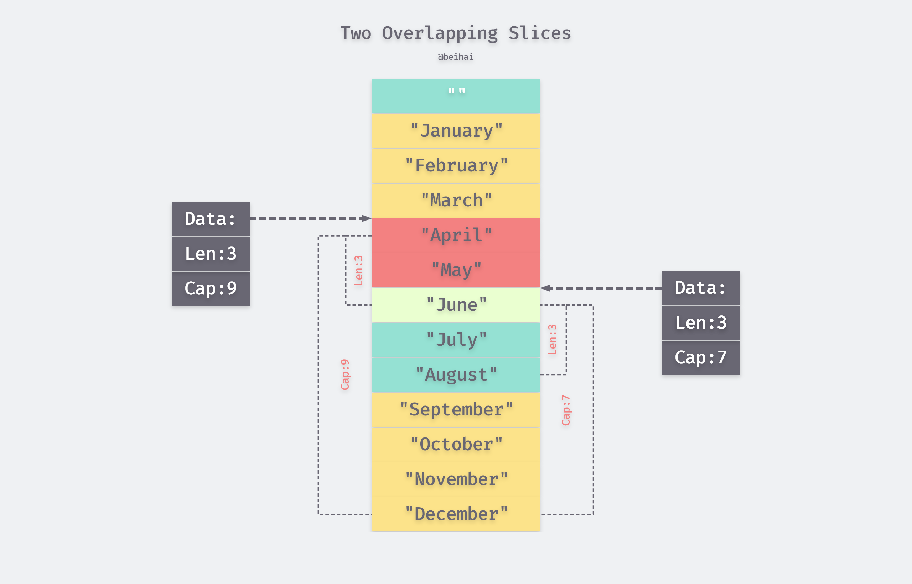
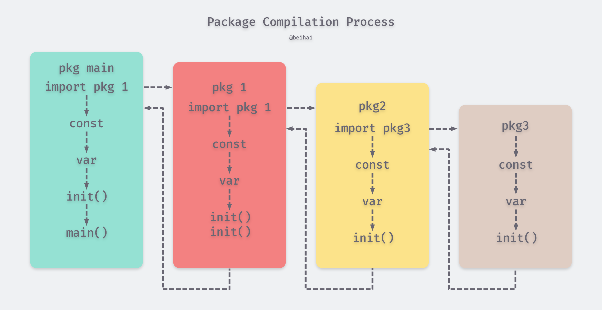

> 学习如何 Web 编程可能正是你阅读此文章的原因，一个 Web 应用应该具有哪些特性，开发过程中注意哪些问题。在此系列中作者不会用长长的列表指出开发者需要掌握的工具、框架，也不会刻画入微地去深究某一项程序设计的实现原理，旨在为初学者构建知识体系。如果你有想了解的问题、错误指正，可以在文章下面留言。

<!--more-->

## 概述{#概述}

得益于 Go 语言的三位创始人，Go 语言继承了 C 语言的诸多特性，而为了适应 Web 开发又具有一些动态语言特性，并为多核处理器时代内建并发支持。 最终目标是成为网络和多核时代的 C 语言。下图描述了 Go 语言基因族谱。

<div align="center"> </div>
Go 语言一共具有 25 个关键字，比英文字母还少一个：



本文会介绍一些相关的关键字，若详细了解可参考 *The Go Programming Language* 一书。对于变量、常量、表达式、控制流等基本语法读者需自行了解。

## 数组、字符串和切片{#数组、字符串和切片}

在主流的编程语言中数组及其相关的数据结构是使用得最为频繁的，只有在它(们)不能满足时才会考虑链表、hash表（hash表可以看作是数组和链表的混合体）和更复杂的自定义数据结构。

Go语言中数组、字符串和切片三者是密切相关的数据结构。这三种数据类型，在底层原始数据有着相同的内存结构，在上层，因为语法的限制而有着不同的行为表现。

### 数组{##数组}

数组是一个由固定长度的特定类型元素组成的序列，一个数组可以由零个或多个元素组成。因为数组的长度是固定的，因此在Go语言中很少直接使用数组。和数组对应的类型是Slice（切片），它是可以增长和收缩动态序列，slice功能也更灵活，但是要理解slice工作原理的话需要先理解数组。  

#### 介绍{###介绍}

数组的定义方式：

```go
var a [3]int                    // 定义长度为3的int型数组, 元素全部为0
var b = [...]int{1, 2, 3}       // 定义长度为3的int型数组, 元素为 1, 2, 3
var c = [...]int{2: 3, 1: 2}    // 定义长度为3的int型数组, 元素为 0, 2, 3
var d = [...]int{1, 2, 4: 5, 6} // 定义长度为6的int型数组, 元素为 1, 2, 0, 0, 5, 6
```

 数组的内存结构比较简单。比如下面是一个`[5]int{2,3,5,7，9}`数组值对应的内存结构： 



Go语言中数组是值语义。一个数组变量即表示整个数组，它并不是隐式的指向第一个元素的指针（比如 C 语言的数组），而是一个完整的值。当一个数组变量被赋值或者被传递的时候，实际上会复制整个数组。如果数组较大的话，数组的赋值也会有较大的开销。为了避免复制数组带来的开销，可以传递一个指向数组的指针，但是数组指针并不是数组。 我们可以用`for`循环来迭代数组。下面常见的几种方式都可以用来遍历数组： 

```go
var a = [...]int{1, 2, 3, 4} // a 是一个数组
var b = &a                // b 是指向数组的指针

fmt.Println(a[0], a[1])   // 打印数组的前2个元素
fmt.Println(b[0], b[1])   // 通过数组指针访问数组元素的方式和数组类似

for i := range a {
        fmt.Printf("a[%d]: %d\n", i, a[i])
}

for i, v := range b {     // 通过数组指针迭代数组的元素
    fmt.Println(i, v)
}

for i := 0; i < len(a); i++ {
    fmt.Printf("a[%d]: %d\n", i, a[i])
}
```

推荐用`for range`方式迭代，这种迭代可以保证不会出现数组越界的情形，每轮迭代对数组元素的访问时可以省去对下标越界的判断，还可以忽略迭代时的下标。

`len()` 与`cap()`是 Go 语言的两个内建函数，`len()`可以用来查看数组或切片的长度，`cap()`可以用来查看数组或切片的容量，由于数组长度不可变，这俩个值在数组中相同。

数组不仅仅可以用于数值类型，还可以定义字符串数组、结构体数组、函数数组、接口数组、管道数组等等： 

```go
// 字符串数组
var s1 = [2]string{"hello", "world"}
var s2 = [...]string{"你好", "世界"}
var s3 = [...]string{1: "世界", 0: "你好", }

// 结构体数组
var line1 [2]image.Point
var line2 = [...]image.Point{image.Point{X: 0, Y: 0}, image.Point{X: 1, Y: 1}}
var line3 = [...]image.Point{{0, 0}, {1, 1}}

// 图像解码器数组
var decoder2 = [...]func(io.Reader) (image.Image, error){
    png.Decode,
    jpeg.Decode,
}

// 接口数组
var unknown1 [2]interface{}
var unknown2 = [...]interface{}{123, "你好"}

// 管道数组
var chanList = [2]chan int{}
```

### 字符串{##字符串}

 一个字符串是一个不可改变的字节序列，字符串通常是用来包含人类可读的文本数据。和数组不同的是，字符串的元素不可修改，是一个只读的字节数组。每个字符串的长度虽然也是固定的，但是字符串的长度并不是字符串类型的一部分。

#### 介绍{###介绍}

Go语言字符串的底层结构在`reflect.StringHeader`中定义：

```go
type StringHeader struct {
    Data uintptr
    Len  int
}
```

字符串结构由两个信息组成：第一个是字符串指向的底层字节数组，第二个是字符串的字节的长度。字符串其实是一个结构体，因此字符串的赋值操作也就是`reflect.StringHeader`结构体的复制过程，并不会涉及底层字节数组的复制。在前面数组一节提到的`[2]string`字符串数组对应的底层结构和`[2]reflect.StringHeader`对应的底层结构是一样的，可以将字符串数组看作一个结构体数组。

分析可以发现，“hello,world”字符串底层数据和以下数组是完全一致的：

```go
var data = [...]byte{
    'h', 'e', 'l', 'l', 'o', ',', 'w', 'o', 'r', 'l', 'd',
}
```

字符串可以包含任意的数据，包括 byte 值 0，但是通常是用来包含人类可读的文本。由于Go语言的源代码要求是UTF8编码，导致Go源代码中出现的字符串面值常量一般也是UTF8编码的。源代码中的文本字符串通常被解释为采用UTF8编码的 Unicode 码点（rune）序列。

内置的 `len()` 函数可以返回一个字符串中的字节数目（不是 rune 字符数目），索引操作 s[i] 返回第 i 个字节的字节值，i 必须满足 0 ≤ i< len(s) 条件约束。 

```Go
s := "hello,world"
fmt.Println(len(s))     // "11"
fmt.Println(s[0], s[6]) // "104 119" ('h' and 'w')
```

 第 i 个字节并不一定是字符串的第 i 个字符，因为对于非 ASCII 字符的 UTF8 编码会要两个或多个字节。

#### 字符处理{###字符处理}

Web 开发中字符串处理是很常见的操作，标准库中有四个包对字符串处理尤为重要：bytes、strings、strconv 和 unicode。

`strings`包提供了许多如字符串的查询、替换、比较、截断、拆分和合并等功能。 

`bytes`包也提供了很多类似功能的函数，但是针对和字符串有着相同结构的[]byte类型。因为字符串是只读的，因此逐步构建字符串会导致很多分配和复制。在这种情况下，使用bytes.Buffer类型将会更有效，稍后我们将展示。

`strconv`包提供了布尔型、整型数、浮点数和对应字符串的相互转换，还提供了双引号转义相关的转换。

`unicode`包提供了 IsDigit、IsLetter、IsUpper 和 IsLower 等类似功能，它们用于给字符分类。每个函数有一个单一的 rune 类型的参数，然后返回一个布尔值。而像 ToUpper 和 ToLower 之类的转换函数将用于 rune 字符的大小写转换。所有的这些函数都是遵循 Unicode 标准定义的字母、数字等分类规范。strings 包也有类似的函数，它们是 ToUpper 和 ToLower，将原始字符串的每个字符都做相应的转换，然后返回新的字符串。

```go
x := 123
fmt.Println(strconv.Itoa(x)) // "123"
fmt.Println(strconv.FormatInt(int64(x), 2)) // "1111011"
y, err := strconv.Atoi("123")             // y is an int
z, err := strconv.ParseInt("123", 10, 64) // base 10, up to 64 bits
```

标准库对字符串的处理十分强大，这里无法对所有方法逐一讲解，仅部分演示。

### 切片(slice){##切片(slice)}

简单地说，切片就是一种简化版的动态数组。因为动态数组的长度是不固定，切片的长度自然也不是类型的组成部分了。数组虽然有适用它们的地方，但是数组的类型和操作都不够灵活，因此在 Go 中数组使用的并不多，而切片则使用得相当广泛。

#### 介绍{###介绍}

切片的定义：

```go
var (
    a []int               // nil 切片, 和 nil 相等, 一般用来表示一个不存在的切片
    b = []int{}           // 空切片, 和 nil 不相等, 一般用来表示一个空的集合
    c = []int{1, 2, 3}    // 有3个元素的切片, len 和 cap 都为3
    d = c[:2]             // 有2个元素的切片, len为2, cap为3
    e = c[0:2:cap(c)]     // 有2个元素的切片, len为2, cap为3
    f = c[:0]             // 有0个元素的切片, len为0, cap为3
    g = make([]int, 3)    // 有3个元素的切片, len 和 cap 都为3
    h = make([]int, 2, 3) // 有2个元素的切片, len为2, cap为3
    i = make([]int, 0, 3) // 有0个元素的切片, len为0, cap为3
)
```

多个 slice 之间可以共享底层的数据，并且引用的数组部分区间可能重叠。图4.1显示了表示一年中每个月份名字的字符串数组，还有重叠引用了该数组的两个slice。数组这样定义

```Go
months := [...]string{1: "January", /* ... */, 12: "December"}
```

因此一月份是 months[1]，十二月份是 months[12]。通常，数组的第一个元素从索引 0 开始，但是月份一般是从 1开始的，因此我们声明数组时直接跳过第 0 个元素，第 0 个元素会被自动初始化为空字符串。

slice的切片操作 s[i:j]，其中 0 ≤ i≤ j≤ cap(s)，用于创建一个新的 slice，引用 s 的从第 i 个元素开始到第 j-1 个元素的子序列。新的 slice 将只有 j-i 个元素。如果 i 位置的索引被省略的话将使用 0 代替，如果 j 位置的索引被省略的话将使用 len(s) 代替。因此，months[1:13] 切片操作将引用全部有效的月份，和 months[1:] 操作等价；months[:] 切片操作则是引用整个数组。让我们分别定义表示第二季度和北方夏天月份的 slice，它们有重叠部分：

```Go
Q2 := months[4:7]
summer := months[6:9]
fmt.Println(Q2)     // ["April" "May" "June"]
fmt.Println(summer) // ["June" "July" "August"]
```



#### 追加/删除元素{###追加/删除元素}

内置的 append 函数可用于向 slice 追加元素：

```Go
var runes []rune
for _, r := range "Hello, 世界" {
    runes = append(runes, r)
}
fmt.Printf("%q\n", runes) // "['H' 'e' 'l' 'l' 'o' ',' ' ' '世' '界']"
var a []int
a = append(a, 1)               // 追加1个元素
a = append(a, 1, 2, 3)         // 追加多个元素, 手写解包方式
a = append(a, []int{1,2,3}...) // 追加一个切片, 切片需要解包
```

根据要删除元素的位置有三种情况：从开头位置删除，从中间位置删除，从尾部删除。其中删除切片尾部的元素最快：

```go
a = []int{1, 2, 3}
a = a[:len(a)-1]   // 删除尾部1个元素
a = a[:len(a)-N]   // 删除尾部N个元素
```

删除开头的元素可以直接移动数据指针：

```go
a = []int{1, 2, 3}
a = a[1:] // 删除开头1个元素
a = a[N:] // 删除开头N个元素
```

对于删除中间的元素，需要对剩余的元素进行一次整体挪动，可以用`append`或`copy`完成：

```go
a = []int{1, 2, 3, ...}

a = append(a[:i], a[i+1:]...) // 删除中间1个元素
a = append(a[:i], a[i+N:]...) // 删除中间N个元素

a = a[:i+copy(a[i:], a[i+1:])]  // 删除中间1个元素
a = a[:i+copy(a[i:], a[i+N:])]  // 删除中间N个元素
```

删除开头的元素和删除尾部的元素都可以认为是删除中间元素操作的特殊情况。

## 结构体{#结构体}

Go 语言中，也和 C 或者其他语言一样，我们可以声明新的类型，作为其它类型的属性或字段的容器。例如，我们可以创建一个自定义类型`person`代表一个人的实体。这个实体拥有属性：姓名和年龄。这样的类型我们称之`struct`。如下代码所示:

```Go
type person struct {
    name string	`json:"user"`
    age int
}
```

结构中的一个重要的概念即 tag ，用小米点 ` 表示。使用 unsafe 与 reflact 包解析结构体 tag 可完成一些"魔法操做"，如要求某些结构体成员不许为 0 值、起别名等。

## 函数、方法和接口{#函数、方法和接口}

### 函数(function){##函数}

在Go语言中，函数是第一类对象，我们可以将函数保持到变量中。函数主要有具名和匿名之分，包级函数一般都是具名函数，具名函数是匿名函数的一种特例。当然，Go语言中每个类型还可以有自己的方法，方法其实也是函数的一种。

```go
// 具名函数
func Add(a, b int) int {
    return a+b
}

// 匿名函数
var Add = func(a, b int) int {
    return a+b
}
```

Go语言中的函数可以有多个参数和多个返回值，参数和返回值都是以传值的方式和被调用者交换数据。在语法上，函数还支持可变数量的参数，可变数量的参数必须是最后出现的参数，可变数量的参数其实是一个切片类型的参数。

```go
// 多个参数和多个返回值
func Swap(a, b int) (int, int) {
    return b, a
}

// 可变数量的参数
// more 对应 []int 切片类型
func Sum(a int, more ...int) int {
    for _, v := range more {
        a += v
    }
    return a
}
```

当可变参数是一个空接口类型时，调用者是否解包可变参数会导致不同的结果：

```go
func main() {
	var a = []interface{}{123, "abc"}

	Print(a...) // 123 abc
	Print(a)    // [123 abc]
	Print2(a...) // 123 \n abc
	Print2(a)    // [123 abc]
}

func Print(a ...interface{}) {
	fmt.Println(a...)
}

func Print2(a ...interface{}) {
	for _, value := range a{
		fmt.Println(value)
	}

}
```

### 方法(method){##方法}

方法一般是面向对象编程(OOP)的一个特性，在C++语言中方法对应一个类对象的成员函数，是关联到具体对象上的虚表中的。但是Go语言的方法却是关联到类型的，这样可以在编译阶段完成方法的静态绑定。 

```go
type Point struct{ X, Y float64 }

// 函数
func Distance(p, q Point) float64 {
    return math.Hypot(q.X-p.X, q.Y-p.Y)
}

// 方法
func (p Point) Distance(q Point) float64 {
    return math.Hypot(q.X-p.X, q.Y-p.Y)
}

func main{
    p := Point{1, 2}
	q := Point{4, 6}
	fmt.Println(Distance(p, q)) // "5", 函数调用
	fmt.Println(p.Distance(q))  // "5", 方法
}
```

这种 p.Distance 的表达式叫做选择器，因为他会选择合适的对应 p 对象的 Distance 方法来执行。

因为每种类型都有其方法的命名空间，我们在用 Distance 这个名字的时候，不同的 Distance 调用指向了不同类型里的 Distance 方法。我们定义一个 Path 类型，这个 Path 代表一个线段的集合，并且也给这个 Path 定义一个叫 Distance 的方法。

```Go
type Path []Point
// Distance returns the distance traveled along the path.
func (path Path) Distance() float64 {
    sum := 0.0
    for i := range path {
        if i > 0 {
            sum += path[i-1].Distance(path[i])
        }
    }
    return sum
}
```

Path 是一个命名的 slice 类型，而不是 Point 那样的 struct 类型，然而我们依然可以为它定义方法。在能够给任意类型定义方法这一点上，Go 和很多其它的面向对象的语言不太一样。因此在 Go 语言里，我们为一些简单的数值、字符串、slice、map 来定义一些附加行为很方便。我们可以给同一个包内的任意命名类型定义方法，只要这个命名类型的底层类型不是指针或者interface。 

当调用一个函数时，会对其每一个参数值进行拷贝，如果一个函数需要更新一个变量，或者函数的其中一个参数实在太大，我们希望能够避免进行这种默认的拷贝，这种情况下我们就需要用到指针了。对应到我们这里用来更新接收器的对象的方法，当这个接受者变量本身比较大时，我们就可以用其指针而不是对象来声明方法：

```go
func (p *Point) ScaleBy(factor float64) {
    p.X *= factor
    p.Y *= factor
}
```

### 接口(interface){##接口}

 Go语言里面设计最精妙的应该算interface，它让面向对象，内容组织实现非常的方便，

### interface类型

简单的说，interface 是一组 method 签名的组合，我们通过 interface 来定义对象的一组行为。 

interface 类型定义了一组方法，如果某个对象实现了某个接口的所有方法，则此对象就实现了此接口。

```Go
type Human struct {
    name string
    age int
    phone string
}

type Student struct {
    Human //匿名字段Human
    school string
    loan float32
}

type Employee struct {
    Human //匿名字段Human
    company string
    money float32
}

//Human对象实现Sayhi方法
func (h *Human) SayHi() {
    fmt.Printf("Hi, I am %s you can call me on %s\n", h.name, h.phone)
}

// Human对象实现Sing方法
func (h *Human) Sing(lyrics string) {
    fmt.Println("La la, la la la, la la la la la...", lyrics)
}

//Human对象实现Guzzle方法
func (h *Human) Guzzle(beerStein string) {
    fmt.Println("Guzzle Guzzle Guzzle...", beerStein)
}

// Employee重载Human的Sayhi方法
func (e *Employee) SayHi() {
    fmt.Printf("Hi, I am %s, I work at %s. Call me on %s\n", e.name,
        e.company, e.phone) //此句可以分成多行
}

//Student实现BorrowMoney方法
func (s *Student) BorrowMoney(amount float32) {
    s.loan += amount // (again and again and...)
}

//Employee实现SpendSalary方法
func (e *Employee) SpendSalary(amount float32) {
    e.money -= amount // More vodka please!!! Get me through the day!
}

// 定义interface
type Men interface {
    SayHi()
    Sing(lyrics string)
    Guzzle(beerStein string)
}

type YoungChap interface {
    SayHi()
    Sing(song string)
    BorrowMoney(amount float32)
}

type ElderlyGent interface {
    SayHi()
    Sing(song string)
    SpendSalary(amount float32)
}
```

通过上面的代码我们可以知道，interface 可以被任意的对象实现。我们看到上面的 Men interface 被 Human、Student 和 Employee 实现。同理，一个对象可以实现任意多个 interface，例如上面的 Student 实现了 Men 和YoungChap 两个 interface。

最后，任意的类型都实现了空 interface，也就是包含 0 个 method 的 interface。空 interface 对于描述起不到任何的作用(因为它不包含任何的method），但是空 interface 在我们需要存储任意类型的数值的时候相当有用，因为它可以存储任意类型的数值。它有点类似于C语言的 void* 类型。

```Go
// 定义a为空接口
var a interface{}
var i int = 5
s := "Hello world"
// a可以存储任意类型的数值
a = i
a = s
```

一个函数把interface{}作为参数，那么他可以接受任意类型的值作为参数，如果一个函数返回interface{},那么也就可以返回任意类型的值。

### main 与 init 函数{##main 与 init 函数}

Go 里面有两个保留的函数：`init`函数（能够应用于所有的`package`）和`main`函数（只能应用于`package main`）。这两个函数在定义时不能有任何的参数和返回值，Go 程序会自动调用`init()`和`main()`，所以我们不需要在任何地方调用这两个函数。

虽个`package`里面可以写任意多个`init`函数，但这无论是对可读性还是维护性都不是一个明智的做法，强烈建议在一个`package`中文件只写一个`init`函数，并放在 `init.go` 文件里 。

程序的初始化和执行都起始于`main`包。如果`main`包还引用了其它的包，那么会在编译时将它们依次导入。有时一个包会被多个包同时引用，但它只会被导入一次（例如很多包可能都会用到`fmt`包，但它只会被导入一次）。当一个包被导入时，如果该包还引用了其它的包，那么会先将其它包导入进来，然后再对这些包中的包级常量和变量进行初始化，接着执行`init`函数（如果有的话），依次类推。等所有被导入的包都加载完毕了，就会开始对`main`包中的包级常量和变量进行初始化，然后执行`main`包中的`init`函数（如果存在的话），最后执行`main`函数。下图详细地解释了整个执行过程： 



## 总结{#总结}

语言的学习过程是循序渐进的，本文仅简单介绍了一些常用的数据结构即 Go 中的流程。

 如果对Go语言不太了解，作者推荐通过以下资料开始学习 Go 语言。安装 Go 语言环境，然后通过`tour`命令打开“A Tour of Go”教程学习。若想系统地学习 Go 语言，可以阅读Go语言官方团队出版的[《The Go Programming Language》](http://www.gopl.io/)一书，这本书在国内 Go 语言社区被称为 Go 语言圣经。 也可以通过`godoc`所有的官方文档以及标准库。

## Reference{#Reference}

- [Go语言创世纪](https://chai2010.gitbooks.io/advanced-go-programming-book/content/ch1-basic/ch1-01-genesis.html)
- *The Go Programming Language*
- [strings](https://golang.org/pkg/strings/)