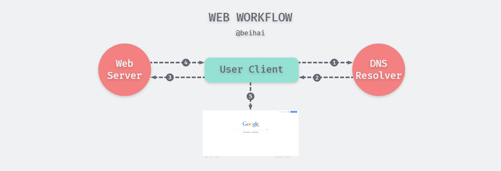
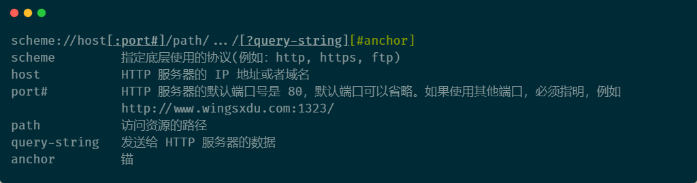
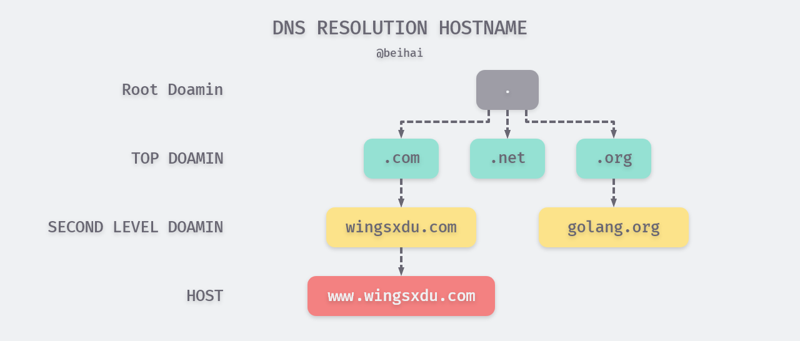
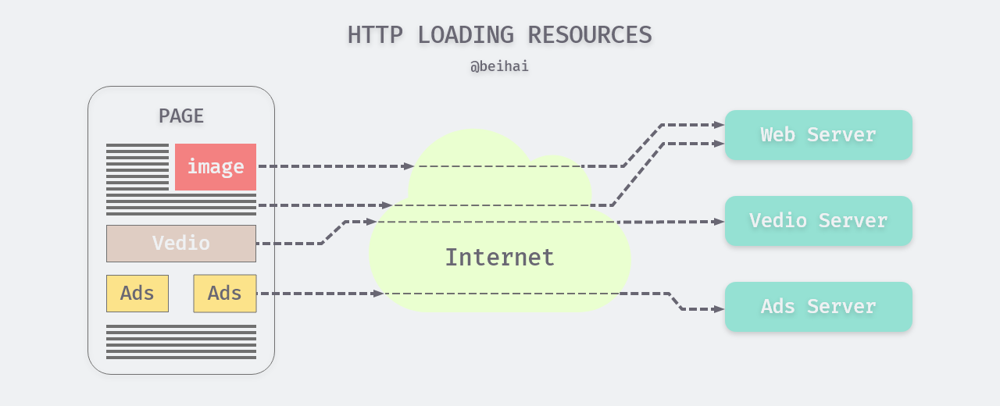
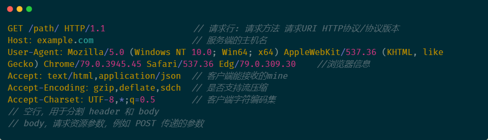
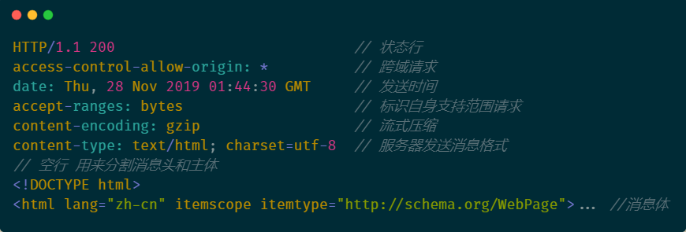
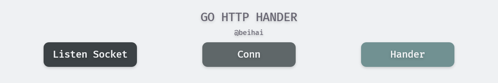

> 一个 Web 应用应该具有哪些特性，开发过程中注意哪些问题，这是我在初学 Web 时常常思考的问题。在此系列中作者不会用长长的列表指出开发者需要掌握的工具、框架，也不会刻画入微地去深究某一项程序设计的实现原理，旨在为初学者构建知识体系。如果你有想了解的问题、错误指正，可以在文章下面留言。

## Web 的工作方式

我们平时浏览网页的时候，会打开浏览器，输入网址按下回车键，然后就会显示出你想要访问的网页。在这个看似简单的用户行为背后，隐藏了些哪些东西？



对于普通的上网过程，系统处理的方式大致是这样的：

1. 浏览器或者应用本身是一个客户端，当你输入 URL 的时候，浏览器会去请求 DNS 服务器查询域名；
2. DNS 服务器进行域名查询流程，获取相应的域名对应的 IP，并返回给客户端；
3. 客户端收到 IP 地址，通过该地址找到对应的服务器，建立 TCP 连接，等客户端发送完 HTTP Request（请求）包后，服务器才开始处理请求包；
4. 服务器调用自身服务，返回 HTTP Response（响应）包
5. 客户端收到来自服务器的响应后开始处理 Response 包里的主体（body），等收到全部的内容随后断开与该服务器之间的 TCP 连接。 

 一个 Web 服务器也被称为 HTTP 服务器，它通过 HTTP 协议与客户端通信。这里的客户端通常指 Web 浏览器和移动端应用。 需要注意的是客户机与服务器之间的通信是非持久连接，当服务器发送了应答后就与客户机断开连接，等待下一次请求。 

### URL 和 DNS 解析

URL(Uniform Resource Locator)是“统一资源定位符”的英文缩写，用于描述一个网络上的资源，其基本格式如下：



DNS(Domain Name System)是“域名系统”的英文缩写，是一种组织成域层次结构的计算机和网络服务命名系统，它用于TCP/IP网络，它从事将主机名或域名转换为实际IP地址的工作。 

域名系统 (DNS) 是整个互联网的电话簿。人们通过例如 google.com 或 baidu.com 等域名在线访问信息。Web 浏览器通过 Internet 协议 (IP) 地址进行交互。DNS 将域名转换为 [**IP 地址**](https://www.cloudflare.com/zh-cn/learning/dns/glossary/what-is-my-ip-address/) ，以便浏览器能够加载网络资源。

连接到 Internet 的每个设备都有一个唯一 IP 地址，其他计算机可使用该 IP 地址查找此设备。DNS 服务器使人们无需记忆形如`192.168.1.1（IPv4）`等 IP 地址或更复杂的较新字母数字 IP 地址，例如 `2400:cb00:2048:1::c629:d7a2（IPv6）`。

#### DNS 的工作原理

DNS 解析过程涉及将主机名（例如 www.wingsxdu.com）转换为计算机友好的 IP 地址（例如 192.168.1.1）。Internet 上的每个设备都被分配了一个 IP 地址，必须有该地址才能找到相应的 Internet 设备——就像使用街道地址来查找特定住所一样。

DNS 解析过程用共涉及四类 DNS 服务器：

- [**DNS 解析器**](https://www.cloudflare.com/zh-cn/learning/dns/dns-server-types#recursive-resolver)：解析器可被视为被要求去图书馆的某个地方查找特定图书的图书馆员。DNS 解析器是一种服务器，旨在通过 Web 浏览器等应用程序接收客户端计算机的查询。然后，解析器一般负责发出其他请求，以便满足客户端的 DNS 查询。

- [**根域名服务器**](https://www.cloudflare.com/zh-cn/learning/dns/glossary/dns-root-server/)：根服务器是将人类可读的主机名转换（解析）为 IP 地址的第一步。可将其视为指向不同书架的图书馆中的索引 - 一般其作为对其他更具体位置的引用。

- **[TLD 域名服务器](https://www.cloudflare.com/zh-cn/learning/dns/dns-server-types#tld-nameserver)**：顶级域服务器 (TLD) 可被视为图书馆中的特定书架。此域名服务器是搜索特定 IP 地址的下一步，其托管主机名的最后一部分（在 wingsxdu.com 中，TLD 服务器为 “com”）。

- **[权威性域名服务器](https://www.cloudflare.com/zh-cn/learning/dns/dns-server-types#authoritative-nameserver)**：可将这个最终域名服务器视为书架上的字典，其中特定名称可被转换成其定义。权威性域名服务器是域名服务器查询中的最后一站。如果权威性域名服务器能够访问请求的记录，则其会将已请求主机名的 IP 地址返回到发出初始请求的 DNS 解析器（图书管理员）。

  

**DNS 查找的 8 个步骤：**

1. 用户在浏览器中键入 “wingsxdu.com”，查询传输到 Internet 中，然后 DNS 递归解析器接收该查询。
2. 该解析器查询 DNS 根域名服务器 (.)。
3. 然后根服务器使用存储其域信息的顶级域 (TLD) DNS 服务器（例如 .com 或 .net）的地址响应该解析器。在搜索 wingsxdu.com 时，我们的请求指向 .com TLD。
4. 该解析器向 .com TLD 发出请求。
5. TLD 服务器随后使用该域的域名服务器 wingsxdu.com 的 IP 地址进行响应。
6. 最后，递归解析器将查询发送到该域的域名服务器。
7. 接着 wingsxdu.com 的 IP 地址从域名服务器返回该解析器。
8. 然后 DNS 解析器使用最初请求的域的 IP 地址响应 Web 浏览器。

DNS 查找的这 8 个步骤返回了 wingsxdu.com 的 IP 地址后，浏览器便能够发出对该网页的请求。

### HTTP 协议

HTTP 协议（Hypertext Transfer Protocol，超文本传输协议）  是一个用于传输超媒体文档（例如 HTML）的[**应用层**](https://en.wikipedia.org/wiki/Application_Layer)协议 ， 它是为 Web 浏览器与 Web 服务器之间的通信而设计的，是 Web 进行数据交换的基础，但也可以用于其他目的。 

HTTP 是一个请求、响应协议——客户端发出一个请求，服务器响应这个请求，通过 TCP 或者是 TLS 加密的 TCP 连接来发送 。在 HTTP 中，客户端通过建立一个连接与发送一个 HTTP 请求来发起一个事务。服务器不能主动与客户端联系，也不能给客户端发出一个回调连接。但客户端与服务器端都可以提前中断一个连接，例如当浏览器下载一个文件时，你可以通过点击“停止”键来中断文件的下载，关闭与服务器的连接。

通常情况下，一个完整的 Web 文档是由不同的子文档拼接而成的，文本、布局描述、图片、视频、脚本等等。



HTTP 协议是无状态的，同一个客户端的本次请求与上次请求之间没有对应关系。对 HTTP 服务器来说，它并不知道这两个请求是否来自同一个客户端。为了解决这个问题，引入了 Cookie 机制来维护连接的可持续状态。

> HTTP 协议是建立在 TCP 协议之上的，因此 TCP 攻击一样会影响 HTTP 的通讯，例如一些比较常见的攻击：SYN Flood 是当前最流行的 DoS（拒绝服务攻击）与 DdoS（分布式拒绝服务攻击）的方式之一，这是一种利用 TCP 协议缺陷，发送大量伪造的 TCP 连接请求，从而使得被攻击方资源耗尽（ CPU 满负荷或内存不足）的攻击方式。

#### HTTP 请求包

Request 包分为 3 部分，第一部分叫 Request line（请求行）, 第二部分叫 Request header（请求头）,第三部分是 body（主体）。header 和 body 之间有个空行，请求包的示例如图所示:



HTTP 定义了一组**请求方法**，以表明要对给定资源执行的操作。虽然他们也可以是名词，但这些请求方法常被称为`HTTP 动词`。 每一个请求方法都实现了不同的语义, 但一些共同的特征由一组共享：例如一个请求方法可以是 [safe](https://developer.mozilla.org/en-US/docs/Glossary/safe), [idempotent](https://developer.mozilla.org/en-US/docs/Glossary/idempotent), 或 [cacheable](https://developer.mozilla.org/en-US/docs/Glossary/cacheable). 

- **GET** 方法请求一个指定资源的表示形式. 使用GET的请求应该只被用于获取数据.
- **HEAD** 方法请求一个与GET请求的响应相同的响应，但没有响应体.
- **POST** 方法用于将实体提交到指定的资源，通常导致在服务器上的状态变化或副作用. 
- **PUT** 方法用请求有效载荷替换目标资源的所有当前表示。
- **DELETE** 方法删除指定的资源。
- **CONNECT** 方法建立一个到由目标资源标识的服务器的隧道。
- **OPTIONS** 方法用于描述目标资源的通信选项。
- **TRACE** 方法沿着到目标资源的路径执行一个消息环回测试。
- **PATCH** 方法用于对资源应用部分修改。

#### HTTP 响应包

 HTTP response 包结构示例如下： 



Response 包中的第一行为状态行，由`HTTP协议版本号/状态码/状态消息`三部分组成。

状态码由三位数字组成，第一个数字定义了响应的类别，用来告诉客户端 HTTP 服务器是否产生了预期的 Response。HTTP/1.1 协议中定义了5类状态码：

- 1XX 提示信息 - 表示请求已被成功接收，继续处理
- 2XX 成功 - 表示请求已被成功接收，理解，接受
- 3XX 重定向 - 要完成请求必须进行更进一步的处理
- 4XX 客户端错误 - 请求有语法错误或请求无法实现
- 5XX 服务器端错误 - 服务器未能实现合法的请求

#### HTTP 协议无状态与 Connection: keep-alive

无状态是指协议对于事务处理没有记忆能力，服务器不知道客户端是什么状态。从另一方面讲，打开一个服务器上的网页和你之前打开这个服务器上的网页之间没有任何联系。

HTTP 是一个无状态的面向连接的协议，无状态不代表HTTP不能保持TCP连接，更不能代表HTTP使用的是UDP协议（面对无连接）。

 **Keep-Alive** 是一个通用消息头，允许消息发送者暗示连接的状态，还可以用来设置超时时长和最大请求数。 

从 HTTP/1.1 起，默认都开启了 Keep-Alive 保持连接特性，简单地说，当一个网页打开完成后，客户端和服务器之间用于传输 HTTP 数据的 TCP 连接不会关闭，如果客户端再次访问这个服务器上的网页，会继续使用这一条已经建立的 TCP 连接。

Keep-Alive 不会永久保持连接，它有一个保持时间，可以在不同服务器软件中设置这个时间。

> 需要将 Connection 首部的值设置为 "keep-alive" 这个首部才有意义。同时需要注意的是，在HTTP/2 协议中， Connection 和 Keep-Alive 是被忽略的，在其中采用其他机制来进行连接管理。 

#### HTTP/2 与 HTTPS

**HTTP/2**，下一代超文本传输协议。HTTP/2 的主要目标是通过启用完整的请求和响应多路复用来减少延迟，通过有效压缩 HTTP 标头字段来最小化协议开销，并增加对请求优先级和服务器推送的支持。

HTTP/2 不会修改 HTTP 协议的语义。 HTTP 1.1 中的所有核心概念（例如 HTTP 方法，状态码，URI 和 headers）都得以保留。 而是修改了 HTTP/2 数据在客户端和服务器之间的格式（帧）和传输方式，这两者都管理整个过程，并在新的框架层内隐藏了应用程序的复杂性。 所以，所有现有的应用程序都可以不经修改地交付。

 **HTTPS (Hypertext Transfer Protocol Secure)**   是以安全为目标的 HTTP 通道，在 HTTP 基础上加入 SSL/TLS 协议进行传输加密和身份认证，其默认端口为 443。 由于 HTTP 最初被设计为一种明文协议，它容易受到窃听和中间人攻击。HTTPS 通过在 SSL/TLS 之上承载 HTTP 协议来缓解这些漏洞，从而在两台联网计算机之间双向加密所有消息。 

## Web 形式的 Hello Word

序言中我们用 Gin 示例展示了一个简单的 web 服务，本次会介绍多种 web 版 hello word 的实现方式。

###  net/http

```go
package main

import (
	"fmt"
	"log"
	"net/http"
)

func main() {
	fmt.Println("Please visit http://localhost:1323/hello+word")
	http.HandleFunc("/", handler) // each request calls handler
	log.Fatal(http.ListenAndServe("localhost:1323", nil))
}

// handler echoes the Path component of the request URL r.
func handler(w http.ResponseWriter, r *http.Request) {
	fmt.Fprintf(w, "URL.Path = %q\n", r.URL.Path)
}
```

 我们只用了几行代码就实现了一个Web服务程序，这多亏了内置 http 库里的方法帮我们完成了大量工作。main 函数将所有发送到 “/” 路径下的请求和 handler 函数关联起来（ “/” 开头的请求表示所有发送到当前站点上的请求），服务监听 1323 端口。发送到这个服务的“请求”是一个 http.Request 类型的对象，这个对象中包含了请求中的一系列相关字段，其中就包括我们需要的 URL。当请求到达服务器时，这个请求会被传给 handler 函数来处理，这个函数会将 “hello+word”  这个路径从请求的 URL 中解析出来，然后把其发送到响应中。“hello+word” 中间有一个加号，因为在 URL 中空格以 “+”  的形式展现。

### 处理流程

该过程中几个概念：

- Request：用户请求的信息，包括 post、url、cookie 等信息
- Response：服务器需要反馈给客户端的信息
- Conn：用户的每次请求链接
- Handler：处理请求和生成返回信息的处理逻辑



处理流程大致如下：

1. 创建 Listen Socket，指定协议并监听指定的端口，等待客户端请求。
2. Listen Socket 接受客户端的请求 Conn，得到 Client Socket，通过 Client Socket 与客户端通信。
3. 处理客户端的请求， 首先从 Client Socket 读取 HTTP 请求的协议头与提交的数据，然后交给相应的 handler 处理请求，handler 处理完毕准备好客户端需要的数据,，通过Client Socket 发送给客户端。

Go 为了实现高并发和高性能，使用了 goroutines 来处理 Conn 的读写事件, 这样每个请求都能保持独立，相互不会阻塞，可以高效的响应网络事件。

```Go
c, err := srv.newConn(rw)
if err != nil {
    continue
}
go c.serve()
```

客户端的每次请求都会创建一个 Conn，这个 Conn 里面保存了该次请求的信息，传递到对应的 handler，该handler 中便可以读取到相应的 header 信息，这样保证了每个请求的独立性。

### Gin

```go
package main

import (
	"fmt"
	"github.com/gin-gonic/gin"
	"log"
	"net/http"
)

func main() {
	fmt.Println("Please visit http://localhost:1323/hello+word")
	e := gin.Default()
	e.GET("/hello+word", handler)
	log.Print(e.Run(":1323"))
}

func handler(c *gin.Context) {
	c.String(http.StatusOK, fmt.Sprintf("Gin.URL.Path = %s", c.Request.URL.Path))
}
```

Gin 版内容更加具体，路径改为固定值，使用 get 方式，并在返回信息中添加了 http 状态码。

可以看出，Go 语言中的 Web 服务一贯地简洁、易读。

### context

在Go 程序中，每个 http 请求都会有一个单独的 goroutine 去处理。然而，处理程序往往还需要创建额外的 goroutine 去访问后端资源，比如数据库、RPC 服务等。由于这些goroutine都是在处理同一个请求，所以它们往往需要访问一些共享的资源，比如用户身份信息、认证 token、请求截止时间等。如果请求超时或者被取消后，所有的 goroutine 都应该马上退出并且释放相关的资源。为了解决复杂的并发场景，引入 **Context（上下文）**机制。


在 Gin 中请求的处理是使用`type HandlerFunc func(*Context)`来处理的，每个 HTTP 请求都会建立一个 Context 对象，Context 贯穿整个 HTTP 请求，包含所有上下文信息。

```go
func(context *gin.Context) {
	context.String(http.StatusOK, "Hello")
}
```

Context 虽然是个接口，但是并不需要使用方实现，golang 内置的 context 包，已经帮我们实现了 2 个方法，一般在代码中，开始上下文的时候都是以这两个作为最顶层的 parent context，然后再衍生出子context。这些 Context 对象形成一棵树：当一个 Context 对象被取消时，继承自它的所有 Context 都会被取消。两个实现如下：

```go
var (
	background = new(emptyCtx)
	todo = new(emptyCtx)
)

func Background() Context {
	return background
}

func TODO() Context {
	return todo
}
```
## 总结

本文介绍了 DNS 解析过程与 HTTP 协议, 并用 go 实现 Web 版 Hello word。或许你也发现了，go 的 web 开发简洁明了，也不需要 nginx 一类的代理工具即可实现服务。 

## Reference{#Reference}

-  [What Is DNS ? How DNS Works ?](https://www.cloudflare.com/learning/dns/what-is-dns/)
- [详解 DNS 与 CoreDNS 的实现原理](https://draveness.me/dns-coredns#)
- [Web 工作方式](https://astaxie.gitbooks.io/build-web-application-with-golang/content/zh/03.1.html)
- [HTTP概述](https://developer.mozilla.org/zh-CN/docs/Web/HTTP/Overview)
- [What is HTTPS?](https://www.ssl.com/faqs/what-is-https/)
- [Golang Context 深入理解](https://juejin.im/post/5a6873fef265da3e317e55b6#heading-9)