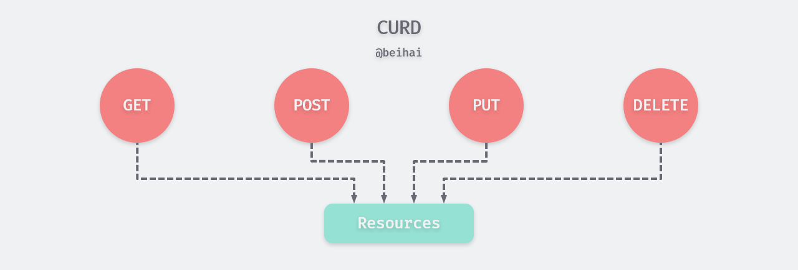
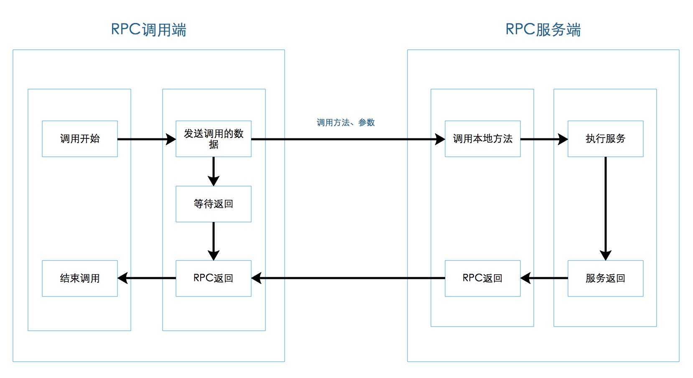
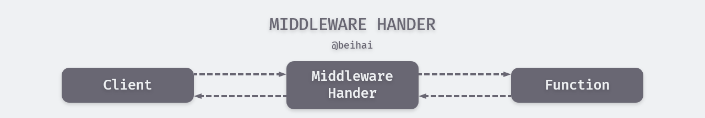
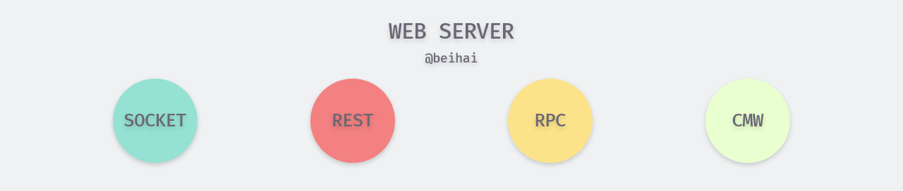

> 一个 Web 应用应该具有哪些特性，开发过程中注意哪些问题，这是我在初学 Web 时常常思考的问题。在此系列中作者不会用长长的列表指出开发者需要掌握的工具、框架，也不会刻画入微地去深究某一项程序设计的实现原理，旨在为初学者构建知识体系。如果你有想了解的问题、错误指正，可以在文章下面留言。

## Socket

Socket 起源于 Unix，而 Unix 的基本哲学之一就是“一切皆文件”，都可以用“打开(open) –> 读写(write/read) –> 关闭(close)”模式来操作。Socket 就是该模式的一个实现，网络的 Socket 数据传输是一种特殊的 I/O，Socket 也是一种文件描述符。 

假设现在你要编程网络程序，进行服务器端和客户端的通信（数据交换），你会做下面的一堆事情：

- 管理缓存区来接收和发送数据
- 告诉操作系统自己要监听某个端口的数据，还有自己处理这些系统调用来读取数据
- 当没有连接的时候或者另外一端要还没有发送数据时候，要处理 IO 阻塞，把自己挂起
- 封装和解析 tcp/ip 协议的数据，维护数据发送的顺序
- 等等

如果有一个程序能够自动帮我们把上面的东西都做掉，这样我们就可以只关心数据的读写，而不用重复性地编写代码——Socket 应运而生。

简单来说，**Socket 是对底层网络通信的一层抽象， 是计算机之间进行通信的一种约定或一种方式，让程序员可以像操作文件那样在网络上发送和接收的数据。** 

常用的 Socket 类型有两种：流式 Socket（SOCK_STREAM）和数据报式 Socket（SOCK_DGRAM）。流式是一种面向连接的 Socket，针对于面向连接的 TCP 服务应用；数据报式 Socket 是一种无连接的 Socket，对应于无连接的 UDP 服务应用。 


#### 协议

协议（Protocol）就是网络通信的约定，通信的双方必须都遵守才能正常收发数据。协议有很多种，例如 TCP、UDP，通信的双方必须使用同一协议才能通信。协议是一种规范，由计算机组织制定，规定了很多细节，例如，如何建立连接，如何相互识别等。

所谓协议族（Protocol Family），就是一组协议（多个协议）的统称。最常用的是 TCP/IP 协议族，它包含 TCP、IP、UDP、Telnet、FTP、SMTP 等上百个互为关联的协议，由于 TCP、IP 是两种常用的底层协议，所以把它们统称为 TCP/IP 协议族。 

#### IP

计算机分布在世界各地，要想和它们通信，必须要知道确切的位置。其中 IP 地址是最常用的。

IP 是 TCP/IP 协议族中网络层的协议，是 TCP/IP 协议族的核心协议。目前主要采用的IP协议的版本号是 4 (简称为 IPv4 )。IPv4 的地址位数为 32 位，也就是最多有 2^32 的网络设备可以联到 Internet 上，其地址格式类似于：192.168.1.1

IPv6是下一代互联网协议，它采用128位地址长度，几乎可以不受限制地提供地址。在 IPv6 的设计过程中除了一劳永逸地解决了地址短缺问题以外，还考虑了在 IPv4 中解决不好的其它问题，主要有端到端 IP 连接、安全性、移动性等，其地址格式类似于：2002:c0e8:82e7:0:0:0:c0e8:82e7

#### 端口

有了 IP 地址，虽然可以找到目标计算机，但仍然不能进行通信。一台计算机可以同时提供多种网络服务，例如Web 服务、FTP 服务（文件传输服务）、SMTP 服务（邮箱服务）等，仅有 IP 地址，计算机虽然可以正确接收到数据包，但是却不知道要将数据包交给哪个网络程序来处理。

为了区分不同的网络程序，计算机会为每个网络程序分配一个独一无二的端口号（Port Number），例如，Web 服务的默认端口号是 80，FTP 服务的端口号是 21，SMTP 服务的端口号是 25。

端口（Port）是一个虚拟的、逻辑上的概念。可以将端口理解为一道门，数据通过这道门流入流出，每道门有不同的编号，就是端口号。 


#### Socket 通信

网络中的进程之间通过 Socket 通信，首要解决的问题是唯一标识一个进程，利用网络层的`IP`可以唯一标识网络中的主机，而传输层的“协议+端口”可以唯一标识主机中的应用程序（进程）。这样利用三元组（IP，协议，端口）就可以标识网络的进程。网络中需要互相通信的进程，就可以利用这个标志进行交互。 

<div align="center"></div>
## REST

REST(Representational State Transfer)  表现层状态转换 ， 是 **Roy Thomas Fielding** 博士于2000年在他的博士论文中提出来的一种万维网软件架构风格，目的是便于不同软件/程序在网络（例如互联网）中互相传递信息 。


- **资源（Resources）**

	REST，表现层状态转化，其实它省略了主语，"表现层"其实指的是"资源"的"表现层"，如我们平常上网访问的图片、文档、视频等，这些资源我们通过 URI (统一资源标识符，Uniform Resource Identifier)  来定位，也就是一个 URI 表示一个资源。

- **表现层（Representation）**

	资源是做一个具体的实体信息，他可以有多种的展现方式。把实体展现出来就是表现层，例如	一个 txt 文本信息，他可以输出成 html、json、xml 等格式，一个图片他可以 jpg、png 等方式	展现，这就是表现层。

	URI 确定一个资源，其具体表现形式在 HTTP 请求头信息中用 Accept 和 Content-Type 字段指定，这两个字段是对"表现层"的描述。

- **状态转化（State Transfer）**

	访问一个网站，就代表了客户端和服务器的一个互动过程。在这个过程中，肯定涉及到数据和状态的变化。而 HTTP 协议是无状态的，那么这些状态肯定保存在服务器端，所以如果客户端想要通知服务器端改变数据和状态的变化，肯定要通过某种方式来通知它。

	客户端利用 HTTP 协议动词（GET、POST、PUT、DELETE 等）通知服务器端，分别对应不同的基本操作，如GET用来获取资源，POST用来新建资源（也可以用于更新资源），DELETE 用来删除资源。

通俗地讲，REST 就是通过使用 HTTP 协议和 URI，对资源进行 CRUD 增删改查操作。 



>  需要注意的是，REST是设计风格而**不是**标准。 

#### RESTful server

RESTful 通常用于指代实现 REST 结构的 Web 服务。一组对开发人员友好的 API，看 URL 就知道要什么，看 http method 就知道干什么，看 http status code 就知道结果如何。形式如下：

```go
func main() {
	e := gin.New()
	v1 := e.Group("/v1/")
	{
		v1.GET("favor", api.FavorGet)
		v1.POST("favor", api.FavorPost)
		v1.PUT("favor", api.FavorPut)
		v1.DELETE("favor", api.FavorDelete)
	}
    log.Print(e.Run(":80"))
}
// GET http://localhost/v1/favor
```

示例为对 favor 收藏资源进行增删改查操作，并用路由组指定了 API 版本。

## RPC

RPC（Remote Procedure Call），远程程序调用，是一种通过网络从远程计算机程序上请求服务，而不需要关注底层网络技术的协议。也就是说两台服务器 A，B，一个应用部署在 A 服务器上，想要调用 B 服务器上应用提供的方法，由于不在一个内存空间，不能直接调用，需要通过网络来表达调用的语义和传达调用的数据。 

RPC 这个概念术语在上世纪 80 年代由 **Bruce Jay Nelson** 提出。在 Nelson 的论文 "Implementing Remote Procedure Calls" 中他提到了几个要点：

> - 简单：RPC 概念的语义十分清晰和简单，这样建立分布式计算就更容易。
> - 高效：过程调用看起来十分简单而且高效。
> - 通用：在单机计算中过程往往是不同算法部分间最重要的通信机制。

通俗一点说，就是一般程序员对于本地的过程调用很熟悉，如果我们把 RPC 作成和本地调用完全类似，那么就更容易被接受，使用起来毫无障碍。Nelson 的论文发表于 30 年前，其观点今天看来确实高瞻远瞩，今天我们使用的 RPC 框架基本按这个目标来实现的。


#### RPC 工作原理

RPC 由 Client，Client stub，Network ，Server stub，Server 构成。 其中 Client 就是用来调用服务的，Client stub 是把调用的方法和参数序列化（因为要在网络中传输），Network 则传输这些信息到 Server stub，Server stub 再将信息进行反序列化，交付 Server，最终调用 Server 提供的方法。 最后将处理得到的数据以相同的流程发送回 Client。

  

1. Client 像调用本地服务一样调用远程服务；
2. Client stub 接收到调用后，将方法、参数序列化；
3. 客户端通过 sockets 将消息发送到服务端；
4. Server stub 收到消息后进行解码（将消息对象反序列化）；
5. Server stub 根据解码结果调用本地的服务；
6. 执行本地服务(对于服务端来说是本地执行)并将结果返回给 Server stub；
7. Server stub 将结果消息对象序列化；
8. 服务端通过 sockets 将消息发送到客户端；
9. Client stub 接收到结果消息，并进行解码；
10. 客户端得到最终结果。

#### 微服务架构

微服务概念在2014年被提出，现在已经被很多公司使用，微服务是一种架构设计，并不是指某种框架。微服务按照项目颗粒度进行服务的拆分，把模块单独拿出来做成每一个单独的小项目。每一个功能模块是一个小项目，独立运行在不同进程或者机器上，不同功能可以由不同的人员独立开发、部署，而不需要依赖整体项目就可以启动单个服务、分布式管理。 每个微服务仅关注于完成一件任务并很好地完成该任务。在所有情况下，每个任务代表着一个小的业务能力。 

RPC 是微服务架构的核心，微服务之间通过 RPC 进行通信，由于单体式架构在开发大型应用时逐渐显得力不从心，微服务概念逐渐被接纳。

#### Go RPC

 Go 标准包中提供了对 RPC 的支持，而且支持三个级别的 RPC：TCP、HTTP、JSONRPC。但 Go 的内置 RPC 包 只支持 Go 语言开发的程序间交互，因为其内部采用了 Gob 编码。

以 TCP RPC 为例：

server.go

注册`HelloService.Hello`方法并监听 TCP 端口

```go
type HelloService struct {}

func (p *HelloService) Hello(request string, reply *string) error {
	*reply = "hello," + request
	return nil
}

func main() {
	err := rpc.RegisterName("HelloService", new(HelloService)) // 注册服务
	if err != nil{
		log.Fatal("Register RPC error:", err)
	}

	listener, err := net.Listen("tcp", ":1323") // 监听 tcp 端口
	if err != nil {
		log.Fatal("ListenTCP error:", err)
	}

	conn, err := listener.Accept()
	if err != nil {
		log.Fatal("Accept error:", err)
	}

	rpc.ServeConn(conn)
}
```

client.go

调用`HelloService.Hello`方法并传递了一个"word"参数

```go
func main() {
	client, err := rpc.Dial("tcp", "localhost:1323")
	if err != nil {
		log.Fatal("dialing:", err)
	}

	var reply string
	err = client.Call("HelloService.Hello", "word", &reply) // 传递调用的方法及参数
	if err != nil {
		log.Fatal(err)
	}

	fmt.Println(reply) // 打印回复
}
```

运行程序

```bash
$ go run server.go
  # open a new bash
$ go run client.go
  hello,word
```

## Middleware

Middleware，中间件，是为应用提供操作系统功能以外服务的多功能软件。任何位于内核和用户应用之间的软件都可以是中间件。 

到目前为止，我们根据请求的 URL 和 HTTP 动词将路由绑定到不同的功能函数。但是，如果您希望在每个请求之前或之后执行一些处理程序， 如记录日志、统计调用时间等，而不考虑请求的 URL。在每个 API 功能函数中添加相同的执行代码未免不够优雅，我们可以使用 Middleware 轻松高效地完成这些操作。

**Middleware Handler** 包装一个程序来执行请求的一些预处理和/或后处理。被称为"中间件"，是因为它位于 Go Web 服务器和实际处理程序的中间层。



#### Gin Middleware

Gin 支持自定义 Middleware，我们写一个简单的在终端打印程序执行时间的中间件。

```go
func main() {
	gin.SetMode(gin.ReleaseMode)
	e := gin.Default()
	e.Use(CallTime())
	e.GET("/ping", func(c *gin.Context) {
		c.JSON(200, gin.H{
			"message": "pong",
		})
	})
	log.Print(e.Run(":1323"))
}

func CallTime() gin.HandlerFunc {
	return func(c *gin.Context) {
		start := time.Now() // 功能函数开始执行时间
		// some evil middleware modify this values
		path := c.Request.URL.Path
		c.Next() // 进行下一步，即功能函数执行结束后

		end := time.Now()         // 功能函数结束执行时间
		latency := end.Sub(start) // 相减
		end = end.UTC()
		fmt.Printf("URL is: %s , use time: %s \n", path, latency)
	}
}
```

执行程序

```bash
$ go run main.go
  # open a new bash
$ curl http://localhost:1323/ping
  {"message":"pong"}
  #main.go terminal will print
  URL is: /ping , use time: 757.7µs
```

该中间件程序会打印出来请求的 URL 和程序执行的时间：757.7µs

Gin 自带了一些常用中间件，如流式压缩 Gzip、日志 Zap，十分实用。

## 总结



本文介绍 Web 服务中一些流行的网络应用开发方式，了解这些概念对程序的设计与开发有一定的帮助。作为 Web  的基石，熟知网络相关知识是开发者必备的技能之一，更多内容还需自行了解。

## Reference

- [socket 编程基础知识](https://cizixs.com/2015/03/29/basic-socket-programming/)
- [Socket 编程](https://astaxie.gitbooks.io/build-web-application-with-golang/content/zh/08.1.html)
- [维基百科：表现层状态转换](https://zh.wikipedia.org/wiki/%E8%A1%A8%E7%8E%B0%E5%B1%82%E7%8A%B6%E6%80%81%E8%BD%AC%E6%8D%A2)
- [什么是 REST？](https://www.jianshu.com/p/350122cf63f2)
- [REST 和 RESTful 有什么区别？](https://cloud.tencent.com/developer/ask/27329)
- [RPC Introduction](https://dubbo.apache.org/zh-cn/blog/rpc-introduction.html)
- [RPC 服务](https://en.swoft.org/docs/2.x/zh-CN/rpc-server/index.html)
- [Middleware Patterns in Go](https://drstearns.github.io/tutorials/gomiddleware/)
- [Gin: Using middleware](https://gin-gonic.com/docs/examples/using-middleware/)