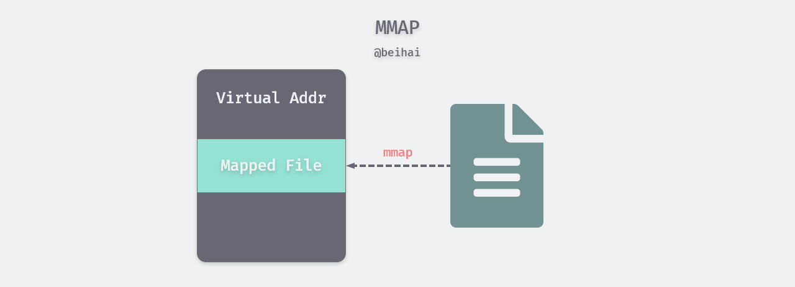
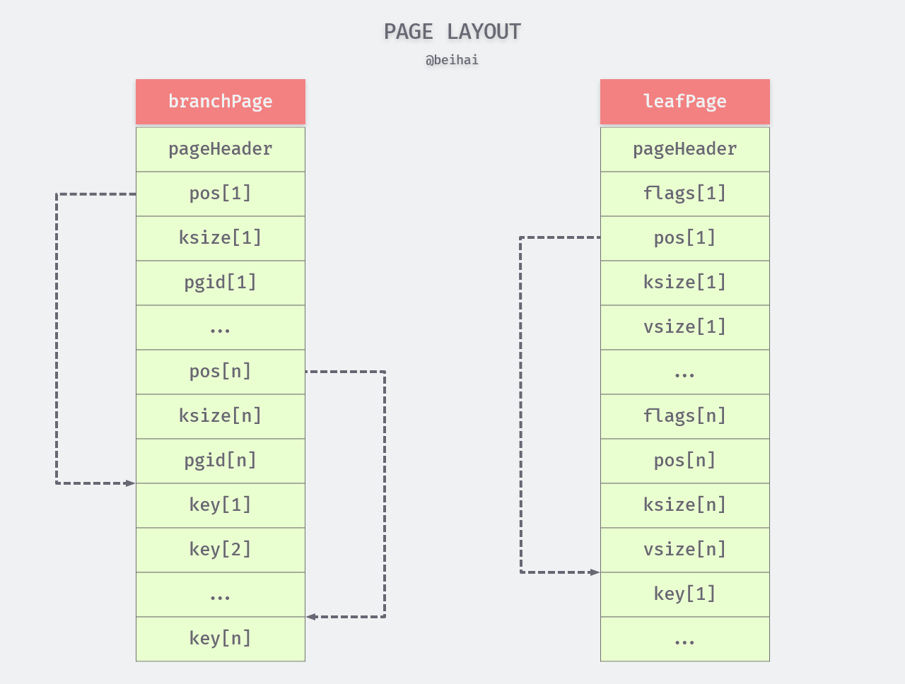
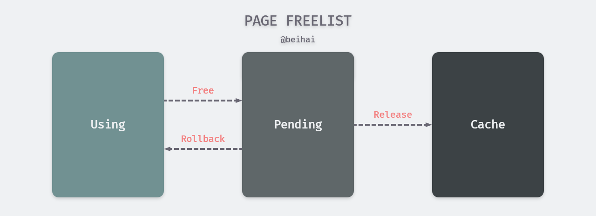

> BoltDB 是使用 Go 语言实现的嵌入式 K/V 数据库，其目标是为不需要完整数据库服务（如 Postgres 或 MySQL）的项目提供一个简单、快速、可靠的嵌入数据库。BoltDB 已在 Etcd、Bitcoin 等项目中作为底层数据库实现。这篇文章对 BoltDB 的设计原理进行简要分析。

[BoltDB ](https://github.com/boltdb/bolt#getting-started) 目前已经被原作者归档，因此文中分析的是由 Etcd 进行维护的版本：[etcd-io/bbolt](https://github.com/etcd-io/bbolt)。

BoltDB 主要设计源于 LMDB，支持 ACID 事务、无锁 MVCC，提供 B+Tree 索引。BoltDB 采用一个单独的文件作为持久化存储，利用`mmap`将文件映射到内存中，并将文件划分为大小相同的 page 存储数据，使用写时复制技术将脏页写入文件。

## MMAP

mmap（内存映射）技术是将一个文件映射到调用进程的虚拟内存中，通过操作相应的内存区域来访问被映射文件的内容。`mmap()`通常在需要对文件进行频繁读写时使用，用内存读写取代 I/O 读写，以获得较高的性能。



传统的 UNIX 或 Linux 系统在内核中设有多个缓冲区，当我们调用`read()`系统调用从文件中读取数据时，内核通常先将该数据复制到一个缓冲区中，再将数据复制到进程的内存空间。

而使用`mmap`时，内核会在调用进程的虚拟地址空间中创建一个内存映射区，应用进程可以直接访问这段内存获取数据，节省了从内核空间拷贝数据到用户进程空间的开销。`mmap`并不会真的将文件的内容实时拷贝到内存中，而是在读取数据过程中，触发缺页中断，才会将文件数据复制到内存中。

现代操作系统中常用分页技术进行内存管理，将虚拟内存空间划分成大小相同的 page，其大小通常是 4KB，在类 UNIX 系统中，我们可以使用下面的命令获取 page 的大小：

```shell
$ getconf PAGESIZE
4096
```

因此为了减少随机 I/O 次数，在 BoltDB 的数据文件中，也会以 4KB 大小进行划分。但在使用过程中，频繁读写数据仍会导致随机 I/O 过多影响性能。

> BoltDB 中对文件的写入并没有使用`mmap`技术，而是直接通过`Write()`与`fdatasync()`这两个系统调用将数据写入文件。

## 数据结构

BoltDB 的数据文件被组织为多个 page，数据库初始化时，会预先分配 4 个 page，第 0 页和第 1 页初始化`meta`页，第 2 页初始化为`freelist`页，第 3 页初始化为一个空`leafPage`，用来写入键值对数据。关于这几种类型的 page 会在下文介绍，我们首先分析 page 的数据结构。

#### Page

每一个`page`都有一个固定大小的`Header`区域，用于标记这个页面的 id、数据类型等信息，由于 BoltDB 使用 B+Tree 索引，因此除了存放数据的`leafPage`，还会有做为数据索引的`branchPage`。

```go
const (
	branchPageFlag = 0x01 	// 分支节点
	leafPageFlag = 0x02 	// 叶子节点
	metaPageFlag = 0x04 	// meta 页
	freelistPageFlag = 0x10 // freelist 页，存放无数据的空 page id
)

type pgid uint64

type page struct {
	id pgid 		// 页 id
	flags uint16 	// 此页中保存的具体数据类型，即上面四个 Flag
	count uint16 	// 数据计数
	overflow uint32 // 是否有后序页，如果有，overflow 表示后续页的数量
}
```

> 在旧版本的实现中会有一个额外的`ptr`字段指向数据存储地址，但在 Go 1.14 中无法通过指针安全性检查，因此这个字段已经去除了，详细了解：[Fix unsafe pointer conversions caught by Go 1.14 checkptr](https://github.com/etcd-io/bbolt/pull/201)

BoltDB 会为每个`page`分配一个唯一标识 id，并通过 id 查找对应的页。`pageHeader`之后就是具体的数据存储结构。每一个键值对用一个`Element`结构体表示，并利用偏移量`pos`进行指针运算获取键值对的存储地址：`&Element + pos == &key`。

```go
type branchPageElement struct {
	pos uint32   // Element 对应 key 存储位置相对于当前 Element 的偏移量
	ksize uint32 // Element 对应 key 的大小，以 byte 为单位
	pgid pgid    // Element 指向的子节点所在 page id
}

type leafPageElement struct {
	flags uint32 // 当前 Element 是否代表一个 Bucket，如果是则其值为 1，如果不是则其值为 0;
	pos uint32   // Element 对应的键值对存储位置相对于当前 Element 的偏移量
	ksize uint32 // Element 对应 key 的大小，以 byte 为单位
	vsize uint32 // Element 对应 value 的大小，以 byte 为单位
}
```

上面两种不同的`Element`结构体用于不同类型的`page`中，如果是用做数据索引的`branchPage`，一个`branchPageElement`中只会存储 key 的大小字段`ksize`和下一级页面的`pgid`，用于数据索引。

`leafPageElement`用于存储真实的键值对数据，因此增加了`vsize`字段，以快速获取查询的键值对信息。`flags`字段的含义会在 **Bucket** 一节中介绍。

通过对`Element`的分析可以得出`branchPage`与`leafPage`的内存布局如下图所示：



将 `Element` 和键值对分开存储减少了查找的时间，因为`Element`结构体的大小是固定的，我们可以在 *O(1)* 时间复杂度内获取所有的`Element` ，若是以 `[Element header][key value][...]` 格式存储，需要按顺序遍历查找。

```go
func (p *page) leafPageElements() []leafPageElement {
	if p.count == 0 {
		return nil
	}
	return *(*[]leafPageElement)(unsafe.Pointer(&reflect.SliceHeader{
		Data: uintptr(unsafe.Pointer(p)) + unsafe.Sizeof(*p),
		Len:  int(p.count),
		Cap:  int(p.count),
	}))
}
```

#### Node

`page`是数据在磁盘文件中的布局格式，当`page`加载到内存中要反序列化为`node`，以便进行数据修改操作。一个 `node`表示为一个 B+ Tree 节点，因此额外的`unbalanced`与`spilled`字段表明节点是否需要旋转与分裂。`node`中还会存储父节点与子节点的指针，用于对 key 进行范围查询。

```go
type node struct {
	bucket *Bucket  // 每一个 Bucket 都是一个完整的 B+ Tree
	isLeaf bool 	// 区分 branch 和 leaf
	unbalanced bool // 是否平衡
	spilled    bool // 是否溢出
	key  []byte 	// 该 node 的起始 key
	pgid pgid
	parent *node 	// 父节点指针
	children nodes 	// 子节点指针
	inodes inodes 	// 存储键值对的结构体数组
}

type inode struct {
	flags uint32 // 用于 leaf node，是否代表一个 subbucket
	pgid  pgid   // 用于 branch node, 子节点的 page id
	key   []byte
	value []byte
}

type inodes []inode
```

`page`中的键值对会存在`node.inodes`中，并且一一对应，可以通过切片下标访问某个键值对。

#### 序列化

BoltDB 中为了方便对数据的修改操作，需要将对应的`page`实例化为`node`，修改完成后再序列化回`page`写入磁盘。`node` 和 `page` 的相互转换通过 `node.read(p *page)` 和 `node.write(p *page)`这两个方法实现，以`page` 的反序列化过程为例，其转化过程如下：

```go
func (n *node) read(p *page) {
	n.pgid = p.id
	n.isLeaf = ((p.flags & leafPageFlag) != 0)
	n.inodes = make(inodes, int(p.count))

	for i := 0; i < int(p.count); i++ {
		inode := &n.inodes[i]
		if n.isLeaf {
			elem := p.leafPageElement(uint16(i))
			inode.flags = elem.flags
			inode.key = elem.key()
			inode.value = elem.value()
		} else {
			elem := p.branchPageElement(uint16(i))
			inode.pgid = elem.pgid
			inode.key = elem.key()
		}
		_assert(len(inode.key) > 0, "read: zero-length inode key")
	}

	// Save first key so we can find the node in the parent when we spill.
	if len(n.inodes) > 0 {
		n.key = n.inodes[0].key
		_assert(len(n.key) > 0, "read: zero-length node key")
	} else {
		n.key = nil
	}
}
```

在向 inodes 中填充键值对时。如果是`leafPage`，`inode.flags`即为元素的`flags`，key 和 value 分别为元素对应的 Key 和 Value；如果是`branchPage`，`inode.pgid`即为子节点的页号，inode 与 page 中的`Element`一一对应。

## Bucket

Bucket 是更为上层的数据结构，每一个 Bucket 都是一个完整的 B+ Tree，将多个节点组织起来。

#### 数据结构

Bucket 由`Bucket`结构体定义，其中包含一个由`bucket`定义的 Header 字段，包含根节点的页面 id 和唯一标识自增 id。Bucket 之间是相互独立的，其概念相当于 namespace。

```go
type Bucket struct {
	*bucket
	tx *Tx // the associated transaction
	buckets map[string]*Bucket // subbucket cache
	page *page // inline page reference
	rootNode *node // materialized node for the root page.
	nodes map[pgid]*node // node cache
	FillPercent float64
}

// In the case of inline buckets, the "root" will be 0.
type bucket struct {
	root pgid // page id of the bucket's root-level page
	sequence uint64 // monotonically incrementing, used by NextSequence()
}
```

Bucket 中的节点可能是已经实例化的`node`，也可能是序列化存储的`page`。当需要从 Bucket 中查找某个页面的键值对时，会先从`Bucket.nodes`缓冲查看是否存在相应的`node`（只有进行过数据修改操作的 page 才会被缓存为`node`），如果没有，再从`page`中查找。

`Bucket.FillPercent`字段记录着节点的填充百分比，当节点中已使用的空间超过整个 node 容量的某个百分比后，该节点必须进行分裂，以减少 B+ Tree 中插入键值对时触发再平衡操作的概率。该值的默认值是 50%，只有当大数多写入操作是在尾部添加时，增大该值才有帮助。

#### 数据查询

为了便于数据查询，Bucket 可能持有多个迭代器，这个迭代器由`Cursor`定义，包含该迭代器正在遍历的 Bucket 和存储搜索路径的栈。

```go
type Cursor struct {
	bucket *Bucket  // 遍历的 bucket
	stack []elemRef // 记录游标的搜索路径，最后一个元素指向游标当前位置
}

type elemRef struct {
	page *page // 当前节点的 page
	node *node // 当前节点的 node
	index int  // page 或 node 中的下标
}
```

`stack`是一个切片，每个`elemRef`指向 B+ Tree 的一个节点，节点可能是已经实例化的`node`，也可能是未实例化的`page`，`elemRef`会存储对应结构的指针，另一个指针则为空，并记录键值对所在的位置。

进行查询时，Cursor 首先从 `Bucket.root` 对应的  page 开始递归查找，直到最终的叶子节点。`Cursor.stack` 中保存了查找对应 key 的路径，栈顶保存了 key 所在的结点和位置。除了常规的键值查询操作，Cursor 也支持查询 Bucket 的`First`、`Last`、`Next`、`Prev`方法，用于相关场景的优化。

#### Bucket 嵌套

BoltDB 中的 Bucket 可以形成嵌套关系，根据嵌套形式的不同分为`subBucket`与`inlineBucket`。在使用过程中，我们通常使用如下方式创建一个新的 Bucket 并设定一个名称：

```go
db.Update(func(tx *bolt.Tx) error {
    b, err := tx.CreateBucket([]byte("NewBucket"))
    if err != nil {
        return fmt.Errorf("create bucket: %s", err)
    }
    return nil
})
```

`subBucket`本身也是一个完整的 B+ Tree，其名称做为 key，一个`bucket`结构体做为 value，索引到子 Bucket 根节点所在的页面。BoltDB 持有一个 `rootBucket`，存储着数据库中所有 B+ Tree 的根节点，我们创建的每一个 `Bucket` 都是 `rootBucket` 的 `subBucket`。


从上图可以看出，父 Bucket 中只保存了`subBucket`的 `bucket`字段，每个 `subBucket` 都会占用额外的 page 存储数据，通常情况下嵌套的子 Bucket 不会拥有大量的数据，这造成了空间的浪费。BoltDB 使用`inlineBucket`解决这个问题，将较小的子 Bucket 的值直接存储在父 bucket 的叶子节点中，从而减少 page 的使用数量。

`inlineBucket`是对`subBucket` 的优化，我们可以通过下面这段代码推理出，其本质是在`subBucket` 的值后面追加一个完整的 page 结构，并以字节数组的形式写入文件。

```go
func (b *Bucket) inlineable() bool {
	var n = b.rootNode

	// Bucket must only contain a single leaf node.
	if n == nil || !n.isLeaf {
		return false
	}

	// Bucket is not inlineable if it contains subbuckets or if it goes beyond
	// our threshold for inline bucket size.
	var size = pageHeaderSize
	for _, inode := range n.inodes {
		size += leafPageElementSize + uintptr(len(inode.key)) + uintptr(len(inode.value))

		if inode.flags&bucketLeafFlag != 0 {
			return false
		} else if size > b.maxInlineBucketSize() {
			return false
		}
	}

	return true
}

```

为保证程序的稳定运行，BoltDB 对`inlineBucket`做出了一些限制要求：

1. `inlineBucket`的大小不能超过 pageSize 的 1/4；
2. `inlineBucket`只能含有一个叶子节点；
3. `inlineBucket`的`bucket.root`字段值为 0，用以表明结构类型。

## 事务

BoltDB 支持 ACID 事务，并采用了使用读写锁机制，支持多个读操作与一个写操作并发执行，让应用程序可以更简单的处理复杂操作。每个事务都有一个 `txid`，其中`db.meta.txid` 保存了最大的已提交的写事务 id。BoltDB 对写事务和读事务执行不同的 id 分配策略：

- 读事务：`txid == db.meta.txid`；
- 写事务：`txid == db.meta.txid + 1`；
- 当写事务成功提交时，会更新了`db.meta.txid`为当前写事务 id.。

#### MVCC

BoltDB 通过`meta`副本机制实现多版本并发控制，`meta`页是事务读取数据的入口，记录了数据的版本信息与查询起点。`meta`的定义如下，选取了一些重要的字段：

```go
type meta struct {
	root bucket     // 存储 rootBucket 所在的 page
	freelist pgid   // freelist 所在的 pgid，初始化为 2
	pgid pgid       // 已经申请的 page 数量，值为 max_pgid +1
	txid txid       // 上次写事务的 id
	checksum uint64 // 上面各字段的 64 位 FNV 哈希校验
}
```

数据库初始化时会将页号为 0 和 1 的两个页面设置为`meta`页，每个事务会获得一个`txid`，并选取`txid % 2`的`meta`页做为该事务的读取对象，每次写数据后会交替更新`meta`页。当其中一个出现数据校验不一致时会使用另一个`meta`页。

BoltDB 的写操作都是在内存中进行，若事务未 commit 时出错，不会对数据库造成影响；若是在 commit 的过程中出错，BoltDB 写入文件的顺序也保证了不会造成影响：因为数据会写在新的 page 中不会覆盖原来的数据，且此时 `meta`中的信息不发生变化。

1. 开始一份写事务时，会拷贝一份 `meta`数据；
2. 从 `rootBucket` 开始，遍历 B+ Tree 查找数据位置并修改；
3. 修改操作完成后会进行事务 commit，此时会将数据写入新的 page；
4. 最后更新`meta`的信息。

#### Freelist

BoltDB 的工作原理是分配 4KB 的 page 并将它们组织成一个B+ Tree，并根据需要在结尾处分配更多的 page。 BoltDB 在写入文件时使用了写时复制技术，当一个页面被更新时，它的内容会被复制到一个新页面，旧页面会被释放。

当经过反复的增删改查后，文件中会出现没有数据的部分。被清空数据的页可能位于任何位置，BoltDB 并不打算搬移数据、截断文件来将这部分空间返还，而是将这部分空 page，加入内部的`freelist`来维护，当有新的数据写入时，复用这些空间。

> 因此`BoltDB ` 的持久化文件只会增大，而不会因为数据的删除而减少。

`freelist`是一个复杂的结构体，其中包含一些函数定义，为了便于理解，下面列出了几个重要的字段：

```go
type freelist struct {
	freelistType   FreelistType        // freelist type
	ids            []pgid              // all free and available free page ids.
	allocs         map[pgid]txid       // mapping of txid that allocated a pgid.
	pending        map[txid]*txPending // mapping of soon-to-be free page ids by tx.
	cache          map[pgid]bool       // fast lookup of all free and pending 
}

type txPending struct {
	ids              []pgid
	alloctx          []txid // txids allocating the ids
	lastReleaseBegin txid   // beginning txid of last matching releaseRange
}
```

`freelist`有`FreelistArrayType`与`FreelistMapType`两种类型，默认为`FreelistArrayType`格式，下面内容也是根据数组类型进行分析。当缓存记录为数组格式时，`freelist.ids`字段记录了当前空 page 的 pgid，当程序需要 page 时，会调用对应的`freelist.arrayAllocate(txid txid, n int) pgid`方法遍历`ids`，从中挑选出n 个连续的空`page`供调用者使用。

当某个写事务产生无用 page时，将调用`freelist.free(txid txid, p *page)`将指定 page 放入`freelist.pending`池中，并将`freelist.cache`中将该 page 设为 true，需要注意的是此时数据被没有被清空。当下一个写事务开启时，会调用`freelist.release(txid txid)`方法将没有任何事务使用的`pending`池中的 page 搬移到`ids`中。

BoltDB 这种设计思路，是为了实现多版本并发控制，加速事务的回滚，同时避免对读事务的干扰：

1. 当写事务更新数据时，并不会直接覆盖旧数据所在的页，而且分配一个新的 page 将更新后的数据写入，然后将旧数据占用的 page 放入`freelist.pending`池中，并建立新的索引。当事务需要回滚时，只需要将`pending`池中的 page 删除，将索引回滚为原来的页面。
2. 当发起一个读事务时，会单独复制一份`meta`信息，从这份独有的`meta`作为入口，可以读出该`meta`指向的数据。此时即使有写事务修改了相关 key 的数据，修改后的数据只会被写入新的 page，读事务引用的旧 page 会进入`pending` 池，与该读事务相关的数据并不会被修改。当该 page 相关的读事务都结束时，才会被复用修改。



`freelist`实现了 MVCC 与空间的复用，只有当剩余空间不满足写入要求时才会进行文件映射增长，当数据文件小于 1GB 时，每次重新映射大小翻倍，当文件大于 1GB 时，每次增长 1GB，以充分利用空间。

## 总结

BoltDB 是一个精简的数据库实现模型，使用`mmap`实现了数据的零拷贝，利用 B+ Tree 进行索引，对理解数据库系统的相关概念很有帮助。BoltDB 的写事务实现比较巧妙，利用`meta`副本、COW 和 freelist 机制实现并发控制，提供了一种解决问题的思路，但是随机写的性能较差，适合读事务密集的场景。

**B+ Tree 相关阅读**：[Concepts of B+ Tree and Extensions – B+ and B Tree index files in DBMS](https://www.tutorialcup.com/dbms/b-tree.htm)

## Reference

- [MMAP(2)](http://man7.org/linux/man-pages/man2/mmap.2.html)
- [fdatasync(2)](http://man7.org/linux/man-pages/man2/fdatasync.2.html)
- [linux 同步IO: sync、fsync与fdatasync](https://blog.csdn.net/letterwuyu/article/details/80927226)
- [Linux Memory Mapping](http://blog.decaywood.me/2017/04/10/Linux-mmap/)
- [Issue:database file size not updating?](https://github.com/boltdb/bolt/issues/308)
- [boltdb 源码分析](https://youjiali1995.github.io/storage/boltdb/#%E5%AE%9E%E7%8E%B0)