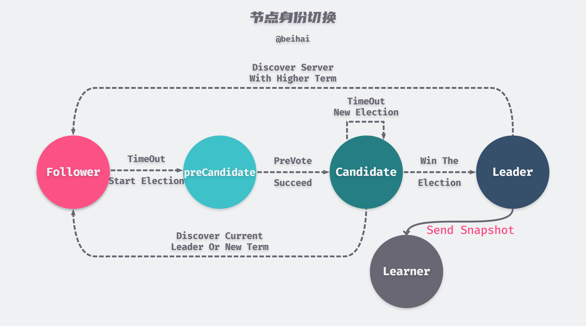
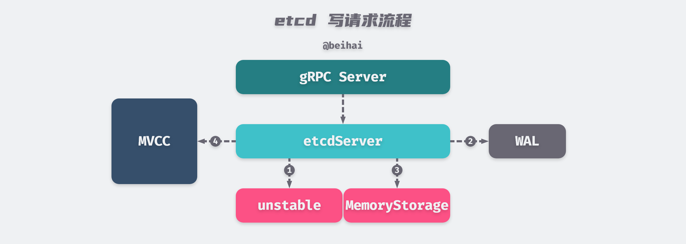

> etcd 是由 CoreOS 发起的开源项目，旨在构建一个高可用的分布式键值存储系统。etcd 可以用于存储关键数据和实现分布式协调与配置服务，在现代化的集群运行中起到关键性的作用。

etcd 是一个基于 Raft 共识算法实现的分布式键值存储服务，在项目结构上采用了模块化设计，其中最主要的三个部分是实现分布式共识的 Raft 模块、实现数据持久化的 WAL 模块和实现状态机存储的 MVCC 模块。这几个模块通过 etcdServer 模块进行通信与任务分配。本篇文章将会主要从这三个模块分析 etcd 的实现原理，理解 etcd 多节点之间如何达成数据一致，以及如何实现高性能的并发读写事务，最后会分析 etcd 是如何解决线性一致性读这一重要问题。通过这些内容，我们可以更好地了解 etcd 的关键特性。


> 由于文章篇幅较长，『数据持久化』和『状态机存储』这两小节的内容可以单独阅读。如果您发现文中有描述错误或理解不正确的地方，可以在下面的评论区留言指正。

## 分布式共识

共识问题是分布式计算中最重要也是最基本的问题之一，通俗地理解其目标就是让多个节点就某件事情达成一致，所以在分析 etcd 的具体实现之前介绍 Raft 共识算法中一些重要的概念。强烈建议先阅读 Raft 论文 [In Search of an Understandable Consensus Algorithm](https://web.stanford.edu/~ouster/cgi-bin/papers/raft-atc14)，对于理解 etcd 的实现原理有很大帮助。

#### 状态机复制

在分布式环境中，如果我们要让一个服务具有容错能力，最常用的方法就是让一个服务的多个副本同时运行在多个节点上。为了保证多个副本在运行时的状态都是同步的，即客户端无论将请求发送到哪一个节点中，最后都能得到相同的结果，通常采用状态机复制（State Machine Replication）方法。

状态机复制使用日志复制实现，etcd 将日志实例化为 Entry 日志，每个节点会存储一系列 Entry 日志，每个节点的 Entry 日志都相同并且顺序也一致，状态机按顺序执行 Entry 中的命令，因此每个状态机处理相同的命令序列，这样就能得到相同的数据状态和输出序列。

Raft 的工作就是保证复制日志的一致性，服务器节点上的`Consensus`模块接收来自客户端的写请求，将它们添加到 WAL (Write Ahead Log，预写日志）中。随后该服务器与其他服务器上的`Consensus`模块通信，以确保每个服务器上具有相同的日志序列。每个服务器上的状态机按顺序执行命令，并将执行结果返回给客户端，这样就形成了高可用的复制状态机。


> 上图修改自论文 [In Search of an Understandable Consensus Algorithm](https://web.stanford.edu/~ouster/cgi-bin/papers/raft-atc14) Figure 1

复制状态机是一个抽象的模块，状态机的数据由一个单独的后端存储模块维护。客户端的每次写请求都会先持久化到 WAL 文件，然后根据写请求的内容修改状态机数据。读请求获取数据时需要从状态机中查询数据，而不是直接获取当前节点维护的最新的日志条目。为了防止数据过多，etcd 会定期生成快照对数据进行压缩。通常情况下，只要集群中超过法定人数（n/2+1）的节点响应了单轮远程过程调用，就可以认为客户端的请求已经执行完成，少数的慢服务器不会影响整个系统性能。

#### Leader 选举

Raft 是一种用来管理日志复制过程的算法，Raft 通过『领导选举机制』选举出一个 Leader，由它全权管理日志复制来实现一致性。一个 Raft 集群包含若干个服务器节点，每一个节点都有一个唯一标识 ID。Raft 算法论文规定了三种节点身份：Leader、Follower 和 Candidate，etcd 的实现中又添加了 PreCandidate 和 Learner 这两种身份。



> 上图修改自论文 [In Search of an Understandable Consensus Algorithm](https://web.stanford.edu/~ouster/cgi-bin/papers/raft-atc14) Figure 4

集群启动时所有节点初始状态均为 Follower，随后会有一个节点选举成功成为 Leader，在绝大多数时间里集群内的节点会处于这两种身份之一。当一个 Follower 节点的选举计时器超时后，会先进入`preVote`状态（切换为 PreCandidate 身份），在它准备发起一次选举之前，需要尝试连接集群中的其他节点，并询问它们是否愿意参与选举，如果集群中的其它节点能够正常收到 Leader 的心跳消息，那么会拒绝参与选举。如果有超过法定人数的节点响应并表示参与新一轮选举，该节点会从 PreCandidate 身份切换到 Candidate，发起新一轮的选举。

> preVote 机制可以阻止离群节点频繁地刷新任期值，防止该节点重新加入集群时以更大的任期值废黜 Leader。

```go
// etcd/raft/raft.go（代码已删减）
func (r *raft) Step(m pb.Message) error {
    switch m.Type {
    case pb.MsgHup:        // 选举计时器超时会创建 MsgHup 消息，这里将预投票和正式投票合并处理了
        if r.state != StateLeader {
            if r.preVote { // 预投票
                r.campaign(campaignPreElection)
            } else {       // 正式选举
                r.campaign(campaignElection)
            }
        } else {
            r.logger.Debugf("%x ignoring MsgHup because already leader", r.id)
        }
    }
    return nil
}
```

Learner 是 etcd 3.4 引入的新角色，当新节点加入集群时其状态机中没有存储任何的日志条目，需要花费很长时间来同步日志，这可能导致集群无法处理新的请求。为了避免这种可用性的间隔时间，新节点会以无投票权的 Learner 身份加入集群，选举计时器超时后也不会发起选举（Leader 不考虑它们属于集群的大多数）。Leader 会向 Learner 发送快照以便 Learner 快速追赶日志，当 Learner 与 Leader 日志达成一致后会切换至正常身份。

特别强调，当一个节点成为 Leader 后会立即提交一条空日志，将自身携带的所有日志都设置为提交状态，该日志条目之前的所有日志条目也都会被提交，包括由其它 Leader 创建但还没有提交的日志条目，然后向集群内的其它节点同步。这样就可以保证集群数据的一致性，防止 Leader 节点切换过程中发生数据丢失。

```go
// etcd/raft/raft.go（代码已删减）
func (r *raft) becomeLeader() {
    // 省略初始化 raft 结构体步骤
    emptyEnt := pb.Entry{Data: nil}
    if !r.appendEntry(emptyEnt) {
        r.logger.Panic("empty entry was dropped")
    }
    r.reduceUncommittedSize([]pb.Entry{emptyEnt})
    r.logger.Infof("%x became leader at term %d", r.id, r.Term)
}
```

#### 数据通道

Raft 模块井未提供网络层的相关实现，而是将待发送的消息封装进 Ready 实例返回给上层模块，然后由上层模块决定如何将这些消息发送到集群中的其他节点。

在 etcd 的通信模块中，etcd 根据不同的用途，定义了 19 种不同类型的消息（Message）。这些消息携带的数据大小可能不尽相同，例如 Leader 发送到 Follower 节点的心跳消息可能只有几十字节，而传输 PRC 快照的数据量就比较大，甚至会超过 1GB 。


为了网络层能够高效地处理不同数据量的消息，etcd 采取分类处理的方式，它抽象出 2 种类型的消息传输通道：Stream 通道和 Pipeline 通道，这两种消息传输通道都使用 gRPC 传输数据。Stream 通道用于处理数据量较少、发送比较频繁的消息，例如心跳消息、追加日志消息等，节点与节点之间只维护 1 个 HTTP 长连接，交替向连接中写入数据。Pipeline 通道用于处理数据量大的消息，比如传输快照消息。这种类型的消息需要与心跳消息等分开处理，否则会阻塞心跳包的传输，进而影响集群的稳定性。Pipeline 通道只通过短连接传输数据，用完即关闭。

> 当 Stream 类型连接不可用时，Pipeline 类型通道也可以传输小数据量的消息，除此之外， Pipeline 类型通道也可以用来并行发送多个消息。

通信模块并不是这篇文章的重点，这里大致描述数据通道的相关概念，或许会在后面的文章中详解 gRPC 的实现。

## Raft 模块

在了解了分布式共识相关的概念后，我们来看看共识模块是如何实现的。etcd 的共识模块都在`raft`结构体中实现，这个结构体非常复杂，实现了逻辑时钟函数、消息处理函数、选举计时器等关键特性。由于这些内容都是按照 Raft 算法写出来的，这里不再赘述具体实现方式，感兴趣的同学可以阅读 [etcd/raft/raft.go](https://github.com/etcd-io/etcd/blob/master/raft/raft.go) 相关的代码。在下文中『Raft 模块』一词代指`raft`结构体及其实现的方法，并会以碎片化的形式在需要的地方介绍相关概念。

etcd 的 Raft 模块只实现了 Raft 协议的基本行为，并未实现网络传输、持久化存储、状态机等功能，etcd 将这些模块独立出来，Raft 模块为这些应用层模块提供了一套接口实现。下面我们来了解其中的概念。

#### Entry

Raft 模块维护的所有数据（键值对）都被实例化为 Entry 日志表示，每个 Entry 日志维护了自己的私有数据。Entry 日志主要有两种类型，一种用于存储正常的键值对数据（EntryNormal），另一种用于存储集群配置变更后的配置信息（EntryConfChange），当集群状态发生变化时，也是通过发送 Entry 日志向其它节点传输新的配置信息。

```go
// etcd/wal/walpb/raft.pd.go
type Entry struct {
    Term             uint64
    Index            uint64
    Type             EntryType
    Data             []byte
}

const (
    EntryNormal       EntryType = 0
    EntryConfChange   EntryType = 1
    EntryConfChangeV2 EntryType = 2 // 用于 etcd V2 版本
)
```

Raft 算法中所有写请求都是由 Leader 节点处理的，在 Leader 追加日志之前，需要对客户端发送的数据封装为 Entry 日志 。其中`Data`字段是客户端发送的键值对，`Term`字段是当前集群的任期，`Index`字段是该 Entry 日志的索引，相当于全局唯一标识 ID。封装完数据后会将这些 Entry 日志追加到 RaftLog 中。

```go
// etcd/raft/raft.go（代码已删减）
func (r *raft) appendEntry(es ...pb.Entry) (accepted bool) {
    li := r.raftLog.lastIndex()  // 获取最后一条日志的索引值
    for i := range es {
        es[i].Term = r.Term
        es[i].Index = li + 1 + uint64(i)
    }
    li = r.raftLog.append(es...) // 向 raftLog 中追加 Entry 日志
}
```

#### RaftLog

Raft 模块使用 RaftLog 结构来管理节点上的 Entry日志，RaftLog 维护了两个数据存储结构`unstable`和`MemoryStorage`（在部分源码注释中，`MemoryStorage`被描述为`Stable Storage`），这两个结构都是在内存中维护 Entry 日志的。

当客户端向 etcd 集群发送了一次写请求后，Raft 模块会先将请求中封装的 Entry 日志保存到 unstable 中，由于 unstable 中的 Entry 日志维护在内存中还没有被持久化，如果这时服务器宕机，这部分数据会丢失掉，所以这些数据是不稳定的（unstable）。随后 Raft 模块会通知 etcdServer 将 Entry 日志持久化到 WAL 文件中，然后将该 Entry 日志从 unstable『移动』到 MemoryStorage。

> 上文虽然用到了『移动』一词，但是实际的操作流程是 etcdServer 先将 Entry 日志追加到 MemoryStorage 中，然后再通知 Raft 模块从 unstable 清理掉对应的日志。

```go
// etcd/raft/log_unstable.go（代码已删减）
type unstable struct {
    snapshot *pb.Snapshot // 未写入 Storage 的快照数据
    entries []pb.Entry    // 未写入 Storage 中的 Entry 日志。
    offset uint64         // entries 中第一条 Entry 日志的索引值
}

// etcd/raft/storage.go
type MemoryStorage struct {
    sync.Mutex
    hardState pb.HardState
    snapshot  pb.Snapshot
    // ents[i] has raft log position i+snapshot.Metadata.Index
    ents []pb.Entry       // 需要注意的是，ents[0] 是一条假数据
}

// etcd/raft/log.go
type raftLog struct {
    storage Storage
    unstable unstable
    committed uint64      // 已提交的 Entry 日志的最大索引值
    applied uint64        // 已应用的 Entry 日志的最大索引值
    logger Logger
    maxNextEntsSize uint64
}
```

unstable 和 MemoryStorage 的结构都不复杂，`MemoryStorage.snapshot`字段维护了最近一次快照包含的最后一条日志的索引值和任期值，所以 ents[i] 代表了索引值为`i+snapshot.Metadata.Index`的 Entry 日志（ents[0] 是一条假数据，i 从 1 计算）。`unstable.offset`字段存储的是 entries 中第一条日志的索引值，通过该值可以获得指定索引的日志。

etcd 已应用日志写入状态机这一过程是异步的，所以 RaftLog 不但维护了已提交 Entry 日志的最大索引值，还维护了已应用（写入状态机）Entry 日志的最大索引值，并且 applied <= committed，这两个参数在 etcd 实现线性一致性中起到了重要的作用，笔者会在另一篇文章中中分析这个问题。

从这几方面的内容可以得知 RaftLog 的逻辑结构视图如下所示：


unstable 和 MemoryStorage 为 RaftLog 提供了很多相同的 API，例如获取 Entry 数组的第一条或最后一条日志的索引、获取指定索引对应日志的任期等等，当 RaftLog 需要这些元数据时，会先从 unstable 中查找，如果没有找到，再从 MemoryStorage 中查找。

在向 unstable 和 MemoryStorage 中追加数据时如果产生冲突，那么原有的冲突部分的数据会被覆盖掉，以节点收到的最新的数据为主。如果向 unstable 追加数据时冲突的数据非常多，甚至需要超过了 unstable 与 MemoryStorage 的界限，那么 RaftLog 并不会修改 MemoryStorage 中的日志，而是截断数据，只保留后半部分。

```go
func (u *unstable) truncateAndAppend(ents []pb.Entry) {
	after := ents[0].Index // 获取第一条待追加的 Entry 记录的索引值
	switch {
	case after == u.offset+uint64(len(u.entries)):
        // 如果待追加的记录与 entries 中的记录正好连续，则可以直接向 entries 中追加
    	u.entries = append(u.entries, ents...)
	case after <= u.offset:
        // 用待追加的 Entry 记录替换当前的 entries 字段，并更新 offset
    	u.logger.Infof("replace the unstable entries from index %d", after)
    	u.offset = after
    	u.entries = ents
	default:
        // after 在 offset～last 之间，将 offset~after 之间的记录保留，抛弃 after 之后的记录
    	u.logger.Infof("truncate the unstable entries before index %d", after)
    	u.entries = append([]pb.Entry{}, u.slice(u.offset, after)...)
    	u.entries = append(u.entries, ents...)
    }
}
```


> 数据冲突的场景只会发生在 Follower 节点身上，Leader 具有 **Append-Only** 特性，从来不会覆盖或者删除自己的日志。

#### Node

etcd 用结构体`Node`表示集群中的一个节点，它是对 Raft 模块的一层封装，对外提供相对简单的 API 接口。主要作用是衔接应用层和 Raft 模块的消息传输，将应用层的消息传递给 Raft 共识模块，并将共识模块处理后的结果反馈给应用层。Node 启动时会先创建很多用于通信的 channel，随后启动一个单独的 goroutine 运行`node.run`方法，这个 goroutine 会陷入一个超大的`for-select-channel`事件循环，不断地从 channel 中获取数据进行处理。`node.run`方法主要有三个作用：

- 一是检查 Raft 模块有没有需要上层模块处理的数据，如果有会将这些数据封装成`Ready`结构体，通过 readyc 通道发送给上层模块；
- 二是检测集群的 Leader 节点是否发生变化，如果发生变化会暂停处理客户端的请求（MsgProp 类型消息）；
- 三是监听或向各种类型的 channel 发送数据，例如客户端的请求、节点间的通信等，等待其它模块对数据进行处理。

```go
// etcd/raft/node.go（代码已删减）
func (n *node) run() {
    // 省略初始化变量
    for {
        if advancec != nil {
            readyc = nil
        } else if n.rn.HasReady() {        // 检查是否有需要处理的数据
            rd = n.rn.readyWithoutAccept() // 创建 Ready 数据结构给上层处理
            readyc = n.readyc
        }
        if lead != r.lead {                // 检测当前的 Leader 节点是否发生变化
            if r.hasLeader() {             // 如果当前节点无法确定集群中的 Leader
                propc = n.propc            // 清空 propc，此次循环不处理 MsgProp 消息
            } else {
                propc = nil
            }
            lead = r.lead
        }
        select {
        case pm := <-propc:                // 处理客户端的请求
        case m := <-n.recvc:               // 处理节点间的通信
        case readyc <- rd:
            n.rn.acceptReady(rd)
            advancec = n.advancec
        // 省略监听其它类型的 channel
        }
    }
}
```

由于 Node 并不负责数据的持久化等功能，所以 Raft 模块会把需要上层模块处理的数据打包到`Ready`结构体中，并通过 readyc 通道将`Ready`发送给上层模块进行处理，上层模块处理完这批数据会调用`node.Advance()`方法通知 Raft 模块数据已经处理完成，可以发送新的数据进行处理。

`Ready`结构体传递了很多种需要上层处理的数据，具体的数据类型展示在下面的代码段中，etcdServer 的 `raftNode.start`方法会启动一个独立的 goroutine 接受这些数据，并对它们进行分类处理：其中会将`Ready`结构体的 Entries、Snapshot 写入持久化文件并追加到 MemoryStorage；将 CommittedEntries 应用到状态机；将 Messages 广播给集群中的其它节点。

```go
// etcd/raft/node.go
type Ready struct {
    *SoftState
    pb.HardState                // 节点状态
    ReadStates []ReadState      // 当前节点等待处理的只读请求
    Entries []pb.Entry          // unstable 待持久化到 WAL 的日志
    Snapshot pb.Snapshot        // 待持久化的快照数据
    CommittedEntries []pb.Entry // 己提交、待应用的 Entry 日志
    Messages []pb.Message       // 当前节点等待发送到集群其他节点的消息
    MustSync bool               // 标记 HardState 和 Entries 同步还是异步写入磁盘
}
```

从这里可以看出，etcd 应用日志、发送消息的过程都是异步的，所以一条日志已经被提交并不意味着这条日志被应用到状态机，Leader 应用了这条日志也不意味着所有的 Follower 都应用了这条日志，每个节点会独立地决定应用日志的时机，这中间可能存在着一定的延迟。

> 虽然 etcd 应用日志的过程是异步的，但是这种批处理策略能够一次批量写入多条日志，可以提升节点的 I/O 性能。

#### 写请求流程

在介绍了 Raft 模块几个重要的概念后，下面简单总结 etcd 写入一条 Entry 日志的大致流程，梳理各模块间的关系便于我们更好地理解 etcd 是如何运作的：

1. 当客户端向 etcd 集群发送了一次写请求后，请求中封装的 Entry 日志会被交给 Raft 模块进行处理，Raft 模块会先将 Entry 日志保存到 unstable 中；
2. 等待时机成熟（etcdServer 处理完上一个 Ready 实例）后，Raft 模块将该 Entry 日志封装到 Ready 实例中，返回给上层模块进行持久化；
3. 当上层模块收到待持久化的 Entry 日志之后，会先将其写入 WAL 文件，然后向集群中的其它节点广播这一条数据，最后向 Raft 模块发送信号进行下一步操作；
4. Raft 模块将该 Entry 日志从 unstable 『移动』到 MemoryStorage；
5. 待该 Entry 日志被复制到集群半数以上的节点时，该 Entry 日志会被 Leader 节点确认为己提交，Leader 会回复客户端写请求操作成功，并将 Entry 日志再次封装进 Ready 实例返回给上层模块；
6. 上层模块将该 Ready 实例中携带的待应用 Entry 日志应用到状态机中。



通过上面几个步骤 etcd 就完成了一次写操作，但是 Leader 节点将数据应用到状态机中不意味着集群其它节点也将数据应用到状态机，如果此时从 etcd 读取数据可能拿到旧数据，etcd 有额外的机制解决这个问题。这部分内容会在下文介绍到。

## 数据持久化

etcd 默认数据一更新就落盘持久化，数据持久化存储使用 WAL (Write Ahead Log，预写日志）。WAL 记录了数据变化的全过程，在 etcd 中所有数据在提交之前都要先写入 WAL 中。etcd 也会定期对数据进行快照备份，快照文件存储了某一时刻 etcd 的所有数据，数据已经存储在快照中的 WAL 文件就可以删除。

#### 预写日志

Raft 模块会将客户端发送的 Entry 日志封装到 Ready 实例中，发送给上层模块进行持久化。etcdServer 收到待持久化的 Entry 日志之后，会将其记录到 WAL 文件中持久化到磁盘上。

在 WAL 日志文件中，每一条日志记录都会结构化为结构体`Record`表示，并将该结构体序列化为 Protocol Buffers 格式写入日志文件中，其中各个字段的含义如下：

```go
// etcd/wal/walpb/record.pd.go（代码已删减）
type Record struct {
    Type int64  // 该 Record 实例类型
    Crc uint32  // 该 Record 实例的校验码
    Data []byte // 日志数据
}

// etcd/wal/wal.go
const (          // Record 实例类型
    metadataType int64 = iota + 1 // 该类型 Record 的 Data 字段中保存的是元数据
    entryType    // 该类型 Record 的 Data 字段中保存的是 Entry 日志
    stateType    // 该类型 Record 的 Data 字段中保存了当前集群的状态信息（raftpb.HardState）
    crcType      // 该类型 Record 主要用于数据校验
    snapshotType // 该类型 Record 保存了快照数据的相关信息（walpb.Snapshot）
)
```

从 Record 的实例类型可以看出，etcd 的 WAL 文件不仅保存了 Entry 日志，也保存着集群的状态信息、快照的元数据信息等重要的数据。每个 WAL 文件的头部都会储存一条`metadataType`类型的元数据，其数据结构定义在`etcdserver/etcdserverpb/etcdserverpb.pb.go`文件的 Metadata 结构体中，保存着当前节点的`NodeID`和`ClusterID`，用来标识文件被创建时集群的状态。

##### 文件管理

WAL 对外暴露的新建文件接口是`Create()`函数，它会初始化一个临时文件并预分配 64MB 的存储空间，创建新文件时会在头部写入`metadataType`类型的元数据和一条空的`snapshotType`记录。初始化操作完成后会对文件重命名，然后调用系统调用函数`fsync()`将上述文件操作立即刷新到磁盘上。因为整个过程都是同步执行的，所以看做是一个原子操作。

```go
// etcd/wal/wal.go（代码已删减）
func Create(lg *zap.Logger, dirpath string, metadata []byte) (*WAL, error) {
    if Exist(dirpath) { return nil, os.ErrExist }

    // 创建临时文件
    tmpdirpath := filepath.Clean(dirpath) + ".tmp"
    if fileutil.Exist(tmpdirpath) {
        if err := os.RemoveAll(tmpdirpath); err != nil {
            return nil, err
        }
    }
    if err := fileutil.CreateDirAll(tmpdirpath); err != nil {……}

    p := filepath.Join(tmpdirpath, walName(0, 0))
    // 对文件上互斥锁
    f, err := fileutil.LockFile(p, os.O_WRONLY|os.O_CREATE, fileutil.PrivateFileMode)
    // 定位到文件末尾
    if _, err = f.Seek(0, io.SeekEnd); err != nil {……}
    // 预分配文件空间，大小为 64MB
    if err = fileutil.Preallocate(f.File, SegmentSizeBytes, true); err != nil {……}

    w := &WAL{
        lg:       lg,
        dir:      dirpath,
        metadata: metadata,
    }
    // 对 WAL 文件创建一个 encoder
    w.encoder, err = newFileEncoder(f.File, 0)
    // 将 FD 添加到 locks 数组中
    w.locks = append(w.locks, f)
    if err = w.saveCrc(0); err != nil {……}
    // 将 metadataType 类型的 Record 记录在 WAL 文件的头部
    if err = w.encoder.encode(&walpb.Record{Type: metadataType, Data: metadata}); err != nil {……}
    // 随后写入一条空的 snapshotType Record
    if err = w.SaveSnapshot(walpb.Snapshot{}); err != nil {……}

    if w, err = w.renameWAL(tmpdirpath); err != nil {……} // 初始化完成之后重命名文件

    var perr error
    if perr = fileutil.Fsync(pdir); perr != nil {……} // 同步上述文件操作

    if perr = pdir.Close(); perr != nil {……} // 关闭目录
    return w, nil
}
```

etcd 的预写日志使用结构体`WAL`来维护 WAL 实例的相关信息，其中的`locks`字段记录着当前 WAL 实例持有的所有 WAL 文件的句柄。etcd 会对 WAL 文件加一个互斥锁，所以 WAL 文件要么是只读的（节点重启数据恢复），要么是只能写的，这样做是为了确保数据的安全。

当 WAL 文件大小超过 64MB 时，就需要进行文件切割与切换，相关逻辑在`WAL.cut()`方法中实现。`WAL.fp.run()`方法负责预创建临时文件并预分配空间，它运行在一个独立的 goroutine 中提前创建以`.tmp`结尾的临时文件备用，当需要切换 WAL 文件时，`WAL.cut()`方法直接从后台 goroutine 中获取临时文件，重命名后即可使用。

```go
// etcd/wal/file_pipeline.go
func (fp *filePipeline) run() {
    defer close(fp.errc)
    for {
        f, err := fp.alloc() // 创建临时文件
        if err != nil { // 如果创建临时文件失败，则将异常传递到 errc channel 中
            fp.errc <- err
            return
        }
        select { // 将上面创建的临时文件句柄传递到 filec 中
        case fp.filec <- f:
            case <-fp.donec: // 调用 filePipeline.Close() 方法时会关闭该通道，删除最后一次创建的临时文件
            os.Remove(f.Name())
            f.Close()
            return
        }
    }
}
```

##### 追加记录

WAL 针对不同类型的 Record 实现了追加记录方法。其中 WAL.Save() 方法实现了对 Entry 日志的批量写入，它循环地将待写入的 Entry 日志封装成`entryType`类型的 Record 实例，然后将其序列化并追加到日志段文件中，批量写入 Entry 日志后会再追加一条`stateType`类型的 Record 记录，并序列化写入日志文件中。`stateType`类型的 Record 记录了当前节点的任期、投票结果和己提交日志的索引，做为集群的状态信息记录。`WAL.Save()`方法的具体实现如下（省略了加锁步骤）：

```go
// etcd/wal/wal.go（代码已删减）
func (w *WAL) Save(st raftpb.HardState, ents []raftpb.Entry) error {
    for i := range ents { // 批量写入 Entry 日志
        if err := w.saveEntry(&ents[i]); err != nil {
            return err
        }
    }
    
    if err := w.saveState(&st); err != nil { // 写入 Entry 后再写入一条 stateType 类型 Record
        return err
    }
    curOff, err := w.tail().Seek(0, io.SeekCurrent)
	if err != nil {
    	return err
    }
	if curOff < SegmentSizeBytes {
    	if mustSync {
        	return w.sync()
        }
    	return nil
    }

	return w.cut()
}

func (w *WAL) saveEntry(e *raftpb.Entry) error {……}
func (w *WAL) saveState(s *raftpb.HardState) error {……}
func (w *WAL) SaveSnapshot(e walpb.Snapshot) error {……}
func (w *WAL) saveCrc(prevCrc uint32) error {……}
```

从上面的代码段可以看出，etcd 一次可能会存储多条 Entry 日志。并在最后调用`sync()`系统调用将这些 Record 记录同步刷新到磁盘。

Record 需要序列化后才能写入持久化文件，这个操作通过`encoder.encode()`方法完成。`encode()`方法会对数据进行 8 字节对齐，并用一个 uint64 字段记录该 Record 占用的字节数：该字段的第一位用来标记是否含有填充数据（如果有为 1），随后的七位用来表示填充数据的大小，高 56 位用于表示 Record 的实际大小。

```go
// etcd/wal/encoder.go（代码已删减）
func (e *encoder) encode(rec *walpb.Record) error {
    e.mu.Lock()
    defer e.mu.Unlock()

    e.crc.Write(rec.Data)
    rec.Crc = e.crc.Sum32()
    var (
        data []byte
        err  error
        n    int
    )

    if rec.Size() > len(e.buf) { // 如果超过预分配的 buf，就使用动态分配
        data, err = rec.Marshal()
    } else {                     // 使用预分配的 buf
        n, err = rec.MarshalTo(e.buf)
        data = e.buf[:n]
    }

    lenField, padBytes := encodeFrameSize(len(data)) // 计算数据填充长度
    // 写入 Record 编码后的长度
    if err = writeUint64(e.bw, lenField, e.uint64buf); err != nil {
        return err
    }

    if padBytes != 0 {           // 写入填充数据
        data = append(data, make([]byte, padBytes)...)
    }
    n, err = e.bw.Write(data)    // 写入 Record 数据
    walWriteBytes.Add(float64(n))
    return err
}
```

`encode()`方法会将数据写入一个带有缓冲区的 Writer 中，每写满一个操作系统页（4KB）大小的缓冲区，就会自动触发一次 Flush 操作，将数据刷新到磁盘上。通过上面的代码片段我们可以推测出 WAL 文件的格式：


#### 快照

WAL 是一种 Append Only 的日志文件，只会在文件结尾不断地添加新日志，这样做可以避免大量随机 I/O 带来的性能损失，但是随着程序的运行，节点需要处理客户端和集群中其他节点发来的大量请求，相应的 WAL 日志量也会不断增加，这会占用大量的磁盘空间。当节点宕机后，如果要恢复其状态，则需要从头读取全部的 WAL 日志文件，这显然是非常耗时的。

为了解决这个问题，etcd 会定期创建快照，将整个节点的状态进行序列化，然后写入稳定的快照文件中，在该快照文件之前的日志记录就可以全部丢弃掉。在恢复节点状态时会先加载快照文件，使用快照数据将节点恢复到对应的状态，之后从 WAL 文件读取快照之后的数据，将节点恢复到正确的状态。

etcd 的快照有两种，一种是用于存储某一时刻 etcd 的所有数据的数据快照，另一种是用于集群中较慢节点追赶数据的 RPC 快照。

##### 数据快照

当 Raft 模块应用日志到状态机中时，都会触发保存数据快照函数，这个函数会先判断已应用日志的索引与上次快照保存的最后一条日志的索引值之间的差距，只有在该差距超过了设定的`SnapshotCount`才会保存快照，该值默认为 100,000。

```go
// etcd/etcdserver/server.go（代码已删减）
const DefaultSnapshotCount = 100000

func (s *EtcdServer) triggerSnapshot(ep *etcdProgress) {
    if ep.appliedi-ep.snapi <= s.Cfg.SnapshotCount { return }
    s.snapshot(ep.appliedi, ep.confState) // 保存快照
    ep.snapi = ep.appliedi
}
```

etcdServer 会创建一个后台 goroutine 来保存快照数据，在 etcd V2 版本中会把内存里的数据序列化成 JSON 然后持久化到磁盘，而 etcd V3 会读取状态机数据的当前版本，然后序列化写入文件，同步刷新到磁盘。

快照创建完成后会在预写日志中写入一条 Snapshot Record，保存当前节点创建快照的状态信息。当节点重启时，会读取快照中的内容，并根据最后一条日志的索引值和任期值从 WAL 文件中将后面的日志条目读取出来，这样就做到了节点数据的快速恢复。

```go
// etcd/etcdserver/storage.go
func (st *storage) SaveSnap(snap raftpb.Snapshot) error {
    walsnap := walpb.Snapshot{
        Index: snap.Metadata.Index,
        Term:  snap.Metadata.Term,
    }
    err := st.Snapshotter.SaveSnap(snap)
    if err != nil {
        return err
    }
    // 创建快照后会在 WAL 中写入一条 Snapshot Record
    return st.WAL.SaveSnapshot(walsnap)
}
```

##### RPC 快照

Leader 会为每一个 Follower 维护一个 `Next`值，表示该 Follower 节点下一个待复制的 Entry 记录的索引值。当发生网络故障或通讯延迟时，集群中可能会存在日志条目比较落后的节点，为了让落后的节点尽快地追赶上集群，Leader 会将从`Next`开始的日志打包成快照，通过`MsgSnap`消息发送给 Follower。


etcd 默认设置的落后 Follower 追赶日志数量为 5,000 条，因为通常情况下集群节点间的通讯延迟是毫秒级的，etcd V3 版本的每秒极限写性能约为 10,000 条日志，5,000 条日志足够 Follower 追赶 Leader。

```go
// etcd/raft/raft.go
func (r *raft) maybeSendAppend(to uint64, sendIfEmpty bool) bool {
    pr := r.prs.Progress[to]
    m := pb.Message{}
    m.To = to

    term, errt := r.raftLog.term(pr.Next - 1)
    ents, erre := r.raftLog.entries(pr.Next, r.maxMsgSize)
    if len(ents) == 0 && !sendIfEmpty {
        return false
    }
    if errt != nil || erre != nil { // send snapshot if we failed to get term or entries
        m.Type = pb.MsgSnap
        snapshot, err := r.raftLog.snapshot()
        m.Snapshot = snapshot
        sindex, sterm := snapshot.Metadata.Index, snapshot.Metadata.Term
        pr.BecomeSnapshot(sindex)
    } else {……}
    r.send(m) // 发送 MsgSnap
    return true
}
```

Follower 接受到`MsgSnap`消息后，会将接收到的数据交给`Snapshotter.SaveDBFrom`方法保存到快照文件中。Follower 收到快照后就可以将快照中的数据应用到状态机中。

```go
// etcd/etcdserver/snap/db.go（代码已删减）
func (s *Snapshotter) SaveDBFrom(r io.Reader, id uint64) (int64, error) {
    start := time.Now()

    f, err := ioutil.TempFile(s.dir, "tmp")
    var n int64
    n, err = io.Copy(f, r)        // 将快照数据写入临时文件
    if err == nil {
        fsyncStart := time.Now()
        err = fileutil.Fsync(f)   // 将临时文件的改动刷新到磁盘
        snapDBFsyncSec.Observe(time.Since(fsyncStart).Seconds())
    }
    
    f.Close()                     // 关闭临时文件
    fn := s.dbFilePath(id)        // 检查是否存在指定的".snap.db"文件，如果存在则将其删除
    if fileutil.Exist(fn) {
        os.Remove(f.Name())
        return n, nil
    }
    err = os.Rename(f.Name(), fn) // 重命名临时文件

    snapDBSaveSec.Observe(time.Since(start).Seconds())
    return n, nil
}
```

> 快照文件根据快照所涵盖的最后一条 Entry 日志的任期值和索引值命名，数据快照的文件名称格式为"term-index.snap"，RPC 快照的文件名称格式为"index.snap.db"，我们可以根据文件名格式区分快照文件。

以上内容就是 etcd 对快照文件的操作，我们也可以使用快照对数据进行备份与恢复，或者将某一时刻的快照文件复制到新加入集群的节点中，这样就可以节省同步日志花费的时间，减轻 Leader 的压力。

## 状态机存储

etcd 的 MVCC 模块实现了状态机存储功能，其底层使用的是开源的嵌入式键值存储数据库 BoltDB，但是这个项目已经由作者归档不再维护了，因此 etcd 社区自己维护了一个 [bbolt](https://github.com/etcd-io/bbolt) 版本。关于 BoltDB 的实现细节可以参考笔者的文章 [可嵌入式数据库 BoltDB 实现原理](https://www.wingsxdu.com/post/database/boltdb)，这一小节中主要分析 MVCC 模块如何利用多版本并发控制维护数据的历史版本信息。

#### 并发控制

在数据库领域，并发控制是一个很具有挑战性的话题。常见的并发控制方式包括悲观锁、乐观锁和多版本并发控制。但是无论是悲观锁还是乐观锁，它们都不是真正的锁概念，而是用来描述锁类别的『设计思想』。

##### 悲观锁

悲观并发控制（又称悲观锁）指的是对数据竞争持悲观消极的态度，默认数据被外界访问时，必然会产生冲突，所以在数据处理的整个过程中会对数据加各种锁来实现并发控制，保证同一时间只有一个线程可以访问到数据。如果一个事务执行过程中对某行数据应用了锁，那么只有在这个事务将锁释放之后，其他事务才能够执行与该锁冲突的操作。由于加锁机制是一种预防性的版本控制，读操作会阻塞写操作，写操作也会阻塞读操作，当锁的粒度较大、时间较长时并发性能就比较差，主要用于数据竞争激烈、写多读少的并发环境。

##### 乐观锁

乐观并发控制（又称乐观锁）是相对悲观锁而言，假设多用户并发的事务在处理时彼此之间不会互相影响，所以不会对数据加锁。在提交更新的数据之前，每个事务都会检查在该事务读取数据之后，有没有其它事务又修改了该数据。如果有其它事务对数据进行了修改，那么正在提交的事务会进行回滚。乐观锁多用于数据冲突较少的环境，偶尔回滚事务的成本要比读取数据时锁定数据的成本低很多，在这种情况下乐观锁可以获得更高的吞吐量。

##### MVCC

多版本并发控制（Multi-Version Concurrency Control , MVCC）是一种无锁事务机制，可以把 MVCC 理解为乐观并发控制思想的一种实现方法，它能够与悲观锁很好地结合以增加事务的并发量。MVCC 的每一个写操作都会创建一个新版本的数据，读操作会从有限多个版本的数据中挑选一个最合适（要么是最新版本，要么是指定版本）的结果直接返回 。通过这种方式，我们就不需要关注读写操作之间的数据冲突。因此，如何管理和高效地选取数据的版本就成了 MVCC 需要解决的主要问题。


由于 etcd 主要用于存储分布式系统中的一些非常重要的元数据，这类元数据的读操作远多于写操作，在悲观锁机制下，当有写操作占用锁，就会有大量的读操作被阻塞，影响并发性能，而 MVCC 可以保持比较高且稳定的读并发能力。每当客户端想要更改或者删除某个数据对象时，etcd 不会在原地修改或删除这个已有的数据对象本身，而是针对该数据对象创建一个新的版本，通过这种方式，在写操作进行的同时仍然可以并发地可以读取老版本的数据。

#### 索引

为了实现多版本并发控制，etcd 会将键值对的每个版本都保存到 BoltDB 中，etcd 在 BoltDB 中存储的 Key 是修订版本`reversion`，Value 是客户端发送的键值对组合。为了更好地理解这一概念，假设我们通过读写事务接口写入了两个键值对，分别是(key1, value1)和(key2, value2)，之后我们再调用读写事务接口更新这两个键值对，更新后为(key1, update1)和(key2, update2)，虽然两次写操作更新的是两个键值对，实际上在 BoltDB 中写入了四条记录：

```shell
rev={1 0}, key=key1, value="valuel" 
rev={1 1}, key=key2, value="value2" 
rev={2 0}, key=key1, value="updatel"
rev={2 1}, key=key2, value="update2"
```

其中，reversion 主要由两部分组成， 第一部分是 main reversion，每次事务递增一；第二部分是 sub reversion，同一个事务的每次操作都会递增一，两者结合就可以保证 Key 唯一且递增。在上面的示例中，第一个事务的 main reversion 是 1，第二个事务的 main reversion 是 2。

从 Backend 保存的数据格式我们可以看出，如果要从 BoltDB 中查询键值对，必须通过 reversion 进行查找。但客户端只知道具体键值对中的 Key 值，并不清楚每个键值对对应的 reversion 信息。


为了将客户端提供的原始键值对信息与 reversion 关联起来，etcd 使用谷歌开源实现的 [btree](https://github.com/google/btree) 数据结构维护 Key 与 reversion 之间的映射关系，BTree 的键部分存储了原始的 Key，值部分存储了一个 keyIndex 实例。一个 keyIndex 实例维护着某个 Key 全部历史修订版本信息。

```go
// etcd/mvcc/backend/backend.go
type keyIndex struct {
	key []byte        // 客户端提供的原始 Key 值
	modified revision // 该 Key 值最后一次修改时对应的 revision 信息
	generations []generation
}

type revision struct {
	main int64
	sub int64
}
```

keyIndex 用代`generation`表示同一个 Key 在某一个生命周期内的数据变化情况，每代中可以存储多个修订版本的信息。第一次创建客户端给定的 Key 值时，对应的第 0 代生命周期`generation[0]`也会被创建，当客户端不断修改该 Key 时，会不断地向`generation[0]`追加 revision 信息。

当对`generation[0]`添加墓碑`Tombstone`后，代表第 0 代的生命周期已经结束。keyIndex 会创建新的 generation 实例，后续修改该 Key 时，将会向`generation[1]`添加 revision 信息。一个 keyIndex 的结构如下图所示：


因为 etcd 保存键空间的历史版本，随着客户端不断修改键值对，keyIndex 中记录的 revision 信息会不断增加，我们可以调用`compact()`方法对 keyIndex 进行压缩，来避免性能下降和存储空间枯竭。

在压缩 keyIndex 时，会将 main 部分小于指定值的 revision 实例全部删除，被压缩的修订版本将无法访问。如果压缩过程出现了空的 generation 实例，则会将其删除。并且每个 Key 至少对应一个 generation 实例，如果 keylndx 中全部的 generation 实例都被清除了，那么该 keyIndex 实例也会被删除。

以上面图片中维护的数据为例展示压缩过程：

```shell
compact(2)
generations:
    {6.0, 7.0}
    {4.0, 5.0(t)}
    {2.0, 3.0(t)}

compact(4)
generations:
    {6.0, 7.0}
    {4.0, 5.0(t)}
```

keyIndex 结构体提供了两种查询 revision 的方法。`since()`方法用于批量查找 main 部分大于指定值的 revision ，如果查询结果中包含了多个 main 部分相同的revision 实例，则只返回 sub 部分最大的 revision 信息；`get()`方法用于查找 main 部分小于指定值的最大 revision。

`get()`方法会先调用`findGeneration()`查找指定 main revision 所在的 generation 实例，`findGeneration()`方法会从 keyIndex 的最后一个 generation 实例开始倒序查找，查找到指定的 generation 后，会调用`walk()`方法查找从该 generation 中查找符合条件的 revision。

```go
// etcd/mvcc/key_index.go（代码已删减）
func (ki *keyIndex) get(lg *zap.Logger, atRev int64) (modified, created revision, ver int64, err error) {
	g := ki.findGeneration(atRev)
	if g.isEmpty() {
    	return revision{}, revision{}, 0, ErrRevisionNotFound
    }

	n := g.walk(func(rev revision) bool { return rev.main > atRev })
	if n != -1 {
    	return g.revs[n], g.created, g.ver - int64(len(g.revs)-n-1), nil
    }

	return revision{}, revision{}, 0, ErrRevisionNotFound
}
```

以上内容就是 etcd 如何通过索引查询多版本数据的：客户端在查找指定键值对时，会先通过内存中维护的 B 树索引查找到对应的 keyIndex 实例，然后通过 keyIndex 查找到对应的 revision 信息，最后通过 revision 从 BoltDB 中查找真正的键值对数据。

了解上述概念后，最后我们看看存储模块是如何使用 BoltDB 存储数据的。

#### Backend

etcd 使用 Backend 这一设计封装了存储引擎的实现细节，为上层提供了一致的接口。Backend 的实现中主要是利用 BoltDB 提供的 API 进行数据的增删改查操作，所以在下文中我们主要关注接口的实现，就不贴出操作细节相关的代码了。

```go
// etcd/mvcc/backend/backend.go
type Backend interface {
	ReadTx() ReadTx           // 只读事务，已经被 ConcurrentReadTx() 取代，
	BatchTx() BatchTx         // 读写事务（批量事务）
	ConcurrentReadTx() ReadTx // 非阻塞的只读事务，代替了 ReadTx()，详情见 PR#10523
	Snapshot() Snapshot       // 创建快照
	Hash(ignores map[IgnoreKey]struct{}) (uint32, error)
	Size() int64
	SizeInUse() int64
	OpenReadTxN() int64       // 返回当前正在进行的只读事务数量
	Defrag() error            // 碎片整理
	ForceCommit()             // 提交批量读写事务
	Close() error
}
```

Backend 两个重要的概念是 `ReadTx` 和 `BatchTx`，分别实现了只读事务和读写事务的接口，其中`BatchTx`内嵌了`ReadTx`，『继承』了只读事务实现的方法：

> Go 语言中内嵌结构体的概念可以理解为『继承』。

```go
// etcd/mvcc/backend/read_tx.go
type ReadTx interface {
	Lock()
	Unlock()
	RLock()
	RUnlock()
	UnsafeRange(bucketName []byte, key, endKey []byte, limit int64) (keys [][]byte, vals [][]byte)
	UnsafeForEach(bucketName []byte, visitor func(k, v []byte) error) error
}

// etcd/mvcc/backend/batch_tx.go
type BatchTx interface {
	ReadTx
	UnsafeCreateBucket(name []byte)
	UnsafePut(bucketName []byte, key []byte, value []byte)
	UnsafeSeqPut(bucketName []byte, key []byte, value []byte)
	UnsafeDelete(bucketName []byte, key []byte)
	Commit()        // 提交当前的读写事务，并立即打开一个新的读写事务
	CommitAndStop() // 提交当前的读写事务，但是不会打开新的读写事务
}
```

`BatchTx`提供了两种更新数据的方法，`UnsafeSeqPut()`不同于`UnsafePut()`之处在于，`UnsafeSeqPut()`方法向指定 Bucket 中添加键值对时会将对应 Bucket 实例的填充比例设置为 90%，这样可以在顺序写入时提高 Bucket 的利用率。

为了提高 BoltDB 的写入效率，Backend 会开启一个 goroutine 异步地对所有读写事务进行定时（默认为 100ms）提交，这样可以减少随机写的次数：

```go
// etcd/mvcc/backend/backend.go
var defaultBatchInterval = 100 * time.Millisecond

func (b *backend) run() {
	defer close(b.donec)
	t := time.NewTimer(b.batchInterval)
	defer t.Stop()
	for {
    	select {
    	case <-t.C:
    	case <-b.stopc:
        	b.batchTx.CommitAndStop()
        	return
        }
    	if b.batchTx.safePending() != 0 {
        	b.batchTx.Commit()
        }
    	t.Reset(b.batchInterval)
    }
}
```

##### 只读事务

虽然使用了 MVCC 之后，读请求不会被写请求锁住，大大提升了读操作的效率。但是由于在 BoltDB 的同一个 goroutine 中开启两个相互依赖的只读事务和读写事务会发生死锁，`readTx`为了避免这种情况还是引入了读写锁 `sync.RWLock`保证不会出现死锁情况：

```go
// etcd/mvcc/backend/read_tx.go
type readTx struct {
	mu  sync.RWMutex
	buf txReadBuffer // 缓存键值对集合
	txMu    sync.RWMutex
	tx      *bolt.Tx
	buckets map[string]*bolt.Bucket
	txWg *sync.WaitGroup
}
```

从结构体中可以看出，`readTx`不但引用了用于保护只读事务`tx`的读写锁`txmu`，还引用了一个保护`buf`的读写锁 `mu`，它的作用是保证读写缓冲区中的数据时不会出现问题。

只读事务对上层提供了两个获取数据的方法。`UnsafeRange()`用于获取指定范围的  Key 或单个 Key，这个方法会先从缓存查找数据，如果缓存中的数据不满足需求，会通过`unsafeRange()`函数从 BoltDB 中查询。`UnsafeForEach()`方法会遍历指定 Bucket 的缓存和 Bucket 中的全部键值对，并通过传入的回调函数处理这些遍历到的键值对。

##### 读写事务

读写事务的实现与只读事务类似，但是读写事务同时提供了不带缓存的 `batchTx` 以及带缓存的 `batchTxBuffered` ，后者内嵌了前者的结构体，并额外加入了缓存 `txWriteBuffer`加快读写事务中的读操作：

```go
// etcd/mvcc/backend/batch_tx.go
type batchTx struct {
	sync.Mutex
	tx      *bolt.Tx
	backend *backend

	pending int // 当前事务中执行的修改操作个数，读写事务提交时该值会被重置为 0
}

type batchTxBuffered struct {
	batchTx
	buf txWriteBuffer
}
```

`batchTx`的写入删除操作实现也很简单，只是调用了 BoltDB 提供的 API 修改 Bucket 中的数据，这方面的内容也不再赘述。

由于 BoltDB 长时间执行读写事务，会导致其他读写事务挂起等待，因此 Backend 指定了一次读写事务中最大的操作数，当超过该阈值时，当前的读写事务会自动提交。

```go
// etcd/mvcc/backend/batch_tx.go
var defaultBatchLimit = 10000

func (t *batchTx) Unlock() {
	if t.pending >= t.backend.batchLimit {
    	t.commit(false)
    }
	t.Mutex.Unlock()
}
```

虽然 MVCC 已经很好地解决了并发事务中的数据冲突问题，但是在操作 BoltDB 的过程中，还是可能发生死锁和并发写入冲突。etcd 结合了锁机制解决这个问题：在只读事务中使用了读写锁，在读写事务中使用了互斥锁。好在发生锁竞争的概率较低，不会长时间阻塞其它事务。

## 线性一致性读

一个分布式系统正确实现了共识算法并不意味着实现了线性一致，共识算法只能保证多个节点对某个对象的状态是一致的。在 etcd 的实现中，写操作执行成功仅仅意味着数据已经通过预写日志落盘，但是**状态机 Apply 日志的行为是异步的**，多个节点不能保证同时将某一条日志应用到状态机上，也就是说各个节点不能『实时』一致，所以此时读取状态机很可能会读到过期数据。


除此之外，由于可能存在网络分区、Leader 节点切换等情况，Leader 的状态机也可能不是最新的状态。如果 Leader 处理请求时没有注意到自己的身份已经发生变化，这会导致整个系统违反线性一致性。

#### 数据一致性

数据一致性问题最初是存在于数据库系统中的一个概念，数据库系统中一致性问题指的是关联数据之间的逻辑是否完整和正确，通常数据库系统会通过使用事务来保证数据的一致性和完整性。但是在分布式系统中的数据一致性指的是『**数据在多份副本中存储时，如何保障数据的一致性**』问题。

在分布式领域，数据的安全不再只由硬件来保证，为了达成系统容灾和提高整体性能，会同时将数据写入到多个副本中，通过复制技术来进行主副本之间的数据同步，确保数据的安全。数据库在同时向多个副本写入记录时，如何确保多个副本间的数据一致问题，称为数据一致性。

分布式系统中一致性模型大概可以分为三类：

- **线性一致性**：当更新操作在某个副本上执行成功后，之后所有的读操作都要能够获得最新的数据；
- **顺序一致性**：当更新操作在某个副本上执行成功后，其它进程的读操作未必能够获得最新的数据，但是每个进程读到的该数据不同值的顺序却是一致的；
- **最终一致性**：当更新某数据时，用户读到最新的数据需要一段时间的延迟。

线性一致性又被称为强一致性、严格一致性，是程序能实现的最高的一致性模型。线性一致性要求任何一个读操作都能读到某个数据的最近一次写的数据，并且要求系统中的所有进程看到的操作顺序，都**与全局时钟下的顺序一致**。一旦某个值发生改变，那么不管后续读操作与这次写操作之间的时间间隔有多小，不管是哪个节点执行了读操作，之后读出的都是新更改的值；同样，如果执行了读操作，那么不管后面的写操作有多快速，该读操作读取的仍是原来的值。

因为线性一致性要求的全局时钟会损失较大的性能，因此顺序一致性放弃了全局时钟的约束，改用**分布式逻辑时钟**实现。顺序一致性模型中所有的进程都以相同的顺序看到所有的修改。读操作未必能够及时得到此前其他进程对同一数据的写更新，但是每个节点读到该数据不同值的顺序却是相同的。

最终一致性也是弱一致性，它不能保证在同一时刻不同节点上的同一份数据都是相同的，但是随着时间的迁移，不同节点上的同一份数据总是在趋向一致的方向上变化。最终一致性的种类繁多，像因果一致性、单调读一致性都是它的变种。


Raft 是分布式领域中的强一致性共识算法，其目标是为了实现线性化语义。当其中某个节点收到客户端的一组指令时，它必须与其它节点沟通，以保证所有的节点以相同的顺序收到相同的指令，最终所有的节点会产生一致的结果，就像是一台机器一样。etcd 利用 Raft 提供的基础方案实现了线性一致性，下文会详细介绍这方面的内容。

#### ReadIndex

etcd 采用 ReadIndex 机制解决上面的问题：虽然状态机应用日志的行为是异步的，但是已经提交的日志都满足线性一致，那么只要等待这些日志都应用到状态机中再执行查询，读请求也可以满足线性一致。ReadIndex 机制的执行流程如下：

1. 读操作执行前记录『此时』集群的`CommittedIndex`，记为`ReadIndex`；
2. 向 Follower 发送心跳消息，如果超过法定人数的节点响应了心跳消息，那么就能保证 Leader 节点的权威性；
3. 等待状态机『至少』应用到`ReadIndex`，即 `AppliedIndex` >= `ReadIndex`；
4. 执行读请求，将结果返回给 Client。

#### 只读请求处理

etcd 的只读请求由`EtcdServer.Range()`方法处理，每个请求需要判断客户端配置的一致性级别，如果需要线性一致化那么会执行函数`linearizableReadNotify`，并且会一直阻塞在这个函数中，直到满足线性一致性读的条件：

```go
// etcd/etcdserver/v3_server.go（代码已删减）
func (s *EtcdServer) Range(ctx context.Context, r *pb.RangeRequest) (*pb.RangeResponse, error) {
    if !r.Serializable { // 执行 linearizableReadNotify()，并等待通知
        err = s.linearizableReadNotify(ctx)
        trace.Step("agreement among raft nodes before linearized reading")
    }
    chk := func(ai *auth.AuthInfo) error {
        return s.authStore.IsRangePermitted(ai, r.Key, r.RangeEnd)
    }

    // 此时 AppliedIndex >= ReadIndex，可以读取数据
    get := func() { resp, err = s.applyV3Base.Range(ctx, nil, r) }
    if serr := s.doSerialize(ctx, chk, get); serr != nil {
        err = serr
        return nil, err
    }
    return resp, err
}
```

`linearizableReadNotify` 函数会向 channel`readwaitc` 发送一个空的结构体，在监听函数执行完任务后会通知发送消息函数可以安全地执行读请求。

```go
// etcd/etcdserver/v3_server.go（代码已删减）
func (s *EtcdServer) linearizableReadNotify(ctx context.Context) error {
    s.readMu.RLock()
    nc := s.readNotifier
    s.readMu.RUnlock()

    select {
    case s.readwaitc <- struct{}{}: // 等待读请求处理协程可以处理此次读请求
    default:
    }

    select {
    case <-nc.c: // 接收可以安全执行读请求的信号（此时 AppliedIndex >= ReadIndex）
        return nc.err
    }
}
```

`readwaitc` 的监听是在一个单独的协程`linearizableReadLoop`中进行的，这个协程会循环获取`readwaitc`信号，当有新请求到来时，会调用 Raft 模块执行`readIndex()`机制，然后等待`ReadIndex`被应用到状态机中。

```go
// etcd/etcdserver/v3_server.go（代码已删减）
func (s *EtcdServer) linearizableReadLoop() {
    for {
        select {
        case <-s.readwaitc: // 新的读请求到来时会从 readwaitc 接收到信号
        }
        // 调用 raft 模块执行 readIndex()
        cctx, cancel := context.WithTimeout(context.Background(), s.Cfg.ReqTimeout())
        if err := s.r.ReadIndex(cctx, ctxToSend); err != nil {
            // ……
        }
        cancel()
        // ……
    }
}
```

#### Raft 共识

Raft 协议库会针对节点的不同身份执行不同的处理流程，根据节点身份的不同，`raft.step`方法会指向不同的处理函数。

```go
// etcd/raft/node.go（代码已删减）
func (n *node) ReadIndex(ctx context.Context, rctx []byte) error {
    return n.step(ctx, pb.Message{Type: pb.MsgReadIndex, Entries: []pb.Entry{{Data: rctx}}})
}
```

如果是 Follower 节点接收到客户端的读请求，Follower 节点会将读请求转发给 Leader，由 Leader 进行处理：

```go
// etcd/Raft/raft.go（代码已删减）
func stepFollower(r *raft, m pb.Message) error {
    switch m.Type {
    case pb.MsgReadIndex:
        m.To = r.lead // 将消息的目标地址修改为 Leader，把读请求转发给 Leader
        r.send(m)
    }
    return nil
}
```

如果是 Leader 接收到读请求，Leader 先将请求保存在 ReadOnly 队列中，并向其他节点发送心跳消息。当 Leader 收到半数以上节点的心跳消息响应时，表明 ReadIndex 已经通过了集群共识，会调用`readOnly.advance()`方法将此时的读状态添加到 readStates 队列。同时在`node.run()`方法中会不断地将 readStates 封装为`Ready`结构体交由应用层处理。

```go
// etcd/raft/raft.go（代码已删减）
func stepLeader(r *raft, m pb.Message) error {
    switch m.Type {
    case pb.MsgReadIndex:  // 处理 ReadIndex
        switch r.readOnly.option {
        case ReadOnlySafe: // ReadOnlySafe 执行 ReadIndex 算法的逻辑
            r.readOnly.addRequest(r.raftLog.committed, m) // 将请求添加到队列中
            // The local node automatically acks the request.
            r.readOnly.recvAck(r.id, m.Entries[0].Data)
            r.bcastHeartbeatWithCtx(m.Entries[0].Data) // Leader 节点向其他节点发起广播
        case ReadOnlyLeaseBased: // 另一种实现线性一致性的机制
            // ……
        }
    case pb.MsgHeartbeatResp: // 心跳消息响应
        // 清理 readOnly 的 map 和 queue 并将此时读状态添加到 readStates 队列中
        // run 方法会将 readStates 包装成 Ready 数据结构交给应用层处理
        rss := r.readOnly.advance(m)
        for _, rs := range rss {
            req := rs.req
            if req.From == None || req.From == r.id { // from local member
                r.readStates = append(r.readStates, ReadState{Index: rs.index, RequestCtx: req.Entries[0].Data})
            } else {
                r.send(pb.Message{To: req.From, Type: pb.MsgReadIndexResp, Index: rs.index, Entries: req.Entries})
            }
        }
    }
    return nil
    }
}

// etcd/raft/node.go（代码已删减）
func (n *node) run(r *raft) {
    for {
        if advancec != nil {
            readyc = nil
        } else if n.rn.HasReady() {
            rd = n.rn.readyWithoutAccept() // 创建新的 Ready 结构体
            readyc = n.readyc
        }
        select {
            case readyc <- rd:
            // 将创建的 Ready 写入 node.readyc 通道中，等待应用层读取
            n.rn.acceptReady(rd)
            advancec = n.advancec
        }
    }
}
```

#### 应用层处理

前文介绍果的`raftNode.start`方法会获取 Raft 模块封装好的`Ready`结构体，并且每次只将最后一个 readState 通过channel`readStateC`发送给协程`linearizableReadLoop`，这是因为 Ready 中封装的最后一个只读请求已经满足 ReadIndex 要求了，那么前面的都可以满足。接下来等待程序异步地将应用到状态机中，然后再执行读请求。

```go
// etcd/etcdserver/raft.go（代码已删减）
func (r *raftNode) start(rh *raftReadyHandler) {
    go func() {
        for {
        case rd := <-r.Ready():
            // 处理已完成 readIndex 的读请求
            if len(rd.ReadStates) != 0 {
                select {
                // 每次只将最后一个 readState 发送给 r.readStateC
                case r.readStateC <- rd.ReadStates[len(rd.ReadStates)-1]:
                }
            } 
        }
    }()
}

// etcd/etcdserver/v3_server.go（代码已删减）
func (s *EtcdServer) linearizableReadLoop() {
    for {
        var (
            timeout bool
            done    bool
        )
        for !timeout && !done {
            select {
            case rs = <-s.r.readStateC: // readIndex() 请求完成
                done = bytes.Equal(rs.RequestCtx, ctxToSend)
                // ……
        }
        // readIndex() 请求执行完成，等待 AppliedIndex >= ReadIndex
        if ai := s.getAppliedIndex(); ai < rs.Index {
            select {
            case <-s.applyWait.Wait(rs.Index):
            case <-s.stopping:
                return
            }
        }
        // unblock all l-reads requested at indices before rs.Index
        // 发送可以读取状态机的信号
        nr.notify(nil)
    }
}
```

#### 小结

通过分析一个完整的读操作可以看出，etcd 为了达成线性一致性读需要满足下面两个条件：

- **由 Leader 来处理只读请求**：如果 Follower 收到读请求，需要将请求转发给 Leader 处理；
- **确保 Leader 的有效性**：Leader 需要向集群发送一次广播，如果能收到大多数节点的回应，说明 Leader 节点的身份是有效的，这一过程是为了确保 Leader 节点的数据都是最新的。

由于 ReadIndex 机制需要等待集群共识与状态机应用日志，尤其是共识过程会带来一定的网络开销，为了提升整体只读请求的性能，etcd 也提供了一种优化的一致性算法，称为 LeaseRead：Leader 会取一个比 ElectionTimeout 小的租期，因为在租期内不会发生选举，可以确保 Leader 的身份不会改变，所以可以跳过 ReadIndex 中的共识步骤，降低了网络开销带来的延时。LeaseRead 的正确性和时间的实现挂钩，由于不同主机的 CPU 时钟有误差，所以也有可能读取到过期的数据。

> 在 etcd 中实现读请求的线性一致性必须要经过 Raft 一致性协议，这种方式必须要付出一些性能和时延的代价。如果对数据一致性没有特别强的要求，可以在客户端将一致性模式配置成串行化（Serializable）。Serializable 模式的只读请求可以由任何一个 etcd 成员提供，但是 etcd 可能会因此读到过期的数据。

## 总结

以上是 etcd 中最重要的几部分内容的实现及其原理，可以看出，etcd 的共识模块对很多边界条件进行了处理，为保障集群的高可用状态添砖加瓦。虽然为了实现强一致性，在性能方面做出了一定的妥协，但是 etcd 也提供了额外的选择，在面对不同的需求场景时可以自由配置。etcd 同时也提供了一个非常好的 Raft 算法实现版本，分析其中的源码对于深入理解 Raft 有很大帮助。

etcd 在很多处源码中都使用了 Go 语言提供的 CSP 并发模型，这种利用`channel`进行通信的方式在写法上并不直观，代码的上下文无法体现消息的发送方或接收方，在阅读源码时要额外注意。但总体而言 etcd 核心模块的代码变化不大，比较适合阅读学习。

## Reference

- [《etcd 技术内幕》](https://book.douban.com/subject/30275551/)
- [多版本并发控制(MVCC)在分布式系统中的应用](https://coolshell.cn/articles/6790.html)
- [In Search of an Understandable Consensus Algorithm](https://web.stanford.edu/~ouster/cgi-bin/papers/raft-atc14)
- [分布式一致性协议 Raft 原理](https://www.wingsxdu.com/post/algorithms/raft/#gsc.tab=0)
- [线性一致性和 Raft](https://pingcap.com/blog-cn/linearizability-and-raft/)