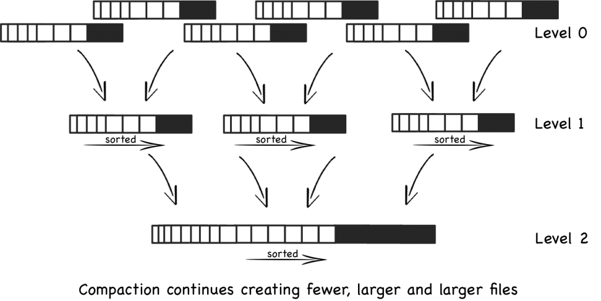
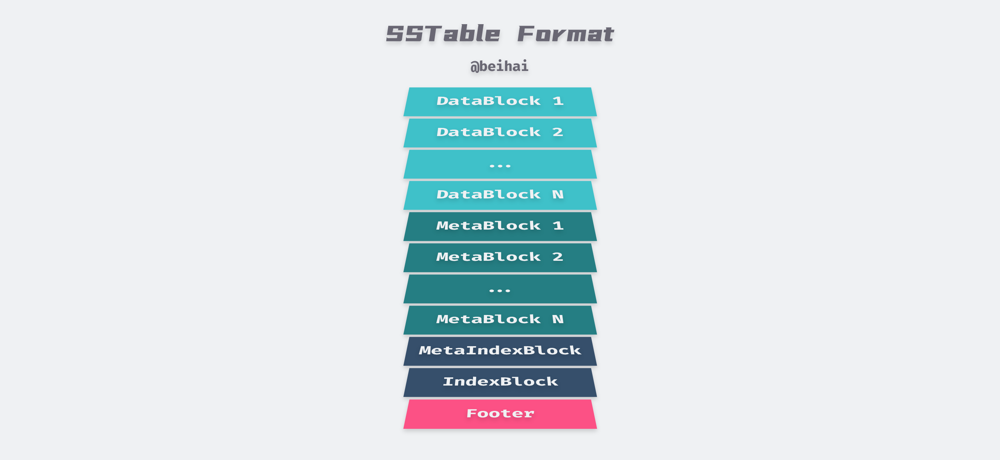

> LSM-Tree 被是一种面向写多读少应用场景的数据结构 ，被 Hbase、RocksDB 等强力 NoSQL 数据库采用作为底层文件组织方式。文中将会介绍 LSM-Tree 的设计思路，并分析使用 LSM-Tree 的 LevelDB 是如何实现与进行性能优化的。

在了解 LSM-Tree 之前，笔者了解的 MySQL、etcd 等数据存储系统都是面向读多写少应用场景的，其底层大都采用 B-Tree 及其变种数据结构。而 LSM-Tree 则解决了另一个应用场景 *写多读少* 时存在的问题。在面对亿级的海量数据的存储和检索的场景下，我们通常选择的强力的 NoSQL 数据库，如 Hbase、RocksDB 等，它们的文件组织方式，都是仿照 LSM-Tree 实现的。

## LSM-Tree

LSM-Tree 全称是 Log Structured Merge Tree，是一种分层、有序、面向磁盘的数据结构，**其核心思想是充分利用磁盘的顺序写性能要远高于随机写性能这一特性，将批量的随机写转化为一次性的顺序写。**

当我们购买了一块磁盘时，我们实际上为两样东西支付了售价：一个是磁盘容量，另一个是磁盘的 I/O 能力。对于任意类型的应用来说，通常其中的一个会成为限制因素，如果我们在添加数据时发现，磁盘悬臂已经被充分使用，但是磁盘还有剩余空间，这就意味着 I/O 能力是程序的性能瓶颈。

<div align="center"></div>

> 图片源自 [Log Structured Merge Trees](http://www.benstopford.com/2015/02/14/log-structured-merge-trees/)。

从上图可以直观地看出，磁盘（无论是 HDD 还是 SSD）的顺序访问速度至少比随机 I/O 快三个数量级，甚至顺序访问磁盘比随机访问主内存还要快。这意味着要尽可能避免随机 I/O 操作，顺序访问非常值得我们去探讨与设计。

LSM-Tree 围绕这一原理进行设计和优化，通过消去随机的更新操作来达到这个目标，以此让写性能达到最优，同时为那些长期具有高更新频率的文件提供低成本的索引机制，减少查询时的开销。

#### Two-Component LSM-Tree

LSM-Tree 可以由两个或多个类树的数据结构组件构成，本小节我们先介绍较为简单的两组件情况。


> 上图修改自论文 [Figure 2.1. Schematic picture of an LSM-tree of two components](http://www.benstopford.com/2015/02/14/log-structured-merge-trees/)

两组件 LSM-Tree（Two-Component LSM-Tree）在内存中有一个 C<sub>0</sub> 组件，它可以是 AVL 或 SkipList 等结构，所有写入首先写到 C<sub>0</sub> 中。而磁盘上有一个 C<sub>1</sub> 组件（在 LevelDB 的实现中是 SSTable）当 C<sub>0</sub> 组件的大小达到阈值时，就需要进行 Rolling Merge，将内存中的内容合并到 C<sub>1</sub> 中。两组件 LSM-Tree 的写操作流程如下：

1. 当有写操作时，会先将数据追加写到日志文件中，以备必要时恢复；
2. 然后将数据写入位于内存的 C<sub>0</sub> 组件，通过某种数据结构保持 Key 有序；
3. 内存中的数据定时或按固定大小刷新到磁盘，更新操作只写到内存，并不更新磁盘上已有文件；
4. 随着写操作越来越多，磁盘上积累的文件也越来越多，这些文件不可写但有序，所以我们定时对文件进行合并（Compaction）操作，消除冗余数据，减少文件数量。

> 类似于普通的日志写入方式，这种数据结构的写入，全部都是以`Append`的模式追加，不存在删除和修改。对于任何应用来说，那些会导致索引值发生变化的数据更新都是繁琐且耗时的，但是这样的更新却可以被 LSM-Tree 轻松地解决，将该更新操作看做是一个删除操作加上一个插入操作。

C<sub>1</sub> 组件是为顺序性的磁盘访问优化过的，所有的节点都是 100% 填充，为了有效利用磁盘，在根节点之下的所有的单页面节点都会被打包放到连续的多页面磁盘块（Multi-Page Block）上。对于 Rolling Merge 和长区间检索的情况将会使用 Multi-Page Block I/O，这样就可以有效减少磁盘旋臂的移动；而在匹配性的查找中会使用 Single-Page I/O，以最小化缓存量。通常根节点只有一个单页面，而其它节点使用 256KB 的 Multi-Page Block。

在一个两组件 LSM-Tree 中，只要 C<sub>0</sub> 组件足够大，那么就会有一个批量处理效果。例如，如果一条数据记录的大小是 16Bytes，在一个 4KB 的节点中将会有 250 条记录；如果 C<sub>0</sub> 组件的大小是 C<sub>1</sub> 的 1/25，那么在每个合并操作新产生的具有 250 条记录的 C<sub>1</sub> 节点中，将会有 10 条是从 C<sub>0</sub> 合并而来的新记录。也就是说用户新写入的数据暂时存储到内存的 C<sub>0</sub> 中，然后再批量延迟写入磁盘，相当于将用户之前的 10 次写入合并为一次写入。显然地，由于只需要一次随机写就可以写入多条数据，因此 LSM-Tree 的写效率比 B-Tree 等数据结构更高，而 Rolling Merge 过程则是其中的关键。 

#### Rolling Merge

我们可以把两组件 LSM-Tree 的 Rolling Merge 过程类比为一个具有一定步长的游标循环往复地穿越在 C<sub>0</sub> 和 C<sub>1</sub> 的键值对上，不断地从C<sub>0</sub> 中取出数据放入到磁盘上的 C<sub>1</sub> 中。

该游标在 C<sub>1</sub>树的叶子节点和索引节点上都有一个逻辑位置，在每个层级上，所有当前正在参与合并的 Multi-Page Blocks 将会被分成两种类型：`Emptying Block`类型的内部记录正在被移出，但是还有一些数据是游标所未到达的，`Filling Block`则存储着合并后的结果。类似地，该游标也会定义出`Emptying Node`和`Filling Node`，这两个节点都被缓存在内存中。为了可以进行并发访问，每个层级上的 Block 包含整数个节点，这样在对执行节点进行重组合并过程中，针对这些节点内部记录的访问将会被阻塞，但是同一 Block 中其它节点依然可以正常访问。


> 上图修改自论文 [Figure 2.2. Conceptual picture of rolling merge steps](http://www.benstopford.com/2015/02/14/log-structured-merge-trees/)

当所有被缓存的节点需要被刷新到磁盘时，每个层级的所有被缓存的信息会被写入到磁盘上的新的位置上，同时需要在索引节点中建立新的索引信息，为了进行恢复还需要产生一条日志记录。那些可能在恢复过程中需要的旧的 Block 暂时还不会被覆盖，只有当后续的写入提供了足够信息时它们才可以宣告失效。

合并后的新 Blocks 会被写入到新的磁盘位置上，这样旧的 Blocks 就不会被覆盖，在发生 crash 后依然可以进行数据恢复。C<sub>1</sub>中的父目录节点也会被缓存在内存中，实时更新以反映出叶子节点的变动，同时父节点还会在内存中停留一段时间以最小化 I/O。当合并步骤完成后，C<sub>1</sub> 中的旧叶子节点就会变为无效状态，随后会被从 C<sub>1</sub> 目录结构中删除。通常，每次都是 C<sub>1</sub> 中的最左边的叶节点记录参与合并过程，因为如果旧叶子节点都是空的那么合并步骤也就不会产生新的节点，这样也就没有必要进行。除了更新后的目录节点信息外，这些最左边的记录在被写入到磁盘之前也会在内存中缓存一段时间。为了减少崩溃后的数据恢复时间，合并过程需要进行周期性的 checkpoint，强制将缓存信息写入磁盘。

为了让 LSM 读取速度相对较快，管理文件数量非常重要，因此我们要对文件进行合并压缩。在 LevelDB 中，合并后的大文件会进入下一个 Level 中。



> 上图源自 [wikipedia: Log-structured merge-tree](https://en.wikipedia.org/wiki/Log-structured_merge-tree)

例如我们的 Level-0 中每个文件有 10 条数据，每 5 个 Level-0 文件合并到 1 个 Level1 文件中，每单个 Level1 文件中有 50 条数据（可能会略少一些）。而每 5 个 Level1 文件合并到 1 个 Level2 文件中，该过程会持续创建越来越大的文件，越旧的数据 Level 级数也会越来越高。

由于文件已排序，因此合并文件的过程非常快速，但是在等级越高的数据查询速度也越慢。在最坏的情况下，我们需要单独搜索所有文件才能读取结果。

#### 数据读取

当在 LSM-Tree 上执行一个精确匹配查询或者范围查询时，首先会到 C<sub>0</sub> 中查找所需的值，如果在 C<sub>0</sub> 中没有找到，再去 C<sub>1</sub> 中查找。这意味着与 B-Tree 相比，会有一些额外的 CPU 开销，因为现在需要去两个目录中搜索。虽然每个文件都保持排序，可以通过比较该文件的最大/最小键值对来判断是否需要进行搜索。但是，随着文件数量的增加，每个文件都需要检查，读取还是会变得越来越慢。

因此，LSM-Tree 的读取速度比其它数据结构更慢。但是我们可以使用一些索引技巧进行优化。LevelDB 会在每个文件末尾保留块索引来加快查询速度，这通常比直接二进制搜索更好，因为它允许使用变长字段，并且更适合压缩数据。详细的内容会在 SSTable 小节中介绍。

我们还可以针对删除操作进行一些优化，高效地更新索引。例如通过断言式删除（Predicate Deletion）过程，只要简单地声明一个断言，就可以执行批量删除的操作方式。例如删除那些时间戳在 20 天前的所有的索引值，当位于 C<sub>1</sub> 组件的记录通过正常过的数据合并过程被加载到内存中时，就可以它们直接丢弃来实现删除。

除此之外，考虑到各种因素，针对 LSM-Tree 的并发访问方法必须解决如下三种类型的物理冲突：

- 查询操作不能同时去访问另一个进程的 Rolling Merge 正在修改的磁盘组件的节点内容；
- 针对 C<sub>0</sub> 组件的查询和插入操作也不能与正在进行的 Rolling Merge 的同时对树的相同部分进行访问；
- 在多组件 LSM-Tree 中，从 Ci-1 到 Ci 的 Rolling Merge 游标有时需要越过从 Ci 到 Ci+1 的 Rolling Merge 游标，因为数据从 Ci-1 移出速率 >= 从 Ci 移出的速率，这意味着 Ci-1 所关联的游标的循环周期要更快。因此无论如何，所采用的并发访问机制必须允许这种交错发生，而不能强制要求在交会点，移入数据到 Ci 的线程必须阻塞在从 Ci 移出数据的线程之后。

#### Multi-Component LSM-Tree

为了保证 C<sub>0</sub> 的大小维持在在阈值范围内，这要求 Rolling Merge 将数据合并到 C<sub>1</sub> 的速度必须不低于用户的写入速度，此时 C<sub>0</sub> 的不同大小会对整体性能造成不同的结果：

- **C<sub>0</sub> 非常小**：此时一条数据的插入都会使 C<sub>0</sub> 变满，从而触发 Rolling Merge，最坏的情况下，C<sub>0</sub> 的每一次插入都会导致 C<sub>1</sub> 的全部叶子节点被读进内存又写回磁盘，I/O 开销非常高；
- **C<sub>0</sub> 非常大**：此时基本没有 I/O 开销，但需要很大的内存空间，也不易进行数据恢复。

论文 [*The Log-Structured Merge-Tree (LSM-Tree)*](https://citeseerx.ist.psu.edu/viewdoc/download?doi=10.1.1.44.2782&rep=rep1&type=pdf) 中花费了相当多的篇幅来说明内存容量成本与磁盘 I/O 成本的关系，笔者这里并不会详细阐述这些内容，但我们需要在磁盘的 I/O 成本与内存容量成本之间找到平衡点。根据 [*The Five-Minute Rule*](https://wingsxdu.com/post/note/the-five-minutes-rule/) 原则，这一数值取决于当前硬件的性能与价格。

为了进一步缩小两组件 LSM-Tree 的开销平衡点，多组件 LSM-Tree 在 C<sub>0</sub> 和 C<sub>1</sub> 之间引入一组新的 Component，大小介于两者之间，逐级增长，这样 C<sub>0</sub> 就不用每次和 C<sub>1</sub> 进行 Rolling Merge，而是先和中间的组件进行合并，当中间的组件到达其大小限制后再和 C<sub>1</sub> 做 Rolling Merge，这样就可以在减少 C<sub>0</sub> 内存开销的同时减少磁盘 I/O 开销。有些类似于我们的多级缓存结构。

#### 小节

LSM-Tree 的实现思路与常规存储系统采取的措施不太相同，其将随机写转化为顺序写，尽量保持日志型数据库的写性能优势，并提供相对较好的读性能。在大量写入场景下 LSM-Tree 之所以比 B-Tree、Hash 要好，得益于以下两个原因：

1. **Batch Write**：由于采用延迟写，LSM-Tree 可以在 Rolling Merge 过程中，通过一次 I/O 批量向 C<sub>1</sub> 写入多条数据，那么这多条数据就均摊了这一次 I/O，减少磁盘的 I/O 开销；
2. **Multi-Page Block**：LSM-Tree 的批量写可以有效地利用 Multi-Page Block，在 Rolling Merge 的过程中，一次从 C<sub>1</sub> 中读出多个连续的数据页与 C<sub>0</sub> 合并，然后一次向 C<sub>1</sub> 写回这些连续页面，这样只需要单次 I/O 就可以完成多个 Pages 的读写。

LSM-Tree 的原始论文比较晦涩难懂，借助一些代码实现后才能更好地探知作者的表达意图，因此笔者也阅读了一部分 LevelDB 的源码，希望能加深理解。

## LevelDB

LevelDB 是对 Bigtable 论文中描述的键值存储系统的单机版的实现，它提供了一个高速的键值存储系统，并且高度复刻了论文中的描述，如今许多 LSM-Tree 的实现思路都参考了 LevelDB 。

在介绍 LevelDB 之前，我们需要了解内部实现的几个基础数据结构。为了压缩数据占用的空间，LevelDB 设计了变长整型编码，其中 varint32 格式最大占用 5 字节，varint64 格式最大占用 10 字节，文档  [Protocol Buffers Encoding : varints](https://developers.google.com/protocol-buffers/docs/encoding#varints) 中有更详细的格式说明。虽然最大字节数增加了，但是在大部分情况下是不到 4 字节的，总体来看减少了存储空间。除此之外还实现了字符串的封装，通过引用字符数组的方式减少数据赋值开销，并提供 C/C++ 类型字符转换。

```c++
class LEVELDB_EXPORT Slice {
  private:
  const char* data_; // 数据指针
  size_t size_;      // 数据长度
};
```

类似于笔者之前分析过的 [BlotDB](https://wingsxdu.com/post/database/boltdb)，LevelDB 并不是一个功能完备的数据库，而是一个由 C++ 编程语言实现的存储引擎，为外部调用程序提供了一系列接口：

```c++
// Implementations of the DB interface
Status Put(const WriteOptions&, const Slice& key, const Slice& value) override;
Status Delete(const WriteOptions&, const Slice& key) override;
Status Write(const WriteOptions& options, WriteBatch* updates) override;
Status Get(const ReadOptions& options, const Slice& key, std::string* value) override;
```

API 的调用方式大同小异，我们将主要精力放在具体的实现思路上。

#### WriteBatch

追踪源码可以发现，键值对的 Put 与 Delete 接口，都会被打包成`WriteBatch`批量处理，最后调用`write()`函数写入内存中的 MemTable：

```c++
Status DB::Put(const WriteOptions& opt, const Slice& key, const Slice& value) {
  WriteBatch batch;
  batch.Put(key, value);
  return Write(opt, &batch);
}

Status DB::Delete(const WriteOptions& opt, const Slice& key) {
  WriteBatch batch;
  batch.Delete(key);
  return Write(opt, &batch);
}
```

`WriteBatch`只包含一个私有的 std::string 类型字符串`rep_`，所有的修改和删除操作都直接添加在这个字符串的后面，并且提供了 MemTable 的迭代接口。它包含一个 12 字节的 Header，其中前 8-byte 为该 WriteBatch 中第一个写操作的序列号`sequence`，后 4-byte 为写操作数量`count`。紧随 Header 之后就是保存着键值对的 Record 数组，在 WriteBatch 内部每一个键值对都会被格式化为一条`Record`记录，包含写操作类型和键值对数据。

> 注：Put 操作的类型为`kTypeValue`，Delete 操作的类型为`kTypeDeletion`。

关于构造 Record 记录这里多描述一些细节，Put 操作会写入完整的键值对数据，而 Delete 操作则只写入一个 Key，在查询与数据合并时，如果遇到操作类型为`kTypeDeletion`的数据记录只需要将其抛弃就可以了。这样既减少了占用的内存空间也加快了执行速度。

键与值的写入都通过`PutLengthPrefixedSlice()`函数实现，它会先写入字符串的长度，再写入字符串的内容，通过`size`字段可以快速定位到下一个键值对。

```c++
void PutLengthPrefixedSlice(std::string* dst, const Slice& value) {
  PutVarint32(dst, value.size());
  dst->append(value.data(), value.size());
}
```

迭代函数`Iterate()`用一个 while 循环按顺序将字符串中存储的写操作转移到 MemTable 上执行，下面的代码删除了一些不重要的校验步骤，核心流程也不难理解，去掉 Header 循环取值即可。

```c++
Status WriteBatch::Iterate(Handler* handler) const {
  Slice input(rep_);
  input.remove_prefix(kHeader);
  Slice key, value;
  while (!input.empty()) {
    char tag = input[0];
    input.remove_prefix(1);
    switch (tag) {
      case kTypeValue:
        if (GetLengthPrefixedSlice(&input, &key) &&
            GetLengthPrefixedSlice(&input, &value)) {
          handler->Put(key, value);
        } else {
          return Status::Corruption("bad WriteBatch Put");
        }
        break;
      case kTypeDeletion:
        if (GetLengthPrefixedSlice(&input, &key)) {
          handler->Delete(key);
        } else {
          return Status::Corruption("bad WriteBatch Delete");
        }
        break;
      default:
        return Status::Corruption("unknown WriteBatch tag");
    }
  }
}
```

WriteBatch 定义了一个友元类`WriteBatchInternal`，针对私有字符串`rep_`的操作都是由这个友元类实现的，使用友元类为外部调用者屏蔽了实现细节，也保证了数据的安全性。

#### 预写日志

LevelDB 的写操作最终都会调用`DBImpl::Write()`函数，这个函数的核心部分会先把 WriteBatch 中的数据追加到预写日志`log_`中，然后再写入 MemTable：

```c++
{
    mutex_.Unlock();
    status = log_->AddRecord(WriteBatchInternal::Contents(write_batch)); // 追加到 WAL
    if (status.ok()) {
        status = WriteBatchInternal::InsertInto(write_batch, mem_);  // 写入 MemTable
    }
    mutex_.Lock();
}
```

在本小节中我们先分析预写日志的实现。WAL 对外只提供了一个添加数据接口`AddRecord()`，每次调用会增加一条 Record 记录 。同时我们需要保证以后可以按顺序读取出每一条 Record。每一个记录由以下结构组成：


为了提升日志的读取速度速度，LevelDB 引入了 Block 的概念，在读写文件时会按照一个一个 Block 来读写，默认的 Block 大小为 `kBlockSize = 32KB`。日志文件结尾可能包含一个不完整的块，一条记录绝不会在最后 6 个字节内开始，因为`checksum`、`length`、`type`总共需要7个字节，剩下的 6 个字节已经不够大。剩余的字节会形成`trailer`，这部分全部由 0 填充，读取的时候必须跳过。

> 注：如果当前块恰好有 7 个字节留下来，一个新的非零长度的记录被增加，Leveldb 会用一个 FIRST 记录去填充块的最后 7 个字节，之后将所有的用户数据写在后面的块中。

为了满足超长记录的需要，每条记录可能有以下几种类型：

```c++
enum RecordType {
  kZeroType = 0,	// 预留字，表示预分配的文件
  kFullType = 1,
  kFirstType = 2,
  kMiddleType = 3,
  kLastType = 4
};
```

FULL 记录表示一个完整的用户记录被存储在当前的 Block 中，FIRST、MIDDLE、LAST 用来表示用户记录被分成多个片段。FIRST 是用户记录的第一个片段，LAST 是该条记录的最后一个片段，MIDDLE 是所有用户数据的中间片段。

假如我们有一条用户数据的长度为 98277Bytes，那么它会划分成三段：第一段占用第一块剩下的部分，第二段占用整个第二块，第三段占用第三块的前面部分。这将会在第三块中留下 6-byte 的空间，被留作空白当成`trailer`，后面的记录将从四块开始存储。

这种记录格式有几个优点，一是对于大的记录我们不需要额外的缓冲区，二是如果读取过程出现错误可以直接跳至下一个 Block，更便捷地划分数据边界。

#### MemTable

MemTable 是 LevelDB 的内存组件，但它只是一个接口类，对跳跃表的 API 进行了封装，因此 MemTable 中的键值对是根据 Key 大小有序存储的。


MemTable 对外提供了`MemTable::Add`与`MemTable::Get`接口，在 WriteBatch 的实现中我们可以看到，无论是插入数据还是删除数据，最终都是调用了`MemTable::Add`接口：

```c++
  void Put(const Slice& key, const Slice& value) override {
    mem_->Add(sequence_, kTypeValue, key, value);
    sequence_++;
  }
  void Delete(const Slice& key) override {
    mem_->Add(sequence_, kTypeDeletion, key, Slice());
    sequence_++;
  }
```

Add 接口会将 Key 封装成结构体`ParsedInternalKey`并序列化成字符串。结构体`ParsedInternalKey`中包含三个字段，上文提到的`sequence`是一个 uint64 类型的序列号，但是它最大只有 56bit 长度，这样就可以与 8bit 长度的`ValueType`形成 8 字节的合成序列号，并添加在`user_key`的后面。

```c++
struct ParsedInternalKey {
  Slice user_key;
  SequenceNumber sequence;
  ValueType type;
};
```

然后将键值对的长度与内容依次存放到字符串`buf`中，最后通过跳跃表的`table_.Insert(buf)`插入数据。一条 MemTable 记录的格式如下图：


Get 接口从 MemTable 中查找对应的 Key 时，不仅仅会比较返回的`key`与`user_key`是否相同，还会判断数据的类型，如果 key 完全一致并且值类型不是`kTypeDeletion`，就把记录中的 value 读出来放到结果中。

```c++
bool MemTable::Get(const LookupKey& key, std::string* value, Status* s) {
  Slice memkey = key.memtable_key();
  Table::Iterator iter(&table_);
  iter.Seek(memkey.data());
  if (iter.Valid()) {
    const char* entry = iter.key();
    uint32_t key_length;
    const char* key_ptr = GetVarint32Ptr(entry, entry + 5, &key_length);
    if (comparator_.comparator.user_comparator()->Compare(Slice(key_ptr, key_length - 8), key.user_key()) ==0) {
      const uint64_t tag = DecodeFixed64(key_ptr + key_length - 8);
      switch (static_cast<ValueType>(tag & 0xff)) { // 值类型判断
        case kTypeValue: {
          Slice v = GetLengthPrefixedSlice(key_ptr + key_length);
          value->assign(v.data(), v.size());
          return true;
        }
        case kTypeDeletion:
          *s = Status::NotFound(Slice());
          return true;
      }
    }
  }
  return false;
}
```

随着数据的不断写入，当 MemTable 会被填满（默认`write_buffer_size`阈值为 4MB）导致剩余空间无法写入新的键值对，此时会将其进行冻结成 Immutable MemTable，并创建一个新的 MemTable 对象写入数据。ImMemTable 的结构与 MemTable 完全一致，唯一区别是它是只读的，并等待合并线程将其合并到 SSTable 中。

> 需要注意的是，MemTable 使用引用计数进行内存回收，需要调用者手动管理，在使用 MemTable 时调用`Ref()`来增加引用计数，引用结束后调用`Unref()`来减少引用计数，当引用计数为 0 时自动销毁。

#### 小结

本节分析了 WriteBatch 与 MemTable 的实现原理，通过这些内容可以学习到 LevelDB 是如何将批量的随机写转化为一次的顺序写，并以 4MB 为单位将数据缓存在内存中，在合适的时机写入磁盘。下一节将会介绍 LevelDB 的磁盘组件 SSTable，以及不同层级之间如何进行数据合并操作。

## SSTable

与 Google BigTable 相同，LevelDB 内部数据文件是 SSTable 格式的，存储为后缀是`.ldb` 的物理文件，每个文件都有自己的`file_number`作为唯一标识 。SSTable 全称是 Sorted String Table，**是一个持久化的、有序的、不可更改的 Map 结构**，Key 和 Value 都是任意的 Byte 串。


LevelDB 最大可以有 7 层 SSTable，其中 Level-0 层比较特殊，它是由 ImMemTable 直接 dump 到磁盘中形成的，每个文件大小约为 4MB。而 Level1 到 Level6 是由上层合并而来，每个 SSTable 文件大小为 2MB，Level1 的文件总大小为 10MB，随后每一级都比上一级大 10 倍，Level6 达到 1TB。

> 与 LSM-Tree 论文描述不同，LevelDB 会增加每一级中的文件数量与总大小，而不会增加 SSTable 文件大小。

#### Minor Compaction

当 MemTable 被填满，且 Level-0 文件数量不多、没有后台合并线程进行合并时，会将其冻结成 ImMemTable，并调用函数`MaybeScheduleCompaction()`启动一个 Detach 线程将 ImMemTable 合并到 SSTable 中，这个过程被称为 Minor Compaction。Detach 的作用是将主线程与子线程分离，两个线程同时运行，当主线程结束的时候，进程也就结束，但是子线程会在后台继续运行。这样即使主线程由于出错中止，也不会影响后台的合并线程。当子线程运行结束后，资源会被运行时库回收。


后台合并线程经过一系列上图所示的函数调用与条件判断，最终会进入`DBImpl::WriteLevel0Table()`，这个函数会先构建新的 SSTable，维护文件的元数据，并更新这个文件的最大、最小键值对。当我们查找数据时，比较这个文件的边界键值对就可以判断它是否包含查询的数据。

```c++
Status DBImpl::WriteLevel0Table(MemTable* mem, VersionEdit* edit, Version* base) {
  FileMetaData meta;
  meta.number = versions_->NewFileNumber();
  Iterator* iter = mem->NewIterator();
  BuildTable(dbname_, env_, options_, table_cache_, iter, &meta);

  const Slice min_user_key = meta.smallest.user_key();
  const Slice max_user_key = meta.largest.user_key();
  int level = base->PickLevelForMemTableOutput(min_user_key, max_user_key);
  edit->AddFile(level, meta.number, meta.file_size, meta.smallest, meta.largest);
  return Status::OK();
}
```

在流程的最后会调用`Version::PickLevelForMemTableOutput`函数，计算新的 SSTable 文件应该写入哪一个层级，判断流程如下图所示：


ImMemTable 落盘生成新的 ldb 文件后，会更新当前的版本信息，并删除一些无用的文件，运行到这里一个完整的 Minor Compaction 结束。可以看出，大多数情况下 ImMemTable 会被直接 dump 到 Level-0 层，也有可能合并到 Level-1、Level-2。

从上图可以看出，Level-0 没有考虑不同文件间数据的重复问题，所以当我们读取数据时，总是需要读取 Level-0 所有的文件，对读操作并不友好。LevelDB 通过对 Level-0 的文件数量进行一系列限制来缓解这个问题：

1. Level-0 文件数量超过 4 个，合并入 Level-1；
2. Level-0 文件数量超过 8 个，则会延迟 1ms 再写入键值对，减慢写入速度；
3. Level-0 文件数量超过 12 个，停止写入。

```c++
// Level-0 compaction is started when we hit this many files.
static const int kL0_CompactionTrigger = 4;

// Soft limit on number of level-0 files.  We slow down writes at this point.
static const int kL0_SlowdownWritesTrigger = 8;

// Maximum number of level-0 files.  We stop writes at this point.
static const int kL0_StopWritesTrigger = 12;
```

#### Major Compaction

当某个层级的文件数量超过阈值后，会从这个层级的 SSTable 文件将其和高一层级的 SSTable 文件进行合并成为新的 Level+1 层的文件，这个过程被称为 Major Compaction。这个过程有两类触发条件：

-  Level-0 文件数目超过 4 个或者某一层级文件总大小超过阈值；

- 某个文件的无效访问（seek）次数过多。

  除了 Level-0 之外，任何一个层级的 SSTable 文件之间是有序的。但是 Level(N) 和 Level(N+1) 中的两个文件的 Key 可能存在交叉。正是因为这种交叉，当我们查找某个 Key 值的时候，Level(N) 的查找无功而返，就不得不去 Level(N+1) 中查找，所以这次查找由于不同层级键的范围重叠造成了更多的耗时。因此 LevelDB 在每个 SSTable 在创建之后设立一个 `allowed_seeks` 为 100 次，当 `allowed_seeks < 0` 时就会触发该文件的与更高层级和合并，以减少以后查询的查找次数。

由于 Level-0 的特殊性，Major Compaction 过程也主要分为两种：

1.  Level-0 和 Level-1：

   选择一个 Level-0 文件，找到一个和该 Level-0 有重复 Key 的 Level-1 文件，再查找出所有和这个 Level-1 文件有重复 Key 的 Level-0 文件，最后将所有 Level-0 文件和 Level-1 文件合并成一个新的 Level-1 文件。

2. Level-N 和 Level-(N+1)：

   选择一个 Level-N 文件，找到所有和该 Level-N 有重复 Key 的 Level-(N+1) 文件进行合并。

#### 文件格式

在 LevelDB 文档 [table_format.md](https://github.com/google/leveldb/blob/master/doc/table_format.md) 中描述了 SSTable 文件的格式，从内部看，SSTable 文件由一系列 4KB 大小的数据块组成。SSTable 使用索引来定位数据块：在打开 SSTable 文件的时候，索引被加载到内存，然后根据索引定位数据块的位置。每次查找都可以通过一次磁盘搜索完成，首先使用二分查找法在内存中的索引里找到数据块的位置，然后再从硬盘读取相应的数据块。我们也可以选择把整个 SSTable 都缓存在内存中，这样就不必访问硬盘了。

> 数据块的大小并不是定长，而是一个阈值，一个键值对并不会跨 Block 存储。当一个 Block 所有键值对的总长度超过阈值时，LevelDB 会创建新的 Block 进行存储。

为了文件的自解释，SSTable 内部有 BlockHandle 指针指向文件的其它位置来表示某个片段的开始和结束位置，它有两个成员变量`offset_` 和`size_`，分别记录某个数据块的起始位置和长度。

```c++
class BlockHandle {
private:
  uint64_t offset_;
  uint64_t size_;
};
```

最终 SSTable 文件的详细格式如上图所示，每一部分对应的含义如下：



1. 键值对序列是有序存储的，被分成多个数据块，每一个数据块格式化后存储在 DataBlock 中；

2. 每一个 DataBlock 对应一个 MetaBlock，存储着数据块的 Bloom Filter，我们也可以为 LevelDB 定制自己的过滤器；

3. 随后是一个元索引块 MetaIndexBlock，是其它 MetaBlock 的入口，存储的 Key 是这个 MetaBlock 的名字，值是一个指向该元块的指针 BlockHandle；

4. 一个索引块 IndexBlock，这个块包含每个 DataBlock 的入口，键是一个大于等于当前数据块的最后一个键的字符串，在连续的数据块的第一个键之前，值是指向这个数据块的 BlockHandle；

5. 在文件的最后面是一个填充满长度的 Footer，长度固定 48Bytes，包含了元索引块和索引块的 BlockHandle，还有一个魔数。

   


一个 uint64 整数经过 varint64 编码后最大占用 10 个字节，一个 BlockHandle 包含两个 varint64 类型，则一个 BlockHandle 最多占用 20 个字节。所以 MetaIndex_Handle 和 Index_Handle 一共最大占用 40 个字节。Magic Number 占用 8 个字节，它是个固定数值，用于读取时校验此文件是不是一个 SSTable 文件。Padding 用于补齐变长整型部分至 40 字节。

SSTable 文件的 Footer 可以解码出距离 Footer 最近的 IndexBlock 和 MetaIndexBlock 的 BlockHandle，从而确定这两个组成部分在文件中的位置，再利用这两个索引块找出其它数据块与过滤块的位置，从而达到文件自解释的目的。

> 除此之外，每个 SSTable 文件还有自己的最大/最小键值对，当我们查询数据时，通过最大/最小键值对可以快速判断是否需要将这个 SSTable 文件加载到内存中进行查找，减少 I/O 开销。

#### 布隆过滤器

一个读操作必须查询某一层级所有 SSTable 的数据。如果这些 SSTable 不在内存中，那么就需要多次访问硬盘。LevelDB 通过允许用户程序对特定局部性群组的 SSTable 指定布隆过滤器， 来减少硬盘访问的次数。我们可以使用布隆过滤器判断一个 SSTable 是否包含了特定的键，只需要付出少量的、用于存储布隆过滤器的内存容量的代价，就可以显著减少读操作的磁盘访问次数。使用布隆过滤器也隐式的达到了当应用程序访问不存在的键值对时，在大多数时候都不需要访问硬盘的目的。

Bloom Filter 是一种概率性的随机数据结构，作用类似于哈希表，它利用位图表示一个集合，并能判断一个元素是否属于这个集合。布隆过滤器具有一定的误判率，在判断一个元素是否属于某个集合时，有可能会把不属于这个集合的元素误认为属于这个集合，也就是说它可能存在以下两种情形：

1. **布隆过滤器判定某个 Key 不存在，那么这个 Key 一定不存在于这个集合中；**
2. **布隆过滤器判定某个 key 存在，那么这个 Key 可能存在。**

Bloom Filter 底层是一个位图结构，初始时每一位都是 0，当插入值`X`时，分别利用 k 个哈希函数对`X`进行散列，并将散列得到的值与 Bloom Filter 的容量进行取余，将取余结果所代表的那一位值置为1。


由于位图的长度有限，最终会发生多个值的哈希冲突问题，例如在上图中，我们只插入了 X<sub>1</sub> 和  X<sub>2</sub> 两个值，虽然没有插入 X<sub>3</sub>，但是查询是布隆过滤器会判定它是存在的，这就是误判发生的原因。

布隆过滤器的查找过程与插入过程类似，同样利用 k 个哈希函数对所需要查找的值进行散列，只有散列得到的每一个位的值均为 1，才表示该值有可能存在，反之若有任意一位的值为0，则表示该值一定不存在。例如下图中 Y<sub>1</sub> 一定不存在，而 Y<sub>2</sub> 可能存在。


LevelDB 定义了过滤器基类`FilterPolicy`，我们可以据此实现自己的过滤器，也可以使用内部实现的`BloomFilterPolicy`。布隆过滤器的实现比较简单，主要思路在降低误判率上。

如果位图总共有 m 位，集合中元素数量为 n，hash 函数的个数为 k，那么 m 越大，k 越大， n 越小，误判率也越小。如果 m 和 n 是确定的，那么最优的哈希函数个数 k = ln2 × m/n。通过 SSTable 的文件格式可以得知，Bloom Filter 并不是全局的，而是针对每个数据块生成自己的过滤器，这就避免了 n 过大使得冲突率上升。

在我们构造新的`BloomFilterPolicy`时，唯一需要传递的参数就是`bits_per_key`，它代表着位图总长度与元素数量的比值 m/n，由此计算出最佳的 k 值。

```c++
  explicit BloomFilterPolicy(int bits_per_key) : bits_per_key_(bits_per_key) {
    k_ = static_cast<size_t>(bits_per_key * 0.69);  // 0.69 =~ ln(2)
    if (k_ < 1) k_ = 1;
    if (k_ > 30) k_ = 30;
  }
```

知道了上面的内容，`BloomFilterPolicy`提供的`CreateFilter()`与`KeyMayMatch()`接口就很容易理解了，分别表示创建与查询流程。需要注意的是，一个布隆过滤器的位图最短也有 64bits。

```c++
  void CreateFilter(const Slice* keys, int n, std::string* dst) const override {
    size_t bits = n * bits_per_key_;

    if (bits < 64) bits = 64;
    size_t bytes = (bits + 7) / 8;
    bits = bytes * 8;

    for (int i = 0; i < n; i++) {
      uint32_t h = BloomHash(keys[i]);
      // write to dst
      }
    }
  }
```

#### TableCache

为了提高读操作的性能，LevelDB 不仅提供了Bloom Filter 减少查询过程的磁盘 I/O，还利用缓存将频繁读取的 SSTable 驻留在内存中。因为程序在运行时对内存的访问具有局部性的特点，程序在对某一块的内存请求会非常频繁，如果这一块内存在第一次请求之后就被缓存，那么会大大提升之后的数据读取速度。**所以，缓存设计的是否合理有效，在于缓存的命中率高不高。**

LevelDB 提供了`TableCache`类以缓存 SSTable 文件。只需要提供文件的 `file_number` 和 `file_size`，就可以返回对应的 Sorted Table 对象及其迭代器。`TableCache`实际上是`Cache`类的一层封装，类似地，`Cache`类是一个抽象类，调用者既可以通过继承该`Cache`类定制自己的缓存实现，也可以直接使用内部实现的`LRUCache`。

```c++
class TableCache {
 public:
  Iterator* NewIterator(const ReadOptions& options, uint64_t file_number,
                        uint64_t file_size, Table** tableptr = nullptr);
  Status Get(const ReadOptions& options, uint64_t file_number,
             uint64_t file_size, const Slice& k, void* arg,
             void (*handle_result)(void*, const Slice&, const Slice&));

 private:
  Status FindTable(uint64_t file_number, uint64_t file_size, Cache::Handle**);

  Env* const env_;
  const std::string dbname_;
  const Options& options_;
  Cache* cache_;
};
```

`LRUCahce`使用最近最少使用（LRU）算法，**如果一个数据最近被使用，那么将来被使用的概率同样也很大**。`LRUCahce`依靠双向环形链表和哈希表实现，链表和哈希表的节点信息都存储于 `LRUHandle` 结构体中，并且访问过程会加上互斥锁。

```c++
class LRUCache {
 private:
  void LRU_Remove(LRUHandle* e);
  void LRU_Append(LRUHandle* list, LRUHandle* e);
    
  void Ref(LRUHandle* e);
  void Unref(LRUHandle* e);
  
  mutable port::Mutex mutex_;
  size_t usage_ GUARDED_BY(mutex_);

  LRUHandle lru_ GUARDED_BY(mutex_);
  LRUHandle in_use_ GUARDED_BY(mutex_);
  HandleTable table_ GUARDED_BY(mutex_);
};
```

链表`in-use`存储当前正在被应用程序引用的数据，另一个链表`lru`按照访问时间的先后顺序缓存数据，每个数据通过 Ref() 和 Unref() 函数分别增删引用计数，并完成节点在`in-use`和`lru`之间切换。当我们需要使用 LRU 算法来淘汰数据时，只需要淘汰`lru`链表上排序靠后的数据。

哈希表用来在缓存中快速查找某个 Key 是否存在，如果存在就直接返回一个`LRUHandle*`指针，返回给上层程序处理。哈希表使用的是经典的数组+链表的实现，并且负载因子为 1，如果当前插入进来的元素个数超过了数组的长度，就会进行扩容，每次容量翻倍。

```c++
Cache::Handle* LRUCache::Lookup(const Slice& key, uint32_t hash) {
  MutexLock l(&mutex_);
  LRUHandle* e = table_.Lookup(key, hash);
  if (e != nullptr) {
    Ref(e);
  }
  return reinterpret_cast<Cache::Handle*>(e);
}
```

为了避免一个 LRUCahce 中存储过多的数据，LevelDB 使用分片缓存`ShardedLRUCache`，它的实现也很简单，同时创建 16 个 LRUCahce 对象，然后通过`Shard()`函数将特定的缓存数据放置到相应的 LRUCahce 对象中。

```c++
static const int kNumShardBits = 4; // 用 4 个二进制位存储缓存片的数量，也就是 16 个缓存片
static const int kNumShards = 1 << kNumShardBits;

class ShardedLRUCache : public Cache {
 private:
  LRUCache shard_[kNumShards];
  port::Mutex id_mutex_;
  uint64_t last_id_;

  static uint32_t Shard(uint32_t hash) { return hash >> (32 - kNumShardBits); }
};
```

## 总结

LSM-Tree 与 B-Tree 及其变种数据结构被广泛应用于存储系统中，与 B-Tree 的高读取性能不同，LSM-Tree 虽然大大提升了数据的写入能力，却是以牺牲部分读取性能为代价，故此这种结构通常适合于写多读少的场景。

笔者为了更好地窥探这种数据结构的设计思路，阅读分析了 LevelDB 的源码。本篇文章中涉及了的 MemTable、SSTable、预写日志等内容，并分析了 LevelDB 为了提高读性使用的 Bloom Filter 与 TableCache。但是没有介绍版本控制、数据恢复相关的内容。

LevelDB 由 BigTable 的作者 [Jeff Dean](https://en.wikipedia.org/wiki/Jeff_Dean_(computer_scientist)) 编写，代码十分优雅，大量运用了 PImpl 与 OOP 的概念，是非常好的学习 C++ 编程的工程项目。网络上有关 LevelDB 源码分析的文章也比较多，文章中没有涉及到或描述不清晰的地方可以自行 Google 学习。

## References

- [The Log-Structured Merge-Tree (LSM-Tree)](https://citeseerx.ist.psu.edu/viewdoc/download?doi=10.1.1.44.2782&rep=rep1&type=pdf)
- [Log Structured Merge Trees](http://www.benstopford.com/2015/02/14/log-structured-merge-trees/)
- [Bigtable: A Distributed Storage System for Structured Data](https://static.googleusercontent.com/media/research.google.com/en//archive/bigtable-osdi06.pdf)
- [LevelDB 源码分析](https://sf-zhou.github.io/#/LevelDB)
- [LevelDB中的SSTable](http://bean-li.github.io/leveldb-sstable/)
- [leveldb源代码阅读（四）- table cache的实现](https://www.myway5.com/index.php/2017/08/20/leveldb%e6%ba%90%e4%bb%a3%e7%a0%81%e9%98%85%e8%af%bb%ef%bc%88%e5%9b%9b%ef%bc%89-table-cache%e7%9a%84%e5%ae%9e%e7%8e%b0/)