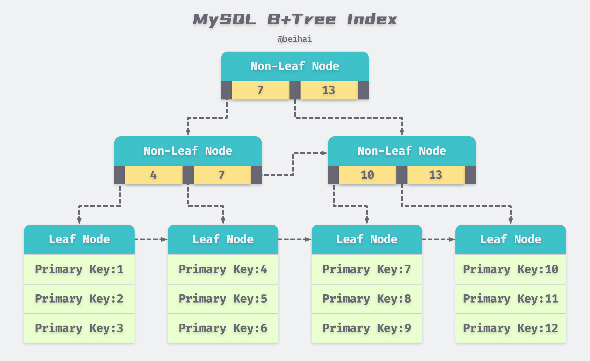
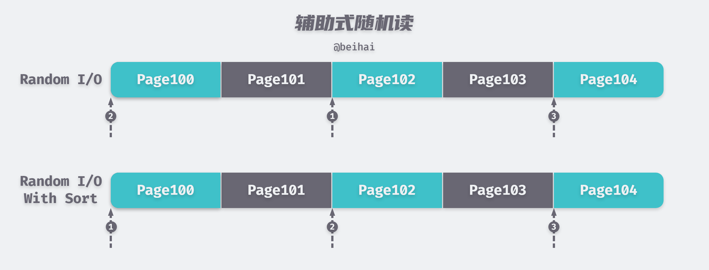
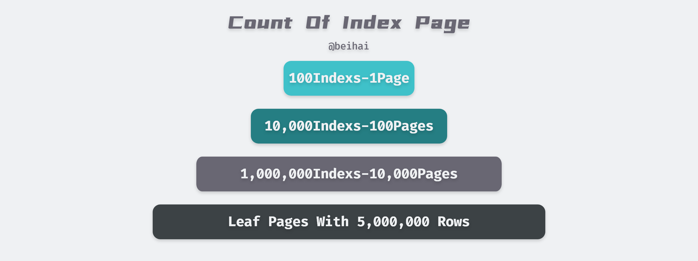
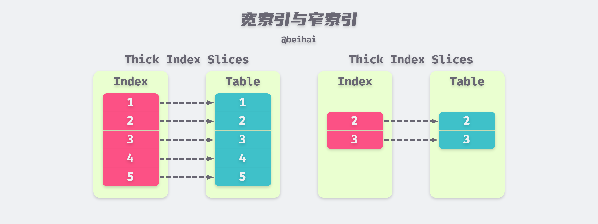
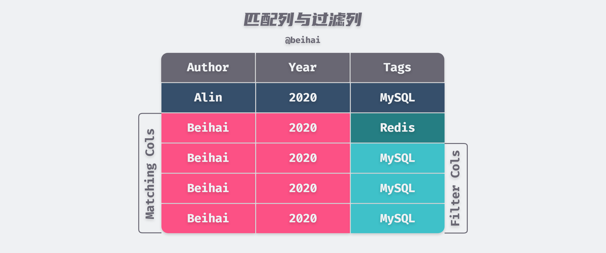
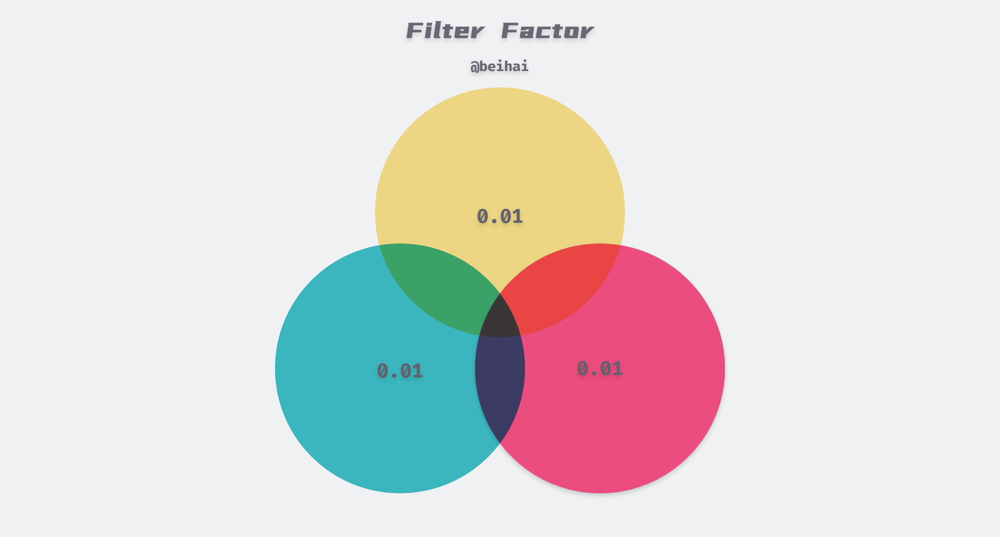

> 在关系型数据库系统中，不合适的索引是造成性能低下的最常见原因。普遍的情况包括没有足够多的索引、一些 SELECT 语句可能没有有效的索引、索引列的顺序不对等等。一些开发人员认为如果一个 SQL 语句使用了索引，那么这个语句得查询性能就会得到很大的提升，而且专业的索引设计应该由 DBA 来完成。但只要掌握数据库内部对任务的处理方式，我们也可以设计出高效的索引。

文中的内容是以 MySQL 为例进行阐述，其它的关系型数据库会有些许不同之处，但基本原理大体上一致。在讨论如何设计索引之前，我们需要先了解索引的相关概念。

## 索引组织结构

关系型数据库的数据行和索引行都被存储在页中，在大多数的操作系统中，页的大小一般为 4KB，在 MySQL 中一个页的默认大小为 16KB。页的大小并不影响我们对性能的分析，它仅仅决定了一个页可以存储多少行数据。在 MySQL 中，辅助索引也是由 B+Tree 组织的，其中包含该条数据的主键。在使用辅助索引查行时，需要先获得主键再去聚集索引中查找该条行数据所在的页，再将页加载到内存中遍历查找出行数据。



#### I/O 的代价

为了更好地估算查询的时间成本，我们需要指定一些贯穿全文的基础假设：

- 磁盘的随机 I/O 速度：10ms 每页；
- 磁盘的顺序 I/O 速度：160MB/s。

> 磁盘的性能取决于具体的硬件水平，但数量级关系基本一致，我们只需记住这一粗略的数据。

磁盘的随机 I/O 代表了磁盘的寻址能力，即磁头寻道读取指定位置处一页数据并传输出去所需的平均时间，虽然现在的磁盘顺序读写速度得到了很大的提升，但进行一次随机读的时间开销依然巨大。

在数据库系统中，随机读取与顺序读取大量的数据页所需的时间差距是巨大的，例如随机读取 10000 个页需要的时间成本是 10000 × 10ms = 100s，如果是顺序读取，那么只需要一次随机 I/O 时间加上顺序读取 160MB 的所需的时间（以每页 16KB 估算）：10ms + 10000 × 16KB ÷ 160MB/s = 1.01s。

#### 辅助式随机读

我们已经看到了随机读取的成本是十分高昂的，为了降低这一成本，SQL 优化器或数据库开发人员会对随机 I/O 场景进行优化。如果一系列不连续的行被按照同一个方向扫描，那么访问模式会是**跳跃式顺序**的，每行的平均 I/O 时间会比随机访问短很多。

某些数据库系统能够在表和索引行顺序不一致的情况下主动创建跳跃式顺序访问，它会首先访问所有满足条件的索引行，然后按照表页的顺序对其进行排序后再访问表，将随机 I/O 变成跳跃式顺序读，以加快读取速度。



跳跃式顺序读的好处会在数据预读的场景下放大，例如在 MySQL 中通过聚集索引访问数据时，数据库实例可能会根据数据的访问情况向前提前读取多个页，如果 SELECT 语句几乎以顺序的方式访问索引页或数据页，那么会大大增加预读数据的命中率，提升 I/O 效率。

#### 缓冲

由于 CPU 速度与磁盘速度之间的鸿沟，基于磁盘的数据库系统通常使用缓冲区技术来提高数据库的整体性能。数据库系统会将频繁访问的页缓存在内存中，当一个索引或数据页被请求时，会优先从内存缓冲区中查找，如果不在内存缓冲区，那么会从磁盘缓冲区中查找，只有当数据不在任何缓冲区中时才会对磁盘驱动器发起读请求。

虽然官方没有明确表示 MySQL 拥有这一机制，但是我们可以认为所有的索引页都被缓存在内存中。MySQL 中的 B+ Tree  通常有 3~4 层高，以索引页行数据的平均长度为 100 字节计算（索引页行数据不会占据太多的空间），考虑到离散的空闲空间，那么一页大概能包含 100 条索引行数据。以一张拥有一百万行索引的四层表为例，这张表大概拥有一万个索引页，占用内存不到 200MB。对于今天的机器配置来说，即使一条行数据拥有多个索引，也可以承担这一内存消耗。



相比之下，从内存缓冲区读取数据的成本十分低廉，通常可以忽略这一时间消耗。对于层高为 4 的 B+ Tree  进行一次聚集索引查询需要访问 4 个页：三个索引页和一个数据页，但是**只需要进行一次随机 I/O**，再配合上数据预读机制，大大减少了查询所需的时间。

#### 小结

通过上面介绍的内容可以看出，随机 I/O 对性能的影响是巨大的，为了提升系统的性能，人们采取了辅助式随机读、数据缓冲等方式来减少随机 I/O 的发生。在设计索引时，也应该多考虑对这方面内容进行优化。

## SQL 优化器

在关系型数据库系统中，优化器是 SQL 处理的核心，在 SQL 语句能够被真正执行之前，优化器必须首先确定数据的访问路径。为查询语句设计合适的索引，可以帮助 SQL 优化器选择更佳的数据访问路径。

#### 索引片

索引片是 SQL 查询在执行过程中扫描的一个索引片段，在这个范围中的索引将被顺序扫描，访问路径的成本很大程度上取决于索引片的厚度。索引片越厚，需要顺序扫描的索引页就越多，相应的行数据也需要从表中同步读取。如果索引片比较薄，就可以减少同步读取所需的随机 I/O 次数。



除此之外，根据索引片包含的列数不同，可将索引分为**宽索引**和**窄索引**：如果一个索引包含 SELECT 语句所需要的全部数据列，那么它就是一个宽索引；如果某个或多个查询所需要的数据列不在索引上，那么它就是一个窄索引。对于`SELECT id, title, author FROM pages WHERE author="beihai"`这条 SQL 语句来说， (author, title, id) 就是该查询的一个宽索引， (author, id) 就是该查询的一个窄索引，因为该索引没有包含查询需要的`title`列。

宽索引能够避免回表操作带来的二次的随机 I/O，而窄索引需要在对索引进行顺序读取之后，需要执行额外的随机读取操作，从聚集索引中获得剩余的数据，如果结果集非常大，那么就会导致随机读取的次数过多而影响性能。

#### 匹配列与过滤列

WHERE 字句后面的条件表达式用于帮助 SQL 优化器定义索引片范围，但不是所有的条件表达式都能匹配到索引上。能够匹配上索引的，我们称之为匹配列，其匹配规则如下：

- 在 WHERE 子句中，如果该列拥有一个**等值条件表达式**与之对应，那么这个列就是匹配列，如果没有，那么这个列及其后面的索引列都是非匹配列；
- 如果该列拥有一个**范围条件表达式**，那么剩余的索引列都是非匹配列；
- 最后一个匹配列之后的索引列，如果拥有一个等值条件表达式与其对应，那么该列为过滤列。

> 特别强调，上述规则中列的顺序是索引中列的顺序，不是 SQL 语句中条件表达式的顺序。

假设在 pages 表中有一个辅助索引(author, years, tags)，当我们使用以下查询语句时：

```sql
SELECT * FROM pages
WHERE author = "Beihai" AND years > 2019 AND tags = "MySQL";
```

虽然我们有(author, years, tags)索引包含了上述查询条件中的全部列，但是根据上述规则，在这条 SQL 语句中只有`author`和`years`两列才是匹配列，MySQL 会扫描所有满足条件的数据行，然后将`tags` 当做过滤列，从中筛选符合条件的数据行。



过滤列虽然不能够减少索引片的大小，但是能够减少随机 I/O 的次数，在索引中也扮演着非常重要的角色。

#### 过滤因子

过滤因子（Filter Factor）是表中满足条件表达式的记录行数所占总行数的比例，表示了列值的分布情况。例如在 pages 表中，`tags="MySQL"`的过滤因子为 0.1%，那么 10000 条数据的查询结果会包含 10 行的记录。在设计索引时，可以使用过滤因子帮助我们获得更薄的索引片。

如果组成条件表达式的列之间非相关，那么联合索引的过滤因子可以由各个索引的过滤因子直接相乘得到。例如索引(author, years, tags)的过滤因子可以由`FF(author)×FF(years)×FF(tags)`计算得到。如果每个列的过滤因子为 1%，那么组合条件的过滤因子已经达到百万分之一了，大大减少了索引片的厚度。




> 直接使用乘积来计算组合条件的过滤因子时，需要特别注意一个问题：列与列之间不应该有太强的相关性，如果不同的列之间有相关性，那么实际的过滤因子与直接相乘得到的过滤因子会有很大的偏差。例如：所在的城市和邮政编码就有非常强的相关性，不过这在多数情况下都不是太大的问题。

在实际情况中，同一个列的不同值的过滤因子也可能会大不相同，例如年龄为 30 的用户数量远远大于年龄为 100 的，这也就造成了同一列不同值之间的查询性能也会有很大差别。当我们评估一个索引是否合适时，**最差情况下的过滤因子比平均过滤因子更重要**，因为在最差输入情况下的查询将消耗最多的时间，而一些在平均情况下运行良好的 SQL 语句有可能在最差环境下无法按时完成任务。

#### 小结

SQL 优化器决定了需要顺序扫描的索引数量与需要进行的随机 I/O 次数，我们在设计索引时，需要针对这一方面的内容进行优化，为查询语句设计一个合适的索引。

## 索引设计

在了解了相关基础内容之后，就可以针对这些原则设计合适的索引，首先，我们讨论一个极端的情况：查询语句的理想索引。

#### 三星索引

如果一个 SQL 语句使用了三星索引，那么一次查询通常只需要进行一次磁盘随机读及一次窄索引片的扫描。一条 SQL 语句要达到三星索引，需要满足以下条件：

1. 第一颗星：在 WHERE 条件语句中，找出所有等值条件表达式的列，将它们作为索引中的开始列；
2. 第二颗星：将 GROUP BY 和 ORDER BY 中的列加入到索引中；
3. 第三颗星：将 SELECT 语句中含有的列加入到索引片中。

例如对于下面的 SQL 语句，索引`(author, years, tags, title, id)`就是该查询语句的一个三星索引。

```sql
SELECT id, title FROM pages
WHERE author = "beihai" AND years = 2020
ORDER BY tags;
```

三星索引的每一颗星都有自己的作用，从不同的角度减少查询所需的时间开销：

1. 第一颗星的作用是减小索引片的厚度，以减少需要顺序扫描的索引行数量；
2. 第二颗星用于避免每次查询都需要进行一次排序，以减少 CPU 和内存的使用；
3. 第三颗星用于避免回表操作，以避免大量的二次随机 I/O；

从中可以看出，满足第三颗星的索引也就是上面提到的宽索引，事实上第三颗星也是最容易获得的，只需要将 SELECT 语句中含有的列加入到索引片中即可。三星索引会增加索引列的数量，如果数据量很大，不仅会增加缓冲区的压力，在更新行数据时也需要同步更新索引中的列，增加了维护的成本。

需要注意的是，在一些复杂查询中，我们可能无法同时获得第一颗星与第二颗星：

```sql
SELECT id, tags, years FROM pages
WHERE author = "beihai"
  AND years BETWEEN 2018 AND 2020
ORDER BY tags;
```

在上面的查询语句中，如果我们想要获得第一颗星，索引的前缀必须为 (author, years)，这时第二颗星是无法获得的，因为需要排序的列`tags`在范围索引列`years`后面，无法直接从索引中获得排序好的`tags`列，必须在内存中进行一次排序操作，这种情况下最终得到的索引就是 (author, years, tags, id)。如果我们想要避免排序的话，就需要交换 `tags`和 `years`的位置，牺牲索引片的薄度，最终会得到索引 (author, tags, years, id)。

针对一条 SQL 语句来说，三星索引是理想的索引方式，但在运行时要针对实际情况进行权衡，通常情况下满足三颗星中的两颗（1,3 或 2,3）就能够达成需求了。

## 总结

从总体上看，设计索引时最重要的问题是如何减少随机读取的次数。三星索引的设计原理是：最小化索引片、避免在运行时排序、避免回表查询。遵循上述原则为每一个查询设计最佳索引的过程是很简单的，但是三星并不适合所有的查询情况，在使用时也需要考虑索引的维护成本，例如索引是否重复、是否可以共用、索引更新的开销等等。索引设计的最终目的，是让查询语句变得又快又省。

文中关于三星索引的定义来自 *[《数据库索引设计与优化》](https://book.douban.com/subject/26419771/)* 一书，书中对索引设计与优化的方法进行了很好的描述，非常值得一读。

## Reference

- [《数据库索引设计与优化》](https://book.douban.com/subject/26419771/)
- [How does a  hard drive work?](https://www.explainthatstuff.com/harddrive.html)
- [Sql优化器究竟帮你做了哪些工作？](https://my.oschina.net/u/1859679/blog/1586098?p=2)
- [MySQL 索引设计概要](https://draveness.me/sql-index-intro/)