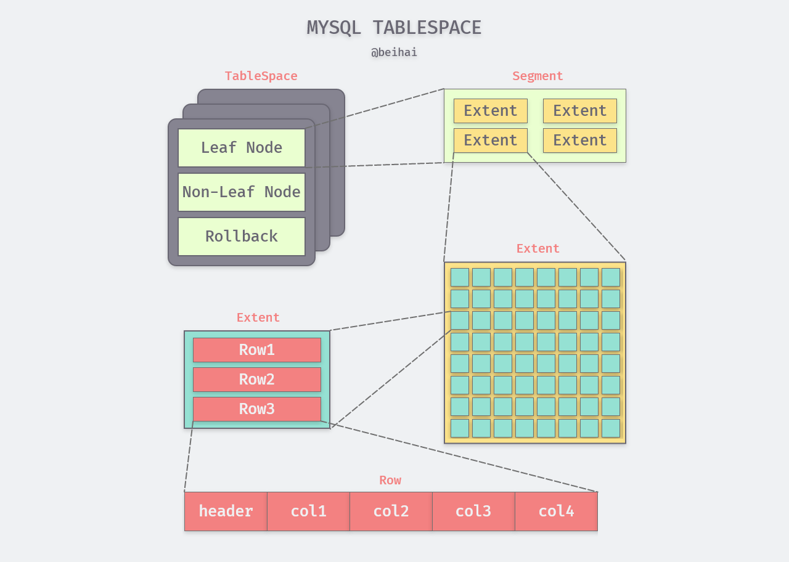
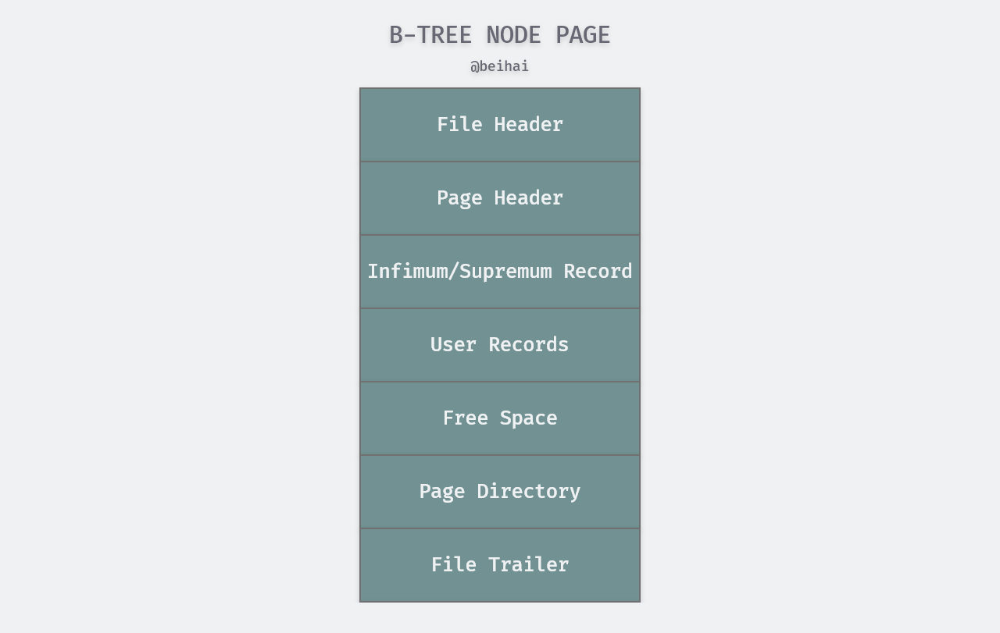
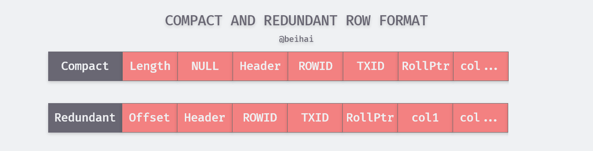
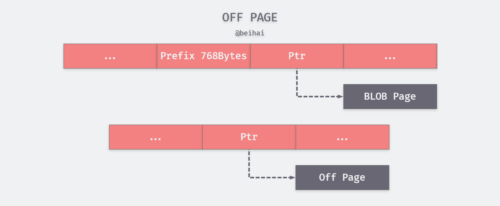
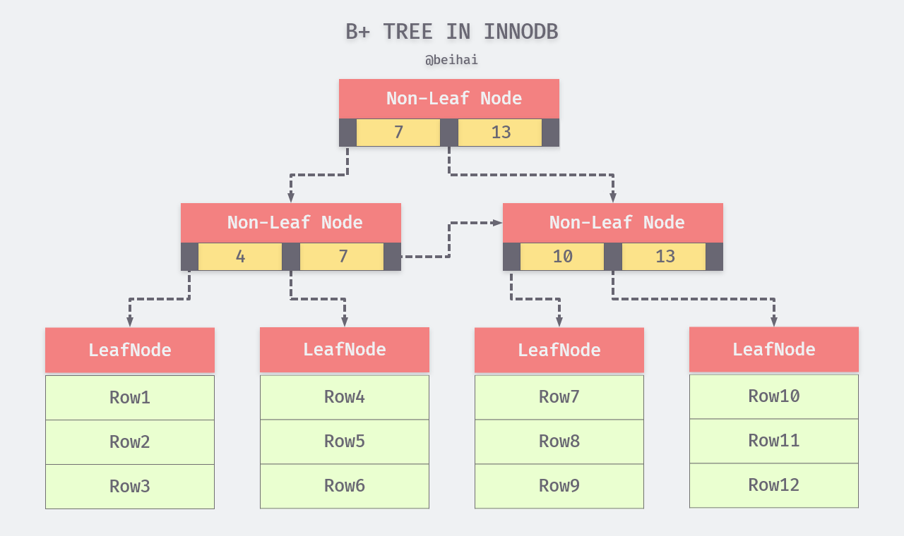
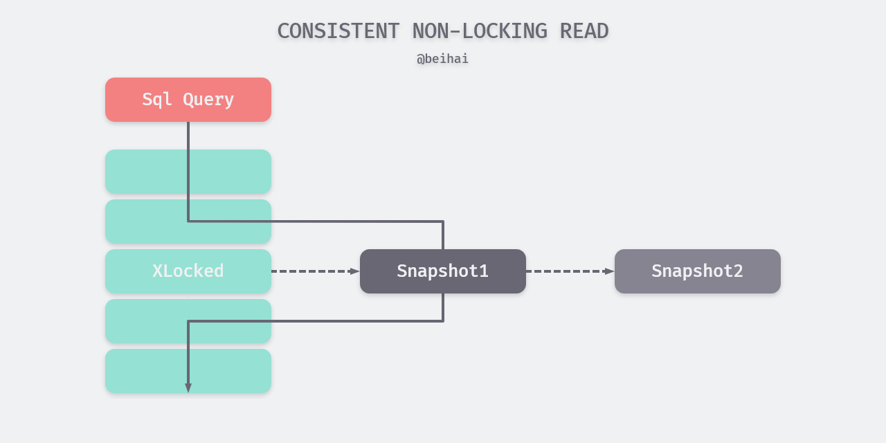
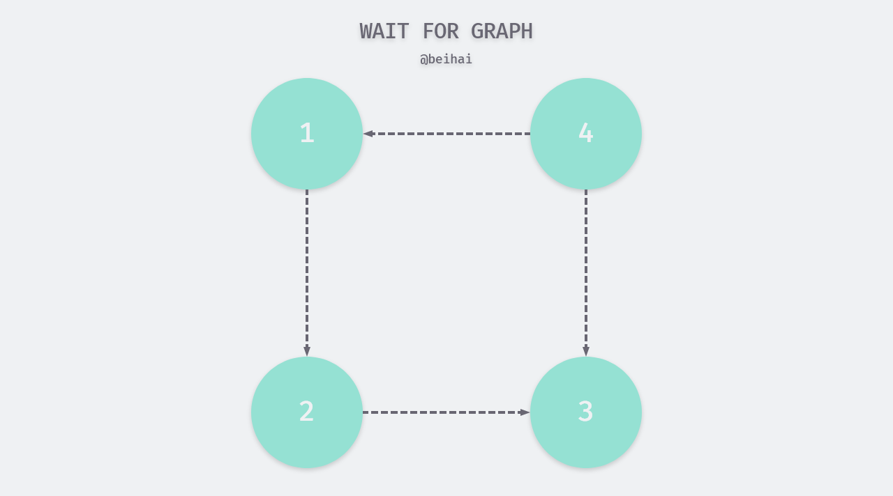

> MySQL 是目前广泛使用的关系型数据库，了解 MySQL 内部的运行机制与体系结构，可以帮助我们更好地解决使用过程中遇到的问题。因此笔者阅读了一些 MySQL InnoDB 存储引擎相关的书籍与资料，并在这篇文章进行总结记录。

## MySQL 体系结构

在数据库领域中有两个词很容易混淆，这就是“**数据库**”（database）和“**实例**”（instance）。作为常见的数据库术语，这两个词在《*MySQL 技术内幕：InnoDB 存储引擎* 》 一书的定义如下：

- **数据库**：物理操作系统文件或其他形式文件类型的集合，在 MySQL 数据库中，数据库文件可以是 csv、ibd 类型的存储文件；
- **实例**：MySQL 数据库由后台线程以及一个共享内存区组成。

概念上来说，数据库是文件的集合，是依照某种数据模型组织起来并存放于二级存储器中的数据集合；数据库实例是程序，是位于用户与操作系统之间的一层数据管理软件，用户对数据库数据的都是在数据库实例下进行的。在 MySQL 中，实例和数据库通常关系是一 一对应的，但是在集群情况下，可能存在一个数据库可被多个实例使用的情况。

MySQL 被设计为一个单进程多线程架构的数据库，并依赖各类操作系统的线程实现，但是 MySQL 基本上能保证在各个平台上的物理体系结构的一致性。MySQL 的体系结构图如下所示：


最上层的连接池提供了网络客户端所需的服务：连接处理、身份验证、安全性等，MySQL 会为每个客户端连接创建一个独立的线程，该连接所属的查询都会在指定的线程中完成。第二层包含了大部分 MySQL 的核心功能，包括对 SQL 的解析、分析、优化、缓存以及内置函数处理，除此之外，跨存储引擎提供的任何功能都在这一层实现，例如：存储过程、触发器和视图。

第三层为插件式存储引擎，也是 MySQL 最重要的部分，存储引擎负责 MySQL 中数据的存储和提取，服务器通过 API 与存储引擎进行通信，并将数据按照每个存储引擎独有的格式写入磁盘中。MySQL 存储引擎是基于表的，在一个数据库实例中，我们能够根据具体的应用的特点对不同的表选择不同的存储引擎。

InnoDB 是目前最通用的存储引擎，在高可靠性与高性能之间具有很好的平衡性，其特点是支持 ACID 事务模型、支持外键、行锁设计，从 MySQL 5.5.8 版本开始，InnoDB 就成为了默认的存储引擎，也是这篇文中主要总结的对象。

## 文件存储

#### 表空间

在 InnoDB 存储引擎中，每张表都有一个主键（Primary Key）从 InnoDB 存储引擎的**逻辑存储结构**看，所有数据都根据主键顺序被逻辑地存放在一个空间中，称之为表空间（tablespace）。从外部来看，一张表是由连续的固定大小的 page 构成，其实表空间文件内部还是组织为更复杂的逻辑结构，自顶向下可分为段（segment）、区（extent）、页（page），InnoDB存储引擎的逻辑存储结构大致如下图所示：



> 上图修改自《MySQL 技术内幕：InnoDB 存储引擎》图4-1 InnoDB逻辑存储结构

segment 与数据库中的索引相映射。InnoDB 引擎内，数据段即为 B+ Tree 的叶子节点，索引段即为 B+ Tree 的非叶子节点，创建索引中很关键的步骤便是分配 segment。

segment 的下一级是 extent，extent 代表一组连续的 page，默认大小均为 1MB。extent 的作用是提高 page 分配效率，另外在数据连续性方面也更佳，segment 扩容时也是以 extent 为单位分配。

page （在一些资料中被称为 block）则是表空间数据存储的基本单位，innoDB 将表文件按 page 切分，依类型不同，page 内容也有所区别，最为常见的是存储数据库表的行记录。

在默认情况下，InnoDB 存储引擎 page 的大小为 16KB，即一个 extent 中一共有 64 个连续的 page。在创建 MySQL 实例时，可以通过指定`innodb_page_size`选项对 page 的大小进行更改，需要注意的是 page 的大小可能会影响 extent 的大小：

| page size | page nums | extent size |
| :-------: | :-------: | :---------: |
|    4KB    |    256    |     1MB     |
|    8KB    |    128    |     1MB     |
|   16KB    |    64     |     1MB     |
|   32KB    |    64     |     2MB     |
|   64KB    |    64     |     4MB     |

#### 数据页结构

页是 InnoDB 存储引擎管理数据的最小磁盘单位，常见的页类型有：数据（索引）页，Undo 页，Inode 页，系统页，BloB 页等等，其中数据页（B+ Tree Node）存放着表中行的实际数据，数据页包括七个部分，文件头部，页头部，最大最小记录，用户记录，空闲空间，数据目录，文件尾部。 简单的来说，数据页分两部分，一部分存储数据行记录，按照行的大小通过指针连接起来，另外一部分存储数据页的目录，用来加速查找。



File Header 与 File Trailer 主要用来存储表空间相关的信息，包括页号、页类型、校验值等。Page Header 存放着数据页相关的元信息，Page Directory 维护着该页的稀松目录，每隔 4-8 条行记录存放一条记录的页内偏移量，由于数据页目录的存在，查找和定位就相对简单，先用二分查找，定位周边的两个目录，然后再用线性查找的方式定位最终的记录或者位置。

Infimum/Supremum Record 是两个虚拟的行记录，用来限定记录的边界。Infimum Record 是比该页中任何主键值都要小的值，Supremum Record 是比任何可能大的值还要大的值。这两个值在页创建时被建立，并且在任何情况下不会被删除。

User Records 就是整个页面中真正用于存放行记录的部分，它是一个链表的数据结构，为了保证插入和删除的效率。整个**页面并不会按照主键顺序对所有记录进行排序**，当用户需要插入记录时候，首先在被删除的记录的空间中查找，如果没有找到合适的空间，就会从 Free Space 中分配。因此行记录在物理存储上可能并不是按照主键顺序的，它们之间的顺序是由指向下一个记录的指针 `next_record` 控制的。

#### 行记录格式

InnoDB 存储引擎和大多数数据库一样，记录是以行的形式存储的，每个 16KB 大小的页中可以存放 2-200 行记录。InnoDB早期的文件格式为`Antelope`，可以定义两种行记录格式，分别是`Compact`和`Redundant`，InnoDB 1.0.x 版本开始引入了新的文件格式`Barracuda`。`Barracuda`文件格式下拥有两种新的行记录格式：`Compressed`和`Dynamic`。

`Compact`行记录格式是在 MySQL 5.0 中引入的，其首部是一个非 NULL 变长列长度列表，并且是逆序放置的，其长度为：

- 若列的长度小于 255 字节，用 1 个字节表示；
- 若列的长度大于 255 字节，用 2 个字节表示。

变长字段的长度最大不可以超过 2 字节，这是因为 MySQL 数据库中 VARCHAR 类型的最大长度限制为 65535。变长字段之后的第二个部分是 NULL 标志位，该位指示了该行数据中是否有 NULL 值，有则用 1 表示，该部分所占的大小为 1 字节。接下来是记录头部信息，固定占用 5 字节。

`Redundant`是 MySQL 5.0 版本之前 InnoDB 的行记录格式，`Redundant`行记录格式的首部是每一列长度偏移列表，同样是逆序存放的。从整体上看，`Compact`格式的存储空间减少了约 20%，但代价是某些操作会增加 CPU 的使用。	



`Dynamic`和`Compressed`是`Compact`行记录格式的变种，`Compressed`会对存储在其中的行数据会以`zlib`的算法进行压缩，因此对于 BLOB、TEXT、VARCHAR 这类大长度类型的数据能够进行非常有效的存储。

> 详细了解 InnoDB 行记录格式可参考文档：[InnoDB Row Formats](https://dev.mysql.com/doc/refman/8.0/en/innodb-row-format.html)

####  行溢出

当 InnoDB 存储极长的 TEXT 或者 BLOB 这类大对象时，我们并不会直接将所有的内容都存放在数据页中。因为 InnoDB 存储引擎使用 B+ Tree 组织索引，每个页中至少应该有两条行记录，因此，如果页中只能存放下一条记录，那么InnoDB存储引擎会自动将行数据存放到溢出页中。

如果我们使用`Compact`或`Redundant`格式，那么会将行数据中的前 768 个字节存储在数据页中，后面的数据会通过指针指向 Uncompressed BLOB Page。

但是如果我们使用新的行记录格式`Compressed` 或者`Dynamic`时只会在行记录中保存 20 个字节的指针，实际的数据都会存放在溢出页面中。



## 索引

索引是应用程序设计和开发的一个重要方面。若索引太多，应用程序的性能可能会受到影响。而索引太少，对查询性能又会产生影响。要找到一个合适的平衡点，这对应用程序的性能至关重要。InnoDB存储引擎支持以下几种常见的索引：

- **B+ Tree 索引**
- **全文索引**
- **哈希索引**

#### B+ Tree 索引

B+ Tree 是目前关系型数据库系统中查找最为常用和最为有效的索引，其构造类似于二叉树，根据键值对快速找到数据。B+ Tree 索引在数据库中有一个特点是高扇出性，在数据库中，B+ Tree 的高度一般都在 2～4 层，这也就是说查找某一键值的行记录时最多只需要 2 到 4 次随机 IO。

在 InnoDB 存储引擎中，B+ Tree 索引并不能找到一个给定键的具体行，B+ Tree 索引能找到的只是被查找数据行所在的页，然后数据库通过把页读入到内存，再在内存中进行查找，最后得到要查找的数据。 



数据库中的 B+ Tree 索引可以分为聚集索引和辅助索引，但是不管是聚集还是辅助的索引，其内部都是 B+ Tree，即高度平衡的，叶子节点存放着所有的数据。聚集索引与辅助索引不同的是，叶子节点存放的是否是一整行的信息。

##### 聚集索引

聚集索引就是按照每张表的主键构造一棵 B+ Tree，同时叶子节点中存放的即为整张表的行记录数据，也将聚集索引的叶子节点称为数据页。聚集索引的这个特性决定了索引组织表中数据也是索引的一部分，同 B+ Tree 数据结构一样，每个数据页都通过一个双向链表来进行链接。我们可以用下面的 SQL 语句创建一张 test 表，指定了`id`字段为主键并创建聚集索引。

```sql
CREATE TABLE test (
    id INT NOT NULL,
    name VARCHAR(20) NOT NULL,
    a INT NOT NULL,
    b INT NOT NULL,
    PRIMARY KEY (id),
    KEY idx_name (name)
    KEY idx_a_b (a,b)
)
```

由于实际的数据页只能按照一棵 B+ Tree 进行排序，因此每张表只能拥有一个聚集索引，**表中的所有行记录数据都是按照聚集索引的顺序存放的**。在多数情况下，查询优化器倾向于采用聚集索引快速发现某一段范围的数据页需要扫描，因为聚集索引能够在 B+ Tree 索引的叶子节点上直接找到数据。此外，由于定义了数据的逻辑顺序，聚集索引能够特别快地访问针对范围值的查询。

##### 辅助索引

辅助索引中叶子节点并不包含行记录的数据，而是记录着对应行数据的聚集索引（即主键）。当通过辅助索引来寻找数据时，InnoDB 存储引擎会遍历辅助索引获得行数据的主键，最后在聚集索引中使用主键获取对应的行记录

辅助索引的存在并不影响数据在聚集索引中的组织，因此每张表上可以有多个辅助索引，在上面的 test 表中，索引`idx_name`与`idx_a_b`都是辅助索引

##### 联合索引

联合索引是一种特殊的辅助索引。前面讨论的情况都是只对表上的一个列进行索引，而联合索引可以对表上的多个列进行索引，在上面的 test 表中，索引`idx_a_b`就是一个联合索引。其本质也是一棵 B+ Tree，不同的是联合索引的键的数量大于等于 2。


如上图所示，联合索引的键都是排序存放的，通过叶子节点可以逻辑顺序读出所有数据。利用索引中的附加列，您可以缩小搜索的范围，所以创建复合索引时，应该仔细考虑列的顺序。

联合索引遵循最左匹配原则，即从左到右使用索引中的字段，一个查询可以只使用索引中的一部份，但只能是最左侧部分。例如索引是 key abc_index (a,b,c)，那么执行以下 SQL 语句都可以用到索引`abc_index`。

```sql
SELECT * FROM test WHERE a=1;
SELECT * FROM test WHERE a=1 AND b=2;
SELECT * FROM test WHERE b=2 AND a=1;
SELECT * FROM test WHERE a=1 AND b=2 AND c=3;
```

在第二条与第三条语句中，查询优化器会判断这条 SQL 语句以什么样的顺序执行效率最高，所以最后所查询的结果是一样的。

#### 自适应哈希索引

自适应哈希索引是 InnoDB 缓冲池的一部分，InnoDB 存储引擎会监控表上二级索引的查找，如果发现某二级索引被频繁访问，通过建立哈希索引可以带来速度的提升。自适应哈希索引经哈希函数映射到一个哈希表中，因此对于字典类型的查找非常快速，而对于其他查找类型，如范围查找，是无法使用哈希索引的。

InnoDB 存储引擎使用哈希算法来对字典进行查找，其冲突机制采用链表方式，哈希函数采用除法散列方式。由于自适应哈希索引是由 InnoDB 存储引擎自己控制的，DBA 本身并不能对其进行干预，但是可以通过参数`innodb_adaptive_hash_index`来禁用或启动此特性，默认为开启。

#### 全文检索

全文检索是将存储于数据库中的整本书或整篇文章中的任意内容信息查找出来的技术。它可以根据需要获得全文中有关章、节、段、句、词等信息，也可以进行各种统计和分析。例如在下面的 SQL 语句中，我们可以查询博客内容包含单词`MySQL`的文章：

```sql
SELECT * FROM blog WHERE content LIKE '%MySQL%';
```

根据 B+ Tree 索引的特性，上述 SQL 语句即便对`content`添加了 B+ Tree 索引也需要对索引进行扫描来得到结果，而且创建索引极大地浪费了空间，一般情况下B+ Tree 索引并不能很好地完成这类工作。

全文检索通常使用倒排索引来实现。倒排索引在辅助表中存储了单词与单词自身在一个或多个文档中所在位置之间的映射，通俗地说，**倒排索引用来记录有哪些文档包含了某个单词**。这通常利用关联数组实现，其拥有两种表现形式：

- **inverted file index**，其表现形式为{单词，单词所在文档的 ID}；
- **full inverted index**，其表现形式为{单词，(单词所在文档的 ID，在具体文档中的位置)}。

例如，有下面这样的一张表：

| DocumentId |                 Text                  |
| :--------: | :-----------------------------------: |
|     1      |     Hello, I am a college student     |
|     2      |           I am 21 years old           |
|     3      | Three years ago I came to the college |

这张表对应的倒排索引示例如下：

| Number |  Text   | inverted file index | full inverted index |
| :----: | :-----: | :-----------------: | :-----------------: |
|   1    | college |         1,3         |     (1:6),(3:8)     |
|   2    | student |          1          |        (1:7)        |
|   3    |  years  |         2,3         |     (2:4),(3:2)     |
|  ...   |   ...   |         ...         |         ...         |

从上表中可以看出，full inverted index 还存储了单词所在的位置信息，如`student`这个单词的索引为（1:7），即文档 1 的第 7 个单词为 student。相比之下，full inverted index 占用更多的空间，但是能更好地定位数据，并扩充一些其他的搜索特性。

InnoDB 从 1.2.x 版本开始支持全文检索，并采用 full inverted index 的方式。在 InnoDB 存储引擎中，将（DocumentId，Position）视为一个*ilist*。由于 InnoDB 存储引擎在`ilist`字段中存放了 Position 信息，因此可以进行临近搜索。

为了提高全文检索的并行性能，InnoDB 存储引擎会将倒排索引的 word 存放到 6 张辅助表中，每张表根据 word 的 Latin 编码进行分区，保存在磁盘上。除此之外还引入了全文检索索引缓存（FTS Index Cache），FTS Index Cache 是一个红黑树结构，其根据（word，ilist）进行排序，以加速查询操作。

索引设计是数据库中十分复杂的部分，这一小节也只是简要概括了 InnoDB 索引的内部机制，如果有不正确或疑问的内容可以在文章下面留言。

## 锁

锁是数据库系统区别于文件系统的一个关键特性，锁机制用于管理对共享资源的并发访问。InnoDB 存储引擎除了会在行级别上对表数据上锁，也会在数据库内部其他多个地方使用锁，从而允许对多种不同资源提供并发访问。对于锁的实现，各个数据库厂商的实现方法都会有所不同，这一节主要讨论 MySQL 中 InnoDB 引擎的锁。

#### 锁的种类

InnoDB 实现了两种类型的行级锁：

- **共享锁（也称为 S 锁）**：允许事务读取一行数据。

  可以使用 SQL 语句 `select * from tableName where … lock in share mode;` 手动加 S 锁。

- **排他锁（也称为 X 锁）**：允许事务删除或更新一行数据。

  可以使用 SQL 语句 `select * from tableName where … for update`; 手动加 X 锁。

S 锁和 S 锁是兼容的，X 锁和其它锁都不兼容，举个例子，事务 T1 获取了一个行 r1 的 S 锁，事务 T2 可以立即获得行 r1 的 S 锁，此时 T1 和 T2 共同获得行 r1 的 S 锁，这种情况称为锁兼容，但是另外一个事务 T3 此时如果想获得行 r1 的 X 锁，则必须等待 T1 对行 r 锁的释放，这种情况称为锁冲突。

我们可以用读写锁的概念来理解 InnoDB 的行级锁，其中共享锁代表了读操作，排他锁代表了写操作，所以我们可以对行数据进行**并行读**，但是只能**串行写**，以此来保证 MySQL 内部不会发生资源竞争现象。

共享锁还是互斥锁都只能对某一个数据行进行加锁，为了支持在不同粒度上进行加锁操作，InnoDB 存储引擎支持一种额外的锁方式，称之为意向锁，由 InnoDB 自动添加，且都是表级别的锁：

- **意向共享锁（IS）**：事务想要获得一张表中某几行的共享锁，必须获得该表的 IS 锁；
- **意向排他锁（IX）**：事务想要获得一张表中某几行的排他锁，必须获得该表的 IX 锁。

由于 InnoDB 存储引擎支持的是行级别的锁，因此意向锁其实不会阻塞除全表扫以外的任何请求，它们的主要目的是为了表示**是否有事务正在锁定表中的某一行数据**。表级意向锁与行级锁的兼容性如表：

<center>表：行级锁和表级意向锁的兼容性</center>

| **锁类型** | **X** | **IX** | **S** | **IS** |
| :--------: | :---: | :----: | :---: | :----: |
|   **X**    | 冲突  |  冲突  | 冲突  |  冲突  |
|   **IX**   | 冲突  |  兼容  | 冲突  |  兼容  |
|   **S**    | 冲突  |  冲突  | 兼容  |  兼容  |
|   **IS**   | 冲突  |  兼容  | 兼容  |  兼容  |

> 如果没有意向锁，当已经有事务使用行锁对表中的某一行进行修改时，如果另外一个事务要对全表进行修改，那么就需要对所有的行是否被锁定进行扫描，在这种情况下，效率是非常低的；不过，在引入意向锁之后，当有事务使用行锁对表中的某一行进行修改之前，会先为表添加意向排他锁（IX），再为行记录添加排他锁（X），在这时如果有事务尝试对全表进行修改就不需要判断表中的每一行数据是否被加锁了，只需要通过等待意向互斥锁被释放就可以了。
>
> ——上述内容来自[『浅入浅出』MySQL 和 InnoDB](https://draveness.me/mysql-innodb/)

#### 行锁的算法

因为 InnoDB 存储引擎支持的是行级别的锁，所以这一小节了解一下行锁的实现算法，InnoDB 存储引擎使用三种行锁的算法用来满足相关事务隔离级别的要求：

- **Record Lock**（记录锁）：该锁为**索引记录**上的锁，如果表中没有定义索引，InnoDB 会默认为该表创建一个隐藏的聚集索引，并使用该索引锁定记录；

  如果我们使用聚集索引或辅助索引字段作为 SQL 中 `WHERE` 语句的过滤条件，那么 InnoDB 就可以通过索引建立的 B+  Tree 找到行记录并添加锁，但是如果使用未添加索引的字段作为过滤条件时，由于 InnoDB 不知道待修改的记录具体存放的位置，也就无法对将要修改哪条记录提前做出判断，因此会锁定整个表。

- **Gap Lock**（间隙锁）：该锁会锁定一个范围，但是不括记录本身；

  当使用类似 `SELECT * FROM table WHERE age BETWEEN 20 AND 30 FOR UPDATE;` 的 SQL 语句时，就会阻止其他事务向表中插入 `age = 15` 的记录，因为整个范围都被间隙锁锁定了。虽然间隙锁中也分为共享锁和排他锁，不过它们之间并不会产生冲突，也就是不同的事务可以同时持有一段相同范围的共享锁和排他锁，它的作用是**多个事务向同一范围中添加新的记录**，以避免幻读问题。

- **Next-key Lock**：该锁是 Record Locks 和 Gap Locks 的组合，即锁定一个范围并且锁定该记录本身。举个例子，如果一个索引有 1, 3, 5 三个值，则该索引锁定的区间为 `(-∞,1], (1,3], (3,5], (5,+ ∞)`。

  > 虽然叫 Next-Key Lock，但它锁定的并不是是当前值和后面的范围，实际上Next-Key Lock 锁定的是当前值和前面的范围。

  当我们更新一条记录，比如 `SELECT * FROM table WHERE index = 3 FOR UPDATE;`，InnoDB 不仅会在范围 `(1, 3]` 上加 Next-Key Lock，还会在这条记录后面的范围 `(3, 5]` 加间隙锁，所以 `(1, 5]` 范围内的记录都会被锁定。InnoDB 使用 Next-key Lock 与 Gap Lock 解决幻读问题。需要注意的是，如果索引有唯一属性，则 InnnoDB 会自动将 Next-key Lock 降级为 Record Locks。

#### 一致性非锁定读

**InnoDB** 中的一致性读指的是利用 MVCC（多版本并发控制）技术查询数据库在某个时间点的快照。此查询可以看到该时间点之前提交的事务所做的更改，并且不会被之后的修改或者未提交事务所影响。例如如果读取的行正在执行 DELETE 或 UPDATE 操作，这时读取操作不会因此去等待行上锁的释放，相反地，InnoDB 存储引擎会去读取行的一个快照数据。



因为不需要等待访问的行上 X 锁的释放，**一致性非锁定读极大地提高了数据库的并发读性能**。从上图可以看出，快照数据其实就是当前行数据之前的历史版本，每行记录可能有多个版本，该实现是通过`undo log segments`来完成。在不同事务隔离级别下，读取的方式会有所不同：

- 当事务隔离级别为 **REPEATABLE READ** 时，同一个事务中的一致性读都是读取的是该事务下第一次查询所建立的快照；
- 当事务隔离级别为 **READ COMMITTED** 时，同一事务下的一致性读都会建立和读取此查询自己的最新的快照。

#### 死锁

死锁是指两个或两个以上的事务在执行过程中，因争夺锁资源而造成的一种互相等待的现象，若无外力作用，它们都将无法继续执行下去。InnoDB 引擎采取的是 wait-for-graph（等待图）的方法来自动检测死锁，如果发现死锁会自动回滚一个事务。

等待图会在数据库中保存*锁的信息链表*与*事务等待链表*，通过上述链表可以构造出一张图，若在这张图中存在回路，就代表存在死锁，事务间在相互等待对方释放资源。



等待图是一种较为主动的死锁检测机制，在每个事务请求锁并发生等待时都会判断是否存在回路。在上图中，事务 1 需要事务 2 释放资源才能继续执行，而事务 2 需要事务 3 释放资源...最终形成了死锁回路，这时会自动回滚一个事务来解开死锁竞争，通常来说 InnoDB 存储引擎选择回滚 undo 量最小的事务。

## 事务

数据库事务是数据库管理系统执行过程中的一个逻辑单位，由一个有限的数据库操作序列构成。事务拥有四个重要的特性：原子性（Atomicity）、一致性（Consistency）、隔离性（Isolation）、持久性（Durability），人们习惯称之为 ACID 特性。

事务隔离性由上文讲述的锁机制来实现，Redo Log（重做日志）用来保证事务的原子性和持久性，Undo Log（回滚日志）用来保证事务的一致性。Redo 和 Undo 的作用都可以视为是一种恢复操作，Redo 恢复提交事务修改的页操作，而 Undo 回滚行记录到某个特定版本，因此两者记录的内容有一些不同。

#### Redo Log 与持久性

持久性是指事务一旦提交，则其结果就是永久性的。即使发生宕机故障，数据库也能将数据恢复，也就是说事务完成后，事务对数据库的所有更新将被保存到数据库，不能回滚。

InnoDB 存储引擎使用重做日志用来实现事务的持久性，其由两部分组成：一是内存中的重做日志缓冲（Redo Log Buffer）；二是持久在磁盘中的重做日志文件（Redo Log File）。重做日志文件中**记录的是数据页的物理变化**，例如某一事务的事务序号为 T1，其对数据 X 进行修改，设 X 的原值是 5，修改后的值为 15，那么 Redo Log 记录内容为<T1,X,15> ，Undo Log 记录内容为<T1,X,5>。

InnoDB 通过 *Force Log at Commit* 机制实现事务的持久性，即当事务 COMMIT 时，必须先将该事务的所有 Redo Log 和 Undo Log 写入到重做日志文件进行持久化，待事务的 COMMIT 操作完成才算成功。Redo Log 基本上都是顺序写的，在数据库运行时不需要对 Redo Log 的文件进行读取操作，当服务器发生宕机故障时，MySQL 通过重做日志来恢复未同步的内容。为了确保每次日志都写入重做日志文件，在每次将重做日志缓冲写入重做日志文件后，InnoDB 存储引擎都需要调用一次`fsync()`系统调用，将数据立即写入磁盘。

为了更好地理解重做日志与数据缓冲之间的关系，我们可以用下面的示例描述这一流程：

1. 客户端开启一个新的数据修改事务 T1，从磁盘中读取数据 X 到内存缓冲区中；
2. 将数据 X 由原值 5 修改为 15，此时数据仍在内存缓冲区中，等待刷新到磁盘；
3. 在 Redo Log 记录下数据的修改记录 <T1,X,15>，并立即调用`fsync()`将数据写入磁盘；
4. 第三步完成后事务才能提交成功，将内存缓冲中的数据刷新到磁盘。

需要注意的是，在事务开始之后就产生 Redo Log，重做日志的落盘并不是随着事务的提交才写入的，而是在事务的执行过程中，便开始写入重做日志文件中。当对应事务的脏页写入到磁盘之后，Redo Log 的使命也就完成了，其占用的空间就可以被重新使用。

在 InnoDB 存储引擎中，重做日志缓存、重做日志文件都是以块（block）的方式进行保存的，每块的大小为512字节。若一个页中产生的重做日志数量大于 512 字节，那么需要分割为多个重做日志块进行存储。此外，由于重做日志块的大小和磁盘扇区大小一样，都是 512 字节，因此重做日志的写入可以保证原子性。

#### Undo Log 与一致性

一致性指事务将数据库从一种状态转变为另一种一致的的状态。事务开始前和结束后，数据库的完整性约束没有被破坏。事务是一致性的单位，如果事务中某个动作失败了，系统可以自动撤销事务——返回初始化的状态。

Undo 存放在数据库内部的一个特殊段 Undo Segment，位于共享表空间内。Undo 是逻辑日志，并不会将数据库物理地恢复到执行语句或事务之前的样子，而只是将数据库逻辑地恢复到原来的样子。所有修改都被逻辑地取消了，但是数据结构和页本身在回滚之后可能大不相同。这是因为在多用户并发系统中，可能会有数十、数百甚至数千个并发事务，一个事务在修改当前一个页中某几条记录，同时还有别的事务在对同一个页中另几条记录进行修改。因此，不能将一个页回滚到事务开始的样子，因为这样会影响其他事务正在进行的工作。

除了回滚操作，一致性非锁定读一小节中提到的 MVCC 的实现也是通过 Undo 来完成。当用户读取一行记录时，若该记录已经被其他事务占用，当前事务可以通过 Undo 日志读取之前的行版本信息，以此实现非锁定读取。

> Undo Log 在运行时也会产生 Redo Log，这是因为 Undo Log 也需要持久性的保护。

#### 锁与隔离性

隔离性要求每个读写事务的对象对其他事务的操作对象能互相分离，即该事务提交前对其他事务不可见。  也可以理解为多个事务并发访问时，事务之间是隔离的，一个事务不应该影响其它事务运行效果。MySQL 通过锁机制来保证事务的隔离性。

SQL 标准定义的四种隔离级别被 ANSI（美国国家标准学会）和 ISO/IEC（国际标准）采用，每种级别对事务的处理能力会有不同程度的影响。我们分别对四种隔离级别从并发程度由高到低进行描述，并用代码进行演示，在这之前，我们先创建一个演示表 test，并准备两个客户端 client1 与 client2：

```sql
create database test;
use test;
create table test(id int primary key);
insert into test(id) values(1);
```

##### READ UNCOMMITTED

该隔离级别的事务会读到其它未提交事务的数据，此现象也称之为**脏读**，其现象如下所示：

```sql
# 在 client1 中执行：
SET @@session.transaction_isolation = 'READ-UNCOMMITTED';
use test;
begin;
update test set id = 2 where id = 1;
select * from test; -- 此时看到一条ID为2的记录

# 在 client2 中执行：
use test;
begin;
select * from test; -- 此时看到一条 ID 为 2 的记录
```

client2 最后一步读取到了 client1 中未提交的事务（没有 commit 动作），即产生了**脏读**，此隔离级别下数据库的并发是最好的。

##### READ COMMITTED

一个事务可以读取另一个已提交的事务，多次读取会造成不一样的结果，此现象称为**不可重复读**：

```sql
# 在 client1 中执行：
SET @@session.transaction_isolation = 'READ-COMMITTED';
begin;
update test set id = 2 where id = 1;
select * from test; -- 此时看到一条ID为2的记录

# 在 client2 中执行：
begin;
select * from test; -- 此时看到一条 ID 为 1 的记录

# 在 client1 中提交事务：
commit;

# 在 client2 中执行查询：
select * from test; -- 此时看到一条 ID 为 2 的记录
```

client2 在开启了一个事务之后，在第一次读取 test 表（此时 client1 的事务还未提交）时 id 为 `1`，在第二次读取 test 表（此时 client1 的事务已经提交）时 id 已经变为 `2`，说明在此隔离级别下已经读取到已提交的事务。

##### REPEATABLE READ

在同一个事务里，SELECT 的结果是事务开始时时间点的状态，因此，同样的 SELECT  操作读到的结果会是一致的，但是会有**幻读**现象。

```sql
# 在 client1 中执行：
SET @@session.transaction_isolation = 'REPEATABLE-READ';
begin;
select * from test; -- 无记录

# 在 client2 中执行：
begin;
select * from test; -- 无记录

# 在 client1 中提交事务：
insert into test(id) values(1);
commit;

# 在 client2 中执行查询：
select * from test; --此时查询还是无记录
insert into test(id) values(1); -- 此时报主键冲突的错误
```

通过这一步可以证明，在该隔离级别下已经读取不到别的已提交的事务，但是如果此时接着在 client2 插入一条数据，就会发生主键冲突的错误，好像之前的查询是幻觉一样。

`REPEATABLE-READ`是 InnoDB 存储引擎默认支持的隔离级别，从上面的描述可以看出，`REPEATABLE READ` 和 `READ UNCOMMITED` 其实是矛盾的，如果保证了前者就看不到已经提交的事务，如果保证了后者，就会导致两次查询的结果不同。InnoDB 选择在`REPEATABLE READ`隔离级别中使用上文中的`next-key lock`机制来避免幻读这个问题。

### SERIALIZABLE

在该隔离级别下事务都是串行顺序执行的，从而避免了上述出现的脏读、不可重读复读和幻读问题：

```sql
# 在 client1 中执行：
SET @@session.transaction_isolation = 'SERIALIZABLE';
begin;
insert into test(id) values(1);

# 在 client2 中执行：
begin;
select * from test; -- 此时会一直卡住

# 在 client1 中提交事务：
commit;
```

一旦事务提交，client2 会立马返回 id 为 1 的记录，否则会一直卡住，直到请求超时。MySQL 数据库的 InnoDB 引擎会给读操作隐式加一把读共享锁来实现串行化级别的事务隔离，但由于每条 SELECT 语句都会加锁，所以该隔离级别的数据库并发能力最弱。

上述四种隔离级别的隔离性越来越高，但是对应的并发性能也越来越低，MySQL 选择了`REPEATABLE READ`隔离级别，并使用`next-key lock`机制来避免幻读问题，也是一种折中的解决方案。

## 总结

文中对 MySQL 的主要特性进行了总结，但是 MySQL 的相关知识十分庞大，读者想了解具体细节的实现可以参考[《MySQL技术内幕：InnoDB存储引擎》](https://read.douban.com/ebook/15233230/)一书。如果发现文中存在不正确的地方可以在下面留言指正。

## Reference

- [File Space Management](https://dev.mysql.com/doc/refman/8.0/en/innodb-file-space.html)
- [InnoDB Row Formats](https://dev.mysql.com/doc/refman/8.0/en/innodb-row-format.html)
- [MySQL · 引擎特性 · InnoDB 数据页解析](http://mysql.taobao.org/monthly/2018/04/03/)
- [InnoDB Locking](https://dev.mysql.com/doc/refman/8.0/en/innodb-locking.html)
- [MySQL 中的锁](https://www.ibm.com/developerworks/cn/opensource/os-mysql-transaction-isolation-levels-and-locks/index.html)
- [MySQL 事务隔离级别和锁](https://www.ibm.com/developerworks/cn/opensource/os-mysql-transaction-isolation-levels-and-locks/index.html)
- [『浅入浅出』MySQL 和 InnoDB](https://draveness.me/mysql-innodb/)
- [《MySQL技术内幕：InnoDB存储引擎》](https://read.douban.com/ebook/15233230/)

