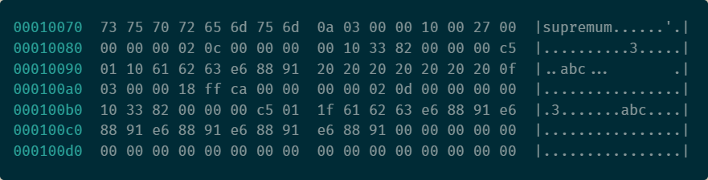

> CHAR 与 VARCHAR 是 MySQL 中常用的存储字符串的数据类型，在官方文档的介绍中 CHAR 类型的可定义最大长度为 255，而 VARCHAR 类型的最大长度为 65535，然而经过操作发现 VARCHAR 实际可创建的最大“长度”是一个不定值，这篇文章将会对这个问题进行分析。

当我们在 MySQL 中输入建表语句`CREATE TABLE test( a VARCHAR(65535) NOT NULL)CHARSET=latin1;`时，MySQL 会返回给我们`Row size too large`错误，这表示 MySQL 并不支持创建 65535 字节长度的 VARCHAR 类型，最终测试发现最大可创建长度为 65533。为了更好地解释这个现象，我们需要了解 MySQL 内部的存储方式。

## 分析

#### 字符编码

在计算机中，字符编码是把字符集中的字符按照比特模式编码为指定集合中某一对象，以便文本在计算机中存储和通过网络传递，常见的字符编码方式有单字节编码 Latin1，双字节编码 GBK，变长字节编码 UTF-8 等。同一字符在不同的编码方式中可能会具有不同的大小，例如汉字“我”的 UTF-8 编码为`E68891`，占用了三个字节，而 GBK 编码为`CED2`，只占用了两个字节。在变长字节编码中，不同字符占用的长度也不相同，例如 UTF-8 编码中的“1”为`35`，只占用一个字节。

数据库中字符的存储方式取决于具体的字符编码，从 MySQL5.0 版本之后，VARCHAR(N) 或 CHAR(N) 中的 **N 指代的是存储的最大字符数量**，而不是最大字节数。如果我们设置表的编码方式为`utf8mb4`，那么该列占用的空间为 N~4N 字节，MySQL 在创建表示会估算最差输入情况下的占用空间这时我们能创建的列最大字符数为 65533/4 = 16383：

```sql
mysql> CREATE TABLE test( a VARCHAR(16384) NOT NULL)CHARSET=utf8mb4;
ERROR 1074 (42000): Column length too big for column 'a' (max = 16383); use BLOB or TEXT instead
mysql> CREATE TABLE test( a VARCHAR(16383) NOT NULL)CHARSET=utf8mb4;
Query OK, 0 rows affected (0.18 sec)
```

#### 行记录格式

MySQL 中记录是以行的形式存储的，每个 16KB 大小的页中可以存放 2~200 条行记录。MySQL5.0 引入了行记录格式`Compact`，并作为默认的存储格式，在这之后又引入了`Compressed`和`Dynamic`行记录格式，但实际上它们的存储格式是相同的：

1. 首部是一个非 NULL 变长列的长度记录列表，并且是逆序存储的：
   - 若列的长度小于等于 255 字节，用 1 个字节表示；
   - 若列的长度大于 255 字节，用 2 个字节表示。
2. 第二个部分是 NULL 标志位，指示了该行中某列是否是 NULL 值，有则用 1 表示，NULL 标志位也是不定长的，如果建表时所有的列都被定于为 NOT NULL，那么 NULL 标志位也不会存在；
3. 接下来是 Record Header，固定占用 5 字节；
4. 如果创建表时没有确认主键，那么 MySQL 会自动生成一个 RowID，长度为 6 字节；
5. 最后是两个隐藏列，TransactionID 记录着最后一次修改该行的事务 ID，长度为 6 字节，Roll Pointer 是一个回滚指针，长度 7 字节。


首部的变长列长度记录最大占用两个字节，65535 是 16 位二进制数所能表示的最大值，也是变长字段所能存储的最大值，所以理论上 MySQL 是支持这一长度的 VARCHAR 类型的列存储数据的。但是在官方文档 <u>[Limits on Table Column Count and Row Size](https://dev.mysql.com/doc/refman/8.0/en/column-count-limit.html)</u> 中指出，MySQL 的行具有 65,535 字节的大小限制，并且这一特性是与存储引擎无关的，即使我们选择能够支持更大的行的存储引擎也是如此。也就是说，**最大行长度限制了列的长度**。

为此我们可以推测，MySQL 中行的长度计算公式为：所有列的长度总和 + 记录长度列表的长度 + NULL 标志位的长度，固定长度的 Record Header 和隐藏列所占用的空间并不计算在内。假设存在一张表，编码方式为`latin1`，a 字段长度定义为 65530，其长度标记占用两个字节，b 字段长度定义为 2，其长度标记占用一个字节，合计刚好 65535 个字节。如果 b 字段长度定义为 3，超出了最大行长度的限制，那么该表是无法成功创建的。

```sql
mysql> CREATE TABLE test_max_size( a VARCHAR(65530) NOT NULL, b VARCHAR(3) NOT NULL)CHARSET=latin1;
ERROR 1118 (42000): Row size too large. The maximum row size for the used table type, not counting BLOBs, is 65535. This includes storage overhead, check the manual. You have to change some columns to TEXT or BLOBs
mysql> CREATE TABLE test_max_size( a VARCHAR(65530) NOT NULL, b VARCHAR(2) NOT NULL)CHARSET=latin1;
Query OK, 0 rows affected (0.14 sec)
```

> 关于 NULL 标志位的长度计算方式，如果一个具有九个列的行，第一列为 NULL 其它列均不为空，那么 NULL 标志位的存储的数据为 0x01，只用了一字节，第九列所在的标志位会被截断，以此来节省一部分空间。如果行数据的所有列全不为空，MySQL 会在标志位存储 0x00，虽然也占用了一字节，但不会计算在行数据总长度中。可以据此推导出 NULL 标志位的长度计算公式：最后一个为 NUUL 的列的位置为 N，size = (N + 7)/8。

## CHAR 类型存储

通常理解 VARCHAR 是存储变长长度的字符类型，CHAR 是存储固定长度的字符类型。在 MySQL 中，固定长度列的长度并不会在每条行数据中存储，而是表级中定义。但是在多字节编码的字符集中，CHAR 类型列内部存储的数据可能不是定长的：

```sql
mysql> CREATE TABLE test_char_size( a CHAR(3) NOT NULL, b CHAR(10) NOT NULL)CHARSET=utf8mb4;
Query OK, 0 rows affected (0.05 sec)
mysql> INSERT INTO test_char_size VALUES("abc","我"),("abc","我我我我我");
Query OK, 2 rows affected (0.02 sec)
Records: 2  Duplicates: 0  Warnings: 0
```

我们在 utf8mb4 编码的表中插入了两行数据，并用 hexdump 工具查看`test_char_size.ibd`二进制存储文件的行记录存储方式：



 行数据的存储从地址 00010079 开始。为了便于理解，对内容进行了整理：

```
// 行 1 记录值
0a 03                                           // 变长列长度列表，逆序存储
00 00 10 00 27                                  // Recoder Header
00 00 00 00 02 0c                               // RowID
00 00 00 00 10 33                               // TxID 
82 00 00 00 c5 01 10                            // Roll Pointer
61 62 63                                        // 列 a 记录值：“abc”
e6 88 91 20 20 20 20 20 20 20                   // 列 b 记录值：“我”，剩余部分用 0x20 补全
// 行 2 记录值
0f 03                                           // 变长列长度列表，逆序存储
00 00 18 ff ca                                  // Recoder Header
00 00 00 00 02 0d                               // RowID
00 00 00 00 10 33                               // TxID 
82 00 00 00 c5 01 1f                            // Roll Pointer
61 62 63                                        // 列 a 记录值：“abc”
e6 88 91 e6 88 91 e6 88 91 e6 88 91 e6 88 91    // 列 b 记录值：“我我我我我”
```

从上图中可以更清晰地查看 MySQL 存储行数据的格式，虽然 CHAR(N) 是定长数据类型，但是内部可能是以变长列的形式来存储的，InnoDB 会记录该列的真实长度，如果长度不足 N 还会用空格（0x20）补全。在计算行数据的总长度时，需要额外注意这一点。

## 总结

MySQL 中行的最大长度与 InnoDB 中 VARCHAR 列的最大长度都是 65535，但是行中还存在一些不确定性数据，需要把这些数据占用的空间计算在行长度中，这导致了 VARCHAR 列无法填满。除此之外，非单字节编码的 VHAR 列也需要额外的空间存储列长度，虽然在实际情况中很少遇到超出行长度溢出问题，但也要额外注意数据的存储方式。

## Reference

- [Character encoding](https://en.wikipedia.org/wiki/Character_encoding)
- [UTF-8 编码与 MySQL 中的 utf8、utf8mb4](https://www.wingsxdu.com/post/database/mysql/mysq-utf8-utf8mb4/)
- [The CHAR and VARCHAR Types](https://dev.mysql.com/doc/refman/8.0/en/char.html)
- [Limits on Table Column Count and Row Size](https://dev.mysql.com/doc/refman/8.0/en/column-count-limit.html)
- [MySQL VARCHAR size?](https://stackoverflow.com/questions/7124029/mysql-varchar-size)
- [InnoDB Row Formats](https://dev.mysql.com/doc/refman/8.0/en/innodb-row-format.html)

