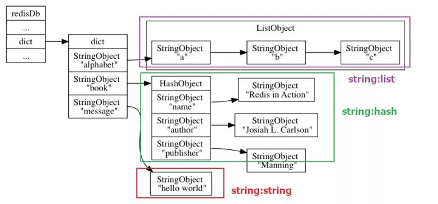

> 对 Redis 数据库的源码阅读，当前版本为 Redis 6.0 RC1，参考书籍《Redis 设计与实现》及其注释。项目地址：[github.com/wingsxdu](https://github.com/wingsxdu/redis)

在了解 Redis 的底层数据结构之后，Redis 是如何将这些碎片化的数据以键值对的形式存储在数据库中，并执行内存回收操作，Redis 数据库的实现又存在哪些特殊之处？这篇文章将会分析 Redis 数据库的实现。

## 数据结构

Redis 数据库由结构体`redisDb`表示：

```c
typedef struct redisDb {
    // 数据库键空间
    dict *dict;                 /* The keyspace for this DB */
    // 键的过期时间
    dict *expires;              /* Timeout of keys with a timeout set */
    // 正处于阻塞状态的键
    dict *blocking_keys;        /* Keys with clients waiting for data (BLPOP)*/
    // 可以解除阻塞的键
    dict *ready_keys;           /* Blocked keys that received a PUSH */
    // 正在被 WATCH 命令监视的键
    dict *watched_keys;         /* WATCHED keys for MULTI/EXEC CAS */
    // 数据库 ID 
    int id;                     /* Database ID */
    // 数据库的键的平均 TTL，统计信息
    long long avg_ttl;          /* Average TTL, just for stats */
    // 仍存活的过期键游标
    unsigned long expires_cursor; /* Cursor of the active expire cycle. */
    // 尝试进行碎片整理的键名称列表
    list *defrag_later;         /* List of key names to attempt to defrag one by one, gradually. */
} redisDb;
```

- `dict`和`expires`用于存储和销毁键；
- `blocking_keys` 和`ready_keys`用于列表的阻塞型命令；
- `watched_keys` 用于事务模块；

#### 键空间

在 redisDb 中使用一个字典来存储键空间：

- 键空间字典的 key 就是键值对的键，每一个 key 都是一个字符串对象；
- 键空间字典的 value 就是键值对的值，这个 value 可以是一个字符串对象、列表对象等对象结构。

一个数据库中的所有键值对都存储在这个巨大的字典结构中



> 图源《Redis 设计与实现》

所以一个 Redis 数据库本质上是一张巨大的哈希表，对数据库的增删改查操作也是对哈希表的增删改查操作。

#### 数据库组

Redis 服务在启动时，会创建可配置量`dbnum`个数据库，`dbnum`的默认值为 16。Redis 会为每个数据库分配 ID，当我们启动一个客户端时，会默认使用 0 号数据库。

```c
struct redisServer{
    ...
    // 当前使用的数据库
    redisDb *db;
    // 创建的数据库数量
    int dbnum;
    ...
}
```

我们可以使用 Select 命令来切换当前客户端使用的数据库，这个命令最终调用的是`selectDb`函数来执行切换步骤。

```c
int selectDb(client *c, int id) {
    if (id < 0 || id >= server.dbnum)
        return C_ERR;
    // 设置当前 client 使用的数据库
    c->db = &server.db[id];
    return C_OK;
}
```

一次性创建多个数据库是为了满足不同的实际需求，但是因为 Redis 是单进程应用程序，不论创建了多少个数据库，都是由一个主进程进行处理。

## 内存回收

Redis 作为内存型数据库，在恰当的时机对键值对进行回收可以有效减轻服务器压力。目前的回收策略有两种：**过期键删除和内存淘汰机制**，下面是对这两种方法的分析。

#### 过期键删除

在我们设置键值对时，我们可以对其设定**相对过期时间或绝对过期时间**：

- 相对过期时间：使用 EXPIRE 或 PEXPIRE 命令对键值对设置秒级或毫秒级的存活时间；
- 绝对过期时间：使用 EXPIREAT 或 EXPIREAT 命令对键值设置秒级或毫秒级的被删除时间；
- 通过 TTL 或 PTTL 命令来查看键值对秒级或毫秒级的剩余过期时间；

redisDb 的`expires`字段存储着所有设置了过期时间的键值对，当需要检查一个 key 是否过期时，会先从`expires` 中检查该 key 是否存在，如果存在，那么比较存储的时间戳是否小于当前系统的时间来判断是否过期。

Redis 对过期键的删除有两种策略：

2. **惰性删除**：当 key 被调用时检查键值对是否过期，但是会造成内存中存储大量的过期键值对，内存不友好，但是极大的减轻CPU 的负担。
3. **定期删除**：Redis 定时扫描数据库，删除其中的过期键，删除键的数量由 Redis 当前的状态决定。

###### 惰性删除

惰性删除策略是由 [db.c](https://github.com/antirez/redis/blob/unstable/src/db.c)源文件中的`expireIfNeeded()`函数实现的，Redis 每次访问键之前，都会执行这个函数，检查键是否过期，如果过期那么执行删除策略。

```c
robj *lookupKeyRead(redisDb *db, robj *key) {
    robj *val;
    expireIfNeeded(db,key);
    val = lookupKey(db,key);
    ...
    return val;
}

int expireIfNeeded(redisDb *db, robj *key) {
    // 如果键没有过期返回 0 
    if (!keyIsExpired(db,key)) return 0;
    // 如果当前节点不是主节点返回 1
    // 返回 1 并不是一个确切的信息，但作者觉得要比返回 0 更准确一些
    if (server.masterhost != NULL) return 1;
    // 将过期键的数量标记值加 1
    server.stat_expiredkeys++;
    propagateExpire(db,key,server.lazyfree_lazy_expire);
    notifyKeyspaceEvent(NOTIFY_EXPIRED,
        "expired",key,db->id);
    // 删除键
    return server.lazyfree_lazy_expire ? dbAsyncDelete(db,key) :
                                         dbSyncDelete(db,key);
}
```

###### 定期删除

定期删除策略由 [expire.c](https://github.com/antirez/redis/blob/unstable/src/db.c)源文件中的`activeExpireCycle(int type)`函数执行，这个函数会定期扫描删除数据库中已经过期的键。当带有过期时间的键比较少时，这个函数运行得比较保守，如果带有过期时间的键比较多，那么函数会以更积极的方式来删除过期键，尽可能地释放被过期键占用的内存。

这个函数有**慢循环和快循环**两种工作模式：

- 慢循环：慢循环是主要的工作模式，这种情况下以`server.hz`频率进行查询（每秒执行次数，通常为 10），但是如果慢循环执行了太长时间将会因超时而退出，
- 快循环：快循环的执行时间不会长过`EXPIRE_FAST_CYCLE_DURATION`（默任值为 1000）毫秒，并且在`EXPIRE_FAST_CYCLE_DURATION`毫秒之内不会再重新执行。如果最近一次的慢速循环因为超时被终止，那么本次快循环也会拒绝运行。除此之外，在快速循环中，一旦数据库中已过期键的数量低于给定百分比将会停止检查，以避免进行了多次的检查工作却回收了很少的内存，导致事倍功半。

Redis 的定时执行程序由`serverCron()`函数实现，每秒调用`server.hz`次，这个函数会执行各样的定时操作：

- 主动清除过期键；
- 更新软件 watchdog 信息和统计信息；
- 触发 BGSAVE 或者 AOF 重写，并处理之后由 BGSAVE 和 AOF 重写引发的子进程停止；
- 对数据库执行定时任务；
- ...

定时程序会调用`databasesCron()`函数对数据库执行过期键删除、调整大小、以及主动和渐进式 rehash 任务。

```c
void databasesCron(void) {
    // 如果服务器不是从服务器，那么执行过期键清除
    if (server.active_expire_enabled) {
        if (server.masterhost == NULL) {
            // 默认慢循环，这个模式会尽量多清除过期键
            activeExpireCycle(ACTIVE_EXPIRE_CYCLE_SLOW);
        } else {
            expireSlaveKeys();
        }
    }
    ...
}
```

总结定期删除的流程：首先创建定时执行程序，这个程序每秒执行`server.hz`次数，每次都会调用数据库定时处理程序，执行`activeExpireCycle()`函数，扫描并删除数据库中已经过期的键。这个函数有**慢循环和快循环**两种工作模式，根据场景进行切换。

###### 为什么不用定时删除？

定时删除策略，是在设置键的过期时间的同时，创建一个定时器，当定时器时间到达时执行删除操作。定时删除能保证内存中数据的最大新鲜度，因为它保证键在过期后立即被删除，其所占用的内存也会随之释放。但是**立即删除对 CPU 是最不友好的**，因为计时与删除操作会占用 CPU 时间，如果恰巧此时 CPU 很忙，比如正在做排序运算，会给 CPU 造成额外的压力。而令两种删除策略会根据 CPU 的状态决定工作量的多少，如果当前删除程序占用了过多的 CPU 资源也会终止执行，已避免延误对主要任务的处理。

除此之外，目前 Redis 的事件处理器对时间事件的处理方式使用的是无序链表，查找一个键的时间复杂度为*O(n)*，并不适合处理大量的时间事件。

#### 内存淘汰

每一个 Redis 实例都有一个内存可最大使用量`maxmemory`，为了保证 Redis 的稳定运行，当内存用量到达阈值，新的键值对将无法写入，此时就需要执行内存淘汰机制，在 Redis 的配置中有以下几种淘汰策略可以选择：

| 淘汰策略                  | 作用                                           |
| ------------------------- | ---------------------------------------------- |
| MAXMEMORY_VOLATILE_LRU    | 从设置了过期时间的键中，删除最长时间未使用的键 |
| MAXMEMORY_VOLATILE_LFU    | 从设置了过期时间的键中，删除使用频率最低的键   |
| MAXMEMORY_VOLATILE_RANDOM | 从设置了过期时间的键中，随机删除键             |
| MAXMEMORY_VOLATILE_TTL    | 从设置了过期时间的键中，删除即将过期的键       |
| MAXMEMORY_ALLKEYS_LRU：   | 从所有键中，删除最长时间未使用的键             |
| MAXMEMORY_ALLKEYS_LFU     | 从所有键中，删除使用频率最低的键               |
| MAXMEMORY_ALLKEYS_RANDOM  | 从所有键中，随机删除键                         |
| MAXMEMORY_NO_EVICTION     | 不删除键，在写操作时直接报错（默认策略）       |

Redis 会在必要的时刻执行`freeMemoryIfNeeded()`函数，尝试进行内存淘汰。淘汰过程采用了近似 LRU 算法和LFU 算法。

###### 近似 LRU 算法

Redis 中的 LRU 算法并不是真正的 LRU（Least Recently Used），Redis 对象中增加了一个额外的`lru`字段：一个24 bit 长度的时间戳，记录该对象最后一次被访问的。

```c
typedef struct redisObject {
	...
    unsigned lru:LRU_BITS; /* LRU time (relative to global lru_clock) or
                            * LFU data (least significant 8 bits frequency
                            * and most significant 16 bits access time). */
} robj;
```

Redis 在执行 LRU 算法时，会从对应的键空间中随机取出`maxmemory-samples`（默认为5）个键，淘汰其中最久未访问过的键。

为了在 24 bit 的`lru`中表示尽可能长的时间，`lru`的时间精度为 1000ms，大约可以表示 194 天。因此如果一个键超过`LRU_CLOCK_MAX`天没有被访问，在计算空闲时间的时候，可能会少算数个`LRU_CLOCK_MAX`时间周期，造成一定的误差。

```c
#define LRU_BITS 24
#define LRU_CLOCK_MAX ((1<<LRU_BITS)-1) /* Max value of obj->lru */
#define LRU_CLOCK_RESOLUTION 1000 /* LRU clock resolution in ms */
```

###### LFU 算法

为了解决近似 LRU 算法在使用过程中出现的精度问题，Redis 4.0 又引入了 LFU（Least Frequently Used）算法。例如下面这种情况，虽然 A 的 LRU 最久，但 A 的使用频率要频繁得多，合理的淘汰策略应该是淘汰B。


LFU 的信息也记录在`redisObject.lru`字段中，其中高 16 位用来记录访问时间，精度为分钟，剩余的 8 位是计数器，记录访问频率。

由于计数器只有 8bit，所能记录的最大数字为 255。为解决溢出问题，Redis 使用了基于概率的对数计数器：

1. 生成 0 到 1 之间的随机数 r；
2. 计算概率 `P = 1.0/(old_value × lfu_log_factor（默认为 10）+1)`；
3. 如果 r < P，计数器值加一。

```c
#define RAND_MAX 0x7fff
#define LFU_INIT_VAL 5
uint8_t LFULogIncr(uint8_t counter) {
    if (counter == 255) return 255;
    double r = (double)rand()/RAND_MAX;
    double baseval = counter - LFU_INIT_VAL;
    if (baseval < 0) baseval = 0;
    double p = 1.0/(baseval*server.lfu_log_factor+1);
    if (r < p) counter++;
    return counter;
}
```

通过上面的函数可以得知，计数器的值并不是随着访问量的线性增加而增加，而是一个趋近于 255 的对数曲线，而且仍然存在值溢出情况。为此 Redis 又提供了一个计数衰减，如果一个键长时间未被访问，计数器的值会减少，衰减量由衰减因子`lfu-decay-time`决定，默认值为 1。衰减的策略如下：

1. 如果一个键的空闲时间大于衰减因子`lfu-decay-time`，那么进行计数器衰减；
2. 计算`num_periods = 空闲时间/lfu_decay_time`；
3. 最终的计数器值为`counter = (num_periods > counter) ? 0 : counter - num_periods`。

```c
unsigned long LFUDecrAndReturn(robj *o) {
    unsigned long ldt = o->lru >> 8;
    unsigned long counter = o->lru & 255;
    unsigned long num_periods = server.lfu_decay_time ? LFUTimeElapsed(ldt) / server.lfu_decay_time : 0;
    if (num_periods)
        counter = (num_periods > counter) ? 0 : counter - num_periods;
    return counter;
}
```

#### Lazyfree

由于 Redis 是单进程工作模式，在使用过程中可能会因任务量过大而发生阻塞，例如使用 DEL 命令删除体积较大的键，或使用 FLUSHDB 命令删除包含大量键的数据库，都会造成阻塞。为了解决这个问题， redis 4.0 引入了 lazyfree 机制，在删除对象时只进行逻辑删除，而将真正的删除操作放在后台进程执行，尽可能避免主进程发生阻塞。

Lazyfree 的执行场景有以下三种，默认都是关闭，可以在配置文件中修改。

```c
struct redisServer{
    ...
    // 当内存达到上限后是否执行 lazyfree
    int lazyfree_lazy_eviction;
    // 是否对过期键执行 lazyfree
    int lazyfree_lazy_expire;
    // 是否对 del 命令执行 lazyfree
    int lazyfree_lazy_server_del;
    ...
}
```

###### 惰性删除中的 lazyfree

以惰性删除为例，如果开启了 lazyfree，那么过期键的删除操作将由`dbAsyncDelete()`函数执行

1. 从 expires 字典中删除过期键，但因为这个对象被数据库字典共享，因此并不会释放内存空间；
2. 从数据库字典中解除过期键的绑定，但不释放内存，这样就无法访问这个键值对；
3. 如果过期键的值较大，放在后台进程执行释放内存操作；
4. 释放第二步解绑的键值对，如果第三步执行了，只会释放键的内存。

```c
#define LAZYFREE_THRESHOLD 64
int dbAsyncDelete(redisDb *db, robj *key) {
    // 从 expires 字典中删除过期键
    if (dictSize(db->expires) > 0) dictDelete(db->expires,key->ptr);
    // 如果这个值的元素数量很少，同步释放对象
    // 从字典中解除绑定但不释放内存
    dictEntry *de = dictUnlink(db->dict,key->ptr);

    if (de) {
        // 获取值对象指针
        robj *val = dictGetVal(de);
        // 获取值对象所包含的元素个数
        size_t free_effort = lazyfreeGetFreeEffort(val);
        // 如果值对象较大
        if (free_effort > LAZYFREE_THRESHOLD && val->refcount == 1) {
            // 原子操作给 lazyfree_objects 加1，以备 info 命令查看后台进程有多少对象待删除
            atomicIncr(lazyfree_objects,1);
            // 把对象 val 丢到后台进程的任务队列中
            bioCreateBackgroundJob(BIO_LAZY_FREE,val,NULL,NULL);
            // 把字典节点的指针设置为 NULL
            dictSetVal(db->dict,de,NULL);
        }
    }
    if (de) {
        // 释放数据库字典中的键值对或只释放键
        dictFreeUnlinkedEntry(db->dict,de);
    } else {
        return 0;
    }
}
```

上述过程提到了解绑（unlink）操作，Redis 实事上也提供了 UNLINK 命令，这是 DEL 命令的非阻塞版本，实际执行步骤也是调用了上面的函数。

除此之外，对清空数据库的 FLUSHDB 和 FLUSHALL 命令添加了配置项`[ASYNC]`，表示开启一个后台进程执行清除数据库操作。

```c
void emptyDbAsync(redisDb *db) {
    dict *oldht1 = db->dict, *oldht2 = db->expires;
    db->dict = dictCreate(&dbDictType,NULL);
    db->expires = dictCreate(&keyptrDictType,NULL);
    atomicIncr(lazyfree_objects,dictSize(oldht1));
    bioCreateBackgroundJob(BIO_LAZY_FREE,NULL,oldht1,oldht2);
}
```

###### BIO_LAZY_FREE 进程

Redis 虽然是一个单进程程序，但在后台也会创建一些子进程用于处理其他任务，其中被称为`BIO_LAZY_FREE`的子进程用于执行 lazyfree 删除机制。

```c
void *bioProcessBackgroundJobs(void *arg) {
    ...
    if (type == BIO_LAZY_FREE) {
            /* What we free changes depending on what arguments are set:
             * arg1 -> free the object at pointer.
             * arg2 & arg3 -> free two dictionaries (a Redis DB).
             * only arg3 -> free the skiplist. */
            if (job->arg1)
                lazyfreeFreeObjectFromBioThread(job->arg1);
            else if (job->arg2 && job->arg3)
                lazyfreeFreeDatabaseFromBioThread(job->arg2,job->arg3);
            else if (job->arg3)
                lazyfreeFreeSlotsMapFromBioThread(job->arg3);
    }
    ...
}
```

从上面的代码中可以看出 lazyfree 的数据类型有三种，分别调用不同的函数执行删除操作：

1. 删除对象，调用`decrRefCount()`来减少对象的引用计数，引用计数为0时会真正的释放资源；
2. 空数据库字典，调用`dictRelease()`循环遍历数据库字典删除所有对象进行删除；
3. 删除 key-slots 映射表；

```c
void lazyfreeFreeObjectFromBioThread(robj *o) {
    decrRefCount(o);
    atomicDecr(lazyfree_objects,1);
}
void lazyfreeFreeDatabaseFromBioThread(dict *ht1, dict *ht2) {
    size_t numkeys = dictSize(ht1);
    dictRelease(ht1);
    dictRelease(ht2);
    atomicDecr(lazyfree_objects,numkeys);
}
void lazyfreeFreeSlotsMapFromBioThread(rax *rt) {
    size_t len = rt->numele;
    raxFree(rt);
    atomicDecr(lazyfree_objects,len);
}
```

#### 小结

Redis 现今提供的内存回收策略满足了不同的使用场景，总结分为以下几点：

- **过期健删除机制强调的是对过期健的操作**，如果有键过期而内存足够，这时会优先使用过期健删除策略删除过期健；
- **内存淘汰机制强调的是对键的淘汰操作**，当内存不足时，即使键没有到达过期时间或者根本没有设置过期时间，也可被删除来获得内存空间，保证新数据的写；
- **Lazyfree 机制强调的是对删除键的多进程处理**，将真正的删除操作放在后台进程执行。

## 列表阻塞

前文提到过，Redis 主进程可能会因为任务量过大而发生阻塞，而 Redis 的列表键却支持主动阻塞操作，即如果目标 list 没有元素，客户端操作会阻塞，直到其他客户端向 list 中增加元素。 

#### 数据结构

实现列表的阻塞操作，需要四个数据结构:

- redisDb.blocking_keys
- redisClient.bpop
- redisServer.ready_keys
- redisDb.ready_keys

**redisDb.blocking_keys**的类型是字典，key 是 Redis 的键，vaule 是一个存储着 redisClient 的列表，redisDb.blocking_keys 记录了当前的数据库中有哪些客户端在等待哪些列表键上的数据；

**redisClient.bpop**的类型是`blockingState`:

```
typedef struct blockingState {
    /* Generic fields. */
    // 阻塞时限
    mstime_t timeout;       /* Blocking operation timeout. If UNIX current time
                             * is > timeout then the operation timed out. */

    /* BLOCKED_LIST, BLOCKED_ZSET and BLOCKED_STREAM */
    // 造成阻塞的键
    dict *keys;             /* The keys we are waiting to terminate a blocking
                             * operation such as BLPOP or XREAD. Or NULL. */
    // 在被阻塞的键有新元素进入时，需要将这些新元素添加到哪里的目标键
    // 用于 BRPOPLPUSH 命令
    robj *target;           /* The key that should receive the element,
                             * for BRPOPLPUSH. */

    /* BLOCK_STREAM */
    size_t xread_count;     /* XREAD COUNT option. */
    robj *xread_group;      /* XREADGROUP group name. */
    robj *xread_consumer;   /* XREADGROUP consumer name. */
    mstime_t xread_retry_time, xread_retry_ttl;
    int xread_group_noack;

    /* BLOCKED_WAIT */
    int numreplicas;        /* Number of replicas we are waiting for ACK. */
    // 复制偏移量
    long long reploffset;   /* Replication offset to reach. */

    /* BLOCKED_MODULE */
    void *module_blocked_handle; /* RedisModuleBlockedClient structure.
                                    which is opaque for the Redis core, only
                                    handled in module.c. */
} blockingState;
```

其中`keys`字段记录了该客户端在等待哪些列表键上的数据，`timeout`字段为等待时限，`target`字段只有在 blpoprpush 命令时使用，指定被 push 的目标列表。

**redisServer.ready_keys**的类型是一个列表，记录了全局中有哪些列表上有数据了，可以响应到被阻塞在这些列表上的客户端。redisServer.ready_keys 中的元素也是一个结构体，记录了一个列表所属的键和数据库：

```
typedef struct readyList {
    redisDb *db;
    robj *key;
} readyList;
```

**redisDb.ready_keys**的类型是一个字典，key 是 Redis 的键，value 为 NULL，redisDb.ready_keys 是一个辅助数据结构，用于加速判断一个列表键是否已经在 redisServer.ready_keys 中。

#### 阻塞流程

BLPOP、BRPOP 和 BRPOPLPUSH 三个命令都可能造成客户端被阻塞，只有当这些命令被用于空列表时， 它们才会阻塞客户端。

阻塞一个客户端需要执行以下步骤：

1. 将该客户端的状态设为“正在阻塞”，设置 redisClient.bpop 中的属性；
2. 将该户端的信息记录到该客户端连接的数据库中，即添加到 redisDb.blocking_keys 中；
3. 继续维持客户端和服务器之间的网络连接，但不再向客户端传送任何信息，造成客户端阻塞。

#### 唤醒

当将新元素添加到列表键时，程序会检查这个键是否存在于前面提到的 redisDb.blocking_keys 字典中， 如果存在， 说明至少有一个客户端因为这个键而被阻塞，程序会为这个键创建一个`readyList`结构， 并将它添加到  redisServer.ready_keys 链表中。

当 Redis 的主进程将新元素添加到列表中后， 会继续调用 `handleClientsBlockedOnLists()` 函数， 这个函数执行以下操作：

1. 如果 redisServer.ready_keys 不为空，那么弹出该链表的表头元素，并取出元素中的 `readyList` 值；
2. 根据 `readyList` 值所保存的 `key` 和 `db` ，在 redisDb.blocking_keys 中查找所有因该`key` 而被阻塞的客户端（以链表的形式保存）；
3. 如果 `key` 不为空，那么从 `key` 中弹出一个元素，并弹出客户端链表的第一个客户端，然后将被弹出元素返回给被弹出客户端作为阻塞命令的返回值；
4. 根据 `readyList` 结构的属性，删除 redisDb.blocking_keys 中相应的客户端数据，取消客户端的阻塞状态；
5. 继续执行步骤 3 和 4 ，直到 `key` 没有元素可弹出，或者所有因为 `key` 而阻塞的客户端都取消阻塞为止。
6. 继续执行步骤 1 ，直到 `ready_keys` 链表里的所有 `readyList` 结构都被处理完为止。

除此之外客户端的定时程序`clientsCron()`也会调用`clientsCronHandleTimeout()`函数，检查是否有处于阻塞状态的客户端已经等待超时，如果有，则清除阻塞状态。避免客户端一直阻塞下去。

## Reference

- [Redis 过期key删除策略和内存淘汰策略](https://tianbin.org/reading/redis_memory/)
- [Redis Commands](https://redis.io/commands)
- Redis 源码注释
- 《Redis 设计与实现》

