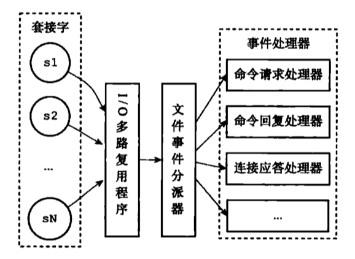

> 对 Redis 数据库的源码阅读，当前版本为 Redis 6.0 RC1。注释项目地址：[github.com](https://github.com/wingsxdu/redis)

Redis 采用事件驱动机制来处理大量的 I/O 操作，并实现了自己的事件驱动库，基于 Reactor 模式开发了自己的网络事件处理器，使用 I/O 多路复用程序监听多个 Socket，以处理大量的事件。

Redis 的事件程序处理以下两类事件：

- 文件事件：用于处理 Redis 服务器和客户端之间的网络 I/O，实现对客户端的响应；
- 时间事件：处理 Redis 服务中的一些定时操作，例如`serverCron`、`clientCron`定时程序。

事件驱动库的实现主要在[ae.c](https://github.com/antirez/redis/blob/unstable/src/ae.c)源文件中，感兴趣的读者也可以阅读一下。

## 事件模型

#### Reactor 模式

Redis 的文件事件处理器是基于 [Reactor 模式](https://en.wikipedia.org/wiki/Reactor_pattern) 实现的，每一个网络连接都对应一个文件描述符（FD），事件处理器使用 I/O 多路复用程序，同时监听多个 FD，实现了同时对多个 FD 读写的监控，提高了网络通信模型的性能。当 `accept`、`read`、`write` 和 `close` 文件事件发生时，就会调用对应的事件处理器进行处理。

虽然文件事件可能是并发发生的，但是 I/O 多路复用程序会将所有的事件放到执行队列里，并由事件分派器分派给对应的事件处理器（执行函数）。保证了 Redis 服务以单线程的方式运行。



#### I/O 多路复用

Redis 是以单线程模式运行的，所有的操作都是线性顺序执行，但是 I/O 操作往往阻塞性的，**这可能会导致某个客户端的 I/O 阻塞使得 Redis 程序无法对其它客户端继续提供服务**，因此 Redis 事件使用 I/O 多路复用来解决这个问题。

Redis 基于 I/O 多路复用实现了一个简单的事件驱动库，这个库实际上是对不同系统平台下的 I/O 复用函数进行了包装，Redis 会优先选择时间复杂度为 *O(1)* 的复用函数作为底层实现，包括 Solaries 10 中的 `evport`、Linux 中的 `epoll` 和 macOS/FreeBSD 中的 `kqueue`，它们都使用内部内核空间内存结构，能够服务数十万的文件描述符。

如果没有上述函数，Redis 会选择使用跨平台的 `select` 函数，但`select`只能服务 1024 个描述符，而且每次调用 `select`都需要把 FD 集合从用户态拷贝到内核态，同时在内核遍历传递进来的所有 FD，所以复杂度为 *O(n)*，这个开销在 FD 很多时会很大，性能损失较大。

```c
#ifdef HAVE_EVPORT
#include "ae_evport.c"
#else
    #ifdef HAVE_EPOLL
    #include "ae_epoll.c"
    #else
        #ifdef HAVE_KQUEUE
        #include "ae_kqueue.c"
        #else
        #include "ae_select.c"
        #endif
    #endif
#endif
```

以 Linux 中的 `epoll` 为例，查看事件驱动库是如何对 I/O 复用函数进行封装的。

创建一个新的`epoll`实例，是对 `epoll.epoll_create()` 进行封装：

```c
static int aeApiCreate(aeEventLoop *eventLoop) {
    aeApiState *state = zmalloc(sizeof(aeApiState));

    if (!state) return -1;
    // 初始化事件槽空间
    state->events = zmalloc(sizeof(struct epoll_event)*eventLoop->setsize);
    if (!state->events) {
        zfree(state);
        return -1;
    }
    // 创建 epoll 实例
    state->epfd = epoll_create(1024); /* 1024 is just a hint for the kernel */
    if (state->epfd == -1) {
        zfree(state->events);
        zfree(state);
        return -1;
    }
    // 赋值给 eventLoop
    eventLoop->apidata = state;
    return 0;
}
```

向`eventLoop`中添加或删除需要监控的 FD 以及监听的事件，都是对 `epoll.epoll_ctl()` 进行封装：

```c
static int aeApiAddEvent(aeEventLoop *eventLoop, int fd, int mask) {
    aeApiState *state = eventLoop->apidata;
    struct epoll_event ee = {0}; /* avoid valgrind warning */
    int op = eventLoop->events[fd].mask == AE_NONE ?
            EPOLL_CTL_ADD : EPOLL_CTL_MOD;

    ee.events = 0;
    mask |= eventLoop->events[fd].mask; /* Merge old events */
    if (mask & AE_READABLE) ee.events |= EPOLLIN;
    if (mask & AE_WRITABLE) ee.events |= EPOLLOUT;
    ee.data.fd = fd;
    if (epoll_ctl(state->epfd,op,fd,&ee) == -1) return -1;
    return 0;
}
static void aeApiDelEvent(aeEventLoop *eventLoop, int fd, int delmask) {
    aeApiState *state = eventLoop->apidata;
    struct epoll_event ee = {0}; /* avoid valgrind warning */
    int mask = eventLoop->events[fd].mask & (~delmask);

    ee.events = 0;
    if (mask & AE_READABLE) ee.events |= EPOLLIN;
    if (mask & AE_WRITABLE) ee.events |= EPOLLOUT;
    ee.data.fd = fd;
    if (mask != AE_NONE) {
        epoll_ctl(state->epfd,EPOLL_CTL_MOD,fd,&ee);
    } else {
        epoll_ctl(state->epfd,EPOLL_CTL_DEL,fd,&ee);
    }
}
```

获取可执行事件，是对 `epoll.epoll_wait()`进行封装：

```c
static int aeApiPoll(aeEventLoop *eventLoop, struct timeval *tvp) {
    aeApiState *state = eventLoop->apidata;
    int retval, numevents = 0;

    retval = epoll_wait(state->epfd,state->events,eventLoop->setsize,
            tvp ? (tvp->tv_sec*1000 + tvp->tv_usec/1000) : -1);
	...
}
```

通俗地将，Redis 在不同操作系统平台上，充分利用了内核提供的函数，以达成性能优化，并简化了自身实现。

#### 事件分发器

Redis 的事件分派器 `aeProcessEvents` 会检查是否有事件需要执行，将文件事件和时间事件分发给对应的事件处理器，分派器会根据传入的`flags`执行不同的处理不同的事件：

- 如果 flags 为 0，那么函数执行任何操作，直接返回；
- 如果 flags 包含`AE_ALL_EVENTS`，那么所有类型的事件都会被处理；
- 如果 flags 包含`AE_FILE_EVENTS`，那么处理文件事件；
- 如果 flags 包含`AE_TIME_EVENTS`，那么处理时间事件；
- 如果 flags 包含`AE_DONT_WAIT`，那么函数在处理完所有不许阻塞的事件之后，立即返回；
- 如果 flags 包含`AE_CALL_AFTER_SLEEP`，将会调用`aftersleep`函数。

如果需要同时处理两种事件，**`aeProcessEvents` 会先计算最近的时间事件发生所需要等待的时间**，然后调用 `aeApiPoll` 方法等待时间事件的发生，如果在这段时间中有文件事件需要处理，就会优先处理文件事件，否则就会一直等待，直到最近的时间事件触发。

如果被分派的是时间事件，将会调用子函数`processTimeEvents()`对时间事件进行处理。

如果被分派的是文件事件，事件分派器 `aeProcessEvents` 会根据被监听的文件事件的类型掩码`mask`将其分发给读/写事件处理器，确保读/写事件只能执行其中一个。

```c
            if (!invert && fe->mask & mask & AE_READABLE) {
                fe->rfileProc(eventLoop,fd,fe->clientData,mask);
                fired++;
            }
            if (fe->mask & mask & AE_WRITABLE) {
                if (!fired || fe->wfileProc != fe->rfileProc) {
                    fe->wfileProc(eventLoop,fd,fe->clientData,mask);
                    fired++;
                }
            }
```

## 事件的执行

#### 文件事件

文件事件是 Redis 能够响应客户端的基石，命令的执行也依赖于此，一个文件时间的数据结构定义如下：

```c
typedef struct aeFileEvent {
    // 监听事件类型掩码
    int mask; /* one of AE_(READABLE|WRITABLE|BARRIER) */
    // 读事件处理器
    aeFileProc *rfileProc;
    // 写事件处理器
    aeFileProc *wfileProc;
    // 多路复用库的私有数据
    void *clientData;
} aeFileEvent;
```

函数`aeCreateFileEvent()`会创建一个文件事件，将该事件注册到 I/O 多路复用程序中。例如我们需要从主服务器同步数据时，会发起一个 socekt 连接，然后调用`aeCreateFileEvent`函数注册对应的事件处理器，将`syncWithMaster`函数添加到读事件处理器中。

```c
int aeCreateFileEvent(aeEventLoop *eventLoop, int fd, int mask,
        aeFileProc *proc, void *clientData)
{
    if (fd >= eventLoop->setsize) {
        errno = ERANGE;
        return AE_ERR;
    }
    aeFileEvent *fe = &eventLoop->events[fd];

    // 将该事件注册到 I/O 多路复用程序中
    if (aeApiAddEvent(eventLoop, fd, mask) == -1)
        return AE_ERR;
    fe->mask |= mask;
    if (mask & AE_READABLE) fe->rfileProc = proc;
    if (mask & AE_WRITABLE) fe->wfileProc = proc;
    fe->clientData = clientData;
    if (fd > eventLoop->maxfd)
        eventLoop->maxfd = fd;
    return AE_OK;
}

// 注册同步事件
aeCreateFileEvent(server.el,fd,AE_READABLE|AE_WRITABLE,syncWithMaster,NULL);
```

当这个同步事件满足条件时，就会由事件分派器处理交给读事件处理器处理，执行数据同步操作。

#### 时间事件

Reids 有很多操作需要定时进行处理，时间事件就是对这类定时任务的抽象。时间事件的数据结构是一个双向链表，便于遍历：

```c
typedef struct aeTimeEvent {
    // 时间事件的唯一标识符
    long long id; /* time event identifier. */
    // 事件的到达时间
    long when_sec; /* seconds */
    long when_ms; /* milliseconds */
    // 事件处理函数
    aeTimeProc *timeProc;
    // 事件释放函数
    aeEventFinalizerProc *finalizerProc;
    // 多路复用库的私有数据
    void *clientData;
    // 指向上/下个时间事件结构，形成链表
    struct aeTimeEvent *prev;
    struct aeTimeEvent *next;
} aeTimeEvent;
```

Redis 的时间事件分为以下两类：

- 定时事件：在指定的时间执行一次；
- 周期性事件：每隔指定的时间间隔就执行一次。

时间的处理由`processTimeEvents()`函数执行，流程如下：

1. 记录最新一次执行这个函数的时间，防止系统时间被修改产生事件处理混乱问题；

   ```c
       if (now < eventLoop->lastTime) {
           te = eventLoop->timeEventHead;
           while(te) {
               te->when_sec = 0;
               te = te->next;
           }
       }
       // 更新最后一次处理时间事件的时间
       eventLoop->lastTime = now;
   ```

2. 遍历链表找出所有`when_sec`和`when_ms`小于现在时间的事件，执行事件对应的处理函数；

3. 检查事件类型，如果是周期事件则刷新该事件下一次的执行事件，否则从列表中删除事件。

```c
        aeGetTime(&now_sec, &now_ms);
        // 如果当前时间等于或等于事件的执行时间，那么说明事件已到达，执行这个事件
        if (now_sec > te->when_sec ||
            (now_sec == te->when_sec && now_ms >= te->when_ms))
        {
            int retval;
            id = te->id;
            // 执行事件处理器，并获取返回值
            retval = te->timeProc(eventLoop, id, te->clientData);
            processed++;
            // 是否需要循环执行这个事件时间
            if (retval != AE_NOMORE) {
                // 需要， retval 毫秒之后继续执行这个时间事件
                aeAddMillisecondsToNow(retval,&te->when_sec,&te->when_ms);
            } else {
                // 不需要，将这个事件删除
                te->id = AE_DELETED_EVENT_ID;
            }
        }
```

#### 循环检查

当我们创建一个 Redis 实例，执行各种初始化任务之后，`main`函数就会调用`aeMain()`函数，执行事件处理器的主循环。

```c
int main(int argc, char **argv) {
    ...
    aeMain(server.el);
}
void aeMain(aeEventLoop *eventLoop) {
    eventLoop->stop = 0;
    while (!eventLoop->stop) {
        if (eventLoop->beforesleep != NULL)
            eventLoop->beforesleep(eventLoop);
        aeProcessEvents(eventLoop, AE_ALL_EVENTS|AE_CALL_AFTER_SLEEP);
    }
}
```

`aeMain` 函数会陷入 `while` 循环，不断执行`aeProcessEvents`检查是否有触发的事件需要执行，这就使得 Redis 能够及时调用资源处理任务，而不会发生有事件需要处理而程序却无动于衷的情况，使得 Redis 即使是单线程执行的程序仍然保证了高性能。

## 总结

Redis 的事件实现使用了 Reactor 模式、I/O 多路复用、循环检查等策略，充分利用了系统提供的 API，简化了自身实现。虽然事件的执行仍然是串行的，但上述策略使得 Redis 在单线程模式下仍然保持了高性能，

## Reference

- [select，epoll，kqueue和evport之间的根本区别是什么？](http://cn.voidcc.com/question/p-xzwynlov-qa.html)
- [Linux I/O多路复用](http://blog.chinaunix.net/uid-31429544-id-5762602.html)
- [Redis 和 I/O 多路复用](https://draveness.me/redis-io-multiplexing)
- [Redis 中的事件驱动模型](https://www.xilidou.com/2018/03/22/redis-event/)
- 《Redis 设计与实现》