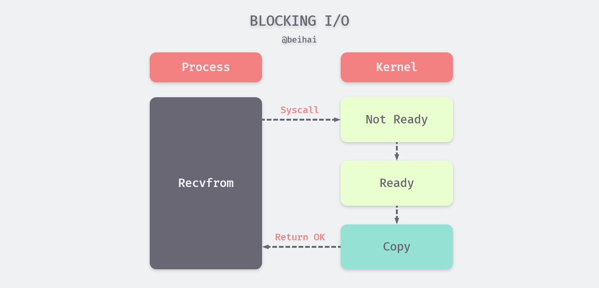

> 对 Redis 数据库的源码阅读，当前版本为 Redis 6.0 RC1，参考书籍《Redis 设计与实现》及其注释。项目地址：[github.com/wingsxdu](https://github.com/wingsxdu/redis)

Redis 一直以高性能著称，然而 Redis 却是以单线程运行的，这通常与人们的认知相悖。那么 Redis 采用了哪些机制来保证巨大的处理量需求？如何在“单线程”下实现高性能，这是这篇文章主要探讨的问题。

标题中“单线程”一词加了引号，这是因为 Redis 的单线程指的是处理网络请求模块使用了一个线程，Redis 采用了线程封闭概念，把任务封闭在一个线程中，避免了多线程安全问题，但其他模块仍用了多个线程。除此之外，Redis 还采用了 I/O 复用模型，更高效地处理客户端的网络请求。

## 单线程优势

使用多线程往往可以获得更大的吞吐率和更短的响应时间，但是，使用多线程不一定比单线程程序快。CPU 在一个时间片内只执行一个线程，当内核线程切换时，需要保存线程 A 的执行上下文，然后加载线程 B 的执行上下文，其中涉及的寄存器包括：

> 16 general purpose registers, PC (Program Counter), SP (Stack Pointer), segment registers, 16 XMM registers, FP coprocessor state, 16 AVX registers, all MSRs etc.

可以看出线程进行上下文切换的开销并不低，如果没有必要，应该尽量减少上下文切换的发生。而且采用多线程往往使得设计更复杂，在访问共享数据时，需要我们更小心地处理——对数据加锁，对 Redis 来说并不是一个划算的选择。

另一方面，Redis 的绝大部分请求是纯粹的内存操作，这一过程非常快速，CPU 并不会成为性能瓶颈，即使采用单线程一台实例每秒也可以处理数万的数据请求。如果有更高的并发量需求，Redis 还支持集群部署，在一台或多台服务器上启动多个实例，分摊访问压力。

因为 Redis 并不是 CPU 密集型的程序，采用单线程足以满足运算需求，避免了不必要的上下文切换和数据竞争，运行也更加稳定。既然性能足够，就无需过度设计引入多线程。

## I/O 复用

类 Unix 系统中包含五种可用的 I/O 模型，分别是：阻塞 I/O、非阻塞 I/O、I/O 复用、信号 I/O 与异步 I/O。在操作系统中，内核用文件描述符（File Descriptor，FD）标识一个特定进程正在访问的文件或其他 I/O 资源，例如网络套接字，不同的 I/O 模型都利用 FD 对文件进行读写。

在 Redis 中，当客户端发起通信时，服务端对数据的接受通常包括两个不同的阶段：

1. 等待数据从网络中达到，当等待分组到达时，它将会被复制到内核中的某个缓冲区；
2. 将数据从内核缓冲区复制到应用进程缓冲区中。

上述五种 I/O 模型中，前四种被称为同步 I/O，它们的区别在于第一阶段中进程在等待数据到达过程中的状态，在第二阶段中，进程都会因数据复制而发生阻塞。下面对这四种进行简单介绍。

#### 阻塞 I/O

阻塞 I/O 是最流行的 I/O 模型，默认情形下，对 FD 的读写都是阻塞的，当进程调用`read`或者`recvfrom`等系统调用读写 FD 时，应用进程可能会因此阻塞。如下图所示，应用程序会从用户态切换到内核态，内核检查对应的文件描述符是否准备就绪，当操作系统内核将数据复制给应用进程后，再从内核态切换到用户态，应用进程继续执行。

由于线程的执行过程是线性的，当我们对阻塞 I/O 调用`recvfrom`时，进程就会陷入等待直到 I/O 操作结束，在这期间不能执行其他操作。

#### 非阻塞 I/O

当进程把一个进程描述符设置成非阻塞时，执行`recvfrom`等 I/O 操作时内核会立即返回。如果套接字还未准备就绪，内核会返回一个`EWOULDBLOCK`错误，由于进程未接收到数据，它会发起轮询操作，不断调用 I/O 函数，直至数据报准备好并被复制到进程缓冲区，内核返回成功指示。

进程使用非阻塞 I/O 时，可以在等待期间执行其它的任务，以提高 CPU 的利用率。但是应用进程会持续轮询内核以查看某个 FD 是否就绪，这个操作会消耗一定的 CPU 资源。

#### I/O 复用

I/O 复用时 Redis 采用的 I/O 模型，可以用来处理同一个事件循环中的多个 I/O。I/O 多路复用需要执行特定的系统调用，其中最常见的就是`select`，该函数最多可以同时监听 1024 个文件描述符。在 Redis 中，除了实现跨平台的`select`函数外，会根据不同的系统平台优先选择更高效的复用函数作为底层实现，包括 Solaries 10 中的 `evport`、Linux 中的 `epoll` 和 macOS/FreeBSD 中的 `kqueue`，它们能够服务数十万的文件描述符。

以`select`为例，调用 I/O 复用函数后，进程会阻塞在该函数上，监听多个文件描述符。当`select`返回 FD 可读时，进程再调用`recvfrom`把对应的数据报复制到应用进程缓冲区。

当我们处理单个文件描述符时，采用 I/O 复用还稍有一定的劣势，因为需要两个系统调用而其它模型只需要一个。当需要处理的 I/O 事件越多时，其性能优势也越明显。

#### 信号 I/O

当进程使用信号时，进程会通过`sigaction`系统调用通知内核执行一个信号处理函数，该系统调用会立即返回，进程可以继续处理其它任务。当数据报准备好时，内核会向该进程发送一个`SIGIO`信号，进程随后调用`recvfrom`把数据报复制到应用进程缓冲区。

与非阻塞 I/O 类似，信号 I/O 可以在等待期间执行其它的任务，而且不用发起轮询操作，由内核通知进程对数据进行处理。

#### 小结

Redis 通常每秒需要处理数万的数据请求，因此选择高效的 I/O 复用函数（如`epoll` ）减少不必要的开销，处理多个任务时也不会发生阻塞，以此支撑大量的网络请求。

## 耗时任务处理

Redis 是一个事件驱动的程序，将客户端命令、定时任务抽象为事件，交由对应的事件处理器执行。通常事件的处理全部在一个线程内顺序执行，没有其他的线程参与。但如前文所说，在某些情况下，Redis 可能会创建新的线程（进程）：

- Redis 在生成 RDB 快照时会`fork`出一个子进程将内存数据写入磁盘；
- Redis4.0 中引入`UNLINK`命令，当使用`UNLINK`命令删除的键较大时，Redis 会将 key 从键空间中删除，而 value 的删除则交由后台线程异步处理；
- Redis6.0 加入多线程 I/O，I/O 线程负责数据读写与解析 ，主线程负责命令的具体执行。

Redis 一直在优化多任务处理能力，以充分利用多核处理器。从上面的举例可以看出，Redis 主要针对一些耗时操作进行多线程优化，如数据备份、大键值对（如十几MB的哈希表）删除、I/O 事件处理，减轻主线程的计算压力。这些被排出主线程的的操作对客户端命令的执行几乎没有影响，不会产生数据竞争的情况。

## 总结

Redis 充分利用了很多操作系统提供的特性，这使得自身的设计与实现并不复杂，性能强大也便于二次开发。可以看出项目的作者对操作系统有着很深入的理解，并擅于运用工程手段解决问题，Redis 中采取的策略概括如下：

- 将耗时任务交给后台线程处理；
- CPU 并不是主线程的性能瓶颈，即使采用单线程也足以应对；
- 使用 I/O 复用处理 I/O 密集型任务。

这些策略为程序设计提供了良好的思路，灵活运用可以在性能优化中发挥良好的作用。

## Reference

- 《UNIX 环境网络编程》
- [linux五种IO模型](https://juejin.im/post/5c725dbe51882575e37ef9ed)
- [正式支持多线程！Redis 6.0 与老版性能对比评测](https://www.chainnews.com/articles/610212461536.htm)