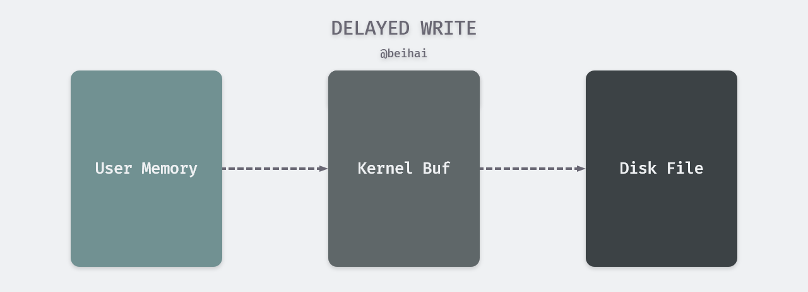
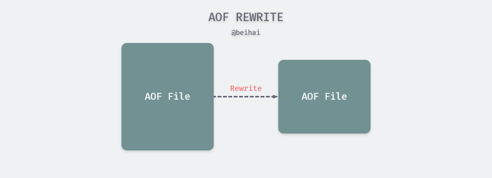

> 对 Redis 数据库的源码阅读，当前版本为 Redis 6.0 RC1，参考书籍《Redis 设计与实现》及其注释。项目地址：[github.com/wingsxdu](https://github.com/wingsxdu/redis)

Redis 是内存数据库，将数据保存在内存中，以换取更快的读取速度。但由于内存是易失性存储器，一旦进程退出或者硬件设备出现故障，Redis 存储的数据可能就会丢失。为了解决数据持久化问题，Redis 提供了 RDB 快照与 AOF 写操作记录两种方案，这篇文章就这两种分案的实现方式进行分析。

所谓的持久化，就是将某个时间点的服务器数据备份到磁盘文件中，当程序退出或服务器停机后，在下次重启时利用之前持久化的文件即可实现数据恢复。一般有三种常见的策略来执行持久化操作，防止数据丢失：

- 方法1：设置备份文件或快照，在设备故障后通过数据备份或者快照进行恢复；
- 方法2：使用独立日志，记录数据库的操作行为，以便在故障后通过日志恢复到一致性的状态，因为日志是以顺序追加的方式写的，所以不会出现日志损坏的情况；
- 方法3：数据库不进行老数据的修改，以追加方式完成写操作，数据本身就是一份日志。

前两种策略就是 Redis 中的 RDB 与 AOF 持久化，至于第三种方案对 Redis 并不使用，一是 Redis 常用在大量读写操作的缓冲场景中，以追加的方式修改数据，会占用大量的内存空间，二是第三种方案并没有将数据备份到磁盘上，一旦设备发生故障，仍然会造成数据丢失。

## 磁盘同步

传统的 UNIX 或 Linux 系统在内核中设有多个缓冲区，分为高速缓存或页面高速缓存，大多数磁盘 I/O 都通过缓冲进行。当将数据写入文件时，内核通常先将该数据复制到一个缓冲区中，如果该缓冲区尚未写满，那么并不会将其排入输出队列，而是等待缓冲区写满或者当空闲内存不足内核需要重用该缓冲区以便存放其他磁盘块数据时，再将该缓冲排入输出队列。当这个缓冲区到达输出队列的队首时，才进行实际的 I/O 操作。这种输出方式被称为延迟写（delayed write）。



#### 延迟写

当我们调用`write()`函数写出数据时，函数将数据写入到内核的缓冲区中后（仅仅是写到缓冲区），函数便立即返回。由于操作系统的设计，对于调用者来说，数据已经写入文件了，能够被其它进程读到，可是并不意味着它们已经被写到了外部永久存储介质上，即使调用`close()`函数关闭文件后也可能如此，因为缓冲区的数据可能还在等待输出。

从硬件层次看，用`write()`函数写出的数据并非是同步写入磁盘中，**数据的写入由专门的`flusher`内核线程在满足一定条件时（如一定时间间隔、内存中的脏页达到一定比例）执行**。这个异步操作的时间间隔取决于操作系统的缓冲刷新时间，Linux 内核通常为 30s，具体值取决于写出的数据量和 I/O 缓冲区的状态。这个时间间隔对于某些场景来讲确实是较长的，例如 Redis 持久化，如果数据在内核缓冲区中时服务器发生故障，秒级的数据丢失可能是无法丢失的。

> 将内核缓冲区中的数据“写”入磁盘文件，这里的“写”不是将缓冲区中的数据移动到磁盘文件，而是复制到磁盘文件，也就说此时缓冲区内容还没有被清除。做出这一设计也是有其道理的，假设写出到磁盘文件上，磁盘坏了或满了等等，如果缓冲区内容被清除，数据会生丢失。内核会等待写入磁盘操作完成后，才会将缓冲区的数据删除。

延迟写减少了磁盘写次数，但是却降低了文件内容的更新速度，为了保证磁盘实际文件系统与缓冲区高速缓存中内容的一致性，UNIX 系统提供了`sync()`、`fsync()`和`fdatasync()`三个系统调用，用于刷新内核中的缓冲区，这里简单介绍 Redis 用到的`fsync`函数。

`fsync()`系统调用只对由文件描述符 fd 指定的单一文件起作用，立即将该文件的块缓冲区加入输出队列，并且等待`flusher`内核线程将该缓冲区写入磁盘操作结束，然后再返回。

`fsync()`不仅会同步更新文件数据，还会同步更新文件的属性（atime、mtime 等），常用于数据库应用程序，因为这类软件需要确保将修改过的缓冲块立即写到磁盘上。

简单理解，调用`write()`系统调用将数据写入内核缓冲区，而`*sync`函数将缓冲区排到输出队列中，再由守护进程负责把队列中的缓冲区写到磁盘上。

#### 持久化流程

Reids 作者 antirez 在 [Redis persistence demystified](http://antirez.com/post/redis-persistence-demystified.html) 一文中简单概述了 Redis 持久化的流程：

1. 客户端向数据库发送写命令（数据在客户端的内存中）
2. 数据库接收到写命令（数据在服务端内存中）
3. 数据库调用`write()`系统调用，将数据往磁盘上写（数据在系统内核缓冲区中）
4. 操作系统将数据传输到磁盘控制器（数据在磁盘缓存上）
5. 磁盘控制器将数据写到物理介质中

通过上一小结的概括，可以了解到`write()`系统调用可以控制第 3 步，`fsync`系统调用可以控制第 4 步，但第 5 步则取决于磁盘硬件，我们已经无法操控。


如果我们考虑的故障只涉及到数据库软件层面而不涉及到操作系统内核（如数据库进程被 kill 或崩溃），步骤 3 成功返回后就可以认为写操作是安全的。在`write()`系统调用返回后，数据被传输到内核，即使数据库进程崩溃，内核也会将数据写到磁盘。如果考虑到突然停电或者更加灾难性的情况，所有缓存都已经失效，那么只有第 5 步骤完成后才可以认为写操作是安全的。

了解了延迟写与持久化流程之后，我们再来分析 Redis 的持久化方式。

## RDB 快照

RDB（Redis DataBase）是一种快照存储持久化方式，将 Redis 某一时刻的内存数据保存到磁盘的文件中，默认的文件名为`dump.rdb`。当 Redis 服务器启动时，会重新加载`dump.rdb`文件的数据到内存当中恢复数据。

启动 RDB 快照备份的方式有两种，一种是客户端向服务端发送 执行RDB命令手动开启备份，另一种是设置触发 RDB 快照的条件，程序自动检查是否需要备份。

无论是哪种备份方式，RDB 的备份流程都如下：

1. 将内存数据写入到临时 rdb 文件；
2. 数据写入完成，用临时文代替代原正式 rdb 文件；
3. 删除原来的 rdb 文件。

#### 数据结构

由于有关 RDB 快照的结构定义比较庞杂，涉及 RDB 的状态、管道通信、子进程信息等，下面只列举出了比较主要的变量定义：

```c
struct redisServer {
    /* RDB persistence */
    long long dirty;                /* Changes to DB from the last save */
    long long dirty_before_bgsave;  /* Used to restore dirty on failed BGSAVE */
    pid_t rdb_child_pid;            /* PID of RDB saving child */
    struct saveparam *saveparams;   /* Save points array for RDB */
    int saveparamslen;              /* Number of saving points */
    time_t rdb_save_time_last;      /* Time used by last RDB save run. */
    int rdb_bgsave_scheduled;       /* BGSAVE when possible if true. */
    int lastbgsave_status;          /* C_OK or C_ERR */
}
```

#### 手动触发

有两种情况可以触发手动备份，一种是执行 Redis 程序命令（不是强制杀死进程），这时程序会执行 RDB 快照备份，以便下次启动 Redis 时加载数据。另一种是客户端向服务端发送`SAVE`或`BGSAVE`命令，这两个命令的**区别在于`SAVE`命令使用 Redis 的主进程进行备份**，这会导致 Redis 服务器阻塞，客户端发送的所有命令请求都会被拒绝，直到 RDB 文件创建完毕。**而`BGSAVE`命令会 fork 出一个子进程执行 I/O 写入操作**，在这期间主进程仍然可以处理命令请求。需要注意的是，子进程快照备份的数据为它被创建时的数据状态，在执行备份期间添加、修改、删除的数据并不会被备份。

这两个命令最终都会调用`rdbSave()`函数将数据库保存到磁盘上，并且执行`write`之后立即执行`fsync`，避免数据遗留在内核缓冲区中。

```c
int rdbSave(char *filename, rdbSaveInfo *rsi) {
    rioInitWithFile(&rdb,fp);
    // 开始备份
    startSaving(RDBFLAGS_NONE);
    
    if (server.rdb_save_incremental_fsync)
        rioSetAutoSync(&rdb,REDIS_AUTOSYNC_BYTES);

    if (rdbSaveRio(&rdb,&error,RDBFLAGS_NONE,rsi) == C_ERR) {
        errno = error;
        goto werr;
    }
    if (fflush(fp) == EOF) goto werr;
    if (fsync(fileno(fp)) == -1) goto werr;
    if (fclose(fp) == EOF) goto werr;
}
```

如果执行的是是`BGSAVE`命令，Redis 会将子进程 ID 保存在`redisServer.rdb_child_pid`中，当`BGSAVE`命令执行完成后，会将该属性设置为 -1，用于判断是否有子进程在执行任务。

Redis 处于性能与避免并发问题的考虑，在执行 RDB 命令时会检查当前服务端的状态，在`BGSAVE`命令期间，不允许再执行任何持久化操作，AOF 命令也会被延迟到 RDB 快照完成之后执行，以避免多个进程进行大量写入操作引发冲突。除此之外，在 `BGSAVE`（以及 AOF 与 MODULE 相关命令）执行前程序会检查是否有其他子进程正在运行，如果有会终止执行并返回错误。

```c
int rdbSaveBackground(char *filename, rdbSaveInfo *rsi) {
    if (hasActiveChildProcess()) return C_ERR;
    ...
}

int hasActiveChildProcess() {
    return server.rdb_child_pid != -1 ||
           server.aof_child_pid != -1 ||
           server.module_child_pid != -1;
}
```

#### 自动触发

除了让客户端发送命令手动触发备份之外，Redis 也提供了自动间隔 RDB 备份功能，我们可以通过`save <seconds> <changes>  `命令设置一个或多个触发条件，表示在`seconds`秒内，如果发生了至少`changes`次数据变化，就会自动触发`bgsave`命令。

触发条件保存在`redisServer.saveparams`中，使用结构体`saveparam`表示：

```c
struct saveparam {
    time_t seconds;
    int changes;
};
```

Redis 还持有一个`redisServer.dirty`计数器，保存着自上次成功执行 RDB 以来，数据库被修改的次数，以及`redisServer.lastsave`，记录上次成功执行 RDB 的时间。在服务端的周期函数中`serverCron()`会周期性检查当前是否有子进程在执行持久化任务，如果没有则会检查是否需要执行 RDB 或 AOF 持久化。

```c
int serverCron(struct aeEventLoop *eventLoop, long long id, void *clientData) {
    if (hasActiveChildProcess() || ldbPendingChildren())
    {
        // 是否有子进程完成任务
        checkChildrenDone();
    } else {
         // 遍历所有保存条件，检查是否需要执行 BGSAVE 命令
        for (j = 0; j < server.saveparamslen; j++) {
            struct saveparam *sp = server.saveparams+j;
            if (server.dirty >= sp->changes &&
                server.unixtime-server.lastsave > sp->seconds &&
                (server.unixtime-server.lastbgsave_try >
                 CONFIG_BGSAVE_RETRY_DELAY ||
                 server.lastbgsave_status == C_OK))
            {
                serverLog(LL_NOTICE,"%d changes in %d seconds. Saving...",
                    sp->changes, (int)sp->seconds);
                rdbSaveInfo rsi, *rsiptr;
                rsiptr = rdbPopulateSaveInfo(&rsi);
                rdbSaveBackground(server.rdb_filename,rsiptr);
                break;
            }
        }

        // 是否需要执行 AOF
        if (server.aof_state == AOF_ON &&
            !hasActiveChildProcess() &&
            server.aof_rewrite_perc &&
            server.aof_current_size > server.aof_rewrite_min_size)
        {
            long long base = server.aof_rewrite_base_size ?
                server.aof_rewrite_base_size : 1;
            long long growth = (server.aof_current_size*100/base) - 100;
            if (growth >= server.aof_rewrite_perc) {
                serverLog(LL_NOTICE,"Starting automatic rewriting of AOF on %lld%% growth",growth);
                rewriteAppendOnlyFileBackground();
            }
        }
    }
}
```

这部分也贴出了执行 AOF 的代码，详细流程会在下面介绍。

## AOF 日志

AOF 是一种 Append Only File 的持久化方案，以追加独立日志的方式记录每次修改数据库命令， AOF 文件是以 Redis RESP 通信协议的格式保存的，以便进行 AOF 数据恢复。例如执行以下命令：

```shell
redis 127.0.0.1:6379> set key1 Hello
OK
redis 127.0.0.1:6379> append key1 " World!"
(integer) 12
redis 127.0.0.1:6379> del key1
(integer) 1
redis 127.0.0.1:6379> del non_existing_key
(integer) 0
```

其中前 3 个命令更改了数据库，而第 4 个命令则没有，因为数据库中并不存在这个键。生成的 AOF 日志如下：

```shell
$ cat appendonly.aof 
*2$6SELECT$10*3$3set$4key1$5Hello*3$6append$4key1$7 World!*2$3del$4key1
```

可以看出最后一个删除命令并没有被记录，避免不必要的 I/O 写操作影响性能。

#### 数据结构

与 AOF 相关的变量也很多，这里也选择了一些主要的：

```c
struct redisServer {
    /* AOF persistence */
    int aof_state;                  /* AOF_(ON|OFF|WAIT_REWRITE) */
    int aof_fsync;                  /* Kind of fsync() policy */
    int aof_no_fsync_on_rewrite;    /* Don't fsync if a rewrite is in prog. */
    int aof_rewrite_perc;           /* Rewrite AOF if % growth is > M and... */
    off_t aof_rewrite_min_size;     /* the AOF file is at least N bytes. */
    off_t aof_fsync_offset;         /* AOF offset which is already synced to disk. */
    pid_t aof_child_pid;            /* PID if rewriting process */
    sds aof_buf;      /* AOF buffer, written before entering the event loop */
    int aof_fd;       /* File descriptor of currently selected AOF file */
    // 指示是否需要每写入一定量的数据，就主动执行一次 fsync()
    int aof_rewrite_incremental_fsync;/* fsync incrementally while aof rewriting? */
    int rdb_save_incremental_fsync;   /* fsync incrementally while rdb saving? */
}
```

AOF 功能提供了三种`aof_fsync`策略，以不同的时间频率执行日志记录功能，Redis 在进入事件循环之前，都会将命令与参数添加到缓冲区`redisServer.aof_buf`中。根据 fsync 策略的不同，缓冲区的大小也会发生变动：

- **always**：Redis 在每个事件循环中都会调用`write()`系统调用将 AOF 缓冲区中的所有内容写入到内核缓存，并且立即调用`fsync()`系统调用同步 AOF 文件。always 的效率是三种策略中最差的一个，但也是最安全的，当发生故障停机时，AOF 持久化也只会丢失最近一个事件循环中的命令数据。
- **everysec**：Redis 在每个事件循环中都会调用`write()`系统调用将 AOF 缓冲区中的所有内容写入到内核缓存，每隔一秒调用`fsync()`系统调用对 AOF 文件进行一次同步。该过程在子线程中执行，效率较高，最多只会丢失最近一秒的数据；
- **no**：Redis 在每个事件循环中都会调用`write()`系统调用将 AOF 缓冲区中的所有内容写入到内核缓存，而 AOF 文件的同步由操作系统控制。这种模式下速度与 RDB 方式相差无几，但是同步的时间间隔较长，出现故障时可能会丢失较多数据。

 Redis 提供的三种文件同步策略中，系统调用函数`fsync()`的使用周期越频繁，读写效率就越差，但是相应的安全性也越高，发生宕机时丢失的数据越少。

#### AOF 文件重写

因为 AOF 持久化是通过保存被执行的写命令来记录 Redis 状态的，随着 Redis 运行时间的增长，AOF 文件的体积也会越来越大，如果不加以控制，体积过大的 AOF 文件很可能对服务器造成影响。

为了解决 AOF 文件体积膨胀的问题，Redis 提供了 AOF 文件重写( rewrite) 功能，创建一个新的 AOF 文件来替代现有的 AOF 文件。新旧两个 AOF 文件所保存的 Redis 状态相同，但是体积通常比旧 AOF 文件的体积要小很多，因为新的 AOF 文件不会包含冗余命令，如下面的示例：

- 过期的数据不再写入 AOF 文件；
- 无效的命令不再写入 AOF 文件；
- 多条命令可以合并为单个。比如：`sadd myset v1, sadd myset v2, sadd myset v3`可以合并为`sadd myset v1 v2 v3`。



开启 AOF 重写功能可以通过执行`BGREWRITEAOF`手动触发执行，也可以设置下面两个配置项，让程序自动决定触发时机：

- auto-aof-rewrite-min-size：执行 AOF 重写时，文件的最小体积，默认值为 64MB；
- auto-aof-rewrite-percentage：执行 AOF 重写时，当前 AOF 大小（aof_current_size）和上一次重写时 AOF 大小（aof_base_size）的比值。

当用户执行`BGREWRITEAOF`命令，Redis 会调用`rewriteAppendOnlyFileBackground()`函数，它会 fork 出一个子进程，子进程在临时文件中对 AOF 文件进行重写，此时主进程会将新输入的写命令追加到`redisServer.aof_rewrite_buf`缓冲中。

```c
int rewriteAppendOnlyFileBackground(void) {
    pid_t childpid;

    // 是否由其他子进程存在
    if (hasActiveChildProcess()) return C_ERR;
    if (aofCreatePipes() != C_OK) return C_ERR;
    openChildInfoPipe();
    if ((childpid = redisFork()) == 0) {
        char tmpfile[256];

        /* Child */
        redisSetProcTitle("redis-aof-rewrite");
        // 创建临时文件，并进行 AOF 重写
        snprintf(tmpfile,256,"temp-rewriteaof-bg-%d.aof", (int) getpid());
        if (rewriteAppendOnlyFile(tmpfile) == C_OK) {
            sendChildCOWInfo(CHILD_INFO_TYPE_AOF, "AOF rewrite");
            exitFromChild(0);
        } else {
            exitFromChild(1);
        }
    } else {
        ...
    }
}
```

在 Redis 服务端的周期执行程序中会不断检查是否有子进程执行完任务（这段代码在 RDB 自动触发小节中贴出），当子进程完成 AOF 重写时，父进程会调用`backgroundRewriteDoneHandler()`函数，将累积的重写缓存写入到临时文件中，重命名新文件并将新文件的 fd 设为 AOF 程序的写目标。

## 总结

最后总结 RDB 和 AOF 各自的优缺点：

- RDB 在调用`write()`后会立即调用`fsync()`将数据写入磁盘缓冲，而 AOF 会根据`aof_fsync`策略在不同的时机将数据写入磁盘；
- RDB 是一个紧凑压缩的二进制文件，代表 Redis 在某个时间点上的数据备份，适合全量复制场景，比如每 6 小时执行`BGSAVE`备份，并把 RDB 文件拷贝到远程机器或者文件系统中，用于灾难恢复；
- Redis 加载 RDB 恢复数据远远快于 AOF 的方式；
- RDB 方式数据无法做到实时持久化，AOF 方式能否做到实时持久化，需要将`aof_fsync`策略设置为 always。

Redis 的持久化方案在性能与速度之间做了一定的取舍，使用子进程提高了非实时持久化的性能。虽然在**执行真正的实时持久化**有损失一定的性能，Redis 最常见的场景是做数据缓冲，可能是做为一个备用选择。

## Reference

- [Redis persistence demystified](http://antirez.com/post/redis-persistence-demystified.html)
- [Linux IO同步函数:sync、fsync、fdatasync](http://byteliu.com/2019/03/09/Linux-IO%E5%90%8C%E6%AD%A5%E5%87%BD%E6%95%B0-sync%E3%80%81fsync%E3%80%81fdatasync/)
- 《Redis 设计与实现》