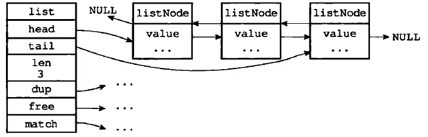

## SDS

SDS 是 Redis 中广泛使用的字符串结构，它的全称是 Simple Dynamic String（简单动态字符串）。SDS 字符串可以看做是对 C 字符串的进一步封装，但是内部实现十分巧妙，有效避免了内存溢出、申请销毁开销过大等问题。其相关实现定义在 [sds.c](https://github.com/antirez/redis/blob/unstable/src/sds.c) 文件中。

#### 数据结构

`sds`的实现比较巧妙，直接被定义为`char *`的别名：

```c
typedef char *sds;
```

因此 SDS 和传统的 C 字符串保持类型兼容，在底层的类型定义都是一个指向`char`类型的指针。但两者之间并不等价，在 SDS 中还定义了一系列 SDSHeader 结构体：

```c
struct __attribute__ ((__packed__)) sdshdrX { // X 代表 bit 长度
    uintX_t len;
    uintX_t alloc;
    unsigned char flags; /* 3 lsb of type, 5 unused bits */
    char buf[];
};
//  Redis 为节约内存占用，分别定义了不同长度 buf 下的数据结构：
struct __attribute__ ((__packed__)) sdshdr5 {...} // 不再使用
struct __attribute__ ((__packed__)) sdshdr8 {...}
struct __attribute__ ((__packed__)) sdshdr16 {...}
struct __attribute__ ((__packed__)) sdshdr32 {...}
struct __attribute__ ((__packed__)) sdshdr64 {...}
```

Redis 针对长度不同的字符串做了优化，选取不同的数据类型来表示长度等。结构体中的`__attribute__ ((__packed__))` 设置是告诉编译器取消内存对齐，以便进行指针偏移操作。结构体成员含义如下：

- len 变量表示字符串的实际长度，如存入一个"redis"字符串，len 值应为 5；

- alloc 变量表示为 buf[] 分配的内存空间大小，Redis 每次初始化一个 SDS 字符串时，通常会分配大于字符串实际长度的内存空间；

- flags 用于标记 sdshdr 的结构体类型，占用一个字节，定义如下：

  ```c
  #define SDS_TYPE_5  0 // 不再使用
  #define SDS_TYPE_8  1
  #define SDS_TYPE_16 2
  #define SDS_TYPE_32 3
  #define SDS_TYPE_64 4
  ```

- buf[] 是字符串的实际存储区域，为了兼容 C 字符串，会在字符串的最后添加加一个空字符'\0'，其实际大小为`alloc+1`。


上文提到的`sds`就是一个指向 buf[] 的指针，而不是指向`sdshdr`结构体，这样做是为了兼容部分 C 语言字符串处理 API。结构体`sdshdr`中的其他成员属性，可以通过指针偏移获取：

```c
// s[-1] 指向了 flags 字段
unsigned char flags = s[-1];
```

传统的 C 字符串为了获取一个长度为 C 字符串的长度，必须遍历整个字符串。但利用`sdshdr`结构体，我们可以通过获取 len 字段的值，直接得到字符串长度，其时间复杂度由*O*(*n*) 降至*O*(*1*)。

除此之外，C 字符串中间不能包含空字符，否则最先被程序读入的空字符将被误认为是字符串结尾。但在 Redis 中，是通过 len 字段标记字符串结束位置，即便是中间出现了空字符也不会影响读取。所以 SDS 也是二进制安全的，可以保存图片、音视频、压缩文件这样的二进制数据。

####  内存分配

Redis 作为数据库，常用于数据频繁修改的场景，为减小内存分配与销毁的开销，在内部了采用预分配与惰性释放的方式。

###### 内存预分配

当将长度为 addlen 的二进制数据追加到  buf[] 后面时，会先调用`sdsMakeRoomFor`函数来保证有足够的空余空间来追加数据，其分配策略如下：

- 如果原字符串中的空余空间足够使用（alloc - len >= addlen），那么它并不会进行内存分配；
- 如果需要分配空间，且追加后字符串总长度小于定义的`SDS_MAX_PREALLOC(1MB)`，其分配的实际内存大小为所需的两倍，以防备继续追加；
- 如果追加后字符串总长度大于 1MB，那么分配的空余内存大小为 1MB；

```c
newlen = (len+addlen);
if (newlen < SDS_MAX_PREALLOC)
    newlen *= 2;
else
    newlen += SDS_MAX_PREALLOC;
```

通过内存预分配策略，SDS 将修改字符串 N 次所需内存分配次数从必定 N 次降低为最多执行 N 次。

###### 惰性释放

惰性空间释放用于优化 SDS 字符串缩短操作：当需要缩短 SDS 保存的字符串时， 程序并不立即使用内存重分配来回收缩短后多出来的字节， 而是减小 len 值， 以等待将来使用。

如果我们需要清空某个字符串，只会将 len 属性设置为 0，但并不释放内存空间，可以下次直接复用。

```c
void sdsclear(sds s) {
    sdssetlen(s, 0);
    s[0] = '\0';
}
```

#### 小结

SDS 的设计策略为尽可能降低响应时间，降低某些操作的时间复杂度，并可能兼容一些 C语言字符串 API，不得不说这种实现十分巧妙。其特点如下表：

| C 字符串                                   | SDS                                    |
| ------------------------------------------ | -------------------------------------- |
| 获取字符串长度的复杂度为*O*(*N*)           | 获取字符串长度的复杂度为*O*(*1*)       |
| 可能会造成缓冲区溢出                       | 不会造成缓冲区溢出                     |
| 修改字符串 N 次必然需要执行 N 次内存重分配 | 修改字符串 N 次最多执行 N 次内存重分配 |
| 只能保存文本数据                           | 二进制安全，可以保存二进制和文本数据   |

## 链表

链表是一种常见的数据结构，在 Redis 中使用非常广泛，列表对象的底层实现之一就是链表。Redis 链表使用双向无环链表，提供了高效的节点重排能力和节点访问方式，并且可以通过左/右增删来灵活的调整链表的长度。链表的相关实现在[adlist.c](https://github.com/antirez/redis/blob/unstable/src/adlist.c)文件中。

#### 数据结构

Redis 中使用`listNode`表示链表节点：

```c
typedef struct listNode {
    struct listNode *prev; // 前置节点指针
    struct listNode *next; // 后置节点指针
    void *value;           // 该节点值指针
} listNode;
```

该双向链表具有以下特点：

- 双向：链表节点带有 prev 和 next 指针，因此可以进行双向遍历；
- 无环：表头节点的 prev 指针和表尾节点的 next 指针都指向 NULL，对链表的访问以 NULL 结束。

 同时 Redis 为了方便的操作链表，提供了一个 list 结构体来持有链表节点：

```c
typedef struct list {
    listNode *head; // 表头节点指针
    listNode *tail; // 表尾节点指针
    void *(*dup)(void *ptr); // 节点值复制函数
    void (*free)(void *ptr); // 节点值释放函数
    int (*match)(void *ptr, void *key); // 节点值比较函数
    unsigned long len; // 链表包含的节点数量
} list;
```

- head 和 tail：list 结构体带有表头和表尾指针，获得链表的表头和表尾节点的时间复杂度为*O*(*1*)。
-  len：链表长度计数器，通过该字段获取链表长度的时间复杂度为。
- 多态：链表节点使用`void *`来保存节点值，所以链表可以保存不同的类型的值，可以通过函数 dup、free、match 对节点值进行操作，。




#### 迭代器

Redis 为双向链表实现了一个迭代器， 利用迭代器可以从两个方向对链表进行迭代：

```c
typedef struct listIter {
    // 当前迭代到的节点
    listNode *next;
    // 迭代方向
    int direction;
} listIter;

// 迭代器方向：从表头向表尾进行迭代
#define AL_START_HEAD 0
// 从表尾到表头进行迭代
#define AL_START_TAIL 1
```

Redis 通过调用`listGetIterator`函数创建一个链表的迭代器，当迭代器调用`listNext`函数时返回被迭代到的链表节点。

#### 小结

| 操作\时间复杂度                   | 数组 | 单链表 | 双向链表 |
| --------------------------------- | ---- | ------ | -------- |
| rpush(从右边添加元素)             | O(1) | O(1)   | O(1)     |
| lpush(从左边添加元素)             | 0(N) | O(1)   | O(1)     |
| lpop (从右边删除元素)             | O(1) | O(1)   | O(1)     |
| rpop (从左边删除元素)             | O(N) | O(1)   | O(1)     |
| lindex(获取指定索引下标的元素)    | O(1) | O(N)   | O(N)     |
| len (获取长度)                    | O(N) | O(N)   | O(1)     |
| linsert(向某个元素前或后插入元素) | O(N) | O(N)   | O(1)     |
| lrem (删除指定元素)               | O(N) | O(N)   | O(N)     |
| lset (修改指定索引下标元素)       | O(N) | O(N)   | O(N)     |

通过上表我们可以看到，列表对象常用的操作中双向链表的响应速度优势很大。但双向链表因为使用两个额外的空间存储前置节点与后置节点指针，在数据量较小的情况下会造成空间上的浪费。这是一个空间换时间的思想问题，因此当对象中数据量较小的时候，Redis 内部会使用压缩列表作为补充。

## 压缩列表

压缩列表（ziplist）是为了尽可能地节约内存而设计的特殊编码双端链表，可以储存字符串值和整数值。其中，整数值被保存为实际的整数（二进制形式），而不是字符串。在压缩列表两端进行 push 或 pop 操作时 T =*O*(*1*)。链表的相关实现在[ziplist.c](https://github.com/antirez/redis/blob/unstable/src/ziplist.c)文件中。

#### 数据结构

通常情况下一个压缩列表的布局如下：

```
<zlbytes> <zltail> <zllen> <entry> <entry> ... <entry> <zlend>
```

-  <uint32_t zlbytes> 是一个 32 位无符号整数，保存着`ziplist`使用的字节数量，包含 zlbytes 自己占用的四个字节。 通过这个值可以直接对`ziplist`的内存大小进行调整，无须为了计算内存大小进行遍历操作；
- <uint32_t zltail> 保存着到达列表中最后一个节点的偏移量，因此对表尾进行 pop 操作时无须遍历整个列表；
- <uint16_t zllen> 保存着列表中的节点数量，如果节点数量大于 2^16^-2，即 zllen 值为 2^16^-1 时，需要对 ziplist 进行遍历才能知道节点数量；
- <uint8_t zlend> 是 ziplist 的结束标记，值固定为 255。

`entry`表示一个压缩列表节点，一个节点的完整结构如下：

```c
<prevlen> <encoding> <entry-data>
```

- <prevlen> 保存着前置节点长度，其编码方式如下：

  a) 如果前置节点的长度小于 254 字节，只使用 1 个字节来保存这个长度值；

  b) 如果前置节点的长度大于等于 254 字节，将使用 5 个字节来保存这个长度值：其中第 1 个字节的值将被设为 254 ，用于标识这是一个 5 字节长的长度值，之后的 4 个字节则用于保存前置节点的实际长度。

- <encoding> 的编码方式取决于节点存储的值：

  a) 如果节点保存的是字符串值，<encoding> 的前 2 位标识字符串长度类型，后面跟着的内容则是字符串的实际长度，根据长度的不同又分为以下三种情况：

  1. 如果长度可以用 6 位二进制数表示，<encoding>只会占用 1 字节：`|00pppppp|`；
  2. 如果长度小于 14 位二进制数：`|01pppppp|qqqqqqqq|`；
  3. 如果长度小于 32 位二进制数：`|10000000|qqqqqqqq|rrrrrrrr|ssssssss|tttttttt|`，这种情况下只有后四个字节用于存储节点值长度，且使用的是大端方式。

  b) 如果节点保存的是整数类型，<encoding> 的前 2 位都将被设置为 1 ,而之后跟着的 2 位则用于标识节点所保存的整数的类型。这种情况下，

  1. |11000000|：存储 int16 类型；
  2. |11010000|：存储 int32 类型；
  3. |11100000|：存储 int64 类型；
  4. |11110000|：存储 24 位有符号整型（int24）类型；
  5. |11111110|：存储 int8 类型；
  6. |1111 xxxx|：这是一种特殊情况，xxxx 的值在 0001 和 1101 之间，一共有 13 个值，这时用这 13 个值来表示整数 0-12（ xxxx 的值减去1）。注意，这里表示的是真正的数据，也就是说，在这种情况下，后面不再需要一个单独的字段来表示真正的数据，而是将两者合并在一个字节中。

## Reference

- [Redis(5.0.3)源码分析之 sds 对象](http://cbsheng.github.io/posts/redis%E6%BA%90%E7%A0%81%E5%88%86%E6%9E%90%E4%B9%8Bsds%E5%AF%B9%E8%B1%A1/)
- 