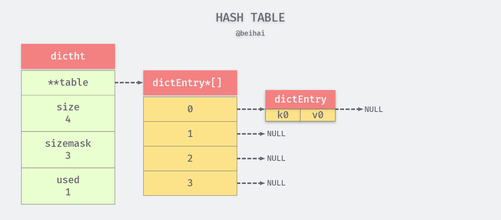

## 前言

Redis 对外提供了六种键值对供开发者使用，而实际上在底层采用了多种基础数据结构来存储信息，并且会在必要的时刻进行类型转换。文章将会逐一介绍这些数据结构，以及它们的独特之处。

## SDS

SDS 是 Redis 中广泛使用的字符串结构，它的全称是 Simple Dynamic String（简单动态字符串）。SDS 字符串可以看做是对 C 字符串的进一步封装，但是内部实现十分巧妙，有效避免了内存溢出、申请销毁开销过大等问题。其相关实现定义在 [sds.c](https://github.com/antirez/redis/blob/unstable/src/sds.c) 文件中。

#### 数据结构

`sds`的直接被定义为`char *`的别名：

```c
typedef char *sds;
```

因此 SDS 和传统的 C 字符串保持类型兼容，在底层的类型定义都是一个指向`char`类型的指针。但两者之间并不等价，在 SDS 中还定义了 SDSHeader 结构体：

```c
struct __attribute__ ((__packed__)) sdshdrX { // X 代表 bit 长度
    uintX_t len;
    uintX_t alloc;
    unsigned char flags; /* 3 lsb of type, 5 unused bits */
    char buf[];
};
//  Redis 为节约内存占用，分别定义了不同长度 buf 下的数据结构：
struct __attribute__ ((__packed__)) sdshdr5 {...} // 不再使用
struct __attribute__ ((__packed__)) sdshdr8 {...}
struct __attribute__ ((__packed__)) sdshdr16 {...}
struct __attribute__ ((__packed__)) sdshdr32 {...}
struct __attribute__ ((__packed__)) sdshdr64 {...}
```

Redis 针对长度不同的字符串做了优化，选取不同的数据类型来表示长度等。结构体中的`__attribute__ ((__packed__))` 设置是告诉编译器取消内存对齐，以便进行指针运算操作。结构体成员含义如下：

- len 变量表示字符串的实际长度，如存入一个"redis"字符串，len 值应为 5；

- alloc 变量表示为 buf[] 分配的内存空间大小，Redis 每次初始化一个 SDS 字符串时，通常会分配大于字符串实际长度的内存空间；

- flags 用于标记 sdshdr 的结构体类型，占用一个字节，定义如下：

  ```c
  #define SDS_TYPE_5  0 // 不再使用
  #define SDS_TYPE_8  1
  #define SDS_TYPE_16 2
  #define SDS_TYPE_32 3
  #define SDS_TYPE_64 4
  ```

- buf[] 是字符串的实际存储区域，为了兼容 C 字符串，会在字符串的最后添加加一个空字符'\0'，其实际大小为`alloc+1`。


上文提到的`sds`就是一个指向 buf[] 的指针，而不是指向`sdshdr`结构体，这样做是为了兼容部分 C 语言字符串处理 API。结构体`sdshdr`中的其他成员属性，可以通过指针运算获取：

```c
// s[-1] 指向了 flags 字段
unsigned char flags = s[-1];
```

传统的 C 字符串为了获取一个长度为 C 字符串的长度，必须遍历整个字符串。但利用`sdshdr`结构体，我们可以通过获取 len 字段的值，直接得到字符串长度，其时间复杂度由*O(n)*降至*O(1)*。

*除此之外，C 字符串中间不能包含空字符，否则最先被程序读入的空字符将*被误认为是字符串结尾。但在 Redis 中，是通过 len 字段标记字符串结束位置，即便是中间出现了空字符也不会影响读取。所以 SDS 也是二进制安全的，可以保存图片、音视频、压缩文件这样的二进制数据。

####  内存分配

Redis 作为数据库，常用于数据频繁修改的场景，为减小内存分配与销毁的开销，在内部了采用预分配与惰性释放的方式。

###### 内存预分配

当将长度为 addlen 的二进制数据追加到  buf[] 后面时，会先调用`sdsMakeRoomFor`函数来保证有足够的空余空间来追加数据，其分配策略如下：

- 如果原字符串中的空余空间足够使用（alloc - len >= addlen），那么它并不会进行内存分配；
- 如果需要分配空间，且追加后字符串总长度小于定义的`SDS_MAX_PREALLOC(1MB)`，其分配的实际内存大小为所需的两倍，以防备继续追加；
- 如果追加后字符串总长度大于 1MB，那么分配的空余内存大小为 1MB；

```c
newlen = (len+addlen);
if (newlen < SDS_MAX_PREALLOC)
    newlen *= 2;
else
    newlen += SDS_MAX_PREALLOC;
```

通过内存预分配策略，SDS 将修改字符串 N 次所需内存分配次数从必定 N 次降低为最多执行 N 次。

###### 惰性释放

惰性空间释放用于优化 SDS 字符串缩短操作：当需要缩短 SDS 保存的字符串时， 程序并不立即使用内存重分配来回收缩短后多出来的字节， 而是减小 len 值， 以等待将来使用。

如果我们需要清空某个字符串，只会将 len 属性设置为 0，但并不释放内存空间，可以下次直接复用。

```c
void sdsclear(sds s) {
    sdssetlen(s, 0);
    s[0] = '\0';
}
```

#### 小结

SDS 的设计策略为尽可能降低响应时间，降低某些操作的时间复杂度，并可能兼容一些 C语言字符串 API，不得不说这种实现十分巧妙。其特点如下表：

| C 字符串                                   | SDS                                    |
| ------------------------------------------ | -------------------------------------- |
| 获取字符串长度的复杂度为*O(N)*             | 获取字符串长度的复杂度为*O(1)*         |
| 可能会造成缓冲区溢出                       | 不会造成缓冲区溢出                     |
| 修改字符串 N 次必然需要执行 N 次内存重分配 | 修改字符串 N 次最多执行 N 次内存重分配 |
| 只能保存文本数据                           | 二进制安全，可以保存二进制和文本数据   |

## 链表

链表是一种常见的数据结构，在 Redis 中使用非常广泛，列表对象的底层实现之一就是链表。Redis 链表使用双向无环链表，提供了高效的节点重排能力和节点访问方式，并且可以通过左/右增删来灵活的调整链表的长度。链表的相关实现在[adlist.c](https://github.com/antirez/redis/blob/unstable/src/adlist.c)文件中。

#### 数据结构

Redis 中使用`listNode`表示链表节点：

```c
typedef struct listNode {
    struct listNode *prev; // 前置节点指针
    struct listNode *next; // 后置节点指针
    void *value;           // 该节点值指针
} listNode;
```

该双向链表具有以下特点：

- 双向：链表节点带有 prev 和 next 指针，因此可以进行双向遍历；
- 无环：表头节点的 prev 指针和表尾节点的 next 指针都指向 NULL，对链表的访问以 NULL 结束。

 同时 Redis 为了方便的操作链表，提供了一个 list 结构体来持有链表节点：

```c
typedef struct list {
    listNode *head; // 表头节点指针
    listNode *tail; // 表尾节点指针
    void *(*dup)(void *ptr); // 节点值复制函数
    void (*free)(void *ptr); // 节点值释放函数
    int (*match)(void *ptr, void *key); // 节点值比较函数
    unsigned long len; // 链表包含的节点数量
} list;
```

- head 和 tail：list 结构体带有表头和表尾指针，获得链表的表头和表尾节点的时间复杂度为*O(1)*。
-  len：链表长度计数器，通过该字段获取链表长度的时间复杂度为。
- 多态：链表节点使用`void *`来保存节点值，所以链表可以保存不同的类型的值，可以通过函数 dup、free、match 对节点值进行操作，。

#### 迭代器

Redis 为双向链表实现了一个迭代器， 利用迭代器可以从两个方向对链表进行迭代：

```c
typedef struct listIter {
    // 当前迭代到的节点
    listNode *next;
    // 迭代方向
    int direction;
} listIter;

// 迭代器方向：从表头向表尾进行迭代
#define AL_START_HEAD 0
// 从表尾到表头进行迭代
#define AL_START_TAIL 1
```

Redis 通过调用`listGetIterator`函数创建一个链表的迭代器，当迭代器调用`listNext`函数时返回被迭代到的链表节点。

#### 小结

| 操作\时间复杂度                   | 数组   | 单链表 | 双向链表 |
| --------------------------------- | ------ | ------ | -------- |
| rpush(从右边添加元素)             | *O(1)* | *O(1)* | *O(1)*   |
| lpush(从左边添加元素)             | *0(N)* | *O(1)* | *O(1)*   |
| lpop (从右边删除元素)             | *O(1)* | *O(1)* | *O(1)*   |
| rpop (从左边删除元素)             | *O(N)* | *O(1)* | *O(1)*   |
| lindex(获取指定索引下标的元素)    | *O(1)* | *O(N)* | *O(N)*   |
| len (获取长度)                    | *O(N)* | *O(N)* | *O(1)*   |
| linsert(向某个元素前或后插入元素) | *O(N)* | *O(N)* | *O(1)*   |
| lrem (删除指定元素)               | *O(N)* | *O(N)* | *O(N)*   |
| lset (修改指定索引下标元素)       | *O(N)* | *O(N)* | *O(N)*   |

通过上表我们可以看到，列表对象常用的操作中双向链表的响应速度优势很大。但双向链表因为使用两个额外的空间存储前置节点与后置节点指针，在数据量较小的情况下会造成空间上的浪费。这是一个空间换时间的思想问题，因此当对象中数据量较小的时候，Redis 内部会使用压缩列表作为补充。

## 压缩列表

压缩列表（ziplist）是为了尽可能地节约内存而设计的特殊编码双端链表，可以储存字符串值和整数值。其中，整数值被保存为实际的整数（二进制形式），而不是字符串。在压缩列表两端进行 push 或 pop 操作时 T =*O(1)*。链表的相关实现在[ziplist.c](https://github.com/antirez/redis/blob/unstable/src/ziplist.c)文件中。

#### 内存布局

通常情况下一个压缩列表的布局如下：


- `<uint32_t zlbytes>`是一个 32 位无符号整数，保存着`ziplist`使用的字节数量，包含 zlbytes 自己占用的四个字节。 通过这个值可以直接对`ziplist`的内存大小进行调整，无须为了计算内存大小进行遍历操作；
- `<uint32_t zltail>`保存着到达列表中最后一个节点的偏移量，因此对表尾进行 pop 操作时进行指针运算即可，而无须遍历整个压缩列表；
- `<uint16_t zllen>`保存着列表中的节点数量，如果节点数量大于 2^16^-2，即 zllen 值为 2^16^-1 时，需要对 ziplist 进行遍历才能知道节点数量；
- `<uint8_t zlend>`是 ziplist 的结束标记，值固定为 255。

`<entry>`表示一个压缩列表节点，一个节点的完整结构如下：

```c
<prevlen> <encoding> <entry-data>
```

1. `<prevlen>`保存着前置节点长度，可以利用指针运算计算出前置节点的起始位置，其编码方式为：

   - 如果前置节点的长度小于 254 字节，只使用 1 个字节来保存这个长度值；
   - 如果前置节点的长度大于等于 254 字节，将使用 5 个字节来保存这个长度值：其中第 1 个字节的值将被设置为 254 ，用于标识这是一个 5 字节长的长度值，之后的 4 个字节则用于保存前置节点的实际长度。

2. `<encoding>` 保存者当前节点值的数据类型与长度，编码方式取决于存储的值：

   - 如果节点保存的是字符串值，`<encoding>` 的前 2 位标识字符串长度类型，后面跟着的内容则是字符串的实际长度，根据长度的不同又分为以下三种情况：
     - 如果长度可以用 6 位二进制数表示，`<encoding>`只会占用 1 字节：`|00pppppp|`；
     - 如果长度小于 14 位二进制数：`|01pppppp|qqqqqqqq|`；
     - 如果长度小于 32 位二进制数：`|10000000|qqqqqqqq|rrrrrrrr|ssssssss|tttttttt|`，这种情况下只有后四个字节用于存储节点值长度，且使用的是大端存储。

   - 如果节点保存的是整数类型，`<encoding>`部分只会占用一个字节，其中前 2 位都将被设置为 1，而紧随其后的 2 位则用于标识节点所保存的整数的类型。分为以下几种情况：
     - |11000000|：存储 int16 类型；
     - |11010000|：存储 int32 类型；
     - |11100000|：存储 int64 类型；
     - |11110000|：存储 24 位有符号整型（int24）类型；
     - |11111110|：存储 int8 类型；
     - |1111 xxxx|：这是一种特殊情况，xxxx 的值在 0001 和 1101 之间，一共有 13 个值，这时用这 13 个值来表示整数 0-12（ xxxx 的值减去1）。注意，这里表示的是真正的数据，也就是说，在这种情况下，后面不再需要一个单独的字段来表示真正的数据，而是将两者合并在一个字节中。

3. `<entry-data>` 则保存着该节点的实际值。

#### 数据结构

压缩列表的一个节点使用结构体`zlentry`表示

```c
typedef struct zlentry {
    unsigned int prevrawlensize; /* Bytes used to encode the previous entry len*/
    unsigned int prevrawlen;     /* Previous entry len. */
    unsigned int lensize;        /* Bytes used to encode this entry type/len.
                                    For example strings have a 1, 2 or 5 bytes
                                    header. Integers always use a single byte.*/
    unsigned int len;            /* Bytes used to represent the actual entry.
                                    For strings this is just the string length
                                    while for integers it is 1, 2, 3, 4, 8 or
                                    0 (for 4 bit immediate) depending on the
                                    number range. */
    unsigned int headersize;     /* prevrawlensize + lensize. */
    unsigned char encoding;      /* Set to ZIP_STR_* or ZIP_INT_* depending on
                                    the entry encoding. However for 4 bits
                                    immediate integers this can assume a range
                                    of values and must be range-checked. */
    unsigned char *p;            /* Pointer to the very start of the entry, that
                                    is, this points to prev-entry-len field. */
} zlentry;
```

为了便于理解，我们可以把`<prevlen>`可以看作是对`prevrawlensize`、`prevrawlen`字段的抽象表示，`<encoding>`则是对`lensize`、`len`、`encoding`字段的抽象表示。而`p`则是指向`zlentry`起点的指针，利用`headersize`进行指针运算则可以快速获取当前节点保存的值。

#### 内存重分配

压缩链表的实质是将数据按照一定规则存储在一块连续的内存区域中，以达到节省内存的目的。**但这种数据结构并不擅长做修改操作，一旦数据大小发生变化，就会触发`realloc`进行内存分配**，可能发生的情况有三种：

- 由于内存区域是连续的，如果后面的空余内存空间足够大，那么直接在后面扩展内存空间；
- 如果剩余空间不足，将会从堆中寻找一块新的内存区域，将旧数据拷贝过去并写入新数据；
- 由于节点中存在`<prevlen>`结构，保存着前置节点的长度，如果该值由小于 254 增加至大于 254，那么`<prevlen>`所占据的内存空间也将发生变化，从而引发连锁更新。

#### 小结

压缩链表是一种存储在连续内存区域的数据结构，这种数据结构适合应用在读多写少且数据量不大的应用场景。相较于双向链表，它使用内存偏移来进行双向查询，节省了存储指针的内存空间。但这种数据结构也存在一定的缺点：

- 如果频繁修改内容会触发内存分配，甚至会引起整段内存拷贝；
- 如果我们的`ziplist`特别大，而且没有完整的空闲内存块分配时。操作系统会抽象出一块连续的内存块，其实际上是一个链表链接成为的内存，这种情况下会造成内存碎片，并且在操作的时候因为内存不连续等原因造成效率问题；

- 除此之外，值查询过程需要对全表进行遍历，在数据量太大的情况下也会影响性能。

作为 Redis 哈希表的底层数据结构之一，我们可以修改配置文件选项，当数据量达到限定值时，Redis 会自动进行类型转换。

## quicklist

通过上面的例子我们了解到，在双向链表两端进行 push 和 pop 操作十分便捷，但是它的内存开销比较大。双端链表每个节点上除了保存数据之外，还要额外保存两个指针；其次，双向链表的各个节点是单独的内存块，地址不连续，节点过多容易产生内存碎片。而压缩列表由于是一整块连续内存，所以存储效率很高。但是压缩列表不利于进行修改操作，每次数据变动都会引发一次内存的 realloc；而且当 ziplist 长度很长的时候，一次 realloc 可能会导致大批量的数据拷贝，进一步降低性能。

为结合两种数据结构的优势，Redis 中创建了新的数据结构`quicklist`，官方对这种数据结构的描述如下：

> quicklist.c - A doubly linked list of ziplists.
>
> quicklist 是使用 ziplist 实现的双向链表。

从宏观上看，quicklist 是一个双向链表，链表的每个节点都是一个 ziplist，因此，它具有双向链表的特点：**进行插入或删除操作时非常方便，虽然复杂度为*O(n)*，但是不需要内存的复制，提高了效率，而且访问两端元素复杂度为*O(1)*。**同时，链表内部不但采用采用了 ziplist，还使用了 LZF 压缩算法进行数据压缩，进一步降低内存占用。相关实现均在[quicklist.c](https://github.com/antirez/redis/blob/unstable/src/quicklist.c)文件中。

#### 数据结构

quicklist 节点数据结构：

```c
typedef struct quicklistNode {
    struct quicklistNode *prev; // 前置节点指针
    struct quicklistNode *next; // 后置节点指针
    unsigned char *zl; // ziplist（或者 quicklistLZF ）指针
    // ziplist 占用的内存大小，如果 ziplist 被压缩了，那么这个 sz 的值仍然是压缩前的 ziplist 大小。
    unsigned int sz;             /* ziplist size in bytes */
    // ziplist 中的节点数目
    unsigned int count : 16;     /* count of items in ziplist */
    // 编码方式：1 为 ziplist，2 为 LZF 压缩存储方式
    unsigned int encoding : 2;   /* RAW==1 or LZF==2 */
    // 数据存储方式,当前只有 ziplist 方式
    unsigned int container : 2;  /* NONE==1 or ZIPLIST==2 */
    // 压缩标志, 为 1 是压缩
    unsigned int recompress : 1; /* was this node previous compressed? */
    // 节点是否能够被压缩,只用在测试
    unsigned int attempted_compress : 1; /* node can't compress; too small */
    // 预留空间
    unsigned int extra : 10; /* more bits to steal for future usage */
} quicklistNode;

// 压缩后的 ziplist
typedef struct quicklistLZF {
    // LZF 压缩后占用的字节数
    unsigned int sz; /* LZF size in bytes*/
    // 压缩数据
    char compressed[];
} quicklistLZF;
```

quicklist 表头结构：

```c
typedef struct quicklist {
    // 头部节点指针
    quicklistNode *head;
    // 尾部节点指针
    quicklistNode *tail;
    // 所有 ziplist 中的所有数据项的数量
    unsigned long count;        /* total count of all entries in all ziplists */
    // quicklistNodes 数量
    unsigned long len;          /* number of quicklistNodes */
    // 每个节点可以存放的元素数
    int fill : 16;              /* fill factor for individual nodes */
    // 链表头尾的前 X 个节点不进行lzf压缩,中间的节点的都进行压缩.0:关闭该功能
    unsigned int compress : 16; /* depth of end nodes not to compress;0=off */
} quicklist;
```

在 quicklist 表头结构中，有两个成员`fill`和`compress`，其中`fill`值是让 quicklist 节点上的 ziplist 要保持一个合理的长度。这个长度取决于具体应用场景，在配置文件[redis.conf](https://github.com/antirez/redis/blob/unstable/redis.conf)中提供了一个配置参数`list-max-ziplist-size`，可以让使用者根据自己的需求进行调整，其含义如下：

1. 当取正值的时候，表示按照数据项个数个数来限定 ziplist 长度。比如，当这个参数配置成 5 的时候，表示每个 quicklist 节点的 ziplist 最多包含 5 个数据项。
2. 当取负值的时候，表示按照占用字节数来限定 ziplist 长度。其取值范围为 -1到 -5，每个值含义如下：
   - -5：每个 quicklist 节点上的 ziplist 大小不能超过 64 Kb；
   - -4：每个 quicklist 节点上的 ziplist 大小不能超过 32 Kb；
   - -3：每个 quicklist 节点上的 ziplist 大小不能超过 16 Kb；
   - -2：每个 quicklist 节点上的 ziplist 大小不能超过 8 Kb；（Redis 默认值）
   - -1：每个 quicklist 节点上的 ziplist 大小不能超过 4 Kb。

除此之外，quicklist 的设计目标是能够用来存储很长的数据列表。当列表很长时，最容易被访问的很可能是两端的数据，中间的数据被访问的频率比较低（访问起来性能也很低）。如果应用场景符合这个特点，那么 quicklist 可以把中间的数据节点进行压缩，从而进一步节省内存空间。表头结构中的`compress`就是用来标记数据压缩位置的，其值由 Redis 的配置参数`list-compress-depth`决定：

- 0：是个特殊值，表示都不压缩；（Redis 默认值）。
- 1：表示 quicklist 两端各有1个节点不压缩，中间的节点压缩；
- 2：表示 quicklist 两端各有2个节点不压缩，中间的节点压缩；
- 3：表示 quicklist 两端各有3个节点不压缩，中间的节点压缩；
- 依此类推…

可以看出 quicklist 的头节点和尾节点总是不被压缩的，以便在表的两端进行快速存取。

由此， 我们就可以知道 quicklist 的整体结构：


quicklist 迭代器结构：

```c
typedef struct quicklistIter {
    // 迭代的 quicklist
    const quicklist *quicklist;
    // 当前迭代到的节点
    quicklistNode *current;
    // 当前迭代的数据节点起始指针
    unsigned char *zi;
    // 当前迭代的 ziplist 的偏移
    long offset; /* offset in current ziplist */
    // 方向
    int direction;
} quicklistIter;
```

由于压缩列表储存时是连续的内存块，当需要访问某个节点时，用一个结构体记录该节点的相关信息，以便操作：

```c
typedef struct quicklistEntry {
    // 所在的 quicklist
    const quicklist *quicklist;
    // 所在的 quicklistNode
    quicklistNode *node;
    // 所在的 ziplistEntry
    unsigned char *zi;
    // 值,字符串
    unsigned char *value;
    // 值,数字
    long long longval;
    // 所在节点的字节大小
    unsigned int sz;
    // 所在节点在 ziplist 的偏移
    int offset;
} quicklistEntry;
```

#### 插入 entry 节点

quicklist 也可以在指定的位置插入数据，该功能由`quicklistInsertAfter()`和`quicklistInsertBefore()`函数实现。在一个已存在的 entry 前或后插入一个新 entry 节点，情况非常的复杂：

- 当前 quicklistNode 节点的 ziplist 可以插入：
  - 插入在已存在的 entry 前；
  - 插入在已存在的 entry 后；

- 如果当前 quicklistNode 节点的 ziplist 超过限制（list-max-ziplist-size），无法继续插入：
  - 已存在的 entry 是 ziplist 的头节点，当前 quicklistNode 节点前驱指针不为空，且是尾插：
    - 前驱节点可以插入，因此插入在前驱节点的尾部。
    - 前驱节点不可以插入，因此要在当前节点和前驱节点之间新创建一个新节点保存要插入的 entry。
  - 已存在的 entry 是 ziplist 的尾节点，当前 quicklistNode 节点后继指针不为空，且是前插：
    - 后继节点可以插入，因此插入在前驱节点的头部。
    - 后继节点不可以插入，因此要在当前节点和后继节点之间新创建一个新节点保存要插入的 entry。
  - 以上情况不满足，则属于将 entry 插入在 ziplist 中间的任意位置，需要分割当前 quicklistNode 节点。最后如果能够合并，还要合并。

#### PUSH 与 POP 操作

quicklist 的 push 操作其实就是在双向列表的头部节点或尾部节点上插入一个新的元素。由于 quicklist 的每个节点都是一个 ziplist，所以 push 操作就涉及到一个问题：当前节点的 ziplist 是否有足够的空余空间放进新元素。

- 如果 ziplist 能够放入新元素，即大小没有超过限制（list-max-ziplist-size），那么直接调用`ziplistPush()`函数压入元素；
- 如果 ziplist 不能放入新元素，则新建一个 quicklist 节点，新的数据项会被插入到新的 ziplist 中。

从 quicklist 的头部节点或部尾节点的 ziplist 中 pop 出一个 entry，分为该 entry 保存的是字符串还是整数类型数据。如果字符串的话，需要传入一个函数指针`quicklistSaver()`，将数据内容拷贝一份并返回地址。

quicklist 的 pop 操作是调用`quicklistPopCustom()`来实现的，该操作流程如下：

1. 从头部或尾部节点的 ziplist 中把对应的数据项删除；
2. 如果在删除后 ziplist 为空，那么对应的头部或尾部节点也要删除；
3. 删除后还可能涉及到里面节点的解压缩问题。

#### 小结

quicklist 的设计初衷就是为了存储大容量数据，以及快速访问两端的元素。这种数据结构使用连续的内存块存储数据，并利用无损压缩算法对中间数据进行压缩，在内存占用与访问时间上做出了取舍。

## 跳跃表

跳跃表（skiplist）是`zset`（有序集合）的基础数据结构。 Redis 的跳跃表实现和 William Pugh 在[《Skip lists: a probabilistic alternative to balanced trees》](https://www.epaperpress.com/sortsearch/download/skiplist.pdf)论文中描述的跳跃表基本相同，不过在以下三个地方做了修改：

1. 这个实现允许有重复的分值；
2. 对元素的比对不仅要比对他们的分值，还要比对他们的对象；
3. 每个跳跃表节点都带有一个后退指针，它允许程序在执行像`ZREVRANGE`这样的命令时，从表尾向表头遍历跳跃表。

跳跃表的相关实现在[t_zset.c](https://github.com/antirez/redis/blob/unstable/src/t_zset.c)文件中。

#### 数据结构

跳跃表的数据结构定义在[server.h](https://github.com/antirez/redis/blob/unstable/src/server.h)文件中。

```c
// 跳跃表节点
typedef struct zskiplistNode {
    // 成员对象
    sds ele;
    // 成员分值
    double score;
    // 后退指针
    struct zskiplistNode *backward;
    // 层结构体
    struct zskiplistLevel {
        // 前进指针
        struct zskiplistNode *forward;
        // 跨度
        unsigned long span;
    } level[];
} zskiplistNode;

// 跳跃表
typedef struct zskiplist {
    // 指向表头节点和表尾节点
    struct zskiplistNode *header, *tail;
    // 节点的数量，不包含表头节点
    unsigned long length;
    // 节点的最大层数，不包含表头节点
    int level;
} zskiplist;
```

结构体数组 level 记录了此节点各层的信息：

- `level[0]->forward`实现跳跃表正向遍历，**zrange\***系列命令就是以此实现的；
- `level[x]->forward`表示**该节点在第x层的下一个节点**；
- `level[x]->span`表示**该节点到第x层的下一个节点跳跃了多少节点**。span主要是为了**zrank、zrevrank**等命令服务。

zskiplist 的头结点不是一个有效的节点，它有**ZSKIPLIST_MAXLEVEL = 32**层，每层的 forward 指针指向该层跳跃表的第一个节点，若没有则为 null。


#### 随即层数算法

跳跃表节点的层高由随机数函数`zslRandomLevel()`决定：

```c
int zslRandomLevel(void) {
    int level = 1;
    while ((random()&0xFFFF) < (ZSKIPLIST_P * 0xFFFF))
        level += 1;
    return (level<ZSKIPLIST_MAXLEVEL) ? level : ZSKIPLIST_MAXLEVEL;
}
```

初始层高均为 1，`random()`函数返回一个[0...1)的随机数，如果该随机数小于`ZSKIPLIST_P = 0.25`，那么将 level 值加一，并一直循环执行，直到不满足该条件或达到最大层级数`ZSKIPLIST_MAXLEVEL = 32`。

从上述代码可以看出，节点层数的计算不依赖于其它节点，而且生成越高的节点层数的概率越低：

- 节点层数至少为1，恰好为 1 的概率为1-p。
- 节点层数大于等于 2 的概率为 p，而节点层数恰好为 2 的概率为 p(1-p)。
- 节点层数大于等于 3 的概率为 p^2^，而节点层数恰好为 3 的概率为 p^2^(1-p)。
- ......

#### 插入与删除节点

跳跃表插入一个新节点由函数`zslInsert()`执行，时间复杂度为*O(logN)*，其流程大致如下：

1. 找到合适的插入位置，并在查找过程中记录节点跨度、排名等信息；
2. 调用`zslRandomLevel()`函数得到新节点的层数；
3. 调用`zslCreateNode(level,score,ele)`创建一个新节点；
4. 修改新节点与插入位置前后节点的 forward、span 等属性。

从 skiplist 中删除并释放掉一个节点的时间复杂度*O(logN)*，主要分为以下3个步骤：

1. 根据 ele 和 score 查找节点的位置；
2. 调用`zslDeleteNode()`把该节点从 skiplist 逻辑上删除，并修改相邻节点信息；
3. 释放节点内存。

跳跃表还可以根据指定范围删除节点，该操作时间复杂度*O(lg(N)+M)*, M是删除的元素个数，主要有三个函数：

- `zslDeleteRangeByScore` 删除 score 满足范围要求的节点；
- `zslDeleteRangeByRank` 删除 rank 满足范围要求的节点；
- `zslDeleteRangeByLex` 在所有节点的分值相同的跳跃表中，删除 ele 满足范围要求的节点。

跳跃表插入和删除节点都比较复杂，**需要更改临近节点的前进指针、后退指针、跨度等信息**，但跳跃表也缩短了对有序数据的查询时间，尤其是范围查询取出一段连续的数据集合。

## 字典

字典（dict）是哈希键的底层实现之一，当一个哈希键包含的键值对比较多，或者键值对中的元素都是比较长的字符串时，Redis 将会使用字典作为哈希键的底层实现。字典的实现在[dict.c](https://github.com/antirez/redis/blob/unstable/src/dict.c)文件中。

#### 数据结构

Redis 的字典使用哈希表（hashtable）作为底层实现：

```c
typedef struct dictht {
    // 哈希表数组
    dictEntry **table;
    // 哈希表大小
    unsigned long size;
    // 哈希表大小掩码，用于计算索引值，总是等于 size - 1
    unsigned long sizemask;
    // 该哈希表已有节点的数量
    unsigned long used;
} dictht;
```

二级指针 table 指向一个`dictEntry`结构体数组，每个 `dictEntry` 结构都保存着一个键值对：

```c
typedef struct dictEntry {
    // 键
    void *key;
    // 值可以是：
    union {
        // 一个指针
        void *val;
        // uint64
        uint64_t u64;
        // int64
        int64_t s64;
        // 浮点数
        double d;
    } v;
    // 指向下个哈希表节点，形成链表,用来解决哈希冲突（链地址法）
    struct dictEntry *next;
} dictEntry;
```

所以一个大小为 4 的哈希表结构示例如图所示：



而一个字典的数据结构如下：

```c
typedef struct dict {
    // 类型特定函数
    dictType *type;
    // 私有数据
    void *privdata;
    // 哈希表
    dictht ht[2];
    // rehash 索引，当 rehash 不在进行时，值为 -1
    long rehashidx; /* rehashing not in progress if rehashidx == -1 */
    // 字典标记，目前正在运行的安全迭代器的数量
    unsigned long iterators; /* number of iterators currently running */
} dict;
```

`ht` 属性是一个两元数组，数组中的每个项都是一个 `dictht` 哈希表，一般情况下，字典中的数都存储在 ht[0] 哈希表，ht[1] 哈希表只由在对 ht[0] 哈希表进行 rehash 时使用。

`type`属性和`privdata`属性是针对不同类型的键值对，为创建多态字典而设置的：

1. `type`属性是一个指向`dictType`结构的指针, 每个`dictType`结构保存了一簇用于操作特定类型键值对的函数, Redis 会为用途不同的字典设置不同的类型特定函数；
2. `privdata`属性则保存了需要传给那些类型特定函数的可选参数。

```c
typedef struct dictType {
    // 计算哈希值的函数
    uint64_t (*hashFunction)(const void *key);
    // 复制键的函数
    void *(*keyDup)(void *privdata, const void *key);
    // 复制值
    void *(*valDup)(void *privdata, const void *obj);
    // 对比键
    int (*keyCompare)(void *privdata, const void *key1, const void *key2);
    // 销毁键
    void (*keyDestructor)(void *privdata, void *key);
    // 销毁值
    void (*valDestructor)(void *privdata, void *obj);
} dictType;
```

从 Redis4.0 开始，一直采用 SipHash 哈希算法，其实现在[siphash.c](https://github.com/antirez/redis/blob/unstable/src/siphash.c)中。做为一种非加密哈希算法，SipHash 则是个异类，它的提出是为了解决一类安全问题：[hash flooding](http://emboss.github.io/blog/2012/12/14/breaking-murmur-hash-flooding-dos-reloaded/)。通过让输出随机化，SipHash 能够有效减缓 hash flooding 攻击。不但能提供良好的随机分布性，而且计算速度也不慢于曾经采用的 Murmurhash2 哈希算法。

#### 键冲突

哈希函数不可避免的会产生计算值碰撞，将多个键分配到哈希表数组的同一个数组上，产生键冲突问题。Redis 的哈希表使用链地址法来解决键冲突：每个哈希表节点都有一个 `next` 指针，多个哈希表节点可以用 `next` 指针构成一个单向链表，被分配到同一个索引上的多个节点可以用这个单向链表连接起来。

例如将键值对 K2 与 V2 插入到哈希表中，并且哈希函数计算出来的索引值与 K1 键索引值相同，那么 K1 与 K2 将产生键冲突。利用`next`指针将 K1 与 K2 形成单向链表，就可以解决这个问题。


因为 `dictEntry` 节点组成的链表没有指向链表表尾的指针，为了速度考虑，程序总是将新节点添加到链表的表头位置, 排在已有节点前面, 操作的复杂度为 O(1).

#### 渐进式 rehash

当哈希表保存的键值对数量太多或者太少时，Redis 会对哈希表的大小进行相应的扩展或者收缩。

扩展和收缩哈希表的工作通过 rehash (重新散列) 操作来完成，Redis 对字典的哈希表执行 rehash 的步骤如下：

1. 为字典的 ht[1] 哈希表分配空间, 这个哈希表的空间大小取决于要执行的操作，以及 ht[0] 当前包含的键值对数量 (ht[0].used 属性的值)：
   - 如果执行的是扩展操作，那么 ht[1] 的大小为第一个大于等于`ht[0].used *2`的 2^n;
   - 如果执行的是收缩操作, 那么 ht[1] 的大小为第一个大于等于`ht[0].used`的 2^n；
2. 对保存在 ht[0] 中的所有键值对重新计算键的哈希值和索引值，然后将键值对放置到 ht[1] 哈希表的指定位置上；
3. 当 ht[0] 包含的所有键值对都迁移到了 ht[1] 之后 (ht[0] 变为空表)，释放 ht[0]，将 ht[1] 设置为 ht[0] , 并新创建一个空白哈希表, 为下一次 rehash 做准备。

对大字典的 rehash 是比较耗时的，为避免 rehash 对服务器性能造成影响，Redis 不是一次性将 ht[0] 里面的所有键值对全部 rehash 到 ht[1]，**而是分多次、渐进式地将 ht[0] 里面的键值对慢慢地 rehash 到 ht[1]**，以下是哈希表渐进式 rehash 的详细步骤：

1. 为 ht[1] 分配空间，让字典同时持有 ht[0] 和 ht[1] 两个哈希表；
2. 在字典中维持一个索引计数器变量`rehashidx` , 并将它的值设置为 0 , 表示 rehash 工作正式开始；
3. 在 rehash 进行期间, 每次对字典执行添加,、删除,、查找或者更新操作时，程序除了执行指定的操作以外，还会顺带将 ht[0] 哈希表在`rehashidx`索引上的所有键值对 rehash 到 ht[1]，当 rehash 工作完成之后, 程序将 rehashidx 属性的值增 1;
4. 随着字典操作的不断执行，最终在某个时间点上，ht[0] 的所有键值对都会被 rehash 至 ht[1]，这时程序将 rehashidx 属性的值设为 -1，表示 rehash 操作已完成。

渐进式 rehash 将 rehash 键值对所需的计算工作均摊到对字典的每个添加、删除、查找和更新操作上，从而避免了集中式 rehash 而带来的庞大计算量。

在进行渐进式 rehash 的过程中，字典会同时使用 ht[0] 和 ht[1] 两个哈希表，**所以在渐进式 rehash 进行期间，字典的删除、查找、更新等操作会在两个哈希表上进行**。新添加到字典的键值对一律会被保存到 ht[1] 里面，而 ht[0] 则不再进行任何添加操作。

除了增删改查的操作外，Redis 还会定时对特殊的字典进行主动迁移，避免没有操作的情况下暂停 rehash。

#### 小结

- Redis 中的字典使用哈希表作为底层实现，每个字典带有两个哈希表，一个用于存储数据, 另一个仅在进行 rehash 时使用；
- 哈希表使用链地址法来解决键冲突，被分配到同一个索引上的多个键值对会连接成一个单向链表；
- 在对哈希表进行扩展或者收缩操作时，程序需要将现有哈希表包含的所有键值对 rehash 到 ht[1]，并且rehash 过程并不是一次性地完成的，而是渐进式地完成的，将计算量均摊到多次操作中。

## zipmap

zipmap 是为节约空间而实现的字符串到字符串映射结构，是一个连续的键值集合。同 ziplist 类似，zipmap 并没有进行任何数据压缩操作，而是利用连续的内存空间存储数据。这个数据结构非常节约内存，并且支持复杂度为 *O(N)*的查找操作。

当哈希键的数据量较小时，会采用 zipmap 做为底层存储数据结构，可以修改 redis.conf 配置选项来自定义数据量大小：

```c
hash-max-zipmap-entries 512 #键值对的最大数量
hash-max-zipmap-value 64 #value 占用的最大字节数
```

zipmap 实现在[zipmap.c](https://github.com/antirez/redis/blob/unstable/src/zipmap.c)中。

#### 数据结构

zipmap 的数据结构如下图所示：


例如以下是带有 "foo" => "bar" 和 "hello" => "world" 两个键值对的 zipmap 的内存结构：

```c
<zmlen><len>"foo"<len><free>"bar"<len>"hello"<len><free>"world"<end>
```

其中参数项的含义：

1. `<zmlen>`的长度为 1 字节，它记录了 zipmap 保存的键值对数量：
   - 只有在 zipmap 的键值对数量 < 254 时，这个值才被使用。
   -  当 zipmap 的键值对数量 >= 254 ，程序需要遍历整个 zipmap 才能知道它的确切大小。
2. `<len>` 表示跟在它后面的字符串（键或值）的长度：
   - 如果 `<len>` 的第一个字节(uint8)是介于 0~253 之间的值，那么这个字节就是字符串的长度；
   - 如果第一字节的值为 254 ，那么这个字节之后的 4 字节无符号整数就是字符串的长度。
3. `<free>`是字符串之后未被使用的字节数量，用于记录因为值被修改而节约下来的字节数。`<free>` 总是一个无符号 8 位数字，在执行更新操作之后，如果剩余字节数 >= `ZIPMAP_VALUE_MAX_FREE = 4` ，那么 zipmap 就会进行内存重分配，并对自身空间进行紧缩；
4. `<end>`为固定值 255，用于标记 zipmap 的结束。

#### 小结

做为哈希键的底层数据结构之一，zipmap 需要的编码额外信息比较小，最少只需要 3 个字节，最多 11 个，而 hashtable 需要的空间很大，sizeof(struct dictEntry) = 24。虽然在顺序查询时花费的时间成本是*O(N)*，但是当数据量比较小时查询效率也是可以接受的。

## 整数集合

整数集合（intset）是集合键的底层数据结构之一，当一个集合只包含整数值且元素数量不超过配置文件中的`set-max-intset-entries`时，集合键就会采用 intset 做为底层实现。整数集合的相关内容在[intset.c](https://github.com/antirez/redis/blob/unstable/src/intset.c)中。

#### 数据结构

整数集合使用结构体`intset`表示：

```c
typedef struct intset {
    // 编码方式
    uint32_t encoding;
    // 集合包含的元素数量
    uint32_t length;
    // 保存元素的数组
    int8_t contents[];
} intset;
```

- encoding 字段来记录 contents[] 里面存放的是何种数据，由于 **intset 是一种具有一致类型的数据集合**，可以存储 int16、int32、int64 三种类型的数据，因此利用 encoding 字段来区分他们；
- length 字段保存着 contents[] 数组的长度；
- 由于`int8_t`类型实际上是`char`类型的别名，因此 content[] 具有灵活的编码方式。

#### 类型升级

当我们创建一个 intset 集合的时候，Redis 会直接创建一个 int16 类型的 intset。

```csharp
intset *intsetNew(void) {
    intset *is = zmalloc(sizeof(intset));
    // 创建一个保存两字节大小的 intset 集合
    is->encoding = intrev32ifbe(INTSET_ENC_INT16);
    is->length = 0;
    return is;
}
```

如果给定的值超过了当前数组的编码，那么 Redis 会将 intset 升级为更大的编码然后再插入给定整数。升级整数集合并添加新元素分为三步进行：

1. 根据新元素的类型，扩展整数集合底层数组的空间大小，并为新元素分配空间；
2. 将底层数组现有的所有元素都转换成与新元素相同的类型，并将类型转换后的元素放置到正确的位上，而且在放置元素的过程中，需要继续维持底层数组的有序性质不变；
3. 将新元素添加到底层数组。

提供类型升级操作主要有两个好处：

- 提升灵活性：因为 C 语言时静态类型语言，保持数据类型的统一可以避免类型错误；
- 节约内存：如果插入的数据中不包含 int64 或 int32 类型数据，intset 就无需进行类型升级，节约了内存开销。

不过 intset 并不提供降级操作，一旦数据进行了升级，其编码就会一直保持升级后的状态。

#### 元素有序性

作为一个集合，判断集合中是否存储在某一个元素是一个常用的操作。一般在数组中查找元素无非就是遍历整个是数组，但是这样效率太慢了，由于 intset 存储的元素都是有序的，所以 Redis 采用二分法加快查找过程。

当我们插入一个新元素时，会调用`intsetSearch()`函数判断该值是否已经存在该集合之中，并利用二分法计算该元素应该放置的位置，以此来保证 intset 里面的元素都是有序的。

因此在 intset 中进行元素查找操作的速度是比较快的，时间复杂度为*O(lg⁡N)* 。

#### 小结

intset 用于有序、无重复地保存多个整数值，会根据元素的值，自动选择该用什么长度的整数类型来保存元素。当一个位长度更长的整数值添加到 intset 时，需要对 intset 进行升级。而且 intset 是有序的，Redis 使用二分法来实现查找操作，复杂度为*O(lgN)*，查找速度较快。

## Radix tree

Redis 在 5.0 版本中实现了不定长压缩前缀的 radix tree，用于 streams 键的底层数据结构。它是一种基于存储空间优化的前缀树数据结构，实现在[rax.c](https://github.com/antirez/redis/blob/unstable/src/rax.c)中通常来讲, 一个基数树的结构如下所示：


> 然而，当前的代码实现使用了一种非常常见的优化策略，把只有单个字符的连续几个节点压缩成一个节点，这个节点有一个字符串，不再是只存储单个字符，因此上述结构可以优化成如下结构：
>
> 


但是这种优化使得具体实现更加复杂，例如在上面的 radix tree 中添加一个键"first"，则必须对节点进行分割操作，因为"foo"不再是一个单一的节点组成：


当要删除这个 key 时，还需要把节点合并。

#### 数据结构

一个 rax 节点使用结构体`RaxNode`表示：

```c
typedef struct raxNode {
    // 表示这个节点是否包含 key
    uint32_t iskey:1;     /* Does this node contain a key? */
    // 是否存储 value 值，如果存储元数据就只有 key，没有value
    uint32_t isnull:1;    /* Associated value is NULL (don't store it). */
    // 节点是否压缩
    uint32_t iscompr:1;   /* Node is compressed. */
    // 该节点存储的字符个数
    uint32_t size:29;     /* Number of children, or compressed string len. */
    // 存储子节点的信息
    unsigned char data[];
} raxNode;
```

raxNode 的数据有两种存储布局：

- 非压缩模式下，节点中会保存size个指向子节点的指针，size 个字符之间互相没有路径联系，数据存储布局是：`[header iscompr=0][abc][a-ptr][b-ptr][c-ptr](value-ptr?)`；
- 压缩模式下，只会有一个子节点，只会保存一个指向子节点的指针，size 个字符是压缩字符片段，数据存储布局是：`[header iscompr=1][xyz][z-ptr](value-ptr?)`。

`rax` 是一个树的结构，记录树根，元素数量以及节点数量：

```c
typedef struct rax {
    raxNode *head;
    uint64_t numele;
    uint64_t numnodes;
} rax;
```

插入一个新元素是，可能会生成多个 raxNode 节点，因此 numele >= numnodes。在radix tree中，如果连续的节点都是只有一个子节点，则这些节点可以被压缩成一个压缩节点。节点合并需要满足一定的条件：

- iskey=1 的节点不能合并；
- 子节点只能有一个字符；
- 父节点只有一个子节点（如果父节点是压缩前缀的节点，那么只有一个子节点，满足条件。如果父节点是非压缩前缀的节点，那么只能有一个字符路径才能满足条件）。

`raxStack` 是一个存储指针的栈结构，用于在遍历时辅助记录父节点的信息。 `stack` 是指向栈底的指针，开始时指向 `static_items[]` ，拥有 32 个存储空间，其设计是为了减少堆内存的请求次数。 如果存储空间不足，程序将申请新的空间以容纳新的元素，此时 `stack` 将指向新的存储空间。

```c
typedef struct raxStack {
    // 指向栈底的指针
    void **stack; /* Points to static_items or an heap allocated array. */
    size_t items, maxitems; /* Number of items contained and total space. */
    /* Up to RAXSTACK_STACK_ITEMS items we avoid to allocate on the heap
     * and use this static array of pointers instead. */
    void *static_items[RAX_STACK_STATIC_ITEMS];
    // 如果 push 失败或发生 OOM 错误，该值为 True(1)
    int oom; /* True if pushing into this stack failed for OOM at some point. */
} raxStack;
```

## 紧凑列表

Redis 5.0 又引入了一个新的数据结构：紧凑列表（listpack），它是对压缩列表的改进，在结构上更加精简，也更加节约内存，实现在[listpack.c](https://github.com/antirez/redis/blob/unstable/src/listpack.c)源文件中。

#### 数据结构

紧凑列表的内存布局如下：


- `<uint32 total_bytes>`是一个 32 位无符号整数，保存着紧凑列表使用的字节数量，包含 zlbytes 自己占用的四个字节。 通过这个值可以直接对`ziplist`的内存大小进行调整，无须为了计算内存大小进行遍历操作；
- `<uint16 size>`保存着元素数量；
- `<end>`是结束标记，和压缩链表一样值为 255。

如果单独看节点结构，每个节点由以下部分组成：

```c
<encoding-type> <entry-data> <entry-len>
```

- `<encoding-type>` 保存数据的编码方式，编码方式与数据类型的对应关系如下：

| 编码方式                              | 说明                       |
| :------------------------------------ | :------------------------- |
| 0\|xxxxxxx                            | 0 - 127                    |
| 110\|xxxxx yyyyyyyy                   | 13 位有符号整数            |
| 1111\|0001 <entry-data>               | 16 位有符号整数            |
| 1111\|0010 <entry-data>               | 24 位有符号整数            |
| 1111\|0011 <entry-data>               | 32 位有符号整数            |
| 1111\|0100 <entry-data>               | 64 位有符号整数            |
| 10\|xxxxxx <entry-data>               | 长度不超过 63 的字符串     |
| 1110\|xxxx yyyyyyyy <entry-data>      | 长度不超过 4095 的字符串   |
| 1111\|0000 <4 bytes len> <entry-data> | 长度大于等于 4095 的字符串 |

- `<entry-data>` 保存的数据，可能与 encoding 字段合并表示；
- `<entry-len>` 保存了占用的字节数，该字段是变长的，且以大端方式存储，通过字节的最高位是否为 1 来决定编码的长度，对应关系如下表：

| 编码方式                                         | 数据大小                |
| :----------------------------------------------- | :---------------------- |
| 0\|xxxxxxx                                       | 0 - 127                 |
| 1xxxxxxx\|0xxxxxxx                               | 128 - 16383             |
| 1xxxxxxx\|1xxxxxxx\|0xxxxxxx                     | 16384 - 2097151         |
| 1xxxxxxx\|1xxxxxxx\|1xxxxxxx\|0xxxxxxx           | 2097152 - 268435455     |
| 1xxxxxxx\|1xxxxxxx\|1xxxxxxx\|1xxxxxxx\|0xxxxxxx | 268435456 - 34359738367 |

通常情况下在从左向右遍历时，我们已经可以计算出 entry 节点的大小。但从右向左迭代时，需要从`<entry-len>`属性中获取偏移量，以指向下一个节点。

#### 小结

相较于压缩列表，紧凑列表的元素与元素之间是完全独立的，并不会产生连锁更新情况，但是每次在中间插入或更新节点仍然会触发`realloc`进行内存分配。虽然目前仅在 Streams 类型对象中使用，但较于压缩列表已经有了很好的改进。

## 总结

从宏观上看，Redis 的数据结构整体倾向于两个方面：**节约内存与减少响应时间**。在源码中也存在大篇幅的类型判断与转换，但显然这些操作也是值得的，做为一款内存型数据库，每一个字节的使用都是寸土寸金，而 Redis 面对的使用场景也需要很快的响应速度。Redis 尽可能地在时间与空间上达到平衡，一些数据结构的实现也很巧妙，具有很强的学习意义，可以强化对数据结构的理解。

## Reference

- [Redis listpack](https://www.dazhuanlan.com/2019/12/07/5deb3a18d5220/)
- [Redis · 引擎特性 · radix tree 源码解析](http://mysql.taobao.org/monthly/2019/04/03/)
- [Redis内部数据结构详解(5)——quicklistb](http://zhangtielei.com/posts/blog-redis-quicklist.html)
- [Redis 源码分析-quicklist](https://caticat.github.io/2018/05/09/redis-source-quicklist/)
- [Redis(5.0.3)源码分析之 sds 对象](http://cbsheng.github.io/posts/redis%E6%BA%90%E7%A0%81%E5%88%86%E6%9E%90%E4%B9%8Bsds%E5%AF%B9%E8%B1%A1/)
- Redis 源码注释
- 《Redis 设计与实现》