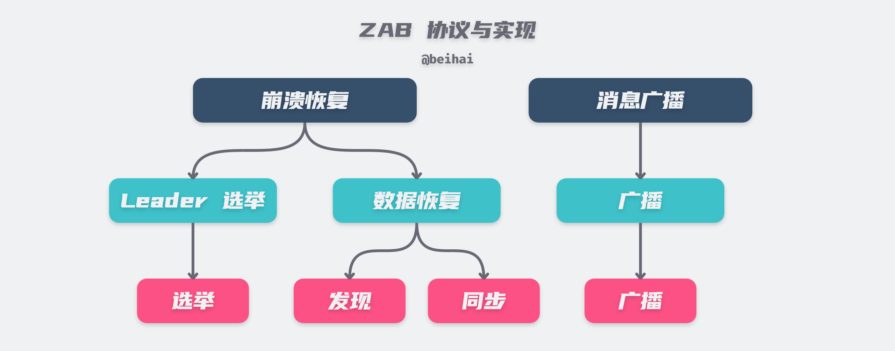
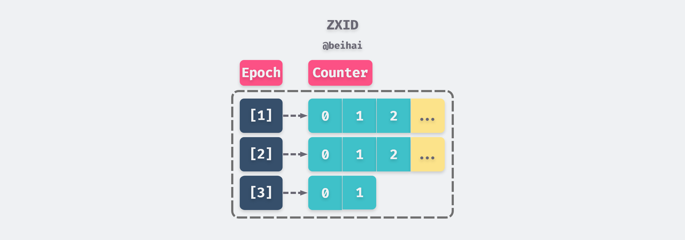
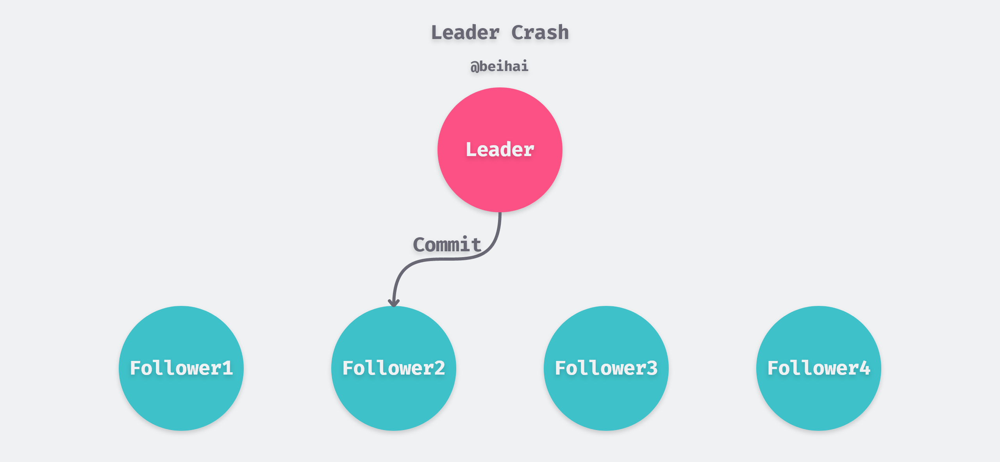
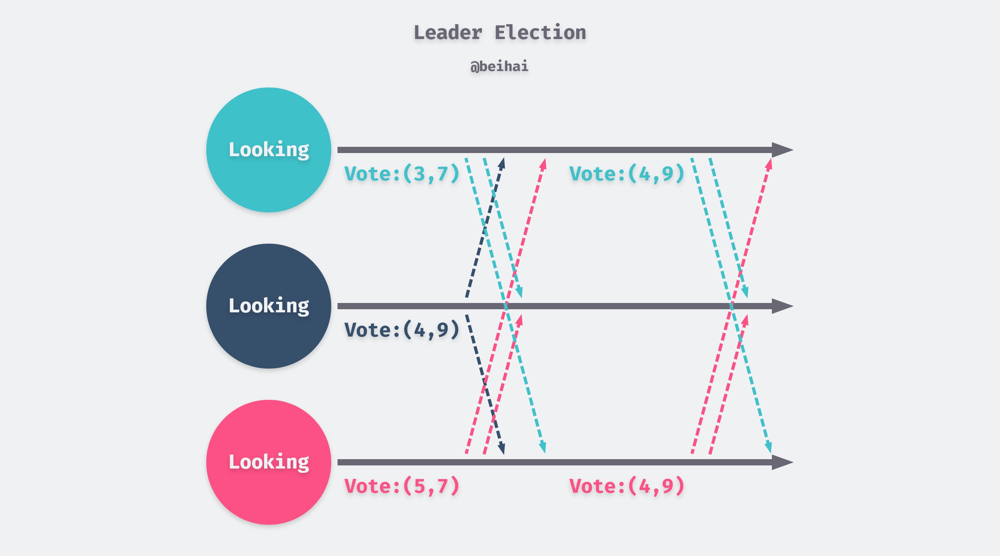
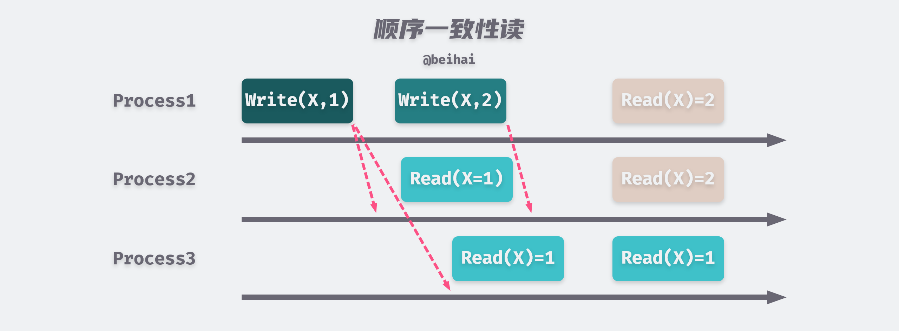
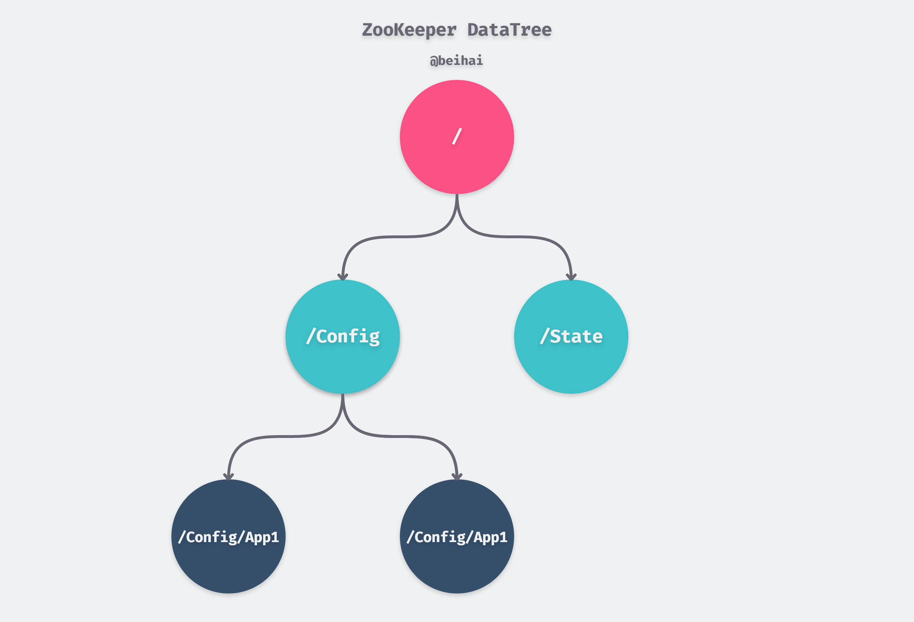

> ZooKeeper 是一个典型的分布式数据一致性解决方案，致力于提供一个高性能、高可用、且具有严格的顺序访问控制能力的分布式协调服务。在上一篇文章 *[分布式键值存储 etcd 原理与实现](https://wingsxdu.com/post/database/etcd/)* 中我们了解了分布式协调服务 etcd 关键模块的实现原理，在这篇文章中，我们看看 ZooKeeper 的实现思路。

ZooKeeper 由互联网公司雅虎创建，使用专门为该服务设计的 Zab 协议作为共识算法，基于该协议，ZooKeeper 实现了主备模式的系统架构，并以此保证集群中各个副本数据之间的一致性。下面将以 Zab 协议为中心展开介绍 ZooKeeper 的原理。

## Zab 协议

Zab 协议的全称是 ZooKeeper 原子广播协议（ZooKeeper Atomic Broadcast Protocol），从名字可以看出，Zab 协议是一种原子性的消息广播协议。Zab 协议借鉴了 Paxos 算法，具有一些相似之处，但又不像 Paxos 那样，是一种通用的分布式一致性算法，它是特别为 ZooKeeper 设计的支持崩溃恢复的原子广播协议。

关于 ZooKeeper 与 Zab 协议的原理介绍比较混乱，从大体上看，Zab 协议的原理可细分为四个阶段：**选举（Leader Election）、发现（Discovery）、同步（Synchronization）和广播（Broadcast）**。但是在 ZooKeeper 的实现中，将发现和同步两部分内容合成数据恢复一部分，所以按实现划分可以分为三个阶段：**Leader 选举（Fast Leader Election）、数据恢复（Recovery Phase）和广播（Broadcast Phase）**。按照功能的不同，可以划分为两个基本模式：**消息广播和崩溃恢复**。其中消息广播模式用于处理客户端的请求，崩溃恢复模式用于在节点意外崩溃时能够快速恢复，继续对外提供服务，让集群达成高可用状态。



#### 节点状态

ZooKeeper 中所有的写请求必须由一个全局唯一的 Leader 服务器来协调处理。ZooKeeper 客户端会随机连接到 ZooKeeper 集群中的一个节点，如果是读请求，就直接从当前节点中读取数据；如果是写请求，那么该节点就会向 Leader 转发请求，Leader 接收到读写事务后，会将事务转换为一个事务提案（Proposal），并向集群广播该提案，只要超过半数节点写入数据成功，Leader 会再次向集群广播 Commit 消息，将该提案提交。

目前 ZooKeeper 集群节点可能处于下面四种状态之一，分别是：

- **LOOKING**：进入 Leader 选举状态；
- **LEADING**：某个节点成为 Leader 并负责协调事务 ；
- **FOLLOWING**：当前节点是 Follower，服从 Leader 节点的命令并参与共识；
- **OBSERVING**：Observer 节点是只读节点，用于增加集群的只读事务性能，不参与共识与选举。

> Observer 节点是 ZooKeeper 实现中添加的服务器状态，与 Zab 协议无关。

Zab 集群使用`Epoch`（纪元）来表示当前集群所处的周期，每个 Leader 就像是一个领导人，都有自己的任期值，所以每次 Leader 变更之后，都会在前一个纪元的基础上加 1。Follower 只听从当前纪元 Leader 的命令，旧 Leader 崩溃恢复后，发现集群中存在更大的纪元，会切换为 FOLLOWING 状态。 

Zab 协议使用`ZXID` 来表示全局事务编号，`ZXID` 是一个 64 位数字，其中低 32 位是一个单调递增的计数器，针对客户端每一个事务请求，计数器都加 1；高 32 位则表示当前 Leader 的 Epoch，每当选举出一个新的主服务器，就会从集群日志中取出最大的 ZXID，从中读取出 Epoch 值，然后加 1，以此作为新的 Epoch，同时将低 32 位从 0 开始计数。



除此之外，ZooKeeper 中的每一个节点都拥有一个唯一标识 ID`myid `，这是一个位于 [1,255] 之间的整数，`myid `除了用于标识节点身分外，在 Leader 选举过程中也有着一定的作用。

#### 消息广播

ZooKeeper 的消息广播过程类似于两阶段提交，针对客户端的读写事务请求，Leader 会生成对应的事务提案，并为其分配 ZXID，随后将这条提案广播给集群中的其它节点。Follower 节点接收到该事务提案后，会先将其以事务日志的形式写入本地磁盘中，写入成功后会给 Leader 反馈一条 Ack 响应。当 Leader 收到超过半数 Follower 节点的 Ack 响应后，会回复客户端写操作成功，并向集群发送 Commit 消息，将该事务提交。Follower 服务器接收到 Commit 消息后，会完成事务的提交，将数据应用到数据副本中。

在消息广播过程中，Leader 服务器会为每个 Follower 维护一个消息队列，然后将需要广播的提案依次放入队列中，并根据『先入先出』的规则逐一发送消息。因为只要超过半数节点响应就可以认为写操作成功，所以少数的慢节点不会影响整个集群的性能。

#### 崩溃恢复

Zab 协议支持崩溃恢复，即当 Leader 节点出现崩溃中止，Follower 无法连接到 Leader 时，Follower 会切换为 LOOKING 状态，发起新一轮的选举。除此之外，如果 Leader 节点无法与过半的服务器正常通信，Leader 节点也会主动切换为 LOOKING 状态，将领导权让位于网络环境较好的节点。

为了维护集群的数据一致性，Zab 协议需要在崩溃恢复的过程中保证下面两个特性：

1. Zab 协议需要确保**已经在 Leader 服务器上提交（Commit）的事务最终被所有服务器提交**；
2. Zab 协议需要确保**丢弃那些只在 Leader 上提出但没有被提交的事务**。

第一条特性是指，因为 Zab 协议中只要超过半数节点写入数据并响应，Leader 就会回复客户端写操作成功，如果此时 Leader 节点崩溃，可能只有少数的 Follower 节点收到了 Commit 消息。例如在下图中，只有 Follower2 节点收到了 Commit 信息，那么在选举过程中，需要 Follower2 节点成功当选 Leader，并将自身的数据同步给集群中的其它节点。



产生第二条特性的情况就比较复杂了，Leader 节点可能是在等待半数 Follower 的 Ack 响应期间崩溃，也可能是在发送 Commit 消息之前崩溃，甚至可能是在广播事务提案的过程中崩溃。但无论是何种情况，可以确定的是集群中没有任何一个 Follower 将数据提交。因此当一个新 Leader 产生时，它会抛弃记录在事务日志但没有提交的事务。

从客户端的角度看，因为 Leader 还没有将事务提交，所以也就没有收到主节点的写操作成功响应，这条事务是失败的。

在 ZooKeeper 的实现中，崩溃恢复需要经历 Leader 选举与数据恢复这两个阶段。

##### Leader 选举

当集群进行 Leader 选举时，集群中所有的服务器都处于 LOOKING 状态，每个节点会向所有其他机器发送投票消息。投票消息中包含了以下关键字段：

```java
// 投票者的 myid
QuorumPeer self;
// 逻辑时钟，当前选举周期，每次投票都会自增
AtomicLong logicalclock = new AtomicLong(); /* Election instance */
// 被选举者服务器的 myid
long proposedLeader;
// 被选举者服务器的 ZXID
long proposedZxid;
// 被选举者服务器的 Epoch
long proposedEpoch;
```

在第一次投票时，每台服务器都会将自己作为投票对象，并向集群广播投票消息。为了达成第一条特性， Zab 协议需要保证拥有最新数据的服务器当选 Leader，因此每台机器会根据下面的规则来处理收到的其他节点的投票，并以此来决定是否需要变更自己的投票：

1. 对比自身与投票消息中被选举者的 Epoch，并选择两者中的较大值作为新的选举服务器，如果相等进入第二步比较；
2. 对比自身与投票消息中被选举者的 ZXID，并选择两者中的较大值作为新的选举服务器，如果相等进入第三步比较；
3. 对比自身与投票消息中被选举者的 myid，并选择两者中的较大值作为新的选举服务器。



再上图中，集群中有 myid 分别为 3、4、5 的三个节点，因为 4 号节点拥有更大的 ZXID 为 9 ，所以 3 号和 5 号节点更改了自己的推举服务器。如果服务器的推举节点发生变更，那么它会向集群广播新的投票消息，一旦某个节点拥有半数以上的投票，就会切换成 Leader。

##### 数据恢复

数据恢复阶段需要先经历发现过程：被选举出来的 Leader 会与 Follower 节点建立长连接，每个 Follower 都会向 Leader 发送一条 FOLLOWERINFO 信息，其中包含 Follower 节点当前的`peerEpoch`值，Leader 会从中选出一个最大的`peerEpoch`，然后加 1 作为新的 `peerEpoch`。随后 Leader 会向集群广播这一新的 Epoch 值，发现过程是为了让集群进入统一的纪元，服从 Leader 的领导地位。

发现过程结束后，集群会进入同步过程，Follower 会向 Leader 发送`lastCommittedZxid`，这个值代表着 Follower 节点最后一条被提交事务的 ID。Leader 会根据这个值向 Follower 发送缺少的事务提案，从而让整个集群中所有数据副本达成一致的状态。同步阶段的协议理论与具体实现有一点区别，在协议中，Follower 只会接收比自己的`lastCommittedZxid`大的提案；但是在实现中，如果 Leader 的`lastZxid`小于`lastCommittedZxid`，那么它会向 Follower 发送 TRUNC 指令截断掉后面的提案。

数据恢复阶段结束后，Zookeeper 集群才能正式对外提供事务服务，也就是进入了上文的消息广播阶段。

#### 顺序一致性读

在上一篇文章的 *[线性一致性读](https://wingsxdu.com/post/database/etcd/#%E7%BA%BF%E6%80%A7%E4%B8%80%E8%87%B4%E6%80%A7%E8%AF%BB)* 一节中提到 etcd 利用 ReadIndex 机制实现了线性一致性读，由于 Zab  协议采用过半写入策略，所以读操作只能达到顺序一致性。顺序一致性模型中所有的进程都以相同的顺序看到所有的修改，其它进程的读操作未必能够获得最新的数据，但是每个进程读到的该数据不同值的顺序却是一致的。



为了避免 Follower 的数据过时，ZooKeeper 提供了`sync()`方法保证读取到最新的数据。调用`sync()`后会先发起一次虚拟的写操作，但不做任何数据写入，由于满足顺序顺序一致，所以等这次虚拟写操作执行完成后，就能够保证读到`sync()`时间点前所有的正确数据。

#### Zab 与 Raft

了解 Zab 协议的原理与实现后，我们可以看出，Zab 和 Raft 协议在实现上其实有非常多的相似点，例如：

- 都具有唯一的主节点 Leader，主节点会向所有的从节点发出提案；
- Zab 协议中的每一个提案都包含一个 Epoch 值，在 Raft 中称为任期值 term ；
- 使用两阶段提交与半数写入策略，即只要有 50% 以上节点的确认，就提交当前提案。

Zab 和 Raft 这两种共识算法都需要保证主从节点间事务数据一致性，集群中任意一个数据副本都按照客户端的请求执行了相同顺序的命令，即在给定请求序列的情况下，即使副本以不同的顺序接收，数据副本始终进行相同的内部状态转换并产生相同的答复。在集群运行的过程中，如果主节点出现了错误导致宕机，其他的节点会重新开始进行选举。

## 数据与存储

ZooKeeper 的数据存储分为两部分：磁盘持久化存储与内存数据存储。为了保障高性能，ZooKeeper 将数据存储在内存中，并通过事务日志与快照将数据持久化到磁盘上。

#### 磁盘数据

ZooKeeper 的事务日志本质上也是预写日志（WAL），事务日志会记录客户端的每个数据变更操作。每个事务日志的文件大小为 64MB，并利用该事务日志文件第一条记录的 ZXID 作为文件名后缀。为了提高磁盘的写 I/O 效率，ZooKeeper 的事务日志文件采取『磁盘空间预分配』策略，即在文件创建之初就向操作系统申请 64MB 的磁盘空间，当文件的剩余空间不足 4KB 时会再次预分配。

ZooKeeper 也会生成快照文件来对整个内存数据进行备份，但是 ZooKeeper 的快照并不是精确到某一时刻的快照文件，而是在生成快照的时间段内节点的数据状态。ZooKeeper 使用异步线程生成快照，由于多线程之间共享同一段内存空间，所以生成快照期间，如果数据发生更改，也有可能被记录到快照中。

为了尽量避免 ZooKeeper 集群内的所有节点在同一时间段开始生成快照，影响整体的性能，ZooKeeper 采用『过半随机』策略来决定经过`snapCount`次事务后生成快照：如果配置的`snapCount`默认值为 10,000，那么每个节点会在 5,000~10,000 之间生成一个随机值，超过该值后会独立地自动生成快照。

#### 内存数据

ZooKeeper 的内存数据模型是一颗树，每一个数据节点都被称为一个 ZNode，我们可以在 ZNode 中写入数据，也可以创建子节点。所有的 ZNode 按照层次化结构进行组织，最终形成一颗 DataTree。DataTree 的节点路径使用斜杠`/`进行分割表示：



DataTree 通过一个名为`nodes`的哈希表维护整个树的数据，定义如下：

```java
private final NodeHashMap nodes;
```

NodeHashMap 是 ZooKeeper 自己实现的一个哈希表，DataTree 中的所有数据都存储在这个哈希表中。这个哈希表的 key 是 string 类型的节点路径名称，value 是 DataNode 对象，每个 DataNode 都表示某个节点路径的数据和状态。

DataNode 的定义中，包含一个用于存储数据的`data`字段，客户端发送的键值对的值就存储在这里。DataNode 还维护了一个子节点列表`children`，通过`children`建立父子节点的对应关系。

```java
// zookeeper/zookeeper-server/src/main/java/org/apache/zookeeper/server/DataNode.java
public class DataNode implements Record {
    private volatile long digest;        // the digest value of this node, calculated from path, data and stat
    byte[] data;                         // the data for this datanode.
    Long acl;                            // the acl map long for this datanode. the datatree has the map.
    public StatPersisted stat;           // the stat for this node that is persisted to disk.
    private Set<String> children = null; // the list of children for this node.
}
```

实际上，整个 DataTree 就是一个巨大的字典，虽然在物理存储上是平行的数据结构，但是通过建立数据节点间的父子对应关系，可以对外提供树形的逻辑视图。 

#### 版本与并发控制

ZooKeeper 为数据节点引入了版本号的概念，每个数据节点都具有三种类型的版本信息：

- **version**：当前数据节点数据内容的版本号；
- **cversion**：当前数据节点子节点的版本号；
- **aversion**：当前数据节点 ACL（Access Control List）权限的版本号。

其中`version`就是当前节点的修改次数，即使修改前后数据内容没有发生变化，但`version`仍会 +1；`cversion` 表示子节点列表信息变更次数，新增、删除字节点时都会自增，但不会感知子节点数据内容的变化。

ZooKeeper 使用乐观锁 CAS（Compare And Switch）进行并发控制，在处理读写请求过程中，会获取当前请求的版本`expectedVersion`与服务器中数据节点中的版本`currentVersion`。如果请求总的`expectedVersion`为 -1，表明客户端不要求使用乐观锁，可以直接将数据写入，否则会将两个版本号进行对比，如果相同，则将其递增的值后写入数据节点。

```java
// zookeeper/zookeeper-server/src/main/java/org/apache/zookeeper/server/PrepRequestProcessor.java
private static int checkAndIncVersion(int currentVersion, int expectedVersion, String path) 
throws KeeperException.BadVersionException {
    if (expectedVersion != -1 && expectedVersion != currentVersion) {
            throw new KeeperException.BadVersionException(path);
    }
    return currentVersion + 1;
}
```

## 会话

会话（Session）是 ZooKeeper 中重要的概念的之一，ZooKeeper 的客户端中，配置了一个`ensemble`服务器列表。当客户端启动时，会尝试与其中一个服务器建立长连接。如果尝试连接失败，那么会继续尝试连接下一个服务器，直到连接成功或者尝试连接全部失败。

客户端在建立网络连接的过程中会创建一个 Session，Session 从 CONNECTING 状态开始，当客户端连接到 ZooKeeper 集群中的某个服务器时，它将切换到 CONNECTED 状态。在正常运行期间，Session 将处于这两种状态之一。如果发生不可恢复的错误，例如会话到期或身份验证失败，或者如果应用程序关闭了会话连接，则该 Session 将切换到 CLOSED 状态。

每一个 Session 都包含四个基本属性：**会话的唯一 ID（sessionID）、会话超时时间（TimeOut）、会话的下次超时时间点（TickTime）和表示会话是否被关闭的标记（isClosing）**。

Session 的过期时间由创建会话的客户端应用来设定，如果在这个时间段内，服务器没有收到来自客户端的任何消息，那么 Session 将被视为过期，在这个 Session 期间内创建的临时数据节点也将会被删除，并且这个 Session 不能被重新创建，如果要重新建立连接，就需要重新创建一个实例。

Zookeeper 利用会话管理器`SessionTracker`负责所有会话的创建、管理以及清理工作，其采用了『分桶策略』对会话进行管理，`SessionTracker`按照会话的下次超时时间点将会话分配在不同的区块中，以便于对不同区块的会话隔离处理以及统一区块的会话统一处理。

> 会话的下次超时时间点可以粗略地认为等于当前时间加上会话超时时间，实际上略有不同。

## 总结

这篇文章并没有详细介绍 ZooKeeper 的实现细节，主要内容在于分析 Zab 协议是如何构建高可用的主备系统。其实无论是 Zab 还是 Raft 一旦发生节点分区情况，都是是牺牲了短暂的可用性来保证一致性，即满足 CAP 理论中的 CP 属性，但是在没有分区发生的情况下既能保证高可用又能保证一致性。

所以说通常认为的 CAP 三者取其二，并不是说该系统一直保持 CP 或者 AP，而是一个会变化的过程：正常运行时可以满足所有的条件，当出现分区情况时，那就需要从 C 和 A 中做出取舍。

## Reference

- [Zookeeper Zab 协议分析](https://blog.xiaohansong.com/Zab.html)
- [Zab vs. Paxos](https://cwiki.apache.org/confluence/display/ZOOKEEPER/Zab+vs.+Paxos)
- [Raft协议和Zab协议及其对比](https://niceaz.com/2018/11/03/raft-and-Zab/)
- [ZooKeeper Programmer's Guide](https://zookeeper.apache.org/doc/r3.6.1/zookeeperProgrammers.html)
- [一致性协议浅析：从逻辑时钟到Raft](https://developer.aliyun.com/article/690624)