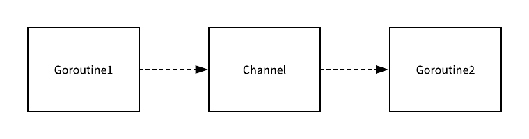

> *原理分析（Analyze The Principles）是一系列对计算机科学领域中的程序设计进行分析，每一篇文章都会着重于某一个实际问题。如果你有想了解的问题、错误指正，可以在文章下面留言。*

Go 语言最吸引人的地方是它内建的并发支持。Go 语言并发体系的理论是 C.A.R Hoare 在 1978 年提出的 CSP 模型（Communicating Sequential Process，通讯顺序进程）。在并发编程中，目前的绝大多数语言，都是通过加锁等线程同步方案来解决数据共享问题，而 Go 语言另辟蹊径，它将共享的值通过 Channel 传递。在任意给定的时刻，最好只有一个Goroutine 能够拥有该资源。数据竞争从设计层面上就被杜绝了。

## 概述

Go 的 CSP 并发模型，是通过`goroutine`和`channel`来实现的。

- **Goroutine** ：Go 语言中并发的执行单位。是一种轻量线程，它不是操作系统的线程，而是将一个操作系统线程分段使用，通过调度器实现协作式调度。
- **Channel**：Goroutine 之间的通信机制，类似于 UNIX 中的管道。

在 Go 语言中，一个最常见的也是经常被人提及的设计模式就是**不要通过共享内存的方式进行通信，而是应该通过通信的方式共享内存**，在很多主流的编程语言中，当我们想要并发执行一些代码时，我们往往都会在多个线程之间共享内存空间，同时为了解决线程冲突的问题，我们又需要在读写这些内存空间时加锁。


Go 语言对于并发编程的设计与上述这种共享内存的方式完全不同，虽然我们在 Golang 中也能使用共享内存加互斥锁来实现并发编程，但是与此同时，Go 语言也提供了一种不同的并发模型，Goroutine 其实就是 CSP 中的实体，Channel 就是用于传递信息的通道，使用 CSP 并发模型的 Goroutine 就会通过 Channel 来传递消息。



上图中的两个 Goroutine，一个会负责向 Channel 中发送消息，另一个会负责从 Channel 中接收消息，它们两者并没有任何直接的关联，能够独立地工作和运行，但是间接地通过 Channel 完成了通信。

## Goroutine 和内核线程

Goroutine，是 Go 语言基于并发编程给出的解决方案。通常 Goroutine 会被当做 Coroutine（协程）的 Golang 实现，从比较粗浅的层面来看，这种认知也算是合理。但实际上，传统的协程库属于**用户级线程模型**，而 Goroutine 和它的`Go Scheduler`在底层实现上属于**两级线程模型**。有时候为了方便理解可以简单把 Goroutine 类比成协程，但心里一定要有个清晰的认知 — Goroutine 并不等同于协程。

Goroutine 使用方式非常简单，只需使用 `go` 关键字即可启动一个协程，并且它是以异步方式运行，你不需要等它运行完成以后再执行后面的代码。

```go
go func() // 通过go关键字启动一个协程来运行函数
```

#### 状态

Goroutine 在 Go 语言运行时使用一个名为 `g` 的私有结构体表示，这个私有结构体非常复杂，总共有 40 多个用于表示各种状态的成员变量。其中的字段 `atomicstatus` 就存储了当前 Goroutine 的状态，除了几个已经不被使用的以及与 GC 相关的状态之外，全部常见的状态都展示在这里：

> 内容源自博主 [draveness.me](https://draveness.me/golang/docs/part3-runtime/ch06-concurrency/golang-goroutine/)

| 状态        | 描述                                                         |
| ----------- | ------------------------------------------------------------ |
| _Gidle      | 刚刚被分配并且还没有被初始化                                 |
| _Grunnable  | 没有执行代码、没有栈的所有权、存储在运行队列中               |
| _Grunning   | 可以执行代码、拥有栈的所有权，被赋予了内核线程 M 和处理器 P  |
| _Gsyscall   | 正在执行系统调用、拥有栈的所有权、没有执行用户代码，被赋予了内核线程 M 但是不在运行队列上 |
| _Gwaiting   | 由于运行时而被阻塞，没有执行用户代码并且不在运行队列上，但是可能存在于 Channel 的等待队列上 |
| _Gdead      | 没有被使用，没有执行代码，可能有分配的栈                     |
| _Gcopystack | 栈正在被拷贝、没有执行代码、不在运行队列上                   |

上述状态中比较常见是 `_Grunnable`、`_Grunning`、`_Gsyscall` 和 `_Gwaiting` 四个状态，Goroutine 中所有状态的迁移是一个非常复杂的过程，会触发 Goroutine 状态迁移的方法也非常多。

虽然 Goroutine 在运行时中定义的状态非常多而且复杂，但是我们可以将这些不同的状态简化为三种：**等待中**、**可运行**、**运行中**，在运行期间我们会在这三种不同的状态来回切换：


- 等待中：表示当前 Goroutine 等待某些条件满足后才会继续执行，例如当前 Goroutine 正在执行系统调用或者同步操作；
- 可运行：表示当前 Goroutine 等待在某个 M 执行 Goroutine 的指令，如果当前程序中有非常多的 Goroutine，每个 Goroutine 就可能会等待更多的时间；
- 运行中：表示当前 Goroutine 正在某个 M 上执行指令；

#### 与线程的区别

谈到 Goroutine，绕不开的一个话题：它和线程有什么区别？

首先，每个系统级线程都会有一个固定大小的栈（一般默认是 2MB），这个栈主要用来保存函数递归调用时参数和局部变量。固定栈的大小导致了两个问题：一是对于很多只需要很小的栈空间的线程来说是一个巨大的浪费，二是对于少数需要巨大栈空间的线程来说又面临栈溢出的风险。针对这两个问题的解决方案是：要么降低固定的栈大小，提升空间的利用率；要么增大栈的大小以允许更深的函数递归调用，但这两者是没法同时兼得的。相反，一个 Goroutine 会以一个很小的栈启动（2KB ），当遇到深度递归导致当前栈空间不足时，Goroutine 会根据需要动态地伸缩栈的大小（目前主流实现中栈的最大值可达到 1GB）。因为启动的代价很小，所以我们可以轻易地启动成千上万个 Goroutine。

Go 的运行时还包含了其自己的调度器，这个调度器使用了一些技术手段，可以在 n 个操作系统线程上多工调度 m个 Goroutine。Go 调度器的工作和内核的调度是相似的，但是这个调度器只关注单独的 Go 程序中的Goroutine。Goroutine 采用的是半抢占式的协作调度，只有在当前 Goroutine 发生阻塞时才会导致调度，发生在用户态，不需要内核上下文切换。调度器会根据具体函数只保存必要的寄存器，切换的代价要比系统线程低得多。

参考资料 [How Goroutines Work](https://blog.nindalf.com/posts/how-goroutines-work/)，我们可以从三个角度比较与内核线程的优势：内存占用、上下文切换、创建与销毀。

**内存占用**

创建一个 Goroutine 的栈内存消耗为 2 KB，实际运行过程中，如果栈空间不够用，会自动进行扩容。创建一个线程则需要消耗 1 MB 栈内存，而且还需要一个`a guard page`区域用于和其他线程的栈空间进行隔离。

对于一个用 Go 构建的 HTTP Server 而言，对到来的每个请求，创建一个 Goroutine 用来处理是非常轻松的一件事。而如果用线程进行处理，每个请求对应一个线程则太浪费资源了，很快会出现内存溢出错误。

**上下文切换**

当内核线程切换时，需要保存各种寄存器，以便将来恢复：

> 16 general purpose registers, PC (Program Counter), SP (Stack Pointer), segment registers, 16 XMM registers, FP coprocessor state, 16 AVX registers, all MSRs etc.

而 Goroutines 切换只需保存三个寄存器：PC、SP 和 BP。

一般而言，线程的上下文切换会消耗 ~1us，而 Goroutine 的切换需要 ~200ns，减少了 80% 的额外开销。因此，Goroutines 切换成本比内核线程要小得多。

**创建和销毀**

内核级线程的创建和销毁需要调用系统调用，CPU 需切换至内核态并进行上下文切换，这都会消耗巨大的资源，通常解决的办法就是线程池。而 Goroutine 是由 Go runtime 负责管理的，不需要进行上下文切换，创建和销毁的消耗非常小。

## G-P-M 模型调度

Go 的调度器内部有三个重要的结构：M、P、G。

<div align="center"></div>
- M：Machine，表示的是操作系统线程，代表着真正执行计算的资源。M 并不保留 G 状态，这是 G 可以跨 M 调度的基础。M 的数量是不定的，在默认情况下调度器能够允许创建 `10000` 个线程，但是其中绝大多数的线程都不会执行用户代码（可能陷入系统调用），最多只会有 `GOMAXPROCS` 个线程 M 能够正常运行。
- P： Processor，表示逻辑处理器。 对 G 来说，P 相当于 CPU 核，G 只有绑定到 P （在 P 的 local  队列中）才能被调度。对 M 来说，P 提供了相关的执行环境，如内存分配状态、任务队列等， P 的数量决定了系统内最大可并行的 G 的数量（前提物理 CPU 核数 >= P 的数量）。P 的数量可由`GOMAXPROCS`设置，默认等于 CPU 数量，它其实也就代表了真正的并发度，即有多少个 Goroutine 可以同时运行。
- G：Goroutine，每个 Goroutine 对应一个`g` 结构体，`g` 存储 Goroutine 的运行堆栈、状态以及任务函数，可重用。G 并非执行体，每个 G 需要绑定到 P 才能被调度执行。

当通过` go `关键字创建一个新的 Goroutine 的时候，它会优先被放入 P 的本地队列。为了运行 Goroutine，M 需要持有一个 P，循环从 P 的本地队列里取出一个 Goroutine 并执行。

<div align="center"></div>
从上图中可以看到，有 2 个物理线程 M，每一个 M 都拥有一个处理器 P，每一个 P 也都有一个正在运行的 Goroutine 和多个等待中的 Goroutine。

在绑定有效的 P 后，进入调度器循环。调度器循环的机制大致是从 Global 队列、P 的 Local 队列以及 Wait 队列中获取 G，切换到 G 的执行栈上并执行 G 的函数，调用 goexit 做清理工作并回到 M，如此反复。M 并不保留 G 状态，这是 G 可以跨 M 调度的基础。

#### Work Stealing

Go 调度器工作时会维护两种用来保存 G 的任务队列：一种是一个 Global 任务队列，一种是每个 P 维护的 Local 任务队列。

由于 Go 语言是协作式的调度，不会像线程那样，在时间片用完后，由 CPU 中断任务强行将其调度走。Go scheduler 有一个后台线程`sysmon`在持续监控，一旦发现某个 G 运行超过 10ms，会设置该 G 的“抢占标志位”。但调度器并不会立即将其换下 P，G 会一直执行下去，直到被阻塞后（例如系统调用、等待 I/O），调度器会将其调度到 Global 任务队列。这是一个全局的任务队列，优先级比较低，以示惩罚。

当 M 执行完了当前 P 的 Local 队列里的所有 G 后，P 会从其他 P “偷” 一些 G 来运行，被称为` work-stealing `调度，它会先尝试从 Global 队列寻找 G 来执行，如果 Global 队列为空，它会随机挑选另外一个 P，从它的队列里中拿走一半的 G 到自己的队列中执行。


#### 为什么要有 P(Processor) ？

在 Go 1.0 发布的时候，它的调度器其实 G-M 模型，调度过程全由 G 和 M 完成，这个模型暴露出一些问题：

- 单一全局互斥锁和集中状态存储的存在导致所有 Goroutine 相关操作，比如：创建、重新调度等都要上锁；
- goroutine 传递问题：M 经常在 M 之间传递『可运行』的 Goroutine，这导致调度延迟增大以及额外的性能损耗；
- 每个 M 做内存缓存，导致内存占用过高，数据局部性较差；
- 由于系统调用而形成的剧烈的内核线程阻塞和解除阻塞，导致额外的性能损耗。

这些问题实在太扎眼了，导致 Go1.0 虽然号称原生支持并发，却在并发性能上一直饱受诟病，然后，Go 语言委员会中一个核心开发大佬看不下了，亲自下场重新设计和实现了 Go 调度器（在原有的 G-M 模型中引入了 P）并且实现了一个叫做 [*work-stealing*](https://supertech.csail.mit.edu/papers/steal.pdf) 的调度算法：

- 每个 P 维护一个 G 的本地队列；
- 当一个 G 被创建出来，或者变为可执行状态时，就把他放到 P 的可执行队列中；
- 当一个 G 在 M 里执行结束后，P 会从队列中把该 G 取出；如果此时 P 的队列为空，即没有其他 G 可以执行， M 就随机选择另外一个 P，从其可执行的 G 队列中取走一半。

一个很简单的例子就是系统调用 `sysall`，一个线程肯定不能同时执行代码和系统调用被阻塞，这个时候，此线程M 需要放弃当前的上下文环境 P，以便可以让其他的 `Goroutine` 被调度执行。

#### 同步与异步

发生同步情况时，G 可能要系统调用，M 会被阻塞，进而从 P 上调度下来，G 仍然依附于 M。之后，一个新的 M 会被调用到 P 上，继续执行 Local 队列里面的G。当阻塞完成后，G 还会加入到 P 的 Local 队列里，M 则会被“雪藏”，待到需要时再“放”出来。

<div align="center"></div>
对于异步的情况，G 可能在等待一些网络 I/O，M 不会被阻塞，G 的异步请求会被对应的 I/O 接手，G 也会被绑定到对应的 I/O 上。当等待结束后，G 会重新回到 P 上。M 由于没被阻塞，它因此可以继续执行 Local 队列里的其他 G。

## Reference 与图片来源

- [Goroutine 并发调度模型深度解析](https://taohuawu.club/high-performance-implementation-of-goroutine-pool)
- [Goroutine](https://draveness.me/golang/docs/part3-runtime/ch06-concurrency/golang-goroutine/)
- [上下文 Context](https://draveness.me/golang/docs/part3-runtime/ch06-concurrency/golang-context/)
- [深度解密Go语言之 scheduler](https://juejin.im/post/5d6cfa13518825267a75685e#heading-5)
- [How Goroutines Work](https://blog.nindalf.com/posts/how-goroutines-work/)
- [面向并发的内存模型](https://chai2010.gitbooks.io/advanced-go-programming-book/content/ch1-basic/ch1-05-mem.html)

## 相关文章

- [内存空洞](https://www.wingsxdu.com/post/golang/golang-memory-holes/)
- [Go 语言 GC 机制 · Analyze](https://www.wingsxdu.com/post/golang/gc)
- [Goroutine 与 Go 语言并发模型 · Analyze](https://www.wingsxdu.com/post/golang/goroutine)