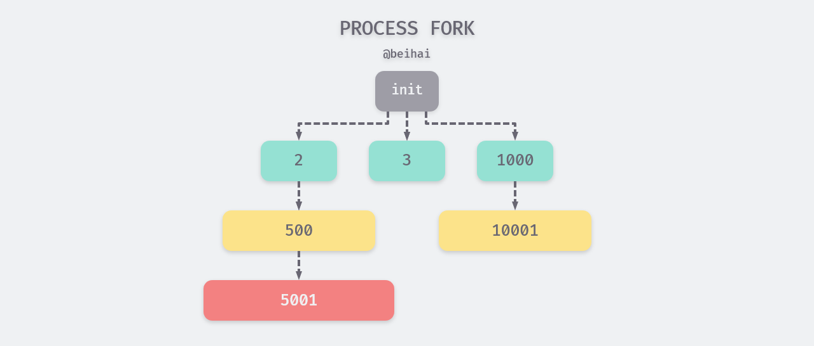
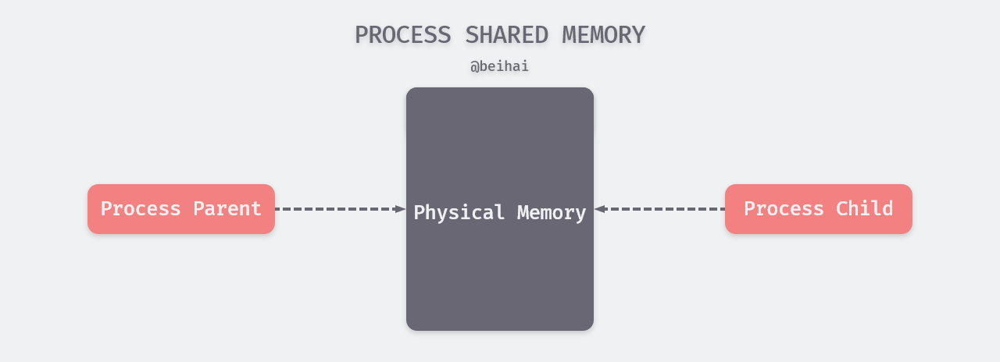

`fork`是目前使用最广泛的进程创建机制，进程通过系统调用函数`fork`能够创建若干个新的进程，前者称为父进程，后者称为子进程。为了减少进程创建的开销，现代操作系统会使用**写时复制**技术，父进程与子进程共享同一内存空间，从而实现数据的“拷贝”，这篇文章将会分析这个问题。


## 概述

操作系统内的每一个进程都有父进程，所有进程形成了一个树形结构。当系统启动时，会建立一个 init 进程（ID 为 1），其它的进程都是 init 进程通过`fork`建立的。init 进程的父进程为它自己，如果某一个进程先于它的子进程结束，那么它的子进程将会被 init 进程“收养”，成为 init 进程的直接子进程。



一个现有的进程可以通过 fork 函数来创建一个新的子进程，当程序调用了 fork 方法之后会返回两次返回值，我们就可以返回值来确定父子进程，以此执行不同的操作：

- `fork` 函数返回 0 时，意味着当前进程是子进程；
- `fork` 函数返回大于 0 时，意味着当前进程是父进程，返回值是子进程的 `pid`；

```c
int main(void) {
    pid_t pid;
    if (-1 == (pid = fork())) { //等于 -1 时表明 fork 出错
        perror("fork error");
        return -1;
    }
    else if (0 == pid) {
        printf("I am child，parent pid is %d\n", getppid());
    }
    else {
        printf("I am parent, child pid is %d\n", pid);
    }
    return 0;
}
```

## fork 流程

#### 内存布局

进程创建时，系统内核会为进程分配虚拟内存空间，内核会将虚拟内存分为用户空间与内核空间两部分，用户空间占据地址的低部分，大小为 0 到 TASK_SIZE，剩下的部分则为内核空间。划分情况如图所示：


从低地址到高地址的用户空间内存区域排列为：

1. 程序段(Text)：CPU 执行的程序指令部分，为了程序的安全性，通常情况下是只读的；程序段可以被父子进程共享；
2. 初始化的数据段(Data)：在程序执行之前已经明确赋值的变量部分；

3. 未初始化的数据段(BSS)：在程序执行前未对变量进行初始化的数据，内核会将这段数据定义为 0 或 空；
4. 运行时堆 (Heap)：存储动态内存分配，需要程序员手工分配、释放，堆区域由低地址向高地址增长；
5. 内存映射段(Memory Mapping)：内存映射文件区，加载动态链接库、文件描述符等，可以向高/低地址扩展；
6. 运行时栈 (Stack)：存储局部、临时变量、函数的返回指针等，用于控制函数的调用和返回。在程序块开始时自动分配内存，结束时自动释放内存，栈区域由高地址向低地址增长。

当 `fork` 发生时子进程会拷贝父进程的内存数据，子进程几乎是父进程的完整副本，获得父进程的数据段、堆和栈的副本。两者的内存空间几乎有着完全相同的内容。

但在另一方面，调用 `fork` 后，父子进程会运行在独立的内存空间中，对内存的写入和修改、文件的映射都是独立的，进程之间不会相互影响。

#### 系统调用 exec

当`fork`函数创建新的子进程后，子进程往往会调用另一个系统调用函数：exec，`exec`函数会从程序文件中加载并替换调用进程的 Text、Data 段，重新初始化 BSS 段等。这导致`fork`时拷贝的内存数据又被覆盖掉，白白浪费了资源。

> exec 是一系列 execxxx() 函数的统称，可参考 [wiki 百科](https://en.wikipedia.org/wiki/Exec_(system_call))

当进程调用`exec`函数时，源进程程序完全由新程序代换，而新程序则从其 main 函数开始执行。因为调用`exec`并不创建新进程，所以前后的进程 ID 并未改变。**exec 只是用另一个新程序替换了当前进程的正文、数据、堆和栈段**。特别地，**在原进程中已经打开的文件描述符，在新进程中仍将保持打开**，除非它们的“执行时关闭标志”被置位。

事实上新程序会继承调用进程的许多属性，下面列举了部分：

- 进程 ID、父进程 ID、进程组 ID
- 实际用户 ID 和实际组 ID
- 当前工作目录
- 文件锁
- ······

#### 写时复制

现在我们了解到，进程在`fork`创建子进程时几乎拷贝了父进程的所有数据，这可能导致进程的创建效率十分低效；除此之外，子进程通常会加载新的程序覆盖拷贝的数据段、堆栈等，这又使得先前复制的数据全部浪费掉；就算没有执行`exec`函数，从父进程拷贝的大量内存数据对子进程来讲可能没有任何意义。

作为替代，系统内核在`fork`时使用了写时复制（Copy-On-Write）技术，写时复制的主要作用就是**将复制推迟到写操作真正发生时**，这也就避免了大量无意义的复制操作。现在的多数操作系统中，`fork` 并不会立刻对父进程的内存空间进行复制，而是利用共享同一物理内存：



在 `fork` 函数调用时，父进程和子进程会被内核分配不同的虚拟内存空间，所以从进程的角度看它们访问的是不同的内存：

- 在虚拟内存空间进行读操作时，内核会将虚拟内存映射到物理内存上，父子进程共享了物理上的内存空间；
- 当父进程对共享的内存进行修改时，共享的内存会**以页为单位进行拷贝**，父进程会对原有的物理空间进行修改，而子进程会使用拷贝后的新物理空间；
- 当子进程对共享的内存进行修改时，子进程会在拷贝后的新物理空间上进行修改，而不会改动原有的物理空间，避免影响父进程的内存空间；

写时复制减少了不必要的物理内存的开销，使得进程的创建速度非常快，提供了一种很好的共享内存使用思想。在一些内存型数据库、大数据分析等应用场景下都具有借鉴意义。

## 总结

回归题目，为什么在`fork`时采用了写时复制技术？

- `fork`时需要复制大量的内存数据；
- 拷贝的数据对子进程来讲可能起不到任何作用；
- 如果子进程调用`exec`还会覆盖拷贝的数据；
- 如果父进程占用了大量物理内存资源，剩下的内存空间可能无法满足子进程需求。

但写时复制技术也有一定的缺点，如果父子进程频繁进行写操作，可能会产生大量的分页错误(页异常中断page-fault)，这样就得不偿失。因此在使用写时复制操作时，要特别注意需求是写多读少还是写少读多，选择合适的应用场景。

## Reference

- [为什么 Redis 快照使用子进程 · Why's THE Design?](https://draveness.me/whys-the-design-redis-bgsave-fork)
- [进程地址空间分布](https://blog.csdn.net/wangxiaolong_china/article/details/6844325)
- [fork 函数详解](https://www.yanbinghu.com/2019/08/11/28423.html)

## 相关文章

- [为什么进程 fork 采用写时复制 · Why](https://www.wingsxdu.com/post/linux/concurrency-oriented-programming/fork-and-cow/)
- [浅论并发编程中的同步问题 · Analyze](https://www.wingsxdu.com/post/linux/concurrency-oriented-programming/synchronous/)
- [浅析进程与线程的设计 · Analyze](https://www.wingsxdu.com/post/linux/concurrency-oriented-programming/process-and-thread/)