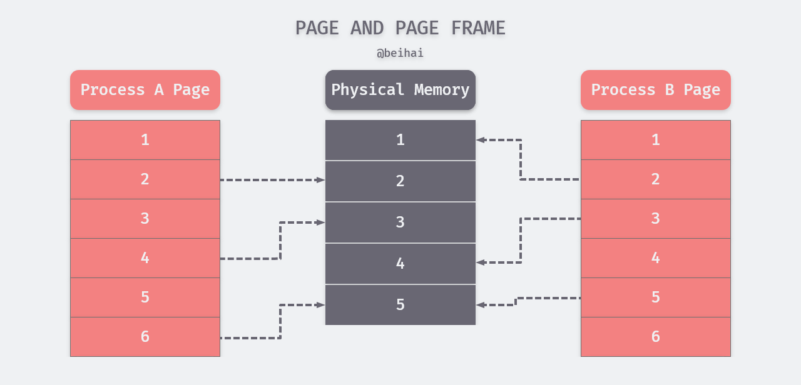
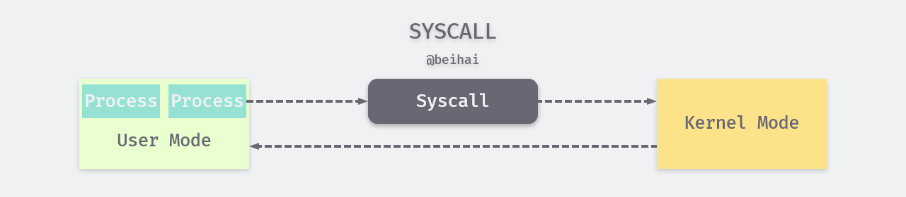
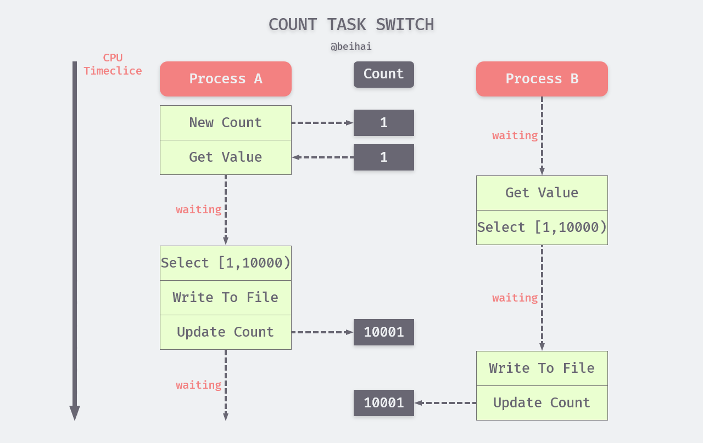

> *原理分析（Analyze The Principles）是一系列对计算机科学领域中的程序设计进行分析，每一篇文章都会着重于某一个实际问题。如果你有想了解的问题、错误指正，可以在文章下面留言。* 

并发这个概念由来已久，其主要思想是使多个任务可以在同一个时间段内下执行以便更快地得到结果。最早支持并发编程的语言是汇编语言，不过那时并没有任何的理论基础来支持这种编程方式，一个细微的编程错误就可能使程序变得非常不稳定，而且对程序的测试也几乎是不可能的。随着计算机软硬件技术的发展，并发程序的编写早已没有以前那么复杂。如果我们想真正理解一门编程语言以及领悟怎样才能编好程序，学习并发编程这一步必不可少。

## 概述

并发编程的思想来自于多任务操作系统，在早期的单用户操作系统中，任务是一个接一个运行的，各个任务的执行完全是串行的，只有在一个任务运行完成后，另一个任务才会被读取。而多任务操作系统则允许终端用户同时运行多个程序。当一个程序暂时不需要使用 CPU 的时候，系统会把该程序挂起或中断，使得其他程序可以使用 CPU。


#### 串行程序与并发程序

串行（Serial）程序特质只能被顺序指令执行的指令列表，并发程序则是可以被并发执行的多个串行程序的综合体。串行程序中的所有代码的先后顺序是固定的，而并发程序中只有部分代码是有序的。也就是说，其中一些代码的执行顺序并没有明确指定，这一特性被称为不确定性，这导致并发程序即使在输入相同数据的情况下，每次代码的执行路径都是不同的。

并发程序允许其中的串行程序运行在一个或多个可共享的 CPU 之上，同时也允许每个串行程序都运行在专为它服务的 CPU 上。前一种方式也成为多元程序，它由操作系统内核支持并提供多个串行程序复用多个 CPU 的方法。多元处理时计算机的多个 CPU 共用一个存储器（内存），并且在同一时刻可能会有数个串行程序分别运行在不同的 CPU 之上。多元程序和多元处理是串行程序得以并发和并行运行的基础。

#### 并发程序与并行程序

在一些参考文献和图书中，常常将并发和并行的概念混淆。实际上两者之间有明显的区别。**并行是指物理上（计算机并行硬件，如多核 CPU）同时执行，并发指能够让多个任务在逻辑上交织执行的程序设计**。并发程序是一个比较宽泛的概念，代表了所有可以实现并发行为的程序，其中包含了并行程序。

也可以用另一种方式来区分：并发（concurrent），台湾和日本翻译为“并行”；并行（parallelism），台湾叫“平行”，日本叫“并列”。

#### 并发程序内部的交互

并发程序内部会被划分为多个部分（或代码段），每个部分可以看作一个串行程序。在这些串行程序之间，可能会存在交互需求。比如，多个串行程序可能都要对一个共享资源进行访问，或者相互传递一些数据。这种情况下，我们需要协调程序的执行，即**同步**（Synchronous）。同步的作用是避免在并发访问共享资源时可能发生的冲突，以及确保有条不紊地传递数据。


根据同步的原则，程序如果想要使用一个共享资源，就必须先请求该资源并获取它的访问权。当程序不再需要某个资源的时候，该程序需放弃对资源的访问权（释放资源）。一个程序对资源的请求不应该导致其他正在访问该资源的程序中断，而应该等到占用程序释放资源后再请求。也就是说，在同一时刻，某个资源应该只被一个程序占用。

数据传递也成为并发程序内部的通信，除同步外，我们也可以利用**异步**（Asynchronous）的方式对通信进行管理，这种方式使得数据可以不加延迟地发送给数据接收方。如果数据接收方还没有为接收数据做好准备，也不会造成数据接收方的等待，数据会被临时存储在通信缓存中。通信缓存是一种特殊的共享资源，可以同时被多个程序使用，数据接收方可以在准备就绪后按照存入的顺序（先进先出）进行接收。

## 进程的设计

进程（Process）是 Unix 及其衍生操作系统的根本，是资源分配的最小单位，所有的代码都在进程中执行。程序是一组指令的集合，它是静态的实体，没有执行的含义，而进程是一个动态的实体，有自己的生命周期。进程由程序执行得来，即进程是程序的实例。

#### 进程的衍生

进程使用`fork`（系统调用函数）能够创建若干个新的进程，前者称为父进程，后者成为子进程。每个子进程都是父进程的一个副本，拥有父进程的数据段、堆和栈的副本，并于父进程共享代码段。每一个子进程都是独立的，子进程对属于它的副本的修改对父进程和兄弟进程都是不可见的。为提高创建进程发的效率，Linux 系统内核使用写时复制（Copy on Write，简写 COW）等技术来对数据复制。也可通过系统调用`exec`切换子进程中的执行程序，替换其从父进程复制过来的代码段与数据段。


Linux 系统下每一个进程都有父进程，所有进程形成了一个树形结构。当系统启动时，会建立一个 **init 进程**（ID 为 1），其它的进程都是 init 进程通过 fork 建立的。init 进程的父进程为它自己。如果某一个进程先于它的子进程结束，那么它的子进程将会被 init 进程“收养”，成为 init 进程的直接子进程。

#### 进程描述符与标识

为了管理进程，内核会对每个进程的属性和行为进行详细的描述，包括进程的优先级、状态、虚拟地址、访问权限等等，这些信息会被记录在每个进程的进程描述符（TASK_STRUCK）中。进程描述符是一个非常复杂的数据结构，其中也保存了进程在操作系统中的唯一标识：进程 ID（ProcessID，简称 PID）。PID 是一个非负整数且顺序编号，新创建的 PID 为前一个 PID 递增的结果。当 PID 达到最大限值时（Linux 下默认 32768），内核会从头开始查找闲置的进程 ID 并使用最先找到的值。进程描述符也包含了当前进程的父进程 ID（PPID）。

多数编程语言都可以查看当前进程 PID 和 PPID：

```go
pid := os.Getpid()
ppid := os.Getppid()
```

PID 只是一个用来唯一标识进程的数字，并不传达与进程有关的任何信息。但系统内核可以高效地把 PID 转换成对应进程的描述符。我们可以用 shell 命令`kill`终止某个进程，或通过 PID 找到对应的进程向其发送信息。

#### 进程的状态

Linux 系统中，进程每个时刻都是有状态的，其可能的状态通常为以下七种：可执行状态、可中断的睡眠状态、不可中断的睡眠状态、暂停状态或跟踪状态、僵尸状态、退出状态。进程状态可以通过 shell 指令`ps aux`查看。


- **可执行状态（TASK_RUNNING），简称 R**。处于该状态的进程表明它立刻要或正在 CPU 上运行。 进程调度器的任务就是从各个CPU的可执行队列中分别选择一个进程在该CPU上运行。
- **可中断的睡眠状态（TASK_INTERRUPTIBLE），简称 S**。处于这个状态的进程因为等待某事件的发生（比如等待 Socket 连接、信号量）而被挂起。这些进程会被放入对应事件的等待队列中。当事件发生时，对应的等待队列中的一个或多个进程将被唤醒。
- **不可中断的睡眠状态（TASK_UNINTERRUPTIBLE），简称 D**。与 S 状态类似，进程处于睡眠状态，但是此刻进程是不可中断的。不可中断，指的并不是CPU不响应外部硬件的中断，而是指进程不响应异步信号，比如无法用 kill 杀掉处于 D 状态的进程。处于 D 状态的进程通常是在等待 IO，比如磁盘 IO，网络 IO。
- **暂停状态或跟踪状态（TASK_STOPPED 或 TASK_TRACED），简称 T**。 向进程发送一个`SIGSTOP`信号，它就会因响应该信号而进入`TASK_STOPPED`状态，除非该进程本身处于D状态而不响应信号。向处于`TASK_STOPPED`状态的进程发送一个`SIGCONT`信号，可以让其从 T 状态恢复到 R 状态。处于`TASK_TRACED`状态的进程会暂停，并等待它的跟踪进程对它进行操作。例如使用 GDB 调试工具设置一个断点，进程运行到该断点处就会停下来。此时该进程处于跟踪状态。向处于跟踪状态的进程发送`SIGSTOP`信号不能使其恢复，只有当调试进程（跟踪进程）进行相应的系统调用调用或退出后才能恢复。
- **僵尸状态（TASK_DEAD - EXIT_ZOMBIE），简称 Z**。处于这个状态的进程在退出的过程中，除了进程描述符、退出码等少数信息以外，进程占有的绝大多数资源将被回收。保留这些信息是考虑到该进程的父进程可能需要它们。此时进程就只剩下 TASK_STRUCK 空壳，故称为僵尸进程。
- **退出状态（TASK_DEAD - EXIT_DEAD），简称 X**。处于这个状态的进程所有资源资源将会被操作系统回收，干净利落地被结束掉。

一个进程在其生命周期内可能会产生一系列状态转换，大致可分为可运行状态与非可运行状态。转换示意简图如下：


注：进程状态转换的实际情况很复杂，为便于理解，上图只画出概要过程。

#### 地址空间与内存布局

当我们创建一个进程时，操作系统会为进程分配内存空间，该内存区域内的每一个单元地址都由指针来标识定位，即内存寻址。指针是一个正整数，由若干个二进制位表示，其长度由 CPU 字长决定，32 位计算机下为 2<sup>32</sup>，64 位计算机下为 2<sup>64</sup>。显然，一个进程不可能拥有如此多的内存资源。这里的地址并非物理内存中的真实地址，而是虚拟地址。由虚拟地址标识的内存区域为虚拟内存（虚拟地址空间）。

内核将虚拟内存分为用户空间与内核空间两部分，用户空间占据地址的低部分，从 0 到 TASK_SIZE（TASK_SIZE 值与具体的硬件平台相关），剩余部分为内核空间。用户进程的虚拟内存会被分配到用户空间中，通常情况下这些用户进程的虚拟内存之间相互独立，彼此不可见。虚拟内存划分情况如图所示：


进程的虚拟内存会被内核划分为若干**页**（page），而物理内存的划分由 CPU 负责，一个物理内存单元被称为**页框**（page frame）。多数情况下不同进程的页会被映射到不同的物理内存之上。如下图所示：



在上图中，页框 5 被进程 A、B 共享使用，形成共享内存区，这也是 IPC（进程间通信）中共享内存方式的实现原理。而图中没有被映射到物理内存上的页，表示该页没有数据或未被使用，也可能是该页被换出磁盘的 swap 分区。

#### 系统调用

用户进程生存在用户空间中无法直接操控计算机的硬件，但是系统内核却可以。因此内核会暴露一些接口供用户进程调用，这是用户进程使用内核功能、操控硬件的唯一方式。用户进程使用内核接口的行为被称为系统调用（**动词**），但很多时候“系统调用”（**名词**）也代指内核提供的一系列接口。发生系统调用时，用户进程会先向内核空间发出一个明确的请求，并导致内核空间中数据的存取和指令的执行。除用户程序外，shell 与公用函数库也可以进行系统调用。

为了保证操作系统的安全和稳定，内核依据由 CPU 提供的、可以让进程驻留的特权级别建立了两个状态：**内核态**与**用户态**。CPU 在大部分时间里都处于用户态，此时的用户进程无法与内核接触。当用户进程发出一个系统调用时，内核把 CPU 从用户态切换到内核态，然后再执行对应的内核函数，执行结束后再把 CPU 切换回用户态并返回执行结果。



这样设计的初衷就是：**给不同的操作给予不同的“权限”**，以确保系统的安全性。

#### 上下文切换

分时操作系统可以凭借 CPU 的威力快速地在多个进程间进行切换，被称为上下文（Context）切换，以此产生多个进程同时运行的假象。但是无论切换速度快慢，同一时刻正在运行的进程只会有一个，而每个进程都认为自己独占了 CPU。

上下文切换需要付出一定代价。如果要换下正在 CPU 上运行的进程 A，内核需要及时保存 A 的运行状态，同时如果被换上的进程 B 不是第一次运行，内核也要及时恢复 B 的上次运行状态。除此之外，内核还要负责进程的调度，在切换时运行那个进程、何时切换、何时再换上被换下的进程。

## 进程的同步

在很多时候，我们需要多个进程之间相互配合完成一个任务，这就需要 IPC 的支持。上文提到过，进程的用户空间是互相独立的，一般而言是不能互相访问的，唯一的例外是共享内存区。但在共享数据的过程中，可能会产生一些“干扰”。

> 不论是多 CPU、多进程还是多线程，只要它们之间存在数据共享，就一定会牵扯同步问题。

#### 计数器

**同步**是一个具有普遍意义的问题，为了更好地切入同步问题，我们举一个计数器例子进行说明。假设进程 A 创建一个计数器 Count，初值为 1，Count 与进程 B 共享，进程 A 与 B 并发执行相同的任务： 从数据库中查询符合条件的数据，并写入 ./temp 文件中。任务流程大致如下：

1. 从计数器中读取值；
2. 每次从数据库中查询一万条数据，若用 a 代表计数器值，那么查询范围为：[a, a+10000)；
3. 遍历查询数据，将符合条件的数据组成新的数据集合
4. 将数据集合写入 ./temp 文件；
5. 计数器的值加 10000，即 c = c+10000；
6. 检查数据是否全部读完，若是则程序退出，否则重复上述步骤；

**注：假设上面的例子运行在单逻辑处理器上，多核处理器的进程调度略有不同。**

进程 A 和 B每次对指定数据集合迁移时，都要完成上面的六个步骤，但由于内核会对进程进行切换与调度，我们无法确保进程在一次循环查询过程不会被打断。你大概能想到了，我们无法知道 CPU 下一刻会干什么，进程 A 与 B 可能会穿插在一起执行（基本上一定是穿插执行），而且 CPU 上下文切换的粒度会比上面的描述步骤小很多。不过为了清晰其间，我们可以假设一种可能的进程调度过程。

1. 内核使 CPU 运行进程 A，初始化计数器；
2. 进程 A 读取计数器初值 1；
3. CPU 被进程 B 抢占，读取计数器初值 1，并依此查询筛选数据，得到一个新的数据集合，此时内核认为进程 B 已经运行足够长的时间，将 A 换上 CPU；
4. 进程 A 开始查询并筛选数据，得到一个数据集合，这个数据集合与进程 B 完全一致；
5. 进程 A 将数据集合写入 ./temp 文件；
6. 进程 A 将计数器的值更新为 10001；
7. 内核把进程 A 换下，让 CPU 运行 B；
8. 进程 B 数据集合写入 ./temp 文件；
9. 进程 B 将计数器的值更新为 10001；

该进程调度过程如下图所示：



通过示例图我们看出一个很明显的问题，进程 A 与 B 在做重复的事情，造成了双倍的资源消耗，却得到了一样的结果。这是由于同一个进程对计数器值的存取时间跨度太大了，以至于计数器只达成了记录任务进度的目的，而无法对进程进行协调。

#### 改进计数器

如果我们对计数器进行改进，将流程中的第五步移动到第一步之后，即在获取计数器值之后立即更新计数器。这样做确实起到了很大效果，大大减少了“事倍功半”问题出现的概率，但仍然不能彻底解决问题。我们面对的可能是成千上万个程序（不一定是进程）对一个资源进行访问修改，仍然可能出现更新计数器值之前 CPU 就将进程切换的可能性。


#### 原子操作与临界区

在并发编程中，多个进程对同一个资源进行访问可能会互相干扰，这种情况被称为竞争条件（race condition）。造成竞态条件的根本原因在于进程在进行某些操作的过程中被中断，虽然进程再次运行时其状态会恢复如初，但是外界环境可能在此时间段内已经发生了改变。在改进版的计数器中已经取得了很好的效果，但由于用户程序对进程调度的不可控使得竞态条件仍然可能发生。如果我们能保证进程在获取并更新计数器值的过程不被打断，其他进程只能在更新值之后再取值，从而保证数据的连续性。

原子操作（atomic operation）意为“**执行过程中不可被中断的一个或一系列操作**”，也不允许在执行结束之前被任何任务或者事件终止，要么全部执行，要么就不执行。原子操作必须由一个单一的汇编指令表示，并且需要得到芯片级的支持，因此原子操作线程间交互数据最细粒度的同步操作，它可以保证线程间读写某个数值的原子性，绝对的并发安全。

相比于原子操作，让串行化执行的若干代码形成临界区的做法更加通用。临界区在任意时刻只允许一个线程对共享资源进行访问，即实现互斥（mutex）。互斥遵循排他原则，如果有多个线程试图同时访问临界区，那么在有一个线程进入后，其他所有试图访问此临界区的线程将被挂起，并一直持续到进入临界区的线程离开。

## 总结


## Reference

- [还在疑惑并发和并行？](https://laike9m.com/blog/huan-zai-yi-huo-bing-fa-he-bing-xing,61/)
- [进程管理](http://wuchong.me/blog/2014/07/24/linux-process-manage/)
- [Linux 进程状态解析](https://blog.csdn.net/wudebao5220150/article/details/12919453)
- [anatomy-of-a-program-in-memory](https://manybutfinite.com/post/anatomy-of-a-program-in-memory/)
- 