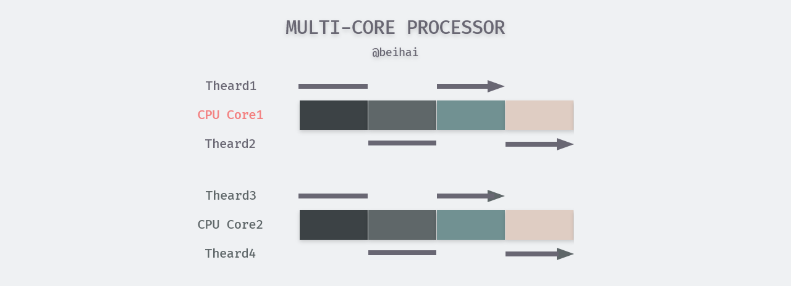

> *原理分析（Analyze The Principles）是一系列对计算机科学领域中的程序设计进行分析，每一篇文章都会着重于某一个实际问题。如果你有想了解的问题、错误指正，可以在文章下面留言。* 

并发这个概念由来已久，其主要思想是使多个任务可以在同一个时间段内下执行以便更快地得到结果。最早支持并发编程的语言是汇编语言，不过那时并没有任何的理论基础来支持这种编程方式，一个细微的编程错误就可能使程序变得非常不稳定，而且对程序的测试也几乎是不可能的。随着计算机软硬件技术的发展，如今并发程序的编写早已没有以前那么复杂。做为并发编程中的底层基础，本篇文章将会浅入浅出，简要分析进程与线程的设计原理。

## 概述

虽然 unix 及其变种操作系统之间的实现方式有些许不同，但是`ISO、IEEE`等组织对其进行了一系列标准化规范，理念上具有许多相似之处。文中将以 Linux 的实现方式为主要介绍目标。在此之前，需要介绍几个概念。


#### 串行程序与并发程序

串行（Serial）程序特指只能被顺序指令执行的指令列表，并发程序则是可以被并发执行的多个串行程序的综合体。串行程序中的所有代码的先后顺序是固定的，而并发程序中只有部分代码是有序的，其中一些代码的执行顺序并没有明确指定，这一特性被称为不确定性，这导致并发程序即使在输入相同数据的情况下，每次代码的执行路径都是不同的。

并发程序允许其中的串行程序运行在一个或多个可共享的 CPU 之上，同时也允许每个串行程序都运行在专为它服务的 CPU 上。前一种方式也成为多元程序，它由操作系统内核支持并提供多个串行程序复用多个 CPU 的方法。多元处理时计算机的多个 CPU 共用一个存储器（内存），并且在同一时刻可能会有数个串行程序分别运行在不同的 CPU 之上。多元程序和多元处理是串行程序得以并发和并行运行的基础。

#### 并发程序与并行程序

在一些参考文献和图书中，常常将并发和并行的概念混淆。实际上两者之间有明显的区别。**并行是指物理上（计算机并行硬件，如多核 CPU）同时执行，并发指能够让多个任务在逻辑上交织执行的程序设计**。并发程序是一个比较宽泛的概念，代表了所有可以实现并发行为的程序，其中包含了并行程序。

## 进程的设计

进程是 Unix 及其衍生操作系统的根本，是资源分配的最小单位，所有的代码都在进程中执行。程序是存放在磁盘上、处于某个目录下的一个可执行文件，它是静态的实体，没有执行的含义。进程由程序执行得来，即进程是程序的实例，是一个动态的实体，有自己的生命周期。

#### 进程描述符与进程标识符

为了管理进程，内核会对每个进程的属性和行为进行详细的描述，包括进程的优先级、状态、虚拟地址、访问权限等等，这些信息会被记录在每个进程的进程描述符（TASK_STRUCK）中。进程描述符是一个非常复杂的数据结构，其中也保存了进程在操作系统中的唯一标识：进程 ID（ProcessID，简称 PID）。PID 是一个非负整数且顺序编号，新创建的 PID 为前一个 PID 递增的结果。当 PID 达到最大限值时（Linux 下默认 32768），内核会从头开始查找闲置的进程 ID 并使用最先找到的值。进程描述符也包含了当前进程的父进程 ID（PPID），依此可以查询该进程的衍生过程。

利用系统调用查看当前进程 PID 和 PPID：

```c
pid_t getpid(void);
pid_t getppid(void);
```

需要注意的是，PID 只是一个用来唯一标识进程的数字，并不传达与进程有关的任何信息。但系统内核可以高效地把 PID 转换成对应进程的描述符。我们可以用 shell 命令`kill`终止某个进程，或通过 PID 找到对应的进程向其发送信息。

#### 进程的衍生

进程使用`fork`（系统调用函数）能够创建若干个新的进程，前者称为父进程，后者成为子进程。每个子进程都是父进程的一个副本，拥有父进程的数据段、堆和栈的副本，并与父进程共享代码段。每一个子进程都是独立的，子进程对属于它的副本的修改对父进程和兄弟进程都是不可见的。为提高创建进程的效率，Linux 系统内核使用写时复制（Copy on Write，COW）等技术对数据“共享”。也可通过系统调用`exec`切换子进程中的执行程序，替换其从父进程复制过来的代码段与数据段。


Linux 系统下每一个进程都有父进程，所有进程形成了一个树形结构。当系统启动时，会建立一个 **init 进程**（ID 为 1），其它的进程都是 init 进程通过 fork 建立的。init 进程的父进程为它自己。如果某一个进程先于它的子进程结束，那么它的子进程将会被 init 进程“收养”，成为 init 进程的直接子进程。

#### 进程的状态

Linux 系统中，进程每个时刻都是有状态的，其可能的状态通常为以下七种：可执行状态、可中断的睡眠状态、不可中断的睡眠状态、暂停状态或跟踪状态、僵尸状态、退出状态。进程状态可以通过 shell 指令`ps aux`查看。


- **可执行状态（TASK_RUNNING），简称 R**。处于该状态的进程表明它立刻要或正在 CPU 上运行。 进程调度器的任务就是从各个CPU的可执行队列中分别选择一个进程在该CPU上运行。
- **可中断的睡眠状态（TASK_INTERRUPTIBLE），简称 S**。处于这个状态的进程因为等待某事件的发生（比如等待 Socket 连接、信号量）而被挂起。这些进程会被放入对应事件的等待队列中。当事件发生时，对应的等待队列中的一个或多个进程将被唤醒。
- **不可中断的睡眠状态（TASK_UNINTERRUPTIBLE），简称 D**。与 S 状态类似，进程处于睡眠状态，但是此刻进程是不可中断的。不可中断，指的并不是CPU不响应外部硬件的中断，而是指进程不响应异步信号，比如无法用 kill 杀掉处于 D 状态的进程。处于 D 状态的进程通常是在等待 IO，比如磁盘 IO，网络 IO。
- **暂停状态或跟踪状态（TASK_STOPPED 或 TASK_TRACED），简称 T**。 向进程发送一个`SIGSTOP`信号，它就会因响应该信号而进入`TASK_STOPPED`状态，除非该进程本身处于D状态而不响应信号。向处于`TASK_STOPPED`状态的进程发送一个`SIGCONT`信号，可以让其从 T 状态恢复到 R 状态。处于`TASK_TRACED`状态的进程会暂停，并等待它的跟踪进程对它进行操作。例如使用 GDB 调试工具设置一个断点，进程运行到该断点处就会停下来。此时该进程处于跟踪状态。向处于跟踪状态的进程发送`SIGSTOP`信号不能使其恢复，只有当调试进程（跟踪进程）进行相应的系统调用调用或退出后才能恢复。
- **僵尸状态（TASK_DEAD - EXIT_ZOMBIE），简称 Z**。处于这个状态的进程在退出的过程中，除了进程描述符、退出码等少数信息以外，进程占有的绝大多数资源将被回收。保留这些信息是考虑到该进程的父进程可能需要它们。此时进程就只剩下 TASK_STRUCK 空壳，故称为僵尸进程。
- **退出状态（TASK_DEAD - EXIT_DEAD），简称 X**。处于这个状态的进程所有资源将会被操作系统回收，干净利落地被结束掉。

一个进程在其生命周期内可能会产生一系列状态转换，示意简图如下：


注：进程状态转换的实际情况很复杂，为便于理解，上图只画出概要过程。

#### 地址空间与内存布局

多任务操作系统中的每个进程在其自己的内存沙盒中运行。此沙盒是**虚拟地址空间**。由虚拟地址标识的内存区域为虚拟内存空间，也就是常说的虚拟内存。当我们创建一个进程时，操作系统会为进程分配内存空间，该内存区域内的每一个单元地址都由指针来标识定位，即内存寻址。指针是一个正整数，由若干个二进制位表示，其长度由 CPU 字长决定，32 位计算机下为 2<sup>32</sup>，64 位计算机下为 2<sup>64</sup>。

系统内核会为进程分配虚拟内存而不是物理内存，内核会将虚拟内存分为用户空间与内核空间两部分，用户空间占据地址的低部分，大小为 0 到 TASK_SIZE（TASK_SIZE 是一个常数，其值与具体的硬件平台相关）剩下的部分则为内核空间。划分情况如图所示：


其中内核空间由内核专用，而用户进程的虚拟内存会被分配到用户空间中，通常情况下这些用户进程的虚拟内存之间相互独立，彼此不可见。进程的虚拟内存又会被内核划分为若干**页**（page），而物理内存的划分由 CPU 负责，一个物理内存单元被称为**页帧**（page frame）。进程的不同页会被映射到对应的物理内存之上。如下图所示：


在上图中，页框 5 被进程 A、B 共享使用，形成共享内存区，这也是 IPC 中共享内存方式的实现原理。而图中没有被映射到物理内存上的页，表示该页没有数据或未被使用，也可能是该页被换出磁盘的 swap 分区。

#### 系统调用

用户进程生存在用户空间中无法直接操控计算机的硬件，但是系统内核却可以。因此内核会暴露一些接口供用户进程调用，这是用户进程使用内核功能、操控硬件的唯一方式。用户进程使用内核接口的行为被称为系统调用（**动词**），但很多时候“系统调用”（**名词**）也代指内核提供的一系列接口。发生系统调用时，用户进程会先向内核空间发出一个明确的请求，并导致内核空间中数据的存取和指令的执行。

为了保证操作系统的安全和稳定，内核依据由 CPU 提供的、可以让进程驻留的特权级别建立了两个状态：**内核态**与**用户态**。CPU 在大部分时间里都处于用户态，此时的用户进程无法与内核接触。当用户进程发出一个系统调用时，内核把 CPU 从用户态切换到内核态，然后再执行对应的内核函数，执行结束后再把 CPU 切换回用户态并返回执行结果。


这样设计的初衷就是：**给不同的操作给予不同的“权限”**，以确保系统的安全性。

#### 上下文切换

分时操作系统可以凭借 CPU 的威力快速地在多个进程间进行切换，被称为上下文（Context）切换，以此产生多个进程同时运行的假象。但是无论切换速度快慢，同一时刻在一个 CPU 核心上正在运行的进程只会有一个，而每个进程都认为自己独占了 CPU。

上下文切换需要付出一定代价。如果要换下正在 CPU 上运行的进程 A，内核需要及时保存 A 的运行状态，同时如果被换上的进程 B 不是第一次运行，内核也要及时恢复 B 的上次运行状态。除此之外，内核还要负责进程的调度，在切换时运行那个进程、何时切换、何时再换上被换下的进程。

## 线程的设计

利用多进程编程也有一些缺点，例如进程的创建、切换开销比较大，一个进程无法同时执行多个任务等。因此在进程内部引入了更加灵活的线程。线程可视为进程中的控制流，是程序执行的最小单位。线程的衍生过程与进程类似，通过其他线程调用系统调用函数`pthread_create`创建。但与进程的树状结构不同，线程之间是平级的关系，不存在所属关系。

在一个进程内的所有线程共享同一地址空间、文件描述符、栈以及与进程相关的属性。因此创建一个新线程时，不会复制其所属进程中存储的数据、代码等，因此线程更加轻量，开销小很多。另外，每个线程也拥有自己的线程栈，存储一些私有数据。

线程也拥有唯一标识 ID，称为 TID，通常情况下 TID 只在所属进程范围内唯一，但在 Linux 中 TID 在整个系统范围内具有唯一性。

#### 控制与状态

线程可以对同一进程中的其他线程进行一定的控制，主要有以下四种情况：

- **创建**：线程通过调用系统调用函数`pthread_create`创建新线程，调用线程需要向新线程传入执行函数与参数，创建成功后获得新线程的 TID；
- **终止**：线程调用系统调用函数`pthread_cancel`发送一个请求来终止执行目标线程（也可以是自身），但目标线程不会立即终止，一般情况下线程执行到某个取消点时才会终止；
- **连接**：线程调用`pthread_join` 来连接目标函数，调用函数会获取目标函数的返回值与流程控制权，并继续执行；
- **分离**：线程调用`pthread_detach` 来分离自身或其他线程，被分离的线程在终止时会被内核自动清理和销毁。

线程在生命周期中也会进行一系列状态转换，其过程与进程类似，这里不再过多赘述。

#### 线程调度

系统内核对线程的调度是比较重要的部分，调度器会把时间划分成极小的时间片分配给不同的线程，使得每个线程都有机会在 CPU 上运行。由于线程的执行过程分为 CPU 消耗型或 I/O 消耗型，一些线程需要花费一定的时间使用 CPU 进行计算，而另外一些线程会花费时间等待 I/O 操作，比如等待键盘输入。调度器会对线程进行优先级划分，其中静态优先级决定了线程单次在 CPU 上运行的最长时间，动态优先级则决定了线程的执行顺序。通常情况下调度器会分配给 I/O 消耗型线程更高的优先级，以便于花费更多时间的 I/O 操作尽早执行。

线程的静态优先级是一个常量，如果应用程序没有显示指定其值，默认值设定为 0。动态优先级在静态优先级的基础上得来，而且可以被调度器实时调整。所有等待 CPU 的线程按照动态优先级从高到低的顺序排列，放到 CPU 对应的运行队列中，因此下一个运行的线程总是动态优先级中最高的一个。优先级阵列是一个由链表组成的数组，一个链表中只包含具有相同优先级的线程，新加入的线程会被放到对应链表的末尾处。实际上，每一个 CPU 的运行队列中包含两个优先级阵列，其中一个存放正在等待运行的线程，另一个存放已经运行过但还未完成的线程。


> 两个阵列的名称并没有严格定义，本文暂且命名为 active 与 expired。

如果某个线程的运行时间达到时间片，调度器会从 active 优先级阵列中拿出下一个要运行的线程换上 CPU，并将被换下的线程排入 expired 优先级阵列。当 active 优先级阵列中的所有线程被运行完毕时，调度器会将两个优先级阵列的身份互换，使得被排入 expired 优先级阵列的线程可以再次运行。

除上述的就绪状态与运行状态外，线程也可能因等待事件而进入睡眠状态。处于睡眠状态的线程会加入对应的等待队列，当事件发生时，内核会唤醒对应等待队列中的所有线程，并转移至运行队列中。而且调度器也会调高被唤醒的线程的动态优先级，以便它们更早地运行。

调度器也会负责多个 CPU 之间的负载，通常情况下一个线程会在一个固定的 CPU 上运行，但也时常发生一些 CPU 核心过于忙碌而一些被闲置的情况。调度器会对负载较大的 CPU 上的线程进行迁移，这一过程可能依赖于具体的实现方式。

#### 线程的实现模型

在线程进化过程中，主要有 3 种实现模型：用户级线程模型、内核级线程模型与两级线程模型。三者之间的主要差别在于线程与内核调度实体 KSE  的对应关系。


**用户级线程模型（M:1）**：应用程序使用线程库来设计多线程程序。线程库是用户级线程管理的一个包，它包含用于创建和销毁线程、在线程间传递信息和数据、调度线程执行的代码以及保存和恢复线程上下文的代码。线程库存储在进程的用户空间中，这些线程的存在对于内核来说是无感知的，有关线程的管理工作由程序自主完成。由于线程在进程内切换的规则远比进程调度和切换的规则简单，不需要用户态/核心态切换，所以切换速度快，可移植性也更强一些。

但由于内核看不到进程内部多线程的存在，继续以进程为单位进行调度，当某个线程被阻塞时，不仅这个线程会被阻塞，进程中的所有线程都被阻塞。另外在调度器眼中，进程是一个无法再被分割的调度单元，内核一次只为一个进程分配给一个处理器。进程内部只会有一个线程在并行执行，线程的优先级也形同虚设。由于包含多个用户级线程的进程只与一个 KSE 对应，也被称为 M:1 线程模型。


**内核级线程模型（1:1）**：该模型下的线程由内核负责管理，每一个线程都与一个 KSE 相对应，因此内核可以分别对每一个线程进行调度。内核可以同时把一个进程中的多个线程调度到多个处理器上，从而真正实现线程的并发运行，即使一个线程被阻塞，内核可以调度同一个进程中的另外一个线程继续执行。

内核线程的管理成本要比用户线程高很多，线程的创建、切换、同步等过程也会消耗更多的资源。如果一个进程包含了大量的线程，也会给内核的调度器带来很大的负担。一般情况下，操作系统会对一个进程中可以创建的线程数量有直接或间接的限制。内核级线程模型常用于操作系统中的线程实现。


**两级线程模型（M:N）**：两级线程模型是多对多的线程实现，试图兼有 M:1 和 1:1 的优点，避免其缺点。该模型下的一个进程可以与多个 KSE 关联，并创建多个内核线程，每个内核线程会对进程内的其他线程进行调度管理。这样做使得在大多数环境下，可以直接在用户模式进行线程的切换，减少内核资源的消耗。

两级线程模型的实现比较复杂，一般不会被操作系统内核的开发者采用，但在一些编程语言上会充分发挥作用。


## 多核并发

当在单核处理器上运行多线程程序时，凭借 CPU 快速切换的威力可以产生多个任务同时执行的假象。但在同一时刻只有一个线程正在执行。在一个多核心处理器上，可在同一时刻并行执行的最大任务数量为处理器核心数量。前者称为并发，后者称为并行。并行运行可以看作是并发运行的一个具体划分，如在下图中，线程 1-4 是并发运行的，而在同一时刻，线程 1、3 或 2、4 是并行执行的。



这里提一个题外话，关于 CPU 的超线程技术。对于处理器核心来说，虽然可以每秒钟处理成千上万条指令，但是在某一时刻，只能够对一条指令进行处理，但一般情况下单条指令不会利用 CPU 内部的所有资源。超线程是一种可以将 CPU 内部暂时闲置的处理资源充分“调动”起来的技术，超能够把一个物理处理器在软件层变成两个逻辑处理器，可以使处理器在某一时刻，同步并行处理更多指令和数据，当然实际效能不是实现双倍提升。从时间角度看，一个拥有两个逻辑处理器的物理核心并行执行的任务数量也是两个。

## 总结

本篇文章主要介绍了进程的一些基本概念与内核对多线程的调度，对于进程与线程更详细的了解可以阅读操作系统相关的书籍。作为系统管理运行的基本单位，许多编程语言的并发模型也是基于内核线程实现。了解线程的基本原理也对语言的理解有一定的帮助。

## Reference

- [进程管理](http://wuchong.me/blog/2014/07/24/linux-process-manage/)
- [Linux 进程状态解析](https://blog.csdn.net/wudebao5220150/article/details/12919453)
- [anatomy-of-a-program-in-memory](https://manybutfinite.com/post/anatomy-of-a-program-in-memory/)
- [深入 Linux 的进程优先级](https://linux.cn/article-7325-1.html)
- [线程的3种实现方式](https://blog.csdn.net/gatieme/article/details/51892437)

## 相关文章

- [Goroutine 与 Go 语言并发模型 · Analyze](https://www.wingsxdu.com/post/linux/concurrency-oriented-programming/goroutine/)
- [浅论并发编程中的同步问题 · Analyze](https://www.wingsxdu.com/post/linux/concurrency-oriented-programming/synchronous/)
- [浅析进程与线程的设计 · Analyze](https://www.wingsxdu.com/post/linux/concurrency-oriented-programming/process-and-thread/)