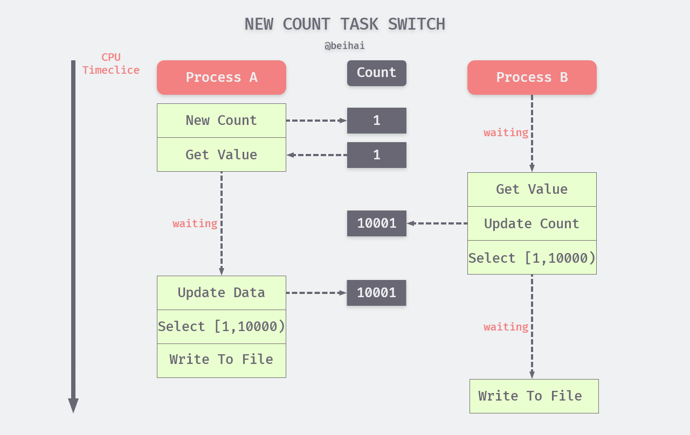
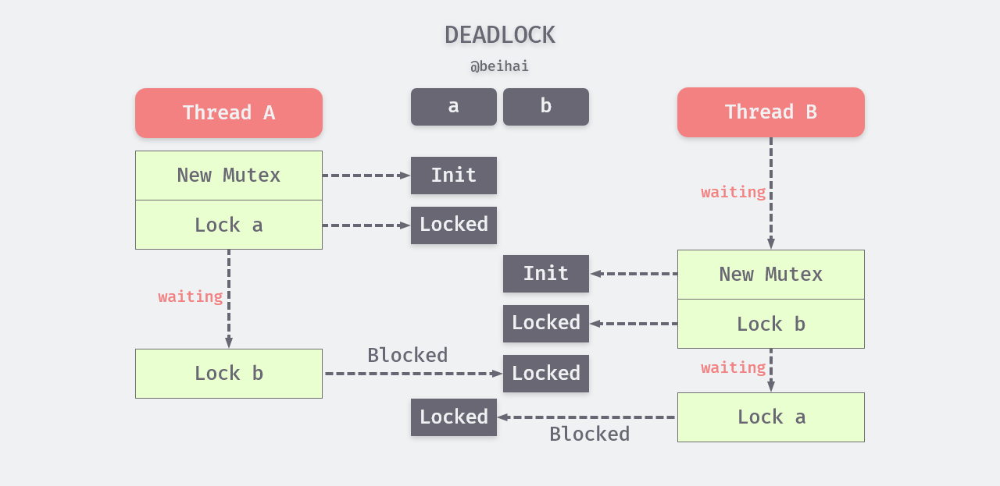

## 并发程序内部的交互

为什么要考虑**同步**问题？在很多时候，我们需要多个进程或线程之间相互配合完成一个任务，多个串行程序可能都要对一个共享资源进行访问，或者相互传递一些数据。这种情况下，我们需要协调程序的执行。同步的作用是避免在并发访问共享资源时可能发生的冲突，以及确保有条不紊地传递信息。


根据同步的原则，程序如果想要使用一个共享资源，就必须先请求该资源并获取它的访问权。当程序不再需要某个资源的时候，该程序需放弃对资源的访问权（释放资源）。在同一时刻，某个资源应该只被一个程序占用，一个程序对资源的请求不应该导致其他正在访问该资源的程序中断，而应该等到占用程序释放资源后再请求。

数据传递也称为并发程序内部的通信，除同步外，我们也可以利用**异步**的方式对通信进行管理，这种方式使得数据可以不加延迟地发送给数据接收方。如果数据接收方还没有为接收数据做好准备，也不会造成数据接收方的等待，数据会被临时存储在通信缓存中。通信缓存是一种特殊的共享资源，可以同时被多个程序使用，数据接收方可以在准备就绪后按照 FIFO 组织队列进行接收。

## 同步问题

> 不论是多 CPU、多进程还是多线程，只要它们之间存在数据共享，就一定会牵扯同步问题。

#### 计数器

为了更好地切入同步问题，我们举一个计数器例子进行说明。假设线程 A 创建一个计数器 Count，初值为 1，Count 与线程 B 共享，线程 A 与 B 并发执行相同的任务： 从数据库中查询符合条件的数据，并写入 ./temp 文件中。任务流程大致如下：

1. 从计数器中读取值；
2. 每次从数据库中查询一万条数据，若用 a 代表计数器值，那么查询范围为：[a, a+10000)；
3. 遍历查询数据，将符合条件的数据组成新的数据集合
4. 将数据集合写入 ./temp 文件；
5. 计数器的值加 10000，即 c = c+10000；
6. 检查数据是否全部读完，若是则程序退出，否则重复上述步骤；

**注：假设上面的例子运行在单个逻辑处理器上，多核处理器的线程调度可能略有不同。**

线程 A 和 B 每次对指定数据集合迁移时，都要重复执行上面的六个步骤。但由于内核会对线程进行切换与调度，在实际运行过程中，线程 A 与 B 可能会穿插在一起执行，而且上下文切换的粒度会比上面的描述步骤小很多。但为了清晰起见，我们可以假设一种可能的线程调度过程。

1. 内核使 CPU 运行线程 A，初始化计数器；
2. 线程 A 读取计数器初值 1；
3. CPU 被线程 B 抢占，读取计数器初值 1，并依此查询筛选数据，得到一个新的数据集合，此时内核认为线程 B 已经运行足够长的时间，将 A 换上 CPU；
4. 线程 A 开始查询并筛选数据，得到一个数据集合，这个数据集合与线程 B 完全一致；
5. 线程 A 将数据集合写入 ./temp 文件；
6. 线程 A 将计数器的值更新为 10001；
7. 内核把线程 A 换下，让 CPU 运行 B；
8. 线程 B 数据集合写入 ./temp 文件；
9. 线程 B 将计数器的值更新为 10001；

该调度过程如下图所示：


通过示例图可以看出一个很明显的问题，线程 A 与 B 在做重复的事情，造成了双倍的资源消耗，却得到了一样的结果。这是由于同一个线程对计数器值的存取时间跨度太大了，计数器只达成了记录任务进度的目的，却没有对多线程进行任务协调，导致线程的执行过程完全是随机的。

如果我们对计数器进行改进，将流程中的第五步移动到第一步之后，即在获取计数器值之后立即更新计数器。这样做确实起到了很大效果，大大减少了“事倍功半”问题出现的概率，但仍然不能彻底解决问题。仍然存在计数器值更新之前 CPU 就将线程切换的可能性。



#### 原子操作与临界区

在并发编程中，多个线程对同一个资源进行访问可能会互相干扰，这种情况被称为竞争条件。造成竞争条件的根本原因在于线程在进行某些操作的过程中被中断，虽然线程再次运行时其状态会恢复如初，但是外界环境可能在此时间段内已经发生了改变。在改进版的计数器例子中，虽然已经尽可能避免，但由于线程调度的不可控性使得竞态条件仍然可能发生。为了解决这个问题，我们引入原子操作与临界区这两个概念。

原子操作意为“**执行过程中不可被中断的一个或一系列操作**”。原子操作必须由一个单一的汇编指令表示，并且需要得到芯片级的支持，因此原子操作是线程间交互数据最细粒度的同步操作，它可以保证线程间读写某个数值的原子性，绝对的并发安全。原子操作只能完成一些最基本的功能，一共有五种：**增或减、比较并交换、载入、存储和交换**。

```c
// 加载并返回该地址指向的值
C atomic_load（const volatile A * obj）;
```

相比于原子操作，让串行化执行的若干代码形成临界区的做法更加通用。临界区在任意时刻只允许一个线程对共享资源进行访问，如果有多个线程试图同时访问临界区，那么在有一个线程进入后其他所有试图访问此临界区的线程将被挂起，并一直持续到进入临界区的线程离开。临界区在被释放后，其他线程可以继续抢占，以此达到用伪原子方式操作共享资源的目的。原子操作和临界区看起来类似，但是原子操作不能被中断，临界区对是否能被中断没有强制规定，只要保证一个访问者在临界区中时其他访问者不允许进入。

临界区常见的同步方式为互斥量与条件变量。

#### 互斥量

互斥量(Mutex)从本质上说是一把锁，在访问共享资源前对互斥量进行加锁，在访问完成后释放锁。当我们对互斥量进行加锁之后，任何其他试图再次对互斥量加锁的线程都会被阻塞直到当前线程释放该互斥锁。如果释放互斥量时有一个以上的线程阻塞，那么所有之前尝试对互斥量加锁的线程都会变成可运行状态，当第一个变为可运行的线程对互斥量加锁后，其他线程只能再次阻塞。在这种方式下，每次只有一个线程可以执行临界区内的代码。

###### 互斥锁

互斥锁是`sleep-waiting`类型的锁。例如在一个双核的机器上有两个线程(线程 A 和线程 B )，它们分别运行在Core0 和 Core1上。假设线程 A 想要通过互斥锁操作得到一个临界区的锁，而此时这个锁正被线程 B 所持有，那么线程 A 就会被阻塞 。互斥锁得不到锁，线程 A 会进入休眠状态，Core0 会在此时进行上下文切换将线程 A 置于等待队列中，此时 Core0 就可以运行其他的任务(例如线程 C )而不必进行忙等待。

###### 自旋锁

自旋锁属于`busy-waiting`类型的锁，如果线程 A 使用自旋锁操作去请求锁，那么线程 A 就会一直在 Core0 上进行忙等待，不停的进行锁请求重复检查这个锁，直到得到这个锁为止。可以想象，当一个处理器处于自旋状态时，它做不了任何有用的工作，因此自旋锁对于单处理器不可抢占内核没有意义。自旋锁主要用在临界区持锁时间非常短且 CPU 资源不紧张的情况下，而互斥锁用于临界区持锁时间比较长的操作。

###### 读写锁

读写锁是一种特殊的自旋锁，它把对共享资源的访问者划分成读者和写者，读者只能对共享资源进行读访问，写者则需要对共享资源进行写操作。这种锁相对于自旋锁而言，能提高并发性，因为在多处理器系统中，它允许同时有多个读者来访问共享资源，最大可能的读者数为实际的逻辑 CPU 数。而写者是排他性的，一个读写锁同时只能有一个写者或多个读者（与CPU数相关），也不能同时既有读者又有写者。

###### 死锁

如果一个并发任务中含有多个临界区，例如线程 A 持有独占锁 a，并尝试去获取独占锁 b， 同时线程 B 持有独占锁 b，并尝试获取独占锁 a ，此时就会发生 A、B 两个线程由于互相持有对方需要的锁，而发生死锁现象，线程 A 和 B 也会无限阻塞下去。



解决死锁的常用方式一般有两个，一个为**固定锁定顺序**，先锁定 a 再锁定 b，这样做虽然可以有效避免死锁，但并不是所有情况下可以实现。另一种方式为**试锁定-回退**，当线程尝试获取第二个独占锁失败时，主动释放第一个已经加锁的资源。

#### 条件变量

条件变量是多线程程序中实现"等待—唤醒"逻辑常用的方法。条件变是利用线程间共享的全局变量进行同步的一种机制，主要包括两个动作：一个线程等待"条件变量的条件成立"而挂起；另一个线程使“条件成立”。例如线程 A 需要等某个条件成立才能继续往下执行，如果这个条件不成立，线程 A 会调用系统调用函数`pthread_cond_wait`把自己放到对应的等待线程列表中。当线程 B 在执行过程中使这个条件成立时，唤醒线程 A 继续执行。

条件变量是一种通知机制，当条件成立时，通过系统调用`pthread_cond_singal`单发或`pthread_cond_broadcast`广播唤醒其他线程执行任务。但 POSIX 为了简化实现，允许`pthread_cond_singal`可以唤醒不止一个线程。

条件变量通常与互斥锁一起使用。这是为了应对线程 A 在调用`pthread_cond_wait`但还没有进入 wait cond 的状态时，线程 B 就对其进行唤醒的情况。 如果不使用互斥锁，这个唤醒信号就会丢失。加了锁时，在线程 A 进入等待状态后再解锁，线程 B 在这之后才能进行唤醒操作。 

## 总结

同步是为了解决数据共享过程中可能出现的“干扰”问题，常用方法为（伪）原子操作或加锁。这些传统的解决方案有着不同的适应场景，在使用时要多加注意，尽可能遵循能用简单的操作就用简单的操作原则。

## Reference

- [有了互斥锁，为什么还要条件变量？](https://www.jianshu.com/p/01ad36b91d39)
- 《Go 并发编程实战》
- 《UNIX 环境高级编程》

## 相关文章

- [为什么进程 fork 采用写时复制 · Why](https://www.wingsxdu.com/post/linux/concurrency-oriented-programming/fork-and-cow/)
- [浅论并发编程中的同步问题 · Analyze](https://www.wingsxdu.com/post/linux/concurrency-oriented-programming/synchronous/)
- [浅析进程与线程的设计 · Analyze](https://www.wingsxdu.com/post/linux/concurrency-oriented-programming/process-and-thread/)