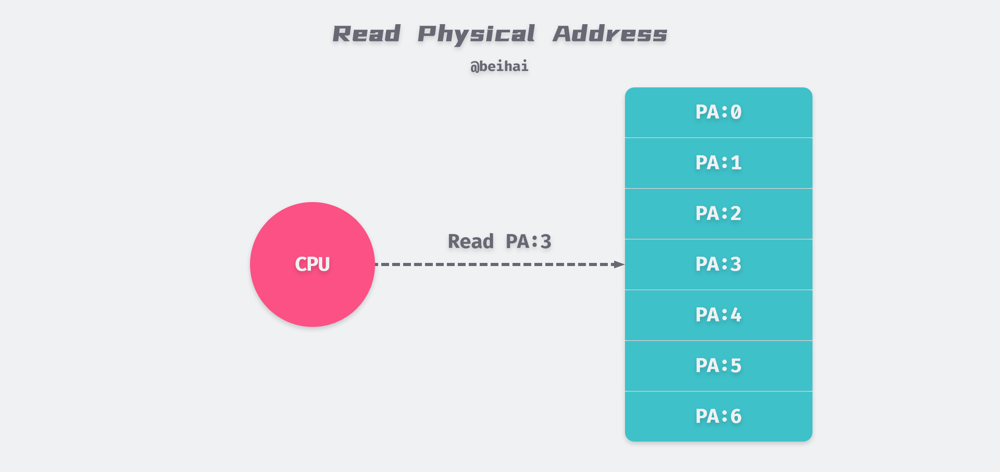
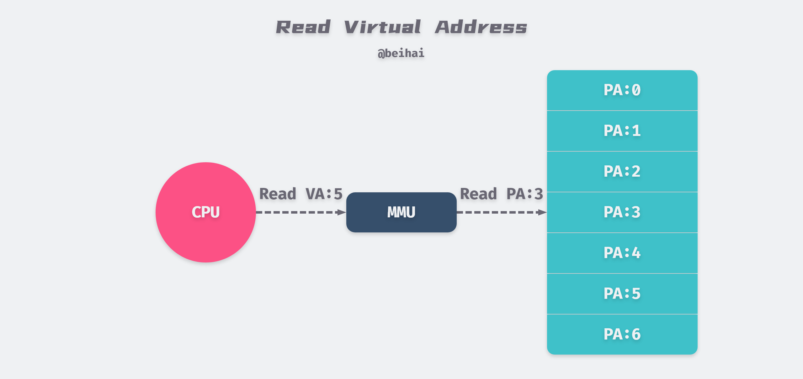
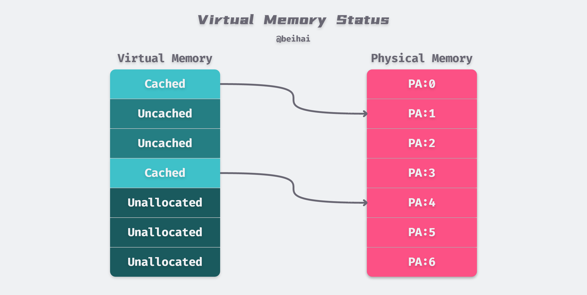
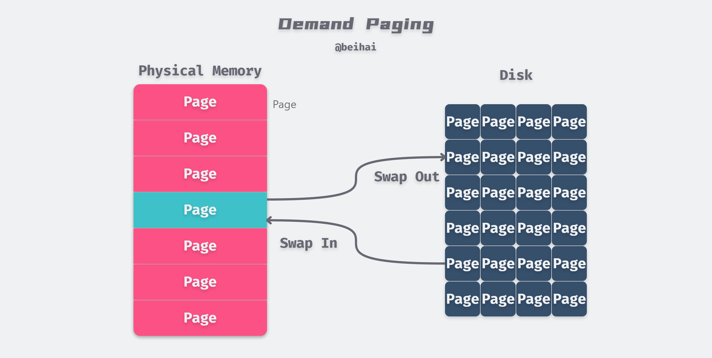
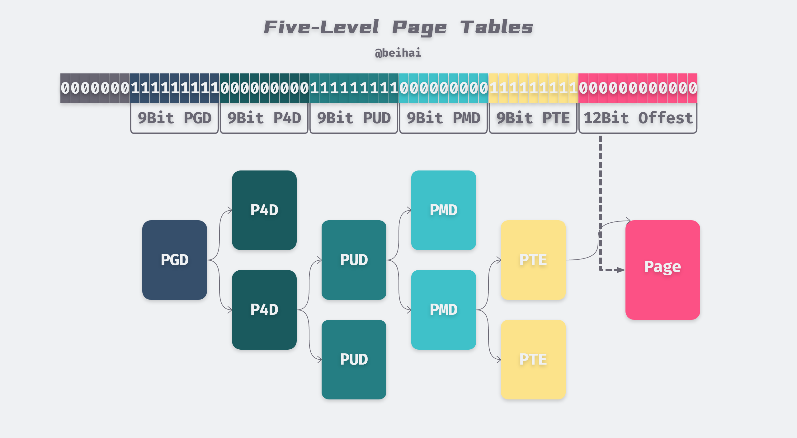
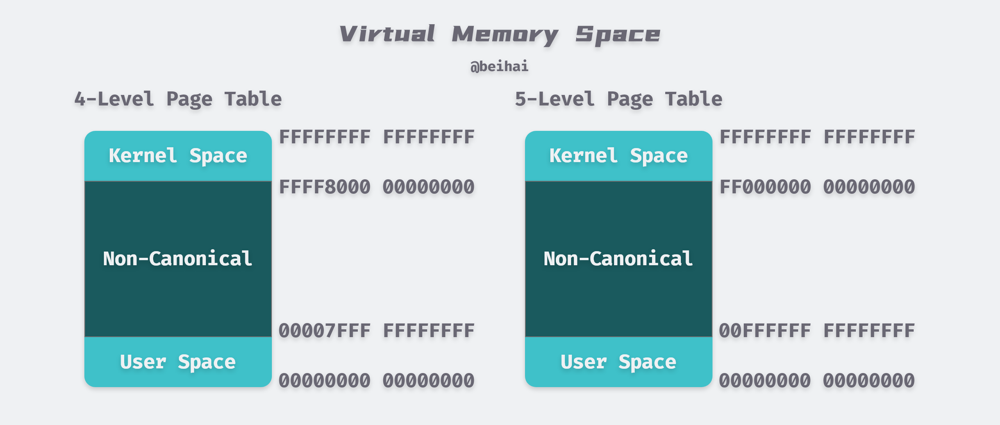
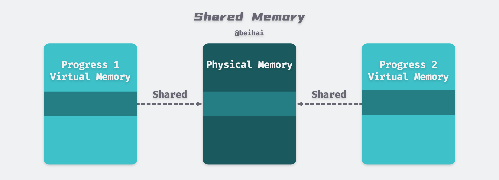
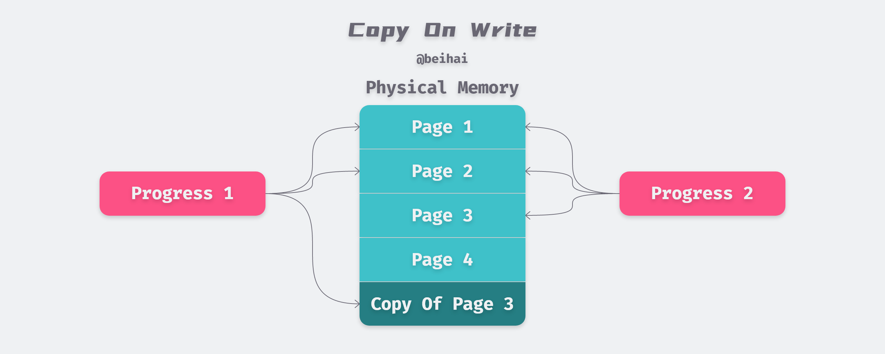

> 现代操作系统使用虚拟内存进行内存管理，本文总结了虚拟内存的原理与一些应用场景。

计算机系统的主存被组成 M 个连续的字节数组，每一个字节都有一个唯一的物理地址（Physical Address，PA）。在这种物理条件下，CPU 访问内存最自然的方式就是使用物理寻址，如下图所示，CPU 执行一条加载指令，读取物理地址 5 的数据。



因为程序直接操控物理内存，如果第二个程序在物理地址 2000 处写入一个新的值，将会擦掉第一个程序存放在相同位置上的内容。在这种情况下，要想在内存中同时运行两个程序是不可能的。

为了更加有效地管理内存并且少出错，现代操作系统提供了一种对主存的抽象概念：虚拟内存，它为每个进程提供了一个巨大的私有地址空间。

CPU 通过生成一个虚拟地址来访问主存，进程持有的虚拟地址（Virtual Address，VA）会通过 CPU 芯片中的内存管理单元（Memory Mangament Unit，MMU）转换成物理地址，然后再通过物理地址访问内存。



虚拟内存提供了三个重要的能力：

1. **虚拟内存将物理内存看作是存储在磁盘上的地址空间的高速缓存**，在主存中只保存活动区域，并根据需要在磁盘和主存之间传送数据，从而高效地使用内存；
2. 虚拟内存为每个进程提供了一致的地址空间，简化了内存管理方式；
3. 虚拟内存保护了每个进程的地址空间不被其它进程破坏。

> 由于对硬盘的访问时间很长，物理内存与磁盘间的同步使用**回写模式 Write Back**，即写操作写在内存上即可，然后再异步刷新到磁盘。

## 分页

操作系统使用分页（Paging）的方式管理内存，分页是把所有虚拟内存空间和物理内存空间切成一段段固定大小的内存页（Page），以页为单位管理内存，当进程发现需要访问的数据不在内存时，操作系统会将数据以页的方式加载到内存中。在 Linux 下默认每一页的大小为 `4KB`。

每个物理页面都需要一个`struct page`数据结构来描述，存储在物理内存中，为了降低内存占用，该结构中大量使用了 C 语言的联合体`Union`来优化其大小。下面的代码段中整理了其中的关键字段：

```c
struct page {
    unsigned long            flags;     // 页面状态，例如 dirty 或 locked
    pgoff_t                  index;     // 在映射的虚拟空间内的偏移量
    struct address_space     *mapping;  // 页面所指向的地址空间
    atomic_t                 _mapcount; // 页映射计数器，表示有多少进程同时共享此页内存
    atomic_t                 _refcount; // 页引用计数器，0 表示空闲，-1 表示没有被引用
    unsigned long            private;   // 私有数据指针
    void                     *virtual;  // 页虚拟地址
}
```

`page`结构管理当前页面的状态、引用次数、是否空闲等等，一个`page`结构体大约占用 64Bytes，占比约 1.5%。

虚拟内存中的虚拟页存储在磁盘上，可能处于以下的三种状态：

- **未分配（Unallocated）**：内存页还没有被进程申请使用，也就是空闲的虚拟内存，不占用任何磁盘空间；
- **未缓存（Uncached）**：仅加载到磁盘中的内存页，还未加载到物理内存中；
- **已缓存（Cached）**：已经加载到物理内存中的内存页。



#### 页表

同缓存系统一样，虚拟内存系统必须具有判断一个虚拟页是否缓存在物理内存中的能力。每个进程都有一个存放在物理内存中的页表（Page Table）数据结构，其中的一个节点被称为 Page Table Entry(PTE)，负责维护虚拟页到物理页的映射。操作系统会维护页表的内容，以及在物理内存和磁盘间迁移数据。

在分页机制下，虚拟地址分为两部分，**页号**和**页内偏移**。页号作为页表的索引，页表包含物理页每页所在物理内存的基地址，这个基地址与页内偏移的组合就形成了物理内存地址。对于一个内存地址转换，分为这样三个步骤：

1. 将虚拟地址切分成页号和偏移量；
2. 在页表中根据虚拟页号，查询对应的物理页号；
3. 将物理页号加上前面的偏移量，得到最终的物理内存地址。

#### 按需页面调度

如果 CPU 引用了虚拟内存中的一个地址，但是该地址并未缓存在物理内存中，那么会触发缺页中断。因为物理内存的空间是有限的，当物理内存中没有足够使用的空间时，操作系统会选择合适的物理内存页驱逐回磁盘，为新的内存页让出位置。



当发生页面不命中时才换入页面的策略被称为按需页面调度算法，该算法的目的就是充分利用内存资源作为磁盘的缓存以提高程序的运行效率。

尽管程序在整个运行过程中引用的页面总数可能超过了物理内存总和，但是程序对数据的访问往往具有局部性，**在程序运行的某一时刻，总是趋向于在一个较小的活动页面集合上工作**。这就保证了只要工作集的大小不超过物理内存的大小，那么就不会频繁地发生页面换进换出的情况。通常情况下虚拟内存的工作是非常有效的。

#### 内存页面权限

虚拟内存提供独立的地址空间使得区分不同进程的私有内存变得容易。除此之外，页表还可以存储进程和物理页之间的访问关系，例如读权限、写权限和执行权限。因此虚拟内存可以作为内存保护的工具，决定当前进程是否有权限访问目标的物理内存，例如：

- 不允许用户进程修改它的只读代码段；
- 不允许用户进程读或修改内核中的代码和数据结构；
- 不允许用户进程读或写其他进程的私有内存；

地址翻译机制可以从一种自然的方式提供更好的访问控制。CPU 每次生成一个地址时，地址翻译硬件都会读一个 PTE，所以通过在 PTE 上添加额外的许可位，使得控制虚拟页面内容的访问十分简单。

## 多级页表

上文提到，每个进程都拥有自己的页表结构，这样的好处是每个正在运行的进程都有自己独立的内存空间，隔离不同进程的访问权限。而每个进程都需要自身的页表, 这会导致系统中大量的所有内存都用来保存页表。一个拥有 4GB 虚拟内存的进程会拥有超过一百万个 4KB 页面，如果假设一个页表项占用 8Bytes，那么一个页表将占用 8MB，一百个这样的进程就要占用 800MB。

为减少页表的大小并允许忽略未分配的虚拟内存，Linux 系统会将虚拟地址分成多个部分，形成多级页表结构。X86 位处理器使用二级页表结构进行内存管理，在 X84-64 处理器下，[Linux kernel 2.6.11](https://lwn.net/Articles/117749/) 版本开始采用了四级页表，而在 [Linux kernel 4.14](https://kernelnewbies.org/Linux_4.14#Bigger_memory_limits)  开始采用了五级页表结构。



上图是五级页表的结构，使用 57bit 来表示一个虚拟地址，最高的 7 位并没有被使用。五级页表中分为 PGD、P4D、PUD、PMD 、PTE 五级，每一级都占用 9bit。

位 57 - 49 用于对页全局目录（Page Global Directory，PGD）的表项进行索引，对每个进程的地址空间来说，对应唯一的一个 PGD。通过 PTE（Page Tabel Entry）我们可以索引到最终的物理页的物理地址，虚拟地址的最低 12 位则以偏移量的方式标识实际数据在物理页中的位置。

在任意级别的页表中，指向下一级的指针可以为空，表示该范围内的虚拟地址没有被当前进程所使用。因此，采用以上方案后，如果某段虚拟地址没有被映射到实际的物理地址，则在整个四级树结构中该段虚拟地址所对应的那些子树也就不存在。这样就节省了不必要的存储空间。

#### Huge Page

为了实现支持 Huge Page ，中间层级的页表可以定义一些特殊条目，直接指向最终存放实际数据的物理页而不是较低层级的页表。例如，PMD 的表项可以跳过 PTE 级别，直接指向 2MB 的 Huge Page。在一些数据库业务中，我们可以是使用 Huge Page 同时存放更多的数据，从而减少随机 I/O 次数。

对不同体系结构的 CPU 来说，支持的 Huge Page 大小也是不同的，我们可以在 *[HugeTLB Pages](https://www.kernel.org/doc/html/latest/admin-guide/mm/hugetlbpage.html)* 中查看 Linux 支持的 Huge Page 大小。以 X86-64 为例，如果由 PMD 直接指向一个物理页面，那么可表示的物理地址大小为 12bit 的`offest`加上 9bit 的`PTE`，共 21bit 的地址可以表示 2MB 数据。

#### 虚拟内存空间

在四级页表情况下，每个进程都会拥有 256 TB 的内存空间，内核空间和用户空间分别占 128 TB，而在五级页表可以提供 128 PB 的寻址空间。因为每个进程的虚拟内存空间是完全独立的，所以它们都可以完整的使用 0x00000000 00000000 到 0x00FFFFFF FFFFFFFF  的全部内存。



## 应用

基于虚拟内存的中间层处理优势，开发人员为我们提供了一些方便好用的特性，更好地利用与共享物理内存。

#### 共享内存

通常情况下，每个进程都有自己私有的代码、数据、以及堆栈区域，是不和其他进程共享的。操作系统创建会页表，将相应的虚拟页映射到不连续的物理页面。但是在部分情况下，进程间还是需要共享代码和数据的，例如每个 C 程序都会调用 C 标准库函数`printf()`。在直接使用物理内存时，由于物理内存地址唯一，即使操作系统发现同一个库在系统内加载了两次，但每个进程指定的加载地址不一样，系统也无法提供共享内存特性。



通过虚拟内存可以更容易地实现内存和数据的共享，应用进程通过`shmget()`系统调用来创建共享内存，操作系统只需要将各个进程的虚拟内存地址指向系统分配的共享物理内存地址即可。如上图中所示，操作系统通过将不同进程中适当的虚拟页面映射到相同的物理页面，从而安排多个进程共享这部分内存，这样就减少了内存开销和进程间通信的成本。

#### 内存映射文件

内存映射文件（Memory-Mapped File，mmap）技术是将一个文件映射到调用进程的虚拟内存中，通过操作相应的内存区域来访问被映射文件的内容。`mmap()`系统调用函数通常在需要对文件进行频繁读写时使用，用内存读写取代 I/O 读写，以获得较高的性能。


传统的 Unix 或 Linux 系统在内核中设有多个缓冲区，当我们调用`read()`系统调用从文件中读取数据时，内核通常先将该数据复制到一个缓冲区中，再将数据复制到进程的内存空间。

而使用`mmap`时，内核会在调用进程的虚拟地址空间中创建一个内存映射区，应用进程可以直接访问这段内存获取数据，节省了从内核空间拷贝数据到用户进程空间的开销。`mmap`并不会真的将文件的内容实时拷贝到内存中，而是在读取数据过程中，触发缺页中断，才会将文件数据复制到内存中。

正如上文提到的，程序访问往往具有局部性，因此我们可以映射比物理内存大得多的文件，并提供相关快速的读写性能。

#### 写时复制

写时复制（Copy-On-Write，COW）技术在复制一个对象的时候并不是真正的把原先的对象复制到内存的另外一个位置上，而是在新对象的内存映射表中设置一个指针，指向源对象的位置。内核会将虚拟内存映射到物理内存上，两个对象共享了物理上的内存空间。当执行写操作时，会将数据复制到新的内存地址上，并修改内存映射表指向这个新的位置，然后在新的内存位置上执行写操作。



写时复制技术的主要作用就是**将复制推迟到写操作真正发生时**，这也就避免了大量无意义的复制操作。写时复制最常见的使用案例就是进程创建机制。父进程通过系统调用`fork()`创建若干个子进程，为了减少新进程创建的开销，现代操作系统会使用写时复制技术，父进程与子进程共享同一内存空间，从而实现数据的快速『拷贝』。

在 `fork()` 函数调用时，父子进程共享了物理上的内存空间，但是父进程和子进程会被内核分配不同的虚拟内存空间，所以从进程的角度看它们访问的是不同的内存，并保证读取到各自的数据副本：

- 在虚拟内存空间进行读操作时，直接返回对应的值；
- 当父进程对共享的内存进行修改时，共享的内存会**以页为单位进行拷贝**，父进程会对原有的物理空间进行修改，而子进程会使用拷贝后的新物理空间；
- 当子进程对共享的内存进行修改时，子进程会在拷贝后的新物理空间上进行修改，而不会改动原有的物理空间，避免影响父进程的内存空间。

## 总结

虚拟内存的概念是在 20 世纪 60 年代提出的，远在 CPU 与主存之间差距的加大而引发的 CPU Cache 之前，但是它们的许多概念非常相似。虚拟内存将物理内存看作是存储在磁盘上的地址空间的高速缓存，而 CPU Cache 则是物理内存的高速缓存。通过多级缓存机制来缓解硬件间巨大的性能差距。

通常的编程场景下我们不会直接对虚拟内存进行操作，但是理解虚拟内存可以帮助我们更好地应用 COW、mmap 等特性，从而写出机器友好的代码。

## References

- [理解 Linux 的虚拟内存](https://zhenbianshu.github.io/2018/11/understand_virtual_memory.html)
- [struct page, the Linux physical page frame data structure](https://blogs.oracle.com/linux/struct-page,-the-linux-physical-page-frame-data-structure)
- [C语言共用体（Union）](http://c.biancheng.net/cpp/html/2932.html)
- [linux/mm_types.h](https://github.com/torvalds/linux/blob/v5.9/include/linux/mm_types.h)
- [Memory Management](https://www.kernel.org/doc/html/latest/x86/x86_64/mm.html)
- [Paging](https://en.wikipedia.org/wiki/Paging)
- [Five-level page tables](https://lwn.net/Articles/717293/)
- [深入理解计算机系统：第九章 虚拟内存](https://book.douban.com/subject/26912767/)
- [Copy-on-write](https://en.wikipedia.org/wiki/Copy-on-write)

  