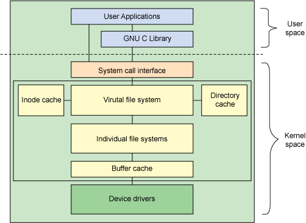

> 文件系统是对一个存储设备上的数据和元数据进行组织的机制，由于定义如此宽泛，各个文件系统的实现也大不相同。常见的文件系统有 ext4、NFS、/proc 等。Linux 采用为分层的体系结构，将用户接口层、文件系统实现和存储设备的驱动程序分隔开，进而兼容不同的文件系统。

虚拟文件系统（Virtual File System, VFS）是 Linux 内核中的软件层，它在内核中提供了一组标准的、抽象的文件操作，允许不同的文件系统实现共存，并向用户空间程序提供统一的文件系统接口。

下面这张图展示了 Linux 虚拟文件系统的整体结构：




> 上图修改自：[《Linux 文件系统剖析》图 1. Linux 文件系统组件的体系结构](https://www.ibm.com/developerworks/cn/linux/l-linux-filesystem/index.html)

用户空间的应用程序通过统一的系统调用（`open()`、`read()`、`write()`等）接口执行文件操作。系统调用接口再将程序的参数传递给 VFS 提供的函数进行处理。

VFS 根据文件路径找到相应的挂载点，得到具体的文件系统信息，然后调用该文件系统的对应操作函数。VFS 提供了两个针对文件系统对象的缓存 Inode Cache 和 DEntry Cache，它们缓存最近使用过的文件系统对象，用来加快对 Inode 和 DEntry 的访问。

每个文件系统为 VFS 实现了一组通用接口，具体的文件系统根据自己对磁盘上数据的组织方式，操作相应的数据。Linux 内核还提供了 Buffer Cache 缓冲区，用来缓存文件系统和相关块设备之间的请求，减少访问物理设备的次数，加快访问速度。Buffer Cache 以 LRU 列表的形式管理缓冲区。

VFS 的好处是实现了应用程序的文件操作与具体的文件系统的解耦，使得编程更加容易：

- 应用层程序只要使用 VFS 对外提供的`read()`、`write()`等接口就可以执行文件操作，不需要关心底层文件系统的实现细节；
- 文件系统只需要实现 VFS 接口就可以兼容 Linux，方便移植与维护。

了解 Linux  文件系统的整体结构后，下面主要分析 Linux VFS 的技术原理，由于文件系统与设备驱动的实现非常复杂，笔者也不了解这方面的内容，因此文中不会涉及文件系统的实现。

## VFS 结构

Linux 以一组通用对象的角度看待所有文件系统，每一级对象之间的关系如下图所示：

```
. . . . . .. . . . .     . . . . . . . . . . . . . . . . . . . . . . . . . .      . . . . . . . . . . . . . . . . . . . . . . . . .
.      Process A   .     .                                                 .      .                                               .
.         fd       .     .                                 Kernel          .      .                  File System                  .
.        +---+     .     .   +--------------+                              .      .                                               .
. stdin  | 0 |-------------->| File Object1 |--------+                     .      .                                               .
.        +---+     .     .   +--------------+        |                     .      .                                               .
. stdout | 1 |-------+   .   +--------------+        |                     .      .                                               .
.        +---+     . +------>| File Object2 |------+ |                     .      .                                               .
. stderr | 2 |-------+   .   +--------------+      | |                     .      .   +------------+                              .
.        +---+     .     .   +--------------+      | |                     . +------->|Inode Object|--+     +-----------------+   .
.        | 3 |-------------->| File Object3 |----+ | |    DEntry Cache     . |    .   +------------+  |  +->|Superblock Object|   .
.        +---+     .     .   +--------------+    | | |  +-------------+    . |    .   +------------+  |  |  +-----------------+   .
.        |...|     .     .                    +--+-+-+->|DEntry Object|------+  +---->|Inode Object|--+  |           |            .
.        +---+     .     .                    |  | |    +-------------+    .    | .   +------------+  +--+           |            .
. . . . . .. . . . .     .                    |  | +--->|DEntry Object|---------+ .   +------------+  |  |           ↓            .
                         .                    |  |      +-------------+    .      .+->|Inode Object|--+  |  +-----------------+   .
                         .                    |  +----->|DEntry Object|------------+  +------------+  |  |  |                 |   .
. . . . . .. . . . .     .                    |  |      +-------------+    .      .   +------------+  |  +->|       Disk      |   .
.      Process B   .     .                    |  |  +-->|DEntry Object|-------------->|Inode Object|--+     |                 |   .
.         fd       .     .   +--------------+ |  |  |   +-------------+    .      .   +------------+        +-----------------+   .
.        +---+     . +------>| File Object4 |-+  |  |   |    .....    |    .      .                                               .
. stdin  | 0 |-------+   .   +--------------+    |  |   +-------------+    .      .                                               .
.        +---+     .     .   +--------------+    |  |                      .      .                                               .
. stdout | 1 |-------------->| File Object5 |----+  |                      .      .                                               .
.        +---+     .     .   +--------------+    |  |                      .      .                                               .
. stderr | 2 |-------+   .   +--------------+    |  |                      .      .                                               .
.        +---+     . +------>| File Object6 |----+  |                      .      .                                               .
.        | 3 |---+ .     .   +--------------+       |                      .      .                                               .
.        +---+   | .     .   +--------------+       |                      .      .                                               .
.        |...|   +---------->| File Object7 |-------+                      .      .                                               .
.        +---+     .     .   +--------------+                              .      .                                               .
. . . . . .. . . . .     . . . . . . . . . . . . . . . . . . . . . . . . . .      . . . . . . . . . . . . . . . . . . . . . . . . .

```

#### fd 与 File

每个进程都持有一个`fd[]`数组，数组里面存放的是指向`File`结构体的指针，同一进程的不同`fd`可以指向同一个`file`对象；

`File`是内核中的数据结构，表示一个被进程打开的文件，和进程相关联。当应用程序调用`open()`函数的时候，VFS 就会创建相应的`File`对象。它会保存打开文件的状态，例如文件权限、路径、偏移量等等。

```c
// https://elixir.bootlin.com/linux/v5.4.93/source/include/linux/fs.h#L936 结构体已删减

struct file {
    struct path                   f_path;
    struct inode                  *f_inode;
    const struct file_operations  *f_op;
    unsigned int                  f_flags;
    fmode_t                       f_mode;
    loff_t                        f_pos;
    struct fown_struct            f_owner;
}

// https://elixir.bootlin.com/linux/v5.4.93/source/include/linux/path.h#L8
struct path {
    struct vfsmount  *mnt;
    struct dentry    *dentry;
}
```

从上面的代码可以看出，文件的路径实际上是一个指向 DEntry 的指针，

除了文件偏移量`f_pos`是进程私有的数据外，其他的数据都来自于 Inode 和 DEntry，和所有进程共享，不同进程的`file`对象可以指向同一个 DEntry 和 Inode，实现文件的共享。

#### DEntry 与 Inode

DEntry 全称为 Directory Entry，用来保存文件路径和 Inode 之间的映射，从而支持在文件系统中移动。DEntry 由 VFS 维护，所有文件系统共享，不和具体的进程关联，每个`dentry`对象都指向一个`inode`对象，在加载`inode`时自动生成。

```c
// https://elixir.bootlin.com/linux/v5.4.93/source/include/linux/dcache.h#L89 结构体已删减

struct dentry {
    struct dentry *d_parent;     // 父目录
    struct qstr d_name;          // 文件名称
    struct inode *d_inode;       // 关联的 inode
    struct list_head d_child;    // 父目录中的子目录和文件
    struct list_head d_subdirs;  // 当前目录中的子目录和文件
}
```

虚拟文件系统维护了一个 DEntry Cache 缓存，用来保存最近使用的 DEntry，加速查询操作。DEntry 只存在于内存中，不会被存储在磁盘上，由于内存有限，所以并不是磁盘上所有 Inode 都会生成 DEntry 被缓存起来。当调用`open()`函数打开一个文件时，内核会第一时间根据文件路径到 DEntry Cache 里面寻找相应的 DEntry，找到了就直接构造一个`file`对象并返回。

如果该文件不在缓存中，那么 VFS 会根据找到的最近目录一级一级地向下加载，直到找到相应的文件。期间 VFS 会缓存所有被加载生成的`dentry`。

每一个`dentry`对象都有一个对应的`inode`对象，Inode（Index Node）由 VFS 定义，表示 Linux 中一个具体的目录项或文件。Inode 包含管理文件系统中的对象所需的所有元数据，以及可以在该文件对象上执行的操作。

```c
// https://elixir.bootlin.com/linux/v5.4.93/source/include/linux/fs.h#L628 结构体已删减

struct inode {
    umode_t                 i_mode;          // 文件权限及类型
    kuid_t                  i_uid;           // user id
    kgid_t                  i_gid;           // group id

    const struct inode_operations    *i_op;  // inode 操作函数，如 create，mkdir，lookup，rename 等
    struct super_block      *i_sb;           // 所属的 SuperBlock

    loff_t                  i_size;          // 文件大小
    struct timespec         i_atime;         // 文件最后访问时间
    struct timespec         i_mtime;         // 文件最后修改时间
    struct timespec         i_ctime;         // 文件元数据最后修改时间（包括文件名称）
    const struct file_operations    *i_fop;  // 文件操作函数，open、write 等
    void                    *i_private;      // 文件系统的私有数据
}
```

Inode 存储的数据存放在磁盘上，由具体的文件系统进行组织，当需要访问一个 Inode 时，会由文件系统从磁盘上加载相应的数据并构造 Inode。一个 Inode 可能被多个 DEntry 所关联，例如为文件创立硬链接等。

#### SuperBlock

SuperBlock 表示特定加载的文件系统，用于描述和维护文件系统的状态，由 VFS 定义，但里面的数据根据具体的文件系统填充。每个 SuperBlock 代表了一个具体的磁盘分区，里面包含了当前磁盘分区的信息，如文件系统类型、剩余空间等。

```c
// https://elixir.bootlin.com/linux/v5.4.93/source/include/linux/fs.h#L1425 结构体已删减

struct super_block {
    struct list_head    s_list;               // 指向 SuperBlock 链表的指针
    dev_t               s_dev;                // 设备标识符
    unsigned long       s_blocksize;          // 以字节为单位的块大小
    loff_t              s_maxbytes;           // 文件大小上限
    struct file_system_type    *s_type;       // 文件系统类型
    const struct super_operations    *s_op;   // SuperBlock 操作函数，write_inode、put_inode 等
    const struct dquot_operations    *dq_op;  // 磁盘限额函数
    struct dentry        *s_root;             // 根目录
}
```

SuperBlock 是一个非常复杂的结构，通过 SuperBlock我们可以将一个实体文件系统挂载到 Linux 上，或者对 Inode 进行增删改查操作，

> 由于 SuperBlock 非常重要，所以一般文件系统都会在磁盘上存储多份，防止数据意外损坏导致整个分区无法读取。

## 应用

## References

- [Linux 文件系统剖析 ](https://www.ibm.com/developerworks/cn/linux/l-linux-filesystem/index.html)
- 