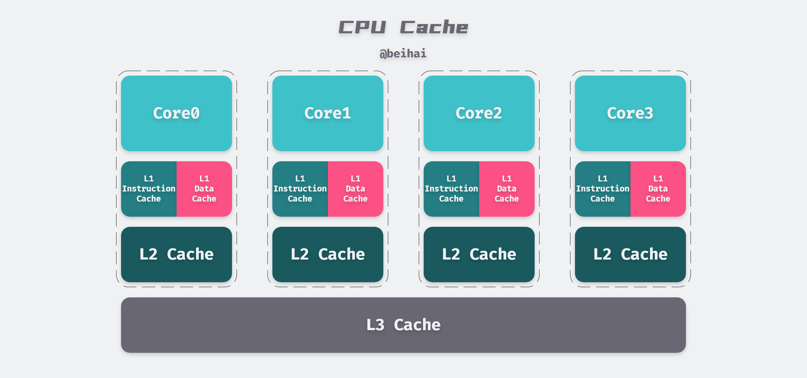
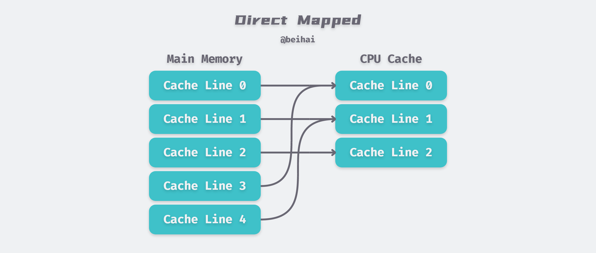
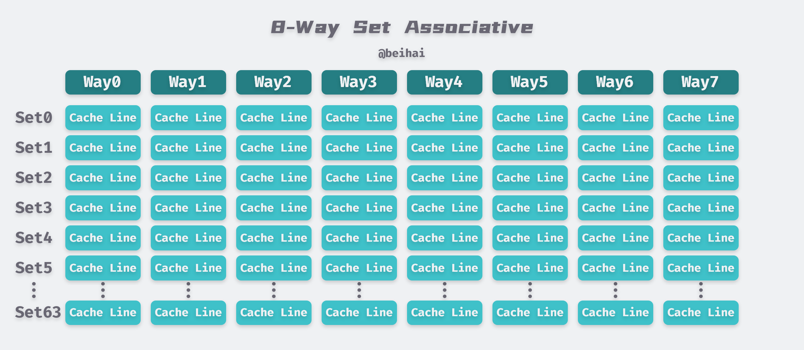
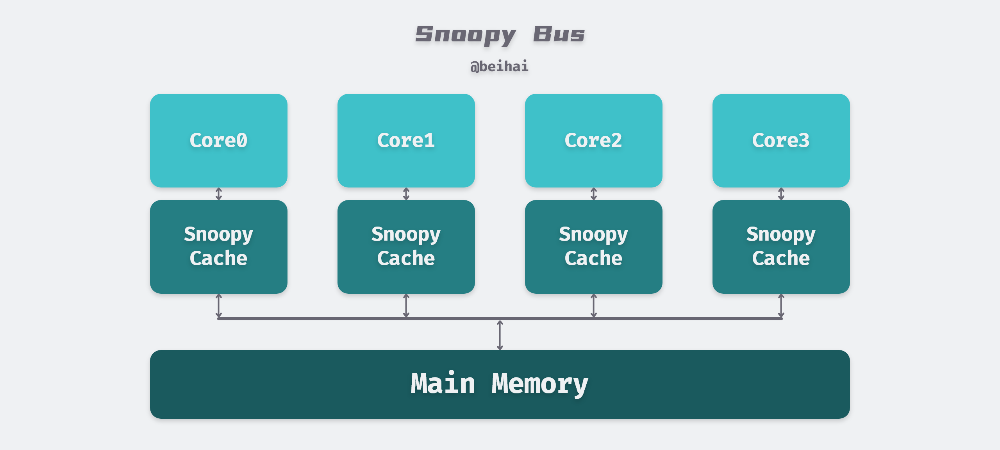

> 在现代的 CPU（大多数）上，所有的内存访问都需要通过层层的缓存来进行，了解 CPU 缓存更新的一致性问题对我们设计与调试程序具有很大的帮助。这篇文章会介绍 CPU 的缓存系统，以及使用内存屏障进行缓存同步。

> *过去两个月比较忙，一直在处理期末考试和学校的一些事情，没什么时间看计科的内容，现在逐渐回归正轨，写一些前面规划的知识。*

早期计算机系统的存储器层次结构只有三层：CPU 寄存器、DRAM 主存和磁盘存储。由于 CPU 和主存之间的存在着较大的性能差距，CPU 在读写数据时都需要漫长的等待，人们不得不在 CPU 寄存器和主存之间插入了一个 SRAM 高速缓存存储器，称为 L1 高速缓存。随着 CPU 和主存之间的性能差距逐渐增大，L2、L3 缓存也被逐渐地添加进来。CPU 与 Cache、Memory 的访问速度大致如下：

- 访问 CPU 寄存器需要 1 个时钟周期；
- 访问 L1 Cache 大概需要 4 个时钟周期；
- 访问 L2 Cache 大概需要 15 个时钟周期；
- 访问 L3 Cache 大概需要 50 个时钟周期；
- 访问 Memory 大概需要 200 个时钟周期。

CPU 与主存之间的性能差距被称作 [冯·诺依曼瓶颈](http://en.wikipedia.org/wiki/Von_Neumann_bottleneck)（Von Neumann bottleneck）。在我们访问内存时，会遇到很多零散的等待周期。例如由于电平协议的传输特性，在选通一行、选通一列、取到可靠的数据之前，需要有一定的信号稳定时间。除此之外，由于主存使用电容来存储信息，为了防止因自然放电而导致的信息丢失，需要周期性的刷新它所存储的内容，这也会带来额外的等待时间。某些连续的内存访问可能会比较高效，但也具有一定的延时，而那些随机的内存访问则消耗更多时间。

可见 CPU 直接向主存读写数据是十分缓慢的，大部分时间都在等待数据传输，所以人们引入了 CPU 缓存结构。

## 概述

现今的 CPU 大都具有三级缓存，以笔者使用的 8265U 为例，其缓存结构如下：

- 每一个 CPU 核心具有 64KB 的 L1 缓存，其中 32KB 是指令缓存，另外的 32KB 是数据缓存，L2 缓存和 L3 缓存不区分指令和数据；
- 每一个 CPU 核心拥有自己的 256KB L2 缓存，而  6MB 的 L3 缓存则是被所有 CPU 核心共享；
- L1、L2、L3 距离 CPU 越近速度也越快，成本也越高 ，离 CPU 越远，速度也越慢。



缓存的级数的逐渐增加，也引入了两个比较重要的问题：一个是缓存的存取命中问题，另一个是缓存更新的一致性问题。在解释这两个问题之前，我们要先了解一下 CPU 是如何读写缓存的。

CPU Cache 和内存以缓存块`Cache Line`为单位交换数据，现今主流 CPU 的 Cache Line 大小是 64Bytes，这就是 CPU 从内存中获取的最小数据单位。CPU 会把 Cache 分成多个 Cache Line，比如 L1 的数据缓存有 32KB，那么它就有 32KB/64B = 512  Cache Line。

当 CPU 看到一条读内存的指令时，它会把内存地址传递给一级数据缓存。一级数据缓存会检查它是否有这个内存地址对应的缓存块。如果有，那就是缓存命中，否则它会把整个 Cache Line 从二级缓存中加载进来。CPU 假设如果我们当前需要某个地址的数据，那么很可能我们马上要访问它的邻近地址，即内存访问倾向于本地化（localized），一旦缓存块被加载到缓存中，读指令就可以正常进行执行。

## 缓存存取设计

Cache 的数据放置策略决定了内存中的数据块会被拷贝到 CPU Cache 中的哪个位置上，因为 Cache 的大小远远小于内存，所以需要一种地址关联的算法，能够让内存中的数据可以被映射到 Cache 中。

#### Fully Associative

全相联（Fully Associative）是指任何一个内存地址的数据可以被缓存在任何一个 Cache Line 里。如果给定一个内存地址，要知道它是否存在于缓存中，需要**并行比较**所有 Cache Line 中的内存地址。因此，Fully Associative 的硬件设计较为复杂，每一个 Cache Line 都需要一个地址比较器，造价也十分昂贵，所以 Fully Associative 并不适合用于 CPU 缓存。

#### Direct Mapped

为了降低直接搜索复杂度的线性增长，直接映射（Direct Mapped）也应运而出：它是指给定一个内存地址，就能确定唯一的 Cache Line。由于 Direct Mapped 下数据的存放地址是固定唯一的，所以容易产生碰撞，最终降低 Cache 的命中率，影响性能。



Hash Table 是最常见的索引方式：将内存地址的哈希值作为数组的 Index，缓存对象的值作为数组的 Value，每次存取时，都把地址算一次 Hash 然后在缓存中找到对应的位置。哈希在高级编程语言中很常见，但是计算一次 Hash 值大约耗时 10,000 个 CPU Cycle ，对于  CPU Cache 来说，其设计目标就是在几十个 CPU Cycle 内获取到数据。如果访问效率是上万个 CPU Cycle ，还不如直接从内存获取数据。

为了降低访问所需的时间，我们使用**求模运算**这类低时间复杂度的算法，如果我们的 L1 Cache 有 512 个 Cache Line，那么公式`（address mod 512）* 64` 就可以直接找到所在的 Cache 位置。但是，这种方式需要操作系统对内存的分配和访问在地址上是近乎平均的，不然冲突情况就会非常严重。

而与我们的意愿相反，为了减少内存碎片和实现便捷，操作系统倾向于连续集中地使用内存。这会导致低编号 Cache Line 由于内存经常被分配并使用，而高编号的 Cache Line 由于鲜有进程访问，几乎一直处于空闲状态。这种情况下造成的浪费，使得本就宝贵的 CPU 缓存更加捉襟见肘。

模映射的灵活性也不够好，如果需要同时将主存的第 0 块与第 512 块复制到 Cache 中，即使其它 Cache Line 空闲，它们也只能复制到编号为 0 的 Cache Line，也就是说它们不能同时写入 CPU Cache 中。Cache Line 需要根据 CPU 的执行过程不断地擦除、加载，十分影响效率。

#### N-Way Set Associative

组相联（Set Associative）是对上述两种方案的权衡，其原理是把一个缓存按 N 个 Cache Line 作为一组（Set），缓存按组等分，N 的值通常为 4、8 或 16 等。

<div align="center"></div>


上图是笔者使用的 CPU-Z 测试截图，可以看出不同级别的缓存采用了不同的 N-Way 组关联。为了更好地理解 N-Way Set Associative，这里举个例子，Intel 大多数处理器的一级数据缓存都是 32KB，8-Way（8 条 Cache Line）一组关联，每条 Cache Line 是 64 Bytes，这意味着：

- 32KB 可以分成 32KB / 64 = 512 条 Cache Line；
- 因为有 8-Way，于是一共有 512 / 8 = 64 个 Set；
- 于是每一组就有 8 x 64 = 512 Bytes 的缓存，每一条 Way 有 4KB 的缓存。

现今的操作系统会把物理内存分割成一个个 4KB 的内存页进行读取，每一个内存页刚好拥有 64 条 Cache Line。当我们读取一个内存页时，这 64 条 Cache Line 会被依次放入 64 个 Set 中：第一条 Cache Line（Byte 0~63）会被放入 Set0，第二条 Cache Line（Byte 64~127）会被放入 Set1，以此类推。



为了方便索引存储器地址，一级数据缓存用一个 36bits 的二进制值来表示地址： 

- **Tag**：每条 Cache Line 地址的前 24 bits 是一个 Tag，表示其所属的物理内存页；
- **Index**：后续的 6bits 则是在这一 Way 的是 Cache Line 索引，2^6 = 64 刚好可以索引 64 条 Cache Line；
- **Offset**：最后的的 6bits 用于表示在该段内存在 Cache Line 里的偏移量，2^6 = 64Bytes；
- **Valid**：一个额外的二进制位用来标记该 Cache Line 是否有效。

因为每一个 Set 有 8 条 Cache Line，可以一次容纳多个内存页，这就降低了缓存碰撞的概率。中间 6bits 的`Index`用于定位到具体的 Set，然后把地址的 Tag 和这个 Set 内的 8 个 Cache Line 的 Tag 并行比较，相同的话就是缓存命中（Cache Line 有效位要设置 为 1），然后再根据`Offset`获取具体的数据。


> 上文中存储器地址与 CPU 的具体寻址设计有关，和操作系统的虚拟内存地址并不是一个概念。文中 36bits 的内存地址可用于表示 64GB 的内存地址，也就是说，这个 CPU 最大支持到 64GB 的物理内存。 64GB 的物理内存刚好可以分割成 2^24 个 4KB 的内存也，所以用 24 bits 来存储 Tag，标记内存页。为了节省空间，CPU 设计的时 Cache 具体用多少 bits 映射 RAM 主要还是和它计划支持多大物理内存有关，并不是我们常说的的 32bits/64bits。

#### 小节

概括来说，CPU 高速缓存可以用元组（S，N，B，m）来表示，即每个存储器地址有 m 位，形成 M = 2<sup>m</sup> 个地址，Cache 被组织成一个有  S = 2<sup>s</sup> 个 Cache Set 的数组，每个 Cache Set 包含 N 个 Cache Line，每个 Cache Line 含有 B = 2<sup>b</sup> 个字节的数据块、m-bit 的地址和一个有效位。

CPU Cache 淘汰策略也有很多类型，常见的有 LRU、LFU 和 Random。通常情况下 CPU Cache 的淘汰策略选择的是 LRU，本文不再赘述这方面的内容。

## 缓存一致性

上一小节中主要介绍了 CPU 缓存的读操作流程，如今家用 CPU 已经普遍四核起步，CPU 也需要保证多个物理核心缓存之间的一致性，这有些类似于分布式系统中的共识问题。但是 CPU 硬件不必考虑网络的断开、延迟等问题，所以多核 CPU 缓存间的同步的关键就是如何管理好数据的状态。通常情况下写操作有下面两种方式：

- **直写模式（Write Through）**：写操作同时写到 Cache 和内存上；
- **回写模式（Write Back）**：写操作写在 Cache 上即可，然后再异步刷新到内存。

因为直接写入内存太慢了，为了提高写入的性能，主流的 CPU 采用的是 Write Back 策略。采用回写模式还有一个额外的优势：它能过滤掉对同一地址的反复写操作，最终只向主存同步一次即可。并且，如果缓存段在回写模式下工作，那么系统可以一次擦写一大片内存，而不是分成小块来写，前者的效率更高。

#### Snoopy 协议

如果有一个数据`x`在 CPU 第 0 核的缓存上被更新了，那么其它 CPU 核心缓存上的数据`x`的值也要被更新，一般情况下使用集中式共享存储体系结构（Snoopy Cache-Coherence Protocols）来解决这个问题：Snoopy 协议更像是一种数据通知的总线型的技术，CPU Cache 通过这个协议可以识别其它 Cache 上的数据状态。如果有数据共享的话，可以通过广播机制将共享数据的状态通知给其它 CPU Cache。这个协议要求每个 CPU 都可以**窥探**数据事件的通知并做出相应的反应。如下图所示，有一个 Snoopy Bus 总线连接着物理内存和 CPU Cache。



『窥探』背后的基本思想是，所有内存传输都发生在一条共享的总线上，而所有的处理器核心都能看到这条总线：缓存本身是独立的，但是内存是共享资源，在同一个指令周期中，只有一个缓存可以读写内存，所有的内存访问都要经过仲裁。**缓存不仅仅在内存传输时才和总线打交道，而是不停地在窥探总线上发生的数据交换，跟踪其它缓存在做什么**。所以当一个缓存代表它所属的核心去读写内存时，其他核心都会得到通知，以此来使自己的缓存保持同步。只要某个处理器一写内存，其他处理器马上就知道这块内存在它们自己的缓存中对应的 Cache Line 已经失效。

> 读者可能会有疑问为什么 L1、L2 缓存不是共享的？这样就可以避免缓存同步问题。这是因为共享 L1 缓存时处理器的时间都花费在排队等待使用一级缓存，至少每个读写指令都要等待一次，效率非常低。使用多组缓存，并利用缓存一致性协议，让它们的行为看起来就像只有一组缓存一样，以达到 CPU 的速度需求。

除了 Snoopy 协议，还有一种 Directory 协议，其典型实现是设计一个集中式控制器，包含有关各种本地缓存内容的全局状态信息。当单个 CPU Cache 发出读写请求时，这个集中式控制器会检查并发出必要的命令，以在主存和 CPU Cache 之间或在 CPU Cache 自身之间进行数据同步和传输。因为是中心式处理数据的，这种协议的延迟比较大，但是在拥有很多个处理器的系统中，它有更好的可扩展性。

#### MESI 类协议

MESI 协议是一个写失效缓存一致性协议，是支持回写模式（Write Back）缓存的最常用协议。在 MESI 协议中，任意一条 Cache Line 有 4 种不同的状态：

- **独占（Exclusive）**：该条 Cache Line 只在当前缓存中，并且干净的（缓存数据同于主存数据），当其它缓存读取它时，状态变为 Shared，当修改数据后，变为 Modified，只有独占状态下的 Cache Line 才能被修改；
- **共享（Shared）**：Cache Line 也存在于其它缓存中且是干净的，可以在任意时刻抛弃；
- **已修改（Modified）**：Cache Line 是脏的（Dirty）与主存的值不同，如果其它 CPU 核心要读主存这块数据，该 Cache Line 必须回写到主存，状态变为共享；
- **无效（Invalid）**：Cache Line 是无效的，需要从主存进行同步。

MESI 协议中只有一个 CPU 核心负责写入数据，在独占状态下，这个 CPU 核心将数据写入 Cache 后，它会广播一个失效请求告诉所有其它的 CPU 核心，把对应的 Cache Line 标记为无效状态；而在共享状态下，同样的数据在多个 CPU Cache 里存在一份，所以需要先向其它核心广播失效请求，把其它的 CPU 核心里面的 Cache 标记为无效状态，最后才能更新数据。

MESI 协议在数据更新后，会标记其它共享的 CPU 缓存数据为无效状态，当其它 CPU 再次读取这部分数据时，就会出现 Cache Miss 情况，此时需要从内存中更新数据。从内存中更新数据意味着 20 倍速度的降低。如果我们能直接从隔壁的 CPU 缓存中更新，这就可以增加很多速度了，于是出现了扩展版的 [MOESI 协议](https://en.wikipedia.org/wiki/MOESI_protocol) 与 [MESIF 协议](https://en.wikipedia.org/wiki/MESIF_protocol)。

MOESI 协议目前被 AMD 的 CPU 采用，它添加了一个额外的 Owner（宿主）状态用于标记更新数据的源头。Owner 状态和 Exclusive 状态类似，也是保证缓存间一致性的手段，但它可以直接共享脏段的内容，而不需要先把它们回写到内存中。Intel 采用的 MESIF 协议添加的 Forward 状态则允许将干净的 Cache Line 转发到另一个缓存，其它缓存则不必从内存中重新读取它以获得一个共享副本。这两种协议都是在缓存间共享数据做了一些优化，以尽可能地减少延迟。

## 内存模型 

我们已经了解了 CPU 缓存的总线模型与同步协议，如果 CPU Cache 能够理想化地满足下面的条件，那么就可以做到得到完全的顺序一致性：

1. 缓存一收到总线事件，就可以在当前指令周期中迅速做出响应；
2. 处理器如实地按程序的顺序，把内存操作指令送到缓存，并且等前一条执行完后才能发送下一条。

但是实际上，现代处理器总是由于各种原因无法满足以上条件：

- **缓存不会及时响应总线事件**：如果总线上发来一条消息，要使某个缓存段失效，但是如果此时缓存正在处理其他事情（比如和 CPU 传输数据），那么这个消息可能无法在当前指令周期中得到处理，而会进入所谓的『失效队列（Invalidation Queue）』，这个消息等在队列中直到缓存有空闲进行处理为止；
- **处理器一般不会严格按照程序的顺序向缓存发送内存操作指令**：有乱序执行（Out-of-Order execution）功能的处理器肯定是这样的，但是顺序执行（in-order execution）的处理器有时候也无法完全保证内存操作的顺序，例如想要的内存不在缓存中时，CPU 不会为了载入缓存而停止工作，而是进行指令重排；
- **写操作尤其特殊，因为被划分为两阶段操作**：在写之前我们先要得到缓存段的独占权，如果我们当前没有独占权，我们先要和其他处理器协商，这也需要一些时间。同理，在这种场景下让处理器闲着无所事事是一种资源浪费。实际上，写操作首先发起获得独占权的请求，然后就进入写缓冲（Store Buffer）队列，写操作在队列中等待，直到缓存准备好处理它。

这些意味着，默认情况下，读操作有可能会读到过时的数据，例如对应失效请求还在失效队列中没执行，写操作真正完成的时间有可能比它们在代码中的位置晚，一旦牵涉到乱序执行，一切都变得模棱两可。

不同的体系结构的 CPU 提供了不同的内存模型，ARM 架构的机器拥有相对较弱的内存模型：这类 CPU 在读写指令重排序方面有相当大的自由度，这种重排序有可能会改变程序在多核环境下的语义。通过内存屏障（Memory Barrier）技术程序可以对此加以限制：**指令重排操作不允许越过设定的边界**。相比之下，x86 则拥有较强的内存模型。

#### 指令重排

每个 CPU 运行一个程序，程序的执行产生内存访问操作。在这个抽象 CPU 中，内存操作的顺序是松散的，在不改变程序执行结果的推测下，由自己方便的顺序执行内存访问操作。举例来说，假定存在值`{ A == 1 ; b == 2}`，考虑下面执行指令的结果：

| CPU 1 | CPU 2 |
| :---: | :---: |
| A=3;  | x=B;  |
| B=4;  | y=A;  |

上面四条指令会有 24 种内存访问操作的组合，每种组合都有可能出现，最终会产生四种执行结果：

```assembly
    STORE A=3,	STORE B=4,	y=LOAD A->3,	x=LOAD B->4
    STORE A=3,	STORE B=4,	x=LOAD B->4,	y=LOAD A->3
    STORE A=3,	y=LOAD A->3,	STORE B=4,	x=LOAD B->4
    STORE A=3,	y=LOAD A->3,	x=LOAD B->2,	STORE B=4
    STORE A=3,	x=LOAD B->2,	STORE B=4,	y=LOAD A->3
    STORE A=3,	x=LOAD B->2,	y=LOAD A->3,	STORE B=4
    STORE B=4,	STORE A=3,	y=LOAD A->3,	x=LOAD B->4
    STORE B=4, ...
    ...

result:
    x == 2, y == 1
    x == 2, y == 3
    x == 4, y == 1
    x == 4, y == 3
```

更残酷的是，一个 CPU 已经提交的写操作，另一个 CPU 可能不会感知到，从而取到旧的值。例如下面这个例子：

```
    CPU 1		CPU 2
    ===============	===============
    { A == 1, B == 2, C == 3, P == &A, Q == &C }
    B = 4;		Q = P;
    P = &B;		D = *Q;
	
result:
    (Q == &A) and (D == 1)
    (Q == &B) and (D == 2)
    (Q == &B) and (D == 4)
```

除此之外，CPU 还可能合并内存访问操作，例如这两条地址运算指令`X = *A; Y = *(A + 4);`可能会被合并为下面任何一种执行顺序：

```assembly
    X = LOAD *A; Y = LOAD *(A + 4);
    Y = LOAD *(A + 4); X = LOAD *A;
    {X, Y} = LOAD {*A, *(A + 4) };
```

#### 内存屏障

虽然 CPU 可以进行指令重排，但为我们提供了最小保证，即：

1. 有依赖关系的内存访问操作是有顺序的；
2. 在同一个 CPU 核心中的覆盖 load-store 操作是有顺序的。

如果我们想要更高级别的、能够在程序中掌控的指令执行顺序，就需要使用内存屏障了，一般常见的有四种类型：

- **写屏障**：写屏障保证任何出现在写屏障之前的 STORE 操作先于出现在该 写屏障之后的任何 STORE 操作执行，写屏障一般与读屏障或者数据依赖屏障配合使用；
- **读屏障**：读屏障保证任何出现在读屏障之前的 LOAD 操作先于出现在该读屏障之后的任何 LOAD 操作执行，读屏障一般和写屏障配合使用；

- **数据依赖屏障**：数据依赖屏障是一个弱的读屏障，用于两个读操作之间，且第二个读操作依赖第一个读操作（比如第一个读操作获得第二个读操作所用的地址），读屏障用于保证第二个读操作的目标已经被第一个读操作获得，数据依赖屏障只能用于确实存在数据依赖的地方；

- **一般内存屏障**：一般内存屏障保证所有出现在屏障之前的内存访问（LOAD 和 STORE）先于出现在屏障之后的内存访问执行，像是读写屏障的结合。

例如在下面的例子中，我们用一个写屏障和一个数据依赖屏障来保障`B`和`Q`的值，使得程序只出现可预期的结果：

```
    CPU 1		      CPU 2
    ===============	      ===============
    { A == 1, B == 2, C == 3, P == &A, Q == &C }
    B = 4;
    <write barrier>
    WRITE_ONCE(P, &B);
			      Q = READ_ONCE(P);
			      <data dependency barrier>
			      D = *Q;
```

关于内存屏障的应用场景还有很多，本文无法一一详细描述它们的用法，相关内容可以自行阅读 Linux 文档 *[LINUX KERNEL MEMORY BARRIERS](https://github.com/torvalds/linux/blob/master/Documentation/memory-barriers.txt)*，大部分情况下我们也很少直接用到这些内容，但了解相关的知识可以帮助我们更好地理解程序的设计思路。

## 总结

总体来说，CPU Cache 对于软件工程师是透明的，所有的操作和策略都在 CPU 内部完成。但是，了解和理解 CPU Cache 的设计思想和工作原理有利于我们更好地利用 CPU Cache，写出对 CPU Cache 更加友好的程序。笔者也思考了一些相关应用场景：

- 在 CAS 算法中把数据比较更新的粒度控制在缓存内，可以进一步提高执行效率；
- Cache 的直写/回写思想可以带入到业务场景中的数据库-缓冲系统中，帮助我们权衡执行方案；
- 在适合的场景中，在 CPU 这一级别对数据进行『加锁』，降低这一过程的性能损耗。

CPU Cache 中的缓存一致性协议类似于简化后的分布式系统中的共识，从微观的角度看待这个问题，也是很有意思的过程。这也说明计算机科学中的一些原理是相通的，虽然知识点庞杂，但要学会抓住重点，做到一脉相承。

## References

- [Cache coherency primer](https://fgiesen.wordpress.com/2014/07/07/cache-coherency/) （[中文版](https://www.infoq.cn/article/cache-coherency-primer)）
- [LINUX KERNEL MEMORY BARRIERS](https://github.com/torvalds/linux/blob/master/Documentation/memory-barriers.txt) （[中文版](https://quant67.com/post/linux/memory-barriers/memory-barriers.html)）
- [Cache: a place for concealment and safekeeping](https://manybutfinite.com/post/intel-cpu-caches/)
- [与程序员相关的CPU缓存知识](https://coolshell.cn/articles/20793.html)
- [《深入理解计算机系统》6.4节：高速缓存存储器](https://book.douban.com/subject/26912767/)
- [What is the benefit of the MOESI cache coherency protocol over MESI?](https://stackoverflow.com/questions/49983405/what-is-the-benefit-of-the-moesi-cache-coherency-protocol-over-mesi)
- [MESI protocol](https://en.wikipedia.org/wiki/MESI_protocol)