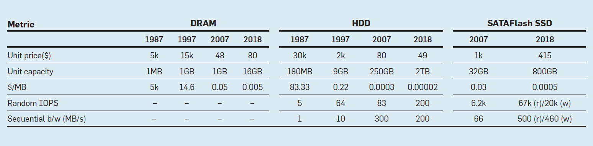
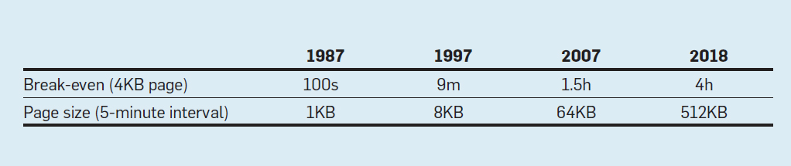
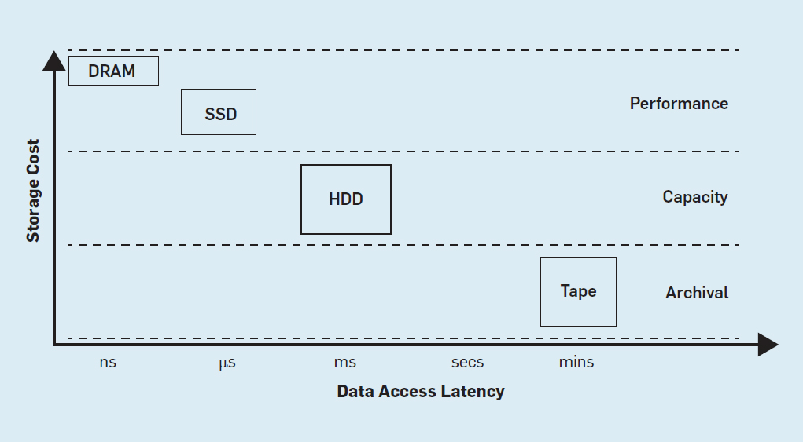
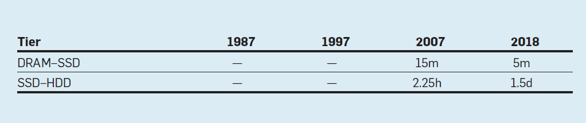
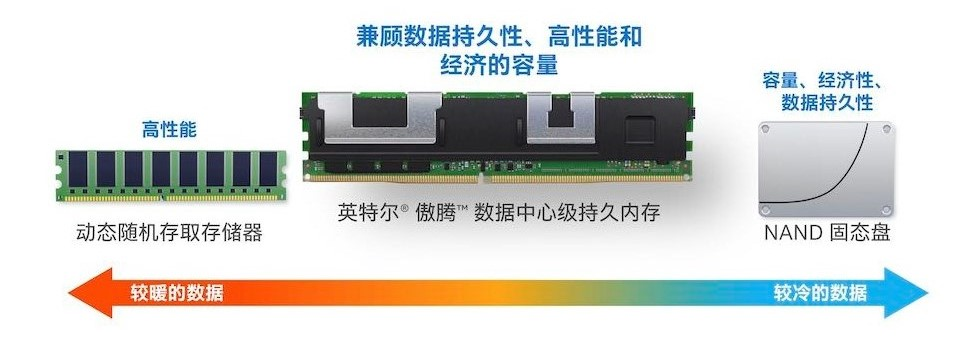

> 五分钟法则（The Five-Minute Rule）是用来衡量数据驻留在内存还是从磁盘进行访问的经验法则：在数据被读写之前必须被移动到主存的情况下，如果某项数据被访问频率的足够高，那么应该将它缓存在内存里，否则的话就应该待在硬盘上按需要再访问。

五分钟法则由 Jim Gray 与 Franco Putzolu 在 1986 年提出，起初用来根据投入成本衡量内存与磁盘的 I/O 开销。如今经历了三十年的硬件发展，内存与磁盘在性能、价格、容量等发面发生了翻天覆地的变化，尤其是闪存的出现填补了传统 DRAM 与磁盘间的性能差距，五分钟法则也被赋予了新的含义。

表1：DRAM、HDD 和 Flash SSD 的性能演变

不幸的是，2007 年 Jim Gray 独自驾船出海失踪，为了纪念这位对数据库领域有突出贡献的图灵奖得主，每隔十年都会重新回顾五分钟法则与当今硬件的发展情况，写成了一个系列文章，感兴趣的同学可以通过下面的链接阅读相关内容：

- *[ 1986. The 5 Minute Rule for Trading Memory for Disc Accesses and the 5 Byte Rule for Trading Memory for CPU Time](https://www.hpl.hp.com/techreports/tandem/TR-86.1.pdf)*
- *[ 1997. The Five-Minute Rule Ten Years Later, and Other Computer Storage Rules of Thumb](https://jimgray.azurewebsites.net/5_min_rule_sigmod.pdf)*
- *[ 2009. The Five-Minute Rule 20 Years Later](https://cacm.acm.org/magazines/2009/7/32091-the-five-minute-rule-20-years-later/fulltext)*
- *[ 2019. The Five-Minute Rule 30 Years Later and Its Impact on the Storage Hierarchy](https://cacm.acm.org/magazines/2019/11/240388-the-five-minute-rule-30-years-later-and-its-impact-on-the-storage-hierarchy/fulltext)*

## The Five-Minute Rule

在 1986 年，1MB 的主存需要 5K$，存储 1KB 数据的成本就是 5$。一个 180MB 的磁盘定价约为 15K$，每秒可以支持 15 次访问，额外的用于支持磁盘一秒访问一次数据的 CPU 和电力开销大约是 1K$，所以磁盘每秒一次的访问成本大约是 2K$。

我们假设一个数据页 Page  的大小为 1KB，如果在主存中保存 1KB 的记录可以节省一次磁盘访问，那么就相当于以 5$ 的成本节省了价值 2K$ 的磁盘访问，这是非常划算的。继续估算下去，就可以得到一个平衡时间间隔：2000÷5=400，**即一个 1KB 数据页的访问频率超过每 400 秒一次，将其缓存在内存中要比放在磁盘中更划算**。因为 400s 接近 5 分钟，所以被称为五分钟法则。

400s 只是一个特定条件下的估值，除了硬件成本与 I/O 性能，数据页大小也会影响平衡间隔，对于更小的页面，这个时间会更长（100 字节的页面是 1 小时)，对于更大的数据页，这个间隔时间会更短（4KB 的页面是 100s)。

五分钟法则提供了一个公式来评估内存成本与磁盘 I/O 成本之间的平衡间隔：
$$
\frac{PagesPerMBofDRAM}{AccessesPerSecondPerDisk}✖\frac{PricePerDiskDrive}{PricePerMBofDRAM}
$$

等式中的第一个比率称为技术比率，即存储引擎一个数据页面的大小，以及二级存储设备（HDD）的随机 I/O 能力，两者都直接取决于所使用的硬件技术；第二个比率称为经济比率，因为硬件定价还需要技术以外的其他因素决定。如果交换两边分式的分母，这就将公式简化为直接比较执行 I/O 从磁盘获取页面的成本与在 DRAM 中缓存页面的成本，可以更直观地了解五分钟法则的含义。

1997 年 Jim Gray 对五分钟法则进行了一次回顾，证实了五分钟法则依然有效，针对 4KB 的页面来说，平衡间隔点是九分钟左右，因为硬盘、内存实际上没有质的飞跃。然而在 21 世纪初期，由于 DRAM 的降价幅度远远快于 HDD，导致经济比率增加了 10 倍，并且由于缺乏对 HDD 随机访问延迟的改进，技术比率并未下降，结果，4KB 页面的平衡间隔上升到 1.5 小时，五分钟法则仅适用于 64KB 的大页面。

表2：4KB 页面的平衡间隔与适用 5分钟法则的页面大小

如今（2018 年）这一数值已经达到 4 小时，这个趋势表明，将大多数数据存储在 DRAM 中而不是 HDD 中更为经济划算，而页面大小的不断上升则要求我们，即使少量地对 HDD 进行访问也应该以大粒度进行。

五分钟法则可以用来确定一个最优的磁盘-内存权衡方案。根据 80-20 法则，大约 64% 的访问会落在 4% 的数据上，所以将热点数据缓存在内存中可以极大地降低访问成本。五分钟法则还可以应用于虚拟内存管理，如果一个 4KB 大小的虚存页会被频繁引用到，那么它就应该驻留在内存中。

> *The 80-20 rule implies that about 80% of the accesses go to 20% of the data, and 80% of the 80% goes to 20% of that 20%. So 64% of the accesses go to just 4% of the database. Keeping that 4% of the database in the main memory disc cache saves 64% of the disc accesses over the all-on-disc design.*

## 闪存的影响

在 2009 年的第二次回顾则是针对 SSD 这个『新的旧硬件』可能带来的影响。随着闪存时代的来临，五分钟法则一分为二：DRAM-SSD 存储系统与 SSD-HDD 存储系统。而这也带来了一个新的问题：是把 SSD 当成较慢的内存还是更快的硬盘使用？这个问题的答案并不是确定的，操作系统和文件系统的设计者会把闪存当成扩展内存使用，但是数据库系统把闪存当成持久性存储会取得更好的效果。

一些设计的决策也依赖于这个问题的答案，例如，如果闪存是缓存的一部分，那么当它的页面与磁盘中的页面不同时，这个页面应该被视为脏页，必须将它们强制写入磁盘；如果将闪存视为持久性存储，这个写入操作是不必要的。

如今，企业数据库引擎使用如上图所示的三层存储层次结构。基于 DRAM 或 NAND 闪存固态设备（SSD）的性能层用于缓存关键延迟事务处理和实时分析应用程序访问的数据；基于 HDD 的容量层存储着对延迟不敏感的批处理分析应用程序访问的数据；档案层并不用于在线数据处理，而是用于存储仅在数据备份或灾难恢复期间很少访问的数据，该层主要基于磁带，对于作为银行、安全和执法等领域的长期数据存储库而言，这一层至关重要。

#### DRAM-SSD

与 HDD 相比，SSD 具有出色的随机访问性能，因此它们正越来越多地用作性能层的存储介质。下表显示了基于 SSD 的存储系统在 2007 年与 2018 年的平衡间隔。

表3：DRAM-SSD 与 SSD-HDD 的平衡间隔

我们看到 4KB 页面的间隔从 15 分钟减少到 5 分钟，因此，五分钟规则对如今的 SSD 仍然有效。这与 DRAM-HDD 的情况形成鲜明对比，后者的间隔从 1.5 个小时增加到 4 个小时，增长了 2.7 倍。在 DRAM-HDD 和 DRAM-SSD 这两种系统中，DRAM 成本的下降都主导了经济比率的升高。但是，与 HDD 2.5 倍的 IOPS 性能改进不同，SSD 实现了惊人的 11 倍随机 I/O 增幅（67K / 6.2K），由于 SSD 技术比率的下降，经济比率的增长被拉平，导致时间间隔缩小。

#### SSD-HDD

由于 SSD 也可以用作 HDD 的缓存，因此这个公式也可以用于估算 SSD-HDD 情况下的平衡间隔。在上表中，我们可以看到这种情况下的平衡间隔从 2007 年的 2.25 小时增加到 2018 年的 1.5 天，增长了 10 倍。SSD-HDD 间隔是 DRAM-HDD 间隔的九倍。

这些结果产生了两个重要的推论。首先，在 2007 年，DRAM-HDD 系统的平衡时间是 DRAM-SSD（1.5h / 15m）的 6 倍，而在 2018 年它几乎增长到了 50 倍（4h / 5m），因此，在出于经济因素而优化的系统中，应该用 SSD 代替 HDD，因为它不仅可以提高性能，还可以减少缓存数据所需的 DRAM 数量。其次，由于 HDD 性能进步幅度不大，导致长达四个小时的 DRAM-HDD 和 1.5 天的 SSD-HDD 间隔，因此将所有热点数据保留在基于 DRAM 或 SSD 的性能层是十分重要的，基于 HDD 的容量层仅存储那些不经常访问的数据。

性能层和容量层之间越来越大的差距也意味着 SSD 供应商应针对随机读写性能 $/IOPS 进行产品优化，而 HDD 供应商应针对容量 $/GB 进行优化。

#### 发展趋势

在过去的二十年中，基于 NAND 闪存的固态存储性能在不断提升。在 2000 年代初期刚刚引入 NAND 闪存时，固态存储被基于 DRAM 的 SSD 产品所主导；到 2000 年代中期，NAND 闪存性能和可靠性的提高使得 SATA SSD 在应用领域中日益普及；在 2000 年代后期出现的新型 PCIe SSD 可以提供比 SATA 类产品高两个数量级的吞吐量。从那时起，容量的快速增加、价格的下降以及低开销的接口，都导致 PCIe SSD 取代了 SATA 作为服务器存储加速器。

随着 SSD 供应商不断提高吞吐量和容量，存储系统中的瓶颈已从设备本身转移到了用于连接 SSD 的 PCIe 总线。因此，在过去的几年中，NAND 闪存再次从高延迟、带宽受限的 PCIe 总线接口的存储设备过渡到通过低延迟、高带宽内存总线。这些设备也称为非易失性双列直插式内存模块（Non-Volatile DIMMs，NVDIMM），它是一种混合内存，通常将非易失性 NAND 闪存与 DRAM 集成在一起，并在单个内存子系统上集成专用的备用电源，可在断电期间保存数据。

虽然 NVDIMM 提供了持久性，但这个系统通常十分昂贵，因为需要与 DRAM 模块一样多的 NAND 存储以及额外的电池备用子系统。而且发生断电时，保存和还原状态也会有所延迟。此外，如果电池未维护或损坏，则会失去备份功能。

与依赖 NAND 闪存的 NVDIMM 技术不同，宣称具有比 NAND 闪存更好的耐久性、更高的吞吐量和更低的延迟的非易失性存储器（Non-Volatile Memory，NVM）正在被积极开发。以英特尔的傲腾持久内存为例，它们与 DRAM 驻留在同一总线上，但是可以在不通电的情况下以持久模式存储数据，保证数据不受损。尽管傲腾持久内存模块的速度不如 DRAM 模块那么快，但从每 GB 成本的角度以及容量扩展能力来看，前者已经有了很大的改善。

## 总结

总体来看，DRAM 与 HDD 之间的差距越来越大，1987 年适用于 DRAM-HDD 存储系统的五分钟法则现在需要四小时。这意味着基于 HDD 的容量层不仅与性能敏感的应用程序失去关联，而且也不适用于所有具有非顺序数据访问的应用程序。另一方面 DRAM 和 SSD 之间的差距正在缩小，原来的五分钟规则现在正好适用于 DRAM-SSD 情况。

如今，在内存中管理数据时代，我们基于所有数据都驻留在 DRAM 中的假设，设计了多种存储引擎。但是由于下面三个原因，五分钟法则计算的平衡间隔可能会进一步下降，对基于 DRAM 的内存数据管理这一趋势提出了挑战：

- 最新的预测表明，在未来五年内，闪存密度预计将以每年 40％ 的速度增长，相比之下，DRAM的容量每三年翻一番，因此，闪存的成本可能比 DRAM 会更快下降；
- 现代 PCIe SSD 是一种可以高度并行工作的设备，可以同时提供非常高的随机 I/O 吞吐量，并且 NVM 固态存储介质的进一步改进将导致技术比率的下降；
- SSD 的功耗比 DRAM 低得多，基于 SDD 的存储系统的运营费用会更低，因此总成本也更少；

这似乎暗示着我们将从基于 DRAM 的数据库引擎转向基于闪存或非易失性存储器的持久性存储引擎，将大部分数据存储在固态设备而不是 DRAM 上更具有经济效益。