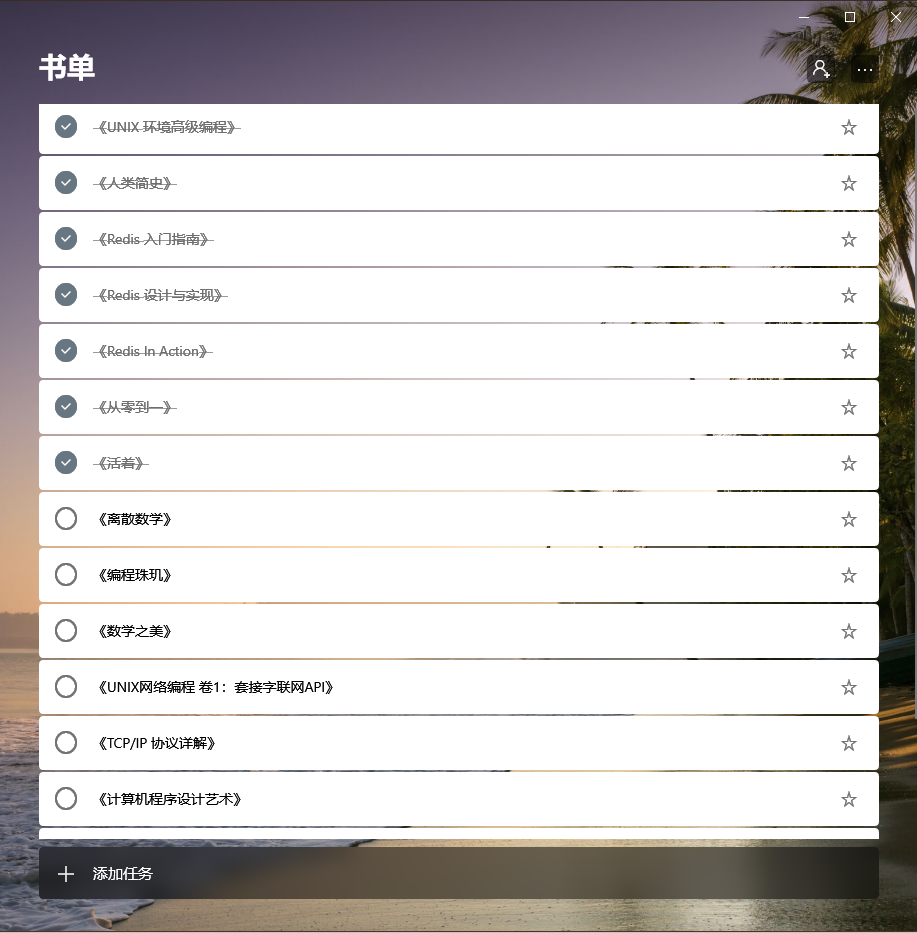

> 将年终总结以“教训、反思、新尝试”为主题未免感觉有些小题大作，但也是我在 2019 年的心路历程。在这一年里除了工程能力上的提升，还在个人学习方式、团队协同工作方面进行了一些思考，对上半年比赛过程中产生的教训进行了反思，希望在未来的工作中少犯同类的错误。

在开头说明一下，虽然时间上的 2019 年已经过去快两个月了，但从任务规划的角度看 2019 年度一直持续到寒假结束。个人觉得这是一个更合理的时间统计方式。

2019 年是笔者变动较大的一年，也是确定未来发展方向的一年，在长期的编写业务逻辑代码过程中逐渐发现了自己的不足，教训累累。因此决定进行一些转变，不断尝试新的学习思路。

## 教训

2019 年上半年的主要精力都在比赛上，除了负责具体的代码编写外，还参加一些交流会、赛前辅导、处理人际关系等。在比赛过程中也暴露出一些团队与个人上的问题，在这里记录下来，引以为戒。

#### 团队问题

对于一个工程团队，协同工作能力是重中之重，很不幸的是我们的管理方式十分糟糕，整个团队在混乱、无序的状态下进行工作。团队成员间的沟通方式以口头形式的交流为主，仅有的书面形式的开发文档形同虚设，进度无法追踪，对其他成员的实现方式也难以了解。

整个团队没有明确的行动目标，没有合理的日程规划，没有行之有效的奖惩措施，这些是我们暴露的十分明显问题。具体在实际表现上，主要在下面三个方面：

- 指导老师下达任务混乱，造成了小方向上的失误，消耗了不必要的时间与精力；
- 团队负责人分配任务不均，低估了实际工程难度，导致工期一再延误；
- 部分负责开发的同学工作不积极，但碍于学生团队不好做出格的举措。

实际上我们依然是 *教师—学生* 的管理模式，团队负责人并没有太大的实权，无法左右人员安排与开发反向，而脱离了开发团队的老师也无法感知整个队伍的情况，往往是坏事情已经发生了才做出反应。要解决这个问题，要么老师深入一线（好像不太可能实现），要么下放更大的权力（好像也不太可能）。

纵然这是第一次在团队中协同工作，但是从决策层到管理层到基层，我们都犯了许多低级错误，对于每个团队成员来说这个过程是一种煎熬，最后的结果可想而知。**无组织无纪律叫团伙，有组织有纪律才叫团队**，在团队协同工作中形成规范性制度，才能提升团队整体的效率。

#### 个人问题

很多人觉得程序员群体都比较闷，不爱交流。我在比赛期间也参加了一些交流会议，但坦诚地讲，这些会议内容没有深度，效率低下，基本是在台下走马观花看看 PPT 。与其参加文案大赛形式的技术、项目交流会议，不如将时间节约下来。我并不是在宣扬闭门造车，积极有效的技术沟通有助于个人成长，但不要将时间花费在无意义的事情上。

在过去的编程过程中，时常在对某项技术没有清晰的认知时就匆忙应用，即使没有出现大问题，但是实现往往很丑陋，也会给自身造成能力达标的假象。互联网的更新换代速度很快，如果只是浮于表面，追求将自己吃成个胖子，很难立足于领域内。

#### 反思

> 对于上半年的内容很难进行全面的描述，在这期间经历了一些团队、管理、行政、人事方面的事情，对此产生一些与以往不同的看法。在考虑良久后，只在上文中简要说明了较为清晰的问题。

笔者曾经错误地认为编程能力能够熟练写一写业务代码，可以将更多的精力放在其他领域上。现在看来这是十分短视的认知，对于技术开发人员，工程能力是安身之本，比所谓的人脉、表达能力更为重要。**对某一技术领域有着深入的探究，不仅可以提升自己的专业知识，更是对自身学习能力的培养**。希望自己能够利用好剩余的大学时间，在专业能力上更进一步。

## 新尝试

在 2019 年上半年没有大块的时间学习，读的书也寥寥无几。从下半年开始将精力转移到自身能力的提升上，除了复习以前的知识，接触新内容，在这个过程中也不断地对学习方式进行调整，以获取更高的学习效率。下面是对这半年学习方式的总结。

#### 新知识

新知识的学习主要有两方面，一是了解计算机体系结构与操作系统，二是 Redis 源码阅读，在学习过程中也产生了一些与以往不同的理解。

计算机体系结构与操作系统是计算机科学的底层基础，笔者主要通过《深入理解计算机系统》与《UNIX 环境高级编程》这两本书进行学习。但这方面的内容实在太复杂了，需要静下心来长时间阅读，单纯的通过书籍文档学习很难有全面深入的理解，需要在实践中不断强化。

Redis 源码学习是我第一次系统性地阅读源码，主要参考了中文注释项目 [huangz1990/redis-3.0-annotated](https://github.com/huangz1990/redis-3.0-annotated) 与书籍《Redis 设计与实现》。Redis 的代码写的很干净优雅，作者对操作系统进程、I/O 也有着很深入的理解，擅于使用工程思维解决问题，非常适合学习临摹。这次源码阅读本意是希望能够更深入地理解 Redis，但在学习过程中也精进了对其他知识的了解，收获要比预料大的多。

#### 规划性阅读

阅读是小时候培养的一个习惯，每年都会花费一段时间进行阅读。但今年的一大变化是从兴趣性阅读转向规划性阅读。除去文学性作品与朋友推荐的书籍，技术领域的书籍都会先了解整体内容，查看书籍是否符合当前的需求，并且会设立一个阅读计划表，根据进度进行调整。

这项规划制度执行了小半年，起到了很好的日程安排与督促作用，因此计划将规划制度应用在其他方面。

#### 文档与编程

大概是从 11 月开始认认真真地写一些技术文章，虽然占用了一些时间与精力，但是写作过程中也提升了对原有知识的理解。现在文章质量参差不齐，计划在 2020 年提升写作能力，产出一些高质量的文章。

在编程方面，相较于上半年下半年的写代码数量大幅减少，一是任务量大大减少，二是重复性地编写业务代码对能力的提升收效渐微，因此将主要精力用于基础知识学习，尝试写出更优雅的代码。

#### 学习效率

根据《深度工作》一书中的描述，人类一天”深度工作“的极限时长约为 4 小时，其余时间都是浅浮工作状态。毫不夸张地说我们的主要产出都是在”深度工作“状态下完成的。笔者现在每天可以保持约一个小时的”深度工作“，在状态极好时能提升到两个多小时。希望自己能够继续提升专注力与自控力，更好地利用时间。

## 计划

2020 年的规划延续了现在的学习方案，在原有知识的基础上，接触新的领域，补足短板。从宏观看，整体的学习曲线比较平缓，学习负担应该不会很大。

**编程语言**

- 加密算法原理分析；
- Go 语言标准库；

**算法**

虽然在算法方面的兴趣不大，但决定还是接触一定的算法知识，注入新的编程思想，主要规划如下：

- 学习离散数学；
- 通读一遍基础数据结构；
- 计划 LeetCode 刷题 200~300道，大约是入门水准，具体量视情况而定；

**文档**

- 在今后的编程过程中培养规范性的文档与注释习惯；
- 学习英语，能够独立阅读官方文档；

**网络**

- 学习 TCP/IP、UDP；
- 学习 HTTP、HTTP2、HTTP3 协议；
- 如果时间充足，阅读 gRPC 的源码。

## 书单

最后整理了全年书单：

- 《Go 语言高级编程》
- 《平凡的世界》
- 《The Go Programming Language》
- 《The C Programming Language》
- 《Go语言标准库》
- 《build-web-application-with-golang》
- 《Go 并发编程实战》
- 《汇编语言 王爽》
- 《写给大家看的设计书》
- 《深度工作》
- 《深入理解计算机系统》
- 《UNIX 环境高级编程》
- 《人类简史》
- 《Redis 入门指南》
- 《Redis 设计与实现》
- 《Redis In Action》
- 《从零到一》
- 《活着》