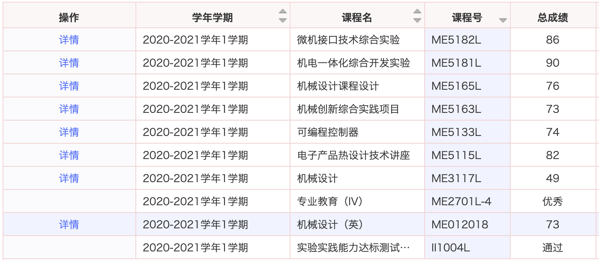
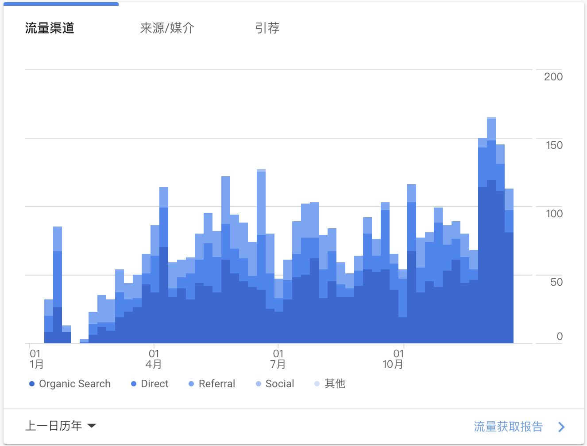

> 2020 年发生了许多黑天鹅事件，笔者在这一年也经历了许多意料之外的事情，既定的学习计划一再延期。总体来看，任何选择都伴随着一定的风险，充斥着不确定性，但是不管遇到什么意外事件，笔者认为我们都要学会拥抱变化，勇敢地去面对问题、接受问题、解决问题。

在 2019 年，笔者一直渴望拥有专注学习的能力，因此逼迫自己去啃下一块硬骨头，不管用多少时间都要咬牙学完。这段经历对于笔者的意义是重大的，懂得「抬头看路，低头做事」，多花费一些时间思考如何能够让自己达成目标，前进的路径的是什么，需要掌握的技能是什么，最终发现很多事情也并不是这么难做到。

由于专业原因，这一年的上半年与下半年做着截然不同的两种事情。上半年以 etcd 为中心，初探分布式系统，这段时光是非常充实的。而在下半年，为了顺利毕业，笔者不得不在秋季学期重修课程，停滞了所有的学习计划。强迫自己去做不喜欢的东西是一件痛苦的事情，但是笔者也利用这段时间沉淀认知，思考更适合自己的未来方向。

## etcd 与 Raft

etcd 是笔者第一个从零开始学习的开源项目，etcd 是由 CoreOS 发起的开源项目，旨在构建一个高可用的分布式键值存储系统，可以用于存储关键数据和实现分布式协调与配置服务，在现代化的集群运行中起到关键性的作用。

作为分布式系统中一个重要的组件，etcd 涉及分布式共识、数据库事务、数据一致性等问题。笔者将任务分解，从点到面不断扩展技能版图，例如通过阅读 Raft 论文来了解分布式共识算法，通过 MySQL 来理解事务与锁，通过阅读 BoltDB 源码去理解 etcd 的底层存储。先理解相关理论知识，再去阅读 etcd 源码，就不会觉得一头雾水了。这期间也整理了几篇文章，在下面列出：

1. *[分布式一致性协议 Raft 原理](https://wingsxdu.com/post/algorithms/raft)*
2. *[可嵌入式数据库 BoltDB 实现原理](https://wingsxdu.com/post/database/boltdb)*
3. *[分布式键值存储 etcd 原理与实现](https://wingsxdu.com/post/database/etcd)*
4. *[漫谈分布式共识算法与数据一致性](https://wingsxdu.com/post/algorithms/distributed-consensus-and-data-consistent)*

随着对分布式系统的理解不断深入，笔者也对这几篇文章进行修正，因此个人对这几篇文章的质量与内容深度是比较满意的，较为清晰地解读了分布式系统面临的一些问题。

etcd 这个计划直到 7 月份才开始收尾，投入了近半年的时间与精力，最终也取得了不错的收益。对于笔者来说，这段经历最大的收获并不在于我学会了多么困难的知识，而在于掌握了解决复杂问题的方法与途径，以及培养了我的自学能力。笔者认为**一个人最重要的能力就是学习能力**，其它的能力可以通过学习能力后天获得，并以此维持自己的竞争力。

在学习 etcd 的过程中笔者接触到了**[《数据密集型应用系统设计》](https://book.douban.com/subject/30329536/)**一书，这是我今年读到的最好的一本技术类书籍。这本书把分布式环境中面临的问题、相关的技术与解决方案都讲得非常清楚，并且深入浅出，把复杂的东西简单化，帮助我们加深理解，非常值得一读。

## 重修与秋招

得益于上半年的在线网课，笔者可以将更多的时间用于钻研理论知识与阅读项目源码，这也带来了严重的后果：在 8 月份的期末考试中，我挂科了一门非常重要的专业主课，这意味着，如果我在大四不能顺利重修通过考试的话，就要延迟毕业一年继续重修。

除此之外，今年的秋招在 7 月末就已经开始，而我 8 月份要准备期末考试，9 月初还要做课程设计。当我开始投递简历时，已经错过了很多大厂的秋招。

同时面临毕业与就业问题，当时的心态是非常焦虑的。幸运的是，专业教学大纲进行了调整，原定于 2021 春季重修的课程调至 2020 年秋季。因此下半年的目标就是全力保证顺利毕业，其实当时也没有其余的选择，因为即使我秋招拿到了 Offer，如果不能顺利毕业，那么这些 Offer 最终也是无效的。

重修的过程是比较煎熬的，心中对不喜欢做的事情总是有各种各样的不情愿。调整心态后，笔者最终坦然接受这件事情，还好，并未出现最坏的结果，可以顺利毕业了。

秋招的经历就比较惨痛了，没有刷算法与面经，寥寥几场面试全凭临场发挥，在 12 月的面试时，已经近四个月没怎么接触计科相关的内容，这导致某些面试官对我的能力水平产生了怀疑，为什么一个在博客上侃侃而谈谈的人，却说不出 Cookie 与 Session 的区别，心中只能一丝苦笑。

下半年的经历可以用一句「天道好轮回」来概括，笔者一直在偿还曾经欠下的债务。期间也会时不时地感叹，如果当初好好复习期末考试，注意一下秋招动态，或许就不会发生现在的状况了。但转念一想，当时全身心地投入到分布式系统的学习中，确实没有多余的时间来关注其它的事情。

## 项目

笔者一直梦想着维护一个自己的开源项目，或者为开源社区贡献代码。由于个人能力有限，时间也比较紧缺，这件事只能无限期搁置了。但是我会坚持更新自己的博客，闲暇时也会写一些玩具项目。

#### tinyUrl

[*tinyUr*l](https://github.com/wingsxdu/tinyurl) 是笔者使用 Go 语言与 Base36 编码实现的短链接服务，并且支持 URL 替换功能，即可以将`https://www.amazon.com/%E6%9C%9D%E8%8A%B1%E5%A4%95%E6%8B%BE-%E9%B2%81%E8%BF%85/dp/7519015432`这样的长链接转换为类似于`http://localhost/t/6c7f`的短链接。

tinyUrl 底层使用 BoltDB 存储数据，并添加了 LRU 缓存。最初做这个项目是想练练如何使用 BoltDB，虽然是一个玩具项目，但是已经用于本博客的后台服务中，希望未来会去增添一些新的 feature，扩大应用场景。

#### 博客

正式写博客有一年多的时间了，笔者在这里记录着学习过程中的思考与总结。一年以来，写作的方式在不断改进，与最初相比，文章质量也有了很大提升。

下图是 Google Analytics 的统计数据，虽然访问量很低，但是大部分是通过搜索引擎浏览博客的。出乎我意料的是，一些前辈们搜到了我的文章，在文章下面留言或者发送邮件联系，提出自己的见解和建议。与仰慕的大神们取得联系内心是非常激动的，这无形之中也敦促我写出更有深度、质量更好的文章。

最后要对几位给我提出了中肯的建议的前辈们说一声感谢，帮助我决定未来的发展发向与职业选择，作为一名学生无以回报，那就祝各位前辈事业顺利，早日实现财富自由吧。~~可能已经实现财富自由~~

## 写在最后

任何选择都伴随着一定的风险，充斥着不确定性甚至是黑天鹅事件，但是不管发生什么，都要勇敢地去面对，对曾经做过的决定也不懊悔。从长远来看，我更愿意相信理性的力量、温和的力量、包容的力量。理性未必会战胜不理性，但是不理性常常会战胜它自己。

最后，附上 2020 年书单，希望 2021 会是新的开始。

## 2020 书单

- 《人类简史》
- 《图解 HTTP》
- 《HTTPS 权威指南》
- 《白帽子讲 web 安全》
- 《MySQL 技术内幕：InnoDB 存储引擎》
- 《数据库索引设计与优化》
- 《etcd 技术内幕》
- 《从 Paxos 到 Zookeeper》
- 《小岛经济学》
- 《最后的演讲》
- 《数据密集型应用系统设计》
- 《Essential C++》
- 《Linux 内核观测技术 BPF》