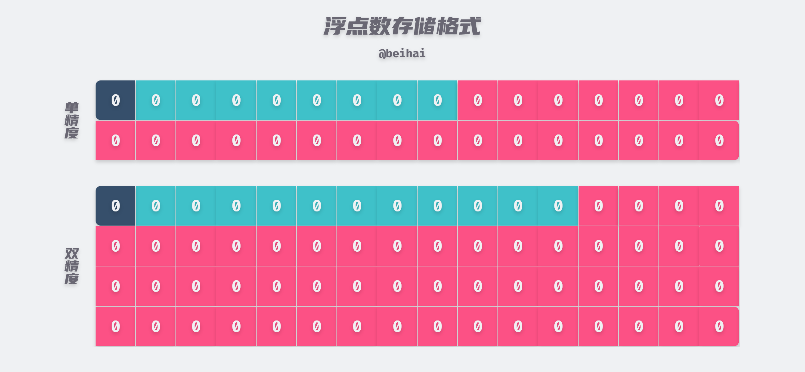
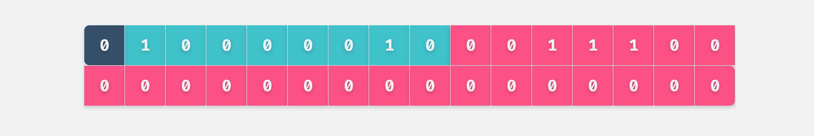
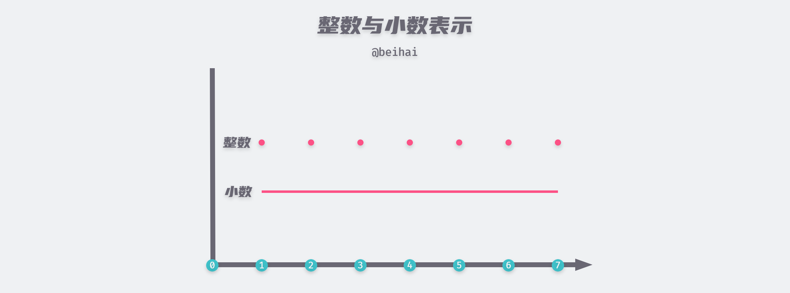

> IEEE 二进制浮点数算术标准（IEEE 754）是 20 世纪 80 年代以来最广泛使用的浮点数运算标准，被许多 CPU 与浮点运算器所采用。但是这种浮点数表示方法也会带来一定的精度问题，我们将对这一问题进行探讨。

IEEE 754 提供了四种精度规范，其中单精度浮点数与双精度浮点数是最常使用的类型，今天大部分的编程语言如 C、Go、Java、JavaScript 等都提供了该标准的浮点数格式。其中 IEEE 单精度格式具有 24 位有效二进制位，总共占用 32 位；IEEE 双精度格式具有 53 位有效二进制位，总共占用 64 位。

## 存储格式

浮点数将连续的二进制位分割为特定宽度的符号域、指数域和尾数域三个部分，其中保存的值分别用于表示给定二进制浮点数中的正负号、指数和尾数，通过尾数和可以调节的指数来表达给定的数值。在单精度浮点数中，符号位占据最高位，用于表示这个浮点数是正数还是负数，为 0 为正，为 1 为负；指数位占据随后的 8 位；最后是 23 位的尾数位。而双精度浮点数被划分为 1bit 的符号位、11bit 的指数位和 52bit 的尾数位。这两种表示格式除了位数长度不一致之外，并没有其它的区别。



我们以单精度浮点数为例，指数位占用 8bit 的空间来表示指数大小，但是其实际取值为 [-126,127]，-127 和 128 被用作特殊值处理。指数位还具有一个偏移量，指数位存储的数值是指数的实际值加上固定的偏移量，这样做的好处是可以用长度为 N 的无符号整数来表示所有的指数取值，使得两个浮点数的指数大小的比较更为容易。单精度浮点数的偏移量为 127，双精度浮点数的偏移量为 1023，因此如果指数的实际值为 10，那么指数位存储的数值为 127 + 10 = 127。

> 详细了解浮点数的存储格式可以参考 [wiki IEEE 754](https://en.wikipedia.org/wiki/IEEE_754)

假设我们要存储一个单精度浮点数`9.75`，那么我们需要先将十进制数转换为二进制数`1001.11`，然后将这个二进制数转换为以 2 为底的指数形式 1001.11 = 1.00111 × 2<sup>3</sup>，其中 1.00111 就是尾数，3 就是指数，并且我们发现尾数的最高位恒为 1，那么在存储时可以省略小数点前面的 1，从而腾出一个二进制位来保存更多的尾数。这样我们实际上用 23 位长的尾数域表达了 24 位的尾数。在这个例子中尾数位是`00111`，并将后面的位数补 0，指数位存储的是 3 + 127 = 130，即`10000010`。最终`9.75`的单精度浮点数存储为：




## 精度问题

#### 最大有效数字

单精度和双精度浮点数的有效数字分别是存储的 23 和 52 个二进制位，加上最左边没有存储的`1.`，最终能表示 24 和 53 个位。所以对应的最终有效数字计算公式为：
$$
lg2^{24} ≈ 7.22
$$

$$
lg2^{53} ≈ 15.95
$$

由以上的计算，单精和双精浮点数可以保证 7 位和 15 位十进制有效数字。需要注意的是，有效数字包括整数部分，并且最大有效数字只是浮点数所能表示的最长十进制小数，能否精确表示还要却决于这个数能否用二进制形式表示。

#### 进制转换

在存储浮点数之前我们需要将十进制数转换为二进制数，但是大部分的十进制数无法用二进制数精确表示。假设我们要把十进制数 0.1 表示为二进制，那么计算流程为：

```
0.1 x 2 = 0.2  取整数位 0 得 0.0
0.2 x 2 = 0.4  取整数位 0 得 0.00
0.4 x 2 = 0.8  取整数位 0 得 0.000
0.8 x 2 = 1.6  取整数位 1 得 0.0001
0.6 x 2 = 0.2  取整数位 1 得 0.00011
0.2 x 2 = 0.4  取整数位 0 得 0.000110
0.4 x 2 = 0.8  取整数位 0 得 0.0001100
0.8 x 2 = 1.6  取整数位 1 得 0.00011001
0.6 x 2 = 1.2  取整数位 1 得 0.000110011
...
```

最终我们得到的是一个无限循环的二进制小数 0.00011**0011**…，即使我们把小数部分取无限长，这个值只能是无限趋近于 0.1，而不可能达到 0.1。由于二进制数只能精确表示 2 的幂次的多项式和的数，所以很多小数在进制转换这一过程中就已经丢失了精度。

#### 值域与舍入误差

通过浮点数存储格式这一部分的内容可以得知，一个浮点数的计算公式为：

- ± 尾数值 × 2<sup>指数值</sup>

由于尾数值的取值范围为 [1,2)（包括被省略掉的`1.`），指数值的取值范围为[-126,127]，所以理论上单精度浮点数的值域为 ±[1,2) × 2<sup>[-126,127]</sup>。但在实际中尾数值与指数值都是通过二进制形式存储的，它们只能表示有限个数字状态。小数与整数不同之处在于是，[1,7] 之间的整数只有 7 个有限的数字，我们只需要在计算机中存储 7 个不同的状态即可；但是 [1,7] 之间的小数却是一条连续的线段，无论浮点数的有效位有多长，我们始终无法用有限的状态来表示无限的小数。



浮点数表示法中，也是将小数划分为密集的点状分布，因此在进行数值计算的过程中，要对计算得到的数据使用相关的舍入规则来取近似值，而这会导致计算结果产生误差。IEEE 浮点格式默认的舍入方法是**向偶数舍入**，这种方式会试图找到一个最接近的匹配值进行舍入，如果是中间值，则会向偶数值舍入。因此，它将 1.4 舍入成 1，将 1.6 进位成 2，但是 1.5 和 2.5 都会舍入成 2。

> 在进行舍入的时候，最后一位数字从 1 到 9，舍去的有 1、2、3、4，而 9、8、7、6 则会被进位，5 会被单独留下。如果我们采用四舍五入每次都将 5 进位的话，在进行一些大量数据的统计时，就会累积比较大的偏差。而如果采用向偶数舍入的策略，在大多数情况下，5 舍去和进位概率是差不多的，统计时产生的偏差也会相应地小一些。

舍入误差同样存在进制转换的过程中，如果我们要存储十进制小数 0.1，那么浮点数的尾数表示形式为`10011001100110011001101`，最后一个二进制位 1 是进位得到的。

#### 不规则分布

在浮点数的存储方法中，如果指数位不变，那么相邻的两个尾数位之间的间隔是一定的，但是相邻的两个指数域之间的间隔是不同的。我们假设尾数部分全为 0，指数部分为`10000000`，此时表示的单精度浮点数为 2.0；将指数部分加 1 变为`10000001`，此时表示的单精度浮点数为 4.0；将指数部分再加 1 变为`10000010`，此时表示的单精度浮点数为 8.0。也就是说 [2.0, 4.0) 范围内的浮点数间隔为 2/2<sup>23</sup>，而 [4.0, 8.0) 范围内的浮点数间隔为 4/2<sup>23</sup>。指数部分每加 1，浮点数之间的间隔也会相应地扩大一倍。


指数越大，浮点数之间的间隔也越来越稀疏。当偏移后的指数值达到了 150 时，相邻两个单精度浮点数的间隔已经为`1`，已经无法保存小数点后面的数字。

## 总结

IEEE 754 标准中也针对无精度损失的小数表示法进行了规定，这中数据类型被称为 Decimal，其底层是用字符串来存储小数部分的，但是这种数据类型也会浪费有部分的存储空间。浮点数的精度问题是基于性能与准确性的妥协，在这一标准最初定义时，内存是十分稀缺的计算资源，因此人们偏向采用这种牺牲精度的表示法。

## Reference

- [wiki 离散](https://zh.wikipedia.org/wiki/%E9%9B%A2%E6%95%A3)
- [解析IEEE 754 标准](https://www.cnblogs.com/HDK2016/p/10506083.html)
- [IEEE 754](https://en.wikipedia.org/wiki/IEEE_754)
- [IEEE-754 Floating Point Converter](https://www.h-schmidt.net/FloatConverter/IEEE754.html)